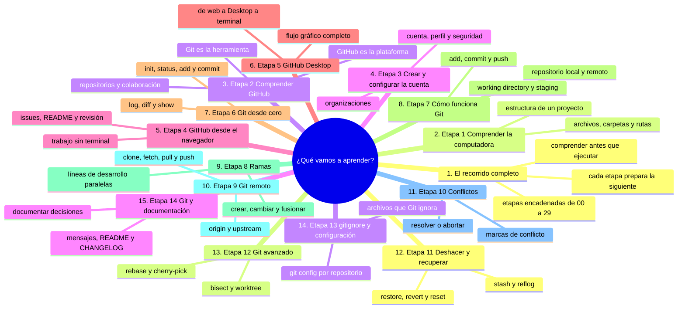
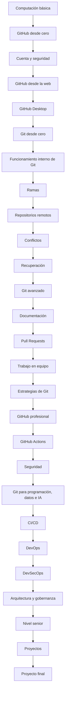
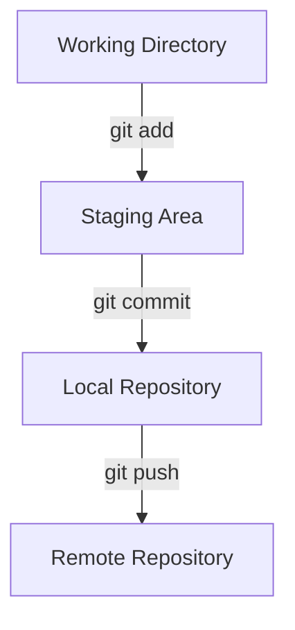

# ¿Qué vamos a aprender?

## De utilizar Git y GitHub a comprenderlos y trabajar con ellos profesionalmente

Este repositorio está diseñado como un recorrido progresivo.

No vamos a comenzar suponiendo que ya sabes programar, utilizar Git o trabajar con GitHub.

Comenzaremos con los conceptos más sencillos y construiremos conocimiento sobre ellos hasta llegar a temas utilizados en equipos profesionales de desarrollo de software.

La idea fundamental es:

> **No aprender únicamente qué comando ejecutar, sino comprender qué problema resuelve, qué ocurre cuando lo ejecutamos y cuándo debemos utilizarlo.**

---

## Mapa conceptual de este capítulo



---

# 1. El recorrido completo

El aprendizaje está organizado en varias etapas:



No necesitas aprender todo de una vez.

Cada etapa prepara los conocimientos necesarios para la siguiente.

---

# 2. Etapa 1 — Comprender la computadora

Antes de utilizar Git, algunas personas necesitan aprender conceptos básicos de informática.

Estudiaremos:

* qué es un archivo;
* qué es una carpeta;
* qué es una ruta;
* qué es una extensión;
* cómo se organizan los archivos;
* cómo copiar archivos;
* cómo mover archivos;
* cómo eliminar archivos;
* qué es un programa;
* qué es una terminal;
* qué es un comando.

Por ejemplo:

```text
proyecto/
├── documentos/
├── imagenes/
├── datos/
└── codigo/
```

La intención no es convertir esta sección en un curso completo de informática.

Su objetivo es proporcionar los conocimientos necesarios para que nadie se quede atrás cuando aparezcan Git y GitHub.

---

# 3. Etapa 2 — Comprender GitHub

Después aprenderemos qué es GitHub.

Estudiaremos:

* qué es GitHub;
* qué es un repositorio;
* qué es un repositorio público;
* qué es un repositorio privado;
* qué es el control de versiones;
* para qué sirve GitHub;
* qué problemas resuelve;
* qué significa colaborar mediante GitHub.

También aprenderemos una diferencia fundamental:

```text
Git
│
└── Sistema de control de versiones

GitHub
│
└── Plataforma para alojar repositorios
    y colaborar utilizando Git
```

Esta distinción será fundamental durante todo el curso.

---

# 4. Etapa 3 — Crear y configurar nuestra cuenta

Aprenderemos a trabajar con nuestra cuenta de GitHub.

Estudiaremos:

* creación de la cuenta;
* perfil;
* configuración;
* repositorios;
* configuración de seguridad;
* autenticación;
* autenticación multifactor;
* organizaciones;
* permisos.

También aprenderemos una idea importante:

> Una cuenta de GitHub no es solamente un lugar para guardar código.

Puede convertirse en una parte de nuestra identidad profesional y de nuestro historial de proyectos.

---

# 5. Etapa 4 — Utilizar GitHub desde el navegador

Antes de entrar de lleno en la terminal, aprenderemos a realizar operaciones básicas desde la interfaz web.

Aprenderemos a:

* crear un repositorio;
* crear archivos;
* modificar archivos;
* eliminar archivos;
* crear carpetas mediante archivos;
* subir archivos;
* visualizar cambios;
* crear commits;
* consultar el historial;
* restaurar versiones cuando corresponda.

Esto permitirá comprender algunos conceptos de Git sin tener que aprender inmediatamente comandos.

---

# 6. Etapa 5 — GitHub Desktop

Después conoceremos GitHub Desktop.

Aprenderemos a:

* instalarlo;
* iniciar sesión;
* clonar repositorios;
* observar cambios;
* preparar cambios;
* crear commits;
* hacer push;
* hacer pull;
* trabajar con ramas;
* cambiar entre ramas.

Esta etapa sirve como puente entre:

```text
GitHub Web
     ↓
GitHub Desktop
     ↓
Git + Terminal
```

No es obligatorio utilizar GitHub Desktop para aprender Git, pero puede facilitar la transición a quienes todavía no están familiarizados con la terminal.

---

# 7. Etapa 6 — Git desde cero

Aquí comenzará el estudio directo de Git.

Aprenderemos qué es Git y cómo instalarlo.

Después trabajaremos progresivamente con comandos como:

```bash
git init
git status
git add
git commit
git log
git diff
git show
```

Pero no estudiaremos estos comandos como una lista para memorizar.

Para cada uno responderemos:

1. ¿Qué problema resuelve?
2. ¿Qué información utiliza?
3. ¿Qué modifica?
4. ¿Qué resultado produce?
5. ¿Qué ocurre internamente?
6. ¿Cuándo conviene utilizarlo?
7. ¿Qué errores pueden producirse?

---

# 8. Etapa 7 — Comprender cómo funciona Git

Esta es una de las etapas más importantes.

Aquí dejaremos de ver Git solamente como una herramienta y comenzaremos a comprender su modelo interno.

Estudiaremos:

* Working Directory;
* Staging Area;
* Local Repository;
* Remote Repository;
* commits;
* hashes;
* HEAD;
* referencias;
* historial;
* objetos de Git;
* relaciones entre commits.

El modelo fundamental será:



Cuando comprendas este modelo, muchos comandos que inicialmente parecen complicados comenzarán a tener sentido.

---

# 9. Etapa 8 — Ramas

Aprenderemos por qué existen las ramas.

Estudiaremos:

* qué es una branch;
* crear ramas;
* cambiar de rama;
* eliminar ramas;
* ramas locales;
* ramas remotas;
* ramas de seguimiento;
* merge;
* fast-forward;
* historial de ramas.

Por ejemplo:

```text
main
 │
 ├── A
 │
 ├── B
 │
 └── C
      \
       D
       \
        E
```

La idea será comprender cómo diferentes líneas de desarrollo pueden coexistir.

---

# 10. Etapa 9 — Git remoto

Aquí conectaremos Git local con repositorios remotos.

Aprenderemos:

```bash
git clone
git remote
git fetch
git pull
git push
```

También estudiaremos:

* `origin`;
* `upstream`;
* repositorio local;
* repositorio remoto;
* sincronización;
* tracking branches;
* diferencias entre fetch y pull.

Un concepto fundamental será:

> **Git local y GitHub no son la misma cosa.**

Aprenderemos qué información existe en cada uno y cómo se sincronizan.

---

# 11. Etapa 10 — Conflictos

Los conflictos son una parte normal del trabajo colaborativo.

Aprenderemos:

* qué es un conflicto;
* por qué aparece;
* cómo identificarlo;
* cómo leerlo;
* cómo resolverlo;
* cómo continuar un merge;
* cómo resolver conflictos durante un rebase;
* cómo cancelar una operación cuando sea necesario.

Por ejemplo:

```text
<<<<<<< HEAD
texto de una rama
=======
texto de otra rama
>>>>>>> otra-rama
```

No aprenderemos simplemente a borrar esas marcas.

Aprenderemos **por qué aparecieron y qué decisión debemos tomar sobre el contenido**.

---

# 12. Etapa 11 — Deshacer y recuperar

Una de las áreas que más confusión genera en Git es deshacer cambios.

Aprenderemos la diferencia entre:

```text
git restore
git revert
git reset
git stash
git reflog
```

Comprenderemos que no todos significan lo mismo.

Por ejemplo:

```text
RESTORE
→ recuperar archivos/cambios

REVERT
→ crear un nuevo commit que deshace otro

RESET
→ mover referencias y modificar el estado del historial

STASH
→ guardar temporalmente cambios

REFLOG
→ consultar movimientos de referencias para recuperar estados
```

También aprenderemos qué operaciones pueden ser peligrosas.

---

# 13. Etapa 12 — Git avanzado

Cuando los fundamentos estén consolidados, estudiaremos herramientas avanzadas.

Entre ellas:

⚠️ **RIESGO:** `git rebase` y `git rebase -i` reescriben commits ya existentes: sobre una rama compartida cambian el historial de todo el equipo. Se prueban en el laboratorio, nunca sobre ramas ajenas.

```bash
git rebase
git rebase -i
git cherry-pick
git tag
git bisect
git blame
git worktree
git submodule
```

También estudiaremos:

* reescritura del historial;
* commits;
* referencias;
* tags;
* versionado;
* diagnóstico de errores;
* hooks;
* escenarios avanzados.

Aquí comenzaremos a trabajar con situaciones más cercanas a las que aparecen en proyectos profesionales.

---

# 14. Etapa 13 — `.gitignore` y configuración

Aprenderemos a controlar qué archivos debe ignorar Git.

Por ejemplo:

```text
.env
__pycache__/
node_modules/
*.log
```

Estudiaremos:

* `.gitignore`;
* `.gitconfig`;
* `.gitattributes`;
* configuración global;
* configuración local;
* finales de línea;
* normalización de archivos.

También comprenderemos por qué un `.gitignore` **no es un mecanismo de seguridad para secretos que ya fueron publicados**.

---

# 15. Etapa 14 — Git y documentación

Un repositorio profesional no contiene únicamente código.

Aprenderemos a utilizar:

* Markdown;
* README;
* CHANGELOG;
* LICENSE;
* CONTRIBUTING;
* documentación técnica;
* plantillas.

Aprenderemos también a organizar la información para que otra persona pueda comprender el proyecto sin tener que preguntarnos todo.

---

### Ejercicio de transferencia

En tu repositorio de práctica, escribe un archivo `ETAPA-01.md` con la lista de las quince etapas que acabas de leer, pero explicando cada una en una frase con **tus** palabras. Compáralo con este capítulo: si en alguna frase no coinciden el sentido ni el orden, vuelve a esa sección. Entregable: el archivo en la raíz del repo y una frase final diciendo qué etapa te costaría más y por qué.

Sigue con [`02-que-vamos-a-aprender-equipo-y-arquitectura.md`](02-que-vamos-a-aprender-equipo-y-arquitectura.md): las etapas 15 a 25, de los Pull Requests a la arquitectura.

## Autopreguntas de cierre

Sin mirar el material, responde mentalmente y luego compruébalo con este capítulo:

1. ¿Por qué el recorrido empieza por la computación y no por los comandos de Git?
2. ¿Qué se pierde si se estudia Git solo como lista de comandos, saltándose la etapa de su funcionamiento interno?
3. ¿Qué tres zonas aparecen en el modelo fundamental y qué hace `git add` entre ellas?
4. ¿Qué consecuencias tiene saltarse las etapas de ramas y conflictos antes de entrar en el trabajo en equipo?
5. ¿Por qué la documentación aparece como etapa y no como apéndice final del curso?
6. Mira la etapa 13: ¿qué problemas del equipo real resuelve ignorar archivos y configurar Git?
