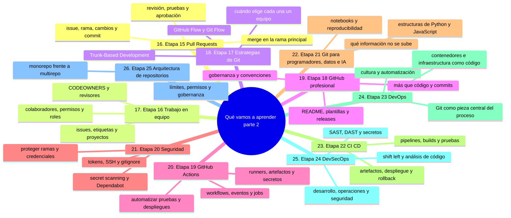
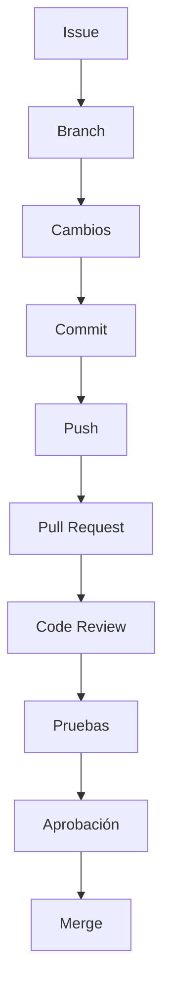
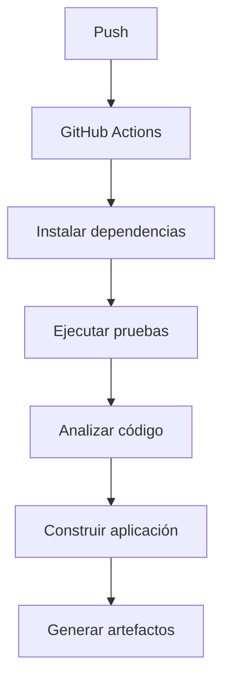

# Qué vamos a aprender, parte 2: del trabajo en equipo a la arquitectura

Esta es la continuación directa de [`01-que-vamos-a-aprender-recorrido.md`](01-que-vamos-a-aprender-recorrido.md): ahí recorriste la estructura del curso y las etapas 1 a 14, de comprender la computadora a documentar un proyecto. Aquí siguen las etapas 15 a 25, el tramo en que Git deja de ser una herramienta personal y pasa a ser la forma en que trabaja un equipo.

Al terminar sabrás qué contiene cada una de estas etapas, por qué se estudian en ese orden y qué tipo de decisiones —de flujo, de seguridad y de arquitectura— tendrás que tomar algún día.

## Mapa conceptual de este capítulo



---

# 16. Etapa 15 — Pull Requests

Aquí entraremos en uno de los mecanismos fundamentales de colaboración en GitHub.

Aprenderemos el flujo:



Estudiaremos:

* qué es un Pull Request;
* cómo crearlo;
* cómo describirlo;
* revisión de código;
* comentarios;
* cambios solicitados;
* aprobación;
* merge;
* cierre de Pull Requests.

---

# 17. Etapa 16 — Trabajo en equipo

Después aprenderemos a utilizar GitHub como herramienta de colaboración.

Estudiaremos:

* colaboradores;
* permisos;
* organizaciones;
* Issues;
* etiquetas;
* milestones;
* GitHub Projects;
* Discussions;
* CODEOWNERS;
* revisores;
* responsabilidades.

La pregunta dejará de ser:

> "¿Cómo uso Git yo solo?"

y pasará a ser:

> "¿Cómo puede trabajar un equipo utilizando Git y GitHub?"

---

# 18. Etapa 17 — Estrategias de Git

No existe una única forma de organizar un flujo de trabajo.

Estudiaremos diferentes estrategias:

### GitHub Flow

```text
main
 │
 ├── feature
 │
 └── Pull Request
        ↓
      merge
```

### Git Flow

Estudiaremos su modelo de ramas y su contexto histórico.

### Trunk-Based Development

Analizaremos el trabajo alrededor de una rama principal y los mecanismos utilizados para integrar cambios frecuentemente.

También estudiaremos:

* Feature Branching;
* estrategias de integración;
* versionado semántico;
* cuándo utilizar cada enfoque;
* ventajas y limitaciones.

No se trata de memorizar una estrategia.

Se trata de comprender **por qué un equipo puede elegir una determinada estrategia**.

---

# 19. Etapa 18 — GitHub profesional

Aquí comenzaremos a construir repositorios con características propias de proyectos profesionales.

Estudiaremos:

* estructura del repositorio;
* README profesional;
* plantillas;
* Issues;
* Pull Requests;
* CODEOWNERS;
* releases;
* proyectos;
* permisos;
* organizaciones;
* convenciones;
* gobernanza.

Aprenderemos que un repositorio profesional es mucho más que:

```text
código + commits
```

También incluye:

```text
código
+ documentación
+ colaboración
+ pruebas
+ automatización
+ seguridad
+ gobierno
```

---

# 20. Etapa 19 — GitHub Actions

Entraremos en automatización.

Aprenderemos:

* qué es GitHub Actions;
* workflows;
* eventos;
* triggers;
* jobs;
* steps;
* runners;
* artifacts;
* variables;
* secrets;
* matrices;
* permisos.

Por ejemplo:



Aprenderemos a interpretar un archivo como:

```text
.github/
└── workflows/
    └── ci.yml
```

---

# 21. Etapa 20 — Seguridad

La seguridad estará integrada progresivamente en todo el recorrido.

Estudiaremos:

* contraseñas;
* tokens;
* SSH;
* API keys;
* secretos;
* `.gitignore`;
* secret scanning;
* Dependabot;
* Code Scanning;
* dependencias;
* vulnerabilidades;
* seguridad de la cadena de suministro;
* permisos;
* protección de ramas;
* seguridad de GitHub Actions.

Una regla fundamental será:

> **Un repositorio no debe convertirse accidentalmente en un lugar donde se publiquen secretos.**

---

# 22. Etapa 21 — Git para programadores, datos e inteligencia artificial

Aplicaremos Git a diferentes disciplinas.

Trabajaremos con ejemplos relacionados con:

### Python

```text
proyecto-python/
├── src/
├── tests/
├── requirements.txt
└── README.md
```

### JavaScript

```text
proyecto-web/
├── src/
├── tests/
├── package.json
└── README.md
```

### Ciencia de datos

Aprenderemos consideraciones relacionadas con:

* notebooks;
* datos;
* scripts;
* entornos;
* experimentos;
* reproducibilidad.

### Inteligencia artificial

Analizaremos:

* código;
* prompts;
* configuraciones;
* notebooks;
* pipelines;
* documentación;
* experimentos;
* modelos y artefactos;
* reproducibilidad.

También estudiaremos qué información **no debería almacenarse directamente en un repositorio**, especialmente secretos y datos sensibles.

---

# 23. Etapa 22 — CI/CD

Aquí conectaremos Git con los procesos de entrega de software.

Aprenderemos:

* integración continua;
* entrega continua;
* despliegue continuo;
* pipelines;
* builds;
* pruebas automatizadas;
* artefactos;
* despliegues;
* rollback.

Un flujo simplificado será:

```text
Developer
    ↓
Git commit
    ↓
Push
    ↓
CI
    ↓
Tests
    ↓
Build
    ↓
Security checks
    ↓
Deploy
```

---

# 24. Etapa 23 — DevOps

Conectaremos Git con una visión más amplia del ciclo de vida del software.

Estudiaremos:

* cultura DevOps;
* automatización;
* CI/CD;
* contenedores;
* Docker;
* infraestructura como código;
* configuración;
* despliegue;
* observabilidad.

La idea será comprender que Git puede actuar como una pieza central de muchos procesos de ingeniería.

---

# 25. Etapa 24 — DevSecOps

Después incorporaremos seguridad al ciclo de desarrollo.

Estudiaremos:

* DevSecOps;
* Shift Left;
* análisis de código;
* dependencias;
* secretos;
* SAST;
* DAST;
* seguridad de pipelines;
* seguridad de la cadena de suministro.

El objetivo será comprender:

```text
Desarrollo
    +
Operaciones
    +
Seguridad
```

como partes integradas del mismo proceso.

---

# 26. Etapa 25 — Arquitectura de repositorios

En proyectos grandes aparecen nuevas preguntas.

Por ejemplo:

> ¿Debemos tener un solo repositorio o varios?

Estudiaremos:

### Monorepo

Un repositorio que contiene múltiples componentes o proyectos relacionados.

### Multirepo

Varios repositorios independientes.

También estudiaremos:

* estructura de proyectos;
* límites entre componentes;
* permisos;
* gobernanza;
* políticas;
* estándares;
* automatización;
* mantenimiento.

No aprenderemos que existe una única arquitectura correcta.

Aprenderemos a analizar el contexto y sus consecuencias.

---

### Ejercicio de transferencia

En un repositorio de práctica (o simulado con una segunda cuenta), recorre el flujo completo de esta parte: crea un issue, haz una rama, commitea un cambio, súbelo y abre un Pull Request con descripción y revisor. Entregable: el enlace al Pull Request **sin mergear** y una lista de los pasos del flujo Issue → Merge que ejecutaste y de los que aún falta alguno.

Sigue con [`03-que-vamos-a-aprender-competencias.md`](03-que-vamos-a-aprender-competencias.md): las últimas etapas del temario y las competencias que tendrás al terminar.

## Autopreguntas de cierre

Sin mirar el material, responde mentalmente y luego compruébalo con este capítulo:

1. ¿Qué cambia en un repositorio cuando deja de ser individual y se convierte en trabajo de equipo?
2. ¿Por qué un Pull Request no es solo un botón de merge, sino una conversación con revisión y aprobación?
3. Si dos equipos entregan software con estrategias distintas, ¿qué los lleva a elegir Git Flow o Trunk-Based?
4. ¿Qué relación hay entre la etapa de seguridad y la etapa de DevSecOps, y por qué se estudian en orden separado?
5. Un token se publica por error en un repositorio: ¿qué etapas de este tramo te habrían ayudado a evitarlo?
6. ¿Qué demostración concreta probaría que entiendes la diferencia entre monorepo y multirepo?
