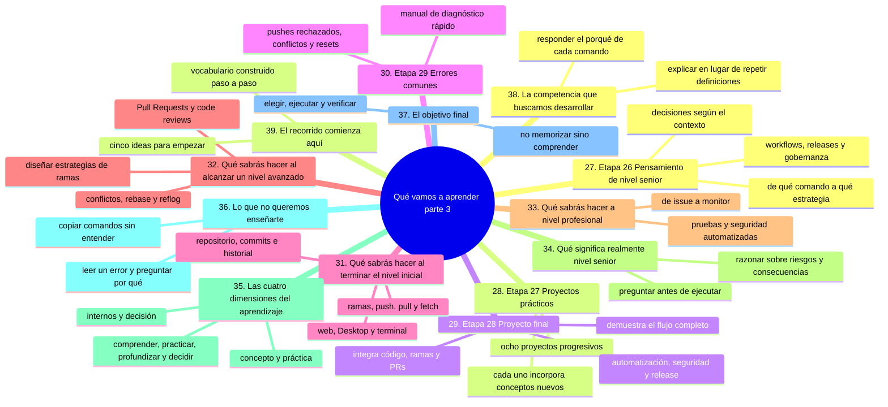
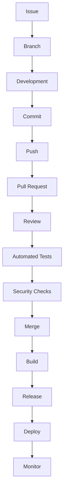
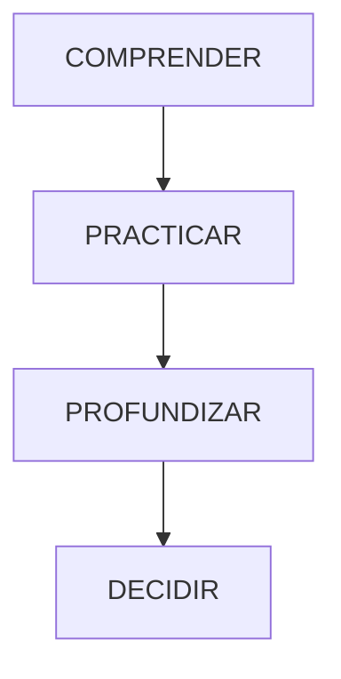

# Qué vamos a aprender, parte 3: competencias y objetivo final

Esta es la última parte del temario. En [`01-que-vamos-a-aprender-recorrido.md`](01-que-vamos-a-aprender-recorrido.md) viste las etapas 1 a 14 y en [`02-que-vamos-a-aprender-equipo-y-arquitectura.md`](02-que-vamos-a-aprender-equipo-y-arquitectura.md) las etapas 15 a 25; aquí cierras el recorrido con las etapas 26 a 29 y con lo que importa de verdad: qué sabrás hacer cuando todo esto termine.

No hace falta que entiendas ahora cada palabra del listado. Lo importante es que reconozcas las cuatro dimensiones del aprendizaje —concepto, práctica, comprensión interna y decisión— porque todas las secciones del curso están construidas sobre ellas.

## Mapa conceptual de este capítulo



---

# 27. Etapa 26 — Pensamiento de nivel senior

El nivel senior no consiste simplemente en conocer más comandos.

Implica tomar mejores decisiones técnicas basadas en contexto.

Estudiaremos:

* diseño de workflows;
* estrategias de ramas;
* revisión de código;
* gestión de releases;
* gobernanza;
* seguridad;
* automatización;
* recuperación ante incidentes;
* recuperación ante desastres;
* mantenimiento;
* escalabilidad;
* decisiones técnicas.

La pregunta cambia de:

> "¿Qué comando uso?"

a:

> "¿Qué estrategia resuelve mejor este problema para este equipo y este proyecto?"

---

# 28. Etapa 27 — Proyectos prácticos

La teoría debe convertirse en práctica.

Realizaremos proyectos progresivos.

Por ejemplo:

```text
Proyecto 1
Primer repositorio
```

Después:

```text
Proyecto 2
Diario digital
```

Después:

```text
Proyecto 3
Recetario
```

Después:

```text
Proyecto 4
Página web
```

Después:

```text
Proyecto 5
Proyecto Python
```

Después:

```text
Proyecto 6
Proyecto de datos
```

Después:

```text
Proyecto 7
Proyecto de inteligencia artificial
```

Y finalmente:

```text
Proyecto 8
Proyecto colaborativo
```

Cada proyecto incorporará nuevos conceptos.

---

# 29. Etapa 28 — Proyecto final

El proyecto final reunirá los conocimientos adquiridos.

La idea será construir un proyecto que incluya, según corresponda:

```text
Código
Documentación
Git
GitHub
Ramas
Commits
Pull Requests
Pruebas
GitHub Actions
Seguridad
CI/CD
Release
```

El objetivo no será solamente terminar un proyecto.

Será demostrar que comprendes el flujo completo.

---

# 30. Etapa 29 — Errores comunes

Finalmente tendremos una sección de consulta rápida.

Aquí encontraremos situaciones como:

* olvidé mi contraseña;
* hice un commit equivocado;
* eliminé un archivo;
* hice push al repositorio incorrecto;
* Git rechazó mi push;
* tengo un conflicto;
* eliminé una rama;
* perdí un commit;
* hice un reset incorrecto;
* no puedo hacer pull;
* no puedo hacer push;
* no sé qué significa un mensaje de Git.

Esta sección funcionará como una especie de **manual de diagnóstico**.

---

# 31. Qué sabrás hacer al terminar el nivel inicial

Después de las primeras etapas deberías poder:

* crear un repositorio;
* comprender qué es Git;
* comprender qué es GitHub;
* crear commits;
* consultar el historial;
* identificar cambios;
* trabajar con ramas;
* sincronizar un repositorio;
* comprender `push`, `pull` y `fetch`;
* utilizar GitHub desde la web;
* utilizar GitHub Desktop;
* utilizar Git desde la terminal.

---

# 32. Qué sabrás hacer al alcanzar un nivel avanzado

Podrás:

* trabajar con ramas complejas;
* resolver conflictos;
* utilizar rebase;
* recuperar información;
* utilizar reflog;
* utilizar cherry-pick;
* analizar historiales;
* utilizar tags;
* utilizar worktrees;
* configurar `.gitignore`;
* trabajar con Pull Requests;
* realizar code reviews;
* colaborar en equipos;
* diseñar estrategias de ramas.

---

# 33. Qué sabrás hacer a nivel profesional

Podrás comprender y participar en flujos como:



Y entenderás qué función cumple Git y GitHub en cada etapa.

---

# 34. Qué significa realmente "nivel senior"

Llegar al nivel senior no significa memorizar todos los comandos de Git.

Un profesional senior debe ser capaz de razonar sobre:

* riesgos;
* consecuencias;
* colaboración;
* mantenibilidad;
* seguridad;
* automatización;
* escalabilidad;
* recuperación;
* gobernanza;
* productividad del equipo.

Por ejemplo, ante una situación como:

> "Tenemos 40 desarrolladores trabajando en un mismo producto. Los conflictos son frecuentes y los despliegues fallan."

La respuesta profesional no consiste necesariamente en ejecutar un comando.

Primero hay que analizar:

```text
¿Cómo trabajan actualmente?
¿Qué estrategia de ramas utilizan?
¿Cómo integran cambios?
¿Cómo revisan código?
¿Qué pruebas ejecutan?
¿Cómo se despliega?
¿Qué automatización existe?
¿Qué problemas de coordinación existen?
```

Después se decide qué cambios realizar.

---

# 35. Las cuatro dimensiones del aprendizaje

Durante todo el repositorio trabajaremos cuatro dimensiones.

## 1. Concepto

Comprender qué es.

## 2. Práctica

Saber utilizarlo.

## 3. Internos

Comprender qué ocurre detrás.

## 4. Decisión

Saber cuándo utilizarlo y cuándo no.

Podemos representarlo así:



Un estudiante que solamente memoriza comandos se queda en la primera capa práctica.

Un profesional aprende a razonar sobre las cuatro.

---

# 36. Lo que no queremos enseñarte

No queremos que termines el curso diciendo:

> "Sé copiar comandos de Git de Internet."

Tampoco:

> "Cuando Git da un error, necesito que alguien me diga qué comando pegar."

Queremos que puedas leer:

```text
error: failed to push some refs
```

y comenzar a preguntarte:

> ¿Por qué mi repositorio local y el remoto tienen historias diferentes?

Ese cambio de mentalidad es mucho más importante que memorizar una solución.

---

# 37. El objetivo final

El objetivo de este repositorio puede resumirse así:

```text
NO

memorizar comandos
        ↓
copiarlos
        ↓
esperar que funcionen


SÍ

comprender el problema
        ↓
comprender Git
        ↓
elegir la herramienta adecuada
        ↓
ejecutarla conscientemente
        ↓
verificar el resultado
        ↓
aprender de lo ocurrido
```

---

# 38. La competencia que buscamos desarrollar

Al finalizar el recorrido, la meta es que puedas responder preguntas como:

> ¿Qué es Git?

> ¿Qué es GitHub?

> ¿Qué diferencia existe entre ambos?

> ¿Qué es un commit?

> ¿Qué es una rama?

> ¿Qué ocurre cuando hago `git add`?

> ¿Qué ocurre cuando hago `git commit`?

> ¿Qué diferencia existe entre `push`, `pull` y `fetch`?

> ¿Qué es un conflicto?

> ¿Cuándo utilizar `merge`?

> ¿Cuándo considerar `rebase`?

> ¿Cómo recupero un commit perdido?

> ¿Cómo trabajo mediante Pull Requests?

> ¿Cómo protejo un repositorio?

> ¿Cómo automatizo pruebas?

> ¿Cómo integro CI/CD?

> ¿Cómo incorporo seguridad?

> ¿Cómo diseño un flujo Git para un equipo?

Si puedes responder estas preguntas **explicando el porqué y no solamente repitiendo definiciones**, estarás construyendo una comprensión sólida.

---

# 39. El recorrido comienza aquí

No necesitas conocer todas estas palabras ahora.

Si algunas te resultan desconocidas, es completamente normal.

Durante el recorrido iremos construyendo el vocabulario progresivamente.

Por ahora recuerda solamente estas cinco ideas:

```text
1. Git controla versiones.

2. GitHub permite alojar repositorios y colaborar.

3. Un commit registra un estado del proyecto.

4. Las ramas permiten trabajar en diferentes líneas de desarrollo.

5. Git se aprende practicando y comprendiendo, no memorizando.
```

A partir de aquí comienza el recorrido.

### Ejercicio de transferencia

Elige una de las preguntas de la sección 38 y respóndela por escrito en un archivo `COMPETENCIA.md` de tu repositorio de práctica: la respuesta debe incluir el porqué, un ejemplo real y qué harías mal si hicieras lo contrario. Si no puedes explicar el porqué, márcala como pendiente y añádela a tu plan de estudio.

## Autopreguntas de cierre

Sin mirar el material, responde mentalmente y luego compruébalo con este capítulo:

1. ¿Por qué conocer más comandos no te convierte en nivel senior y qué hace falta además?
2. Si tu equipo acumula conflictos y despliegues fallidos, ¿qué preguntas harías antes de proponer un comando?
3. ¿Qué separa las competencias del nivel inicial de las del nivel avanzado y por qué ese orden?
4. ¿Qué dimensiones del aprendizaje se quedan fuera en un material que solo te pide copiar comandos?
5. Ante `error: failed to push some refs`, ¿qué tres preguntas te harías antes de buscar una solución?
6. ¿Cómo comprobarías, sin mirar el material, que ya puedes decir cuándo conviene `rebase` y cuándo no?

**Siguiente paso:**

`01-computacion-desde-cero/`

o, si ya tienes conocimientos suficientes de informática:

`02-github-desde-cero/`
