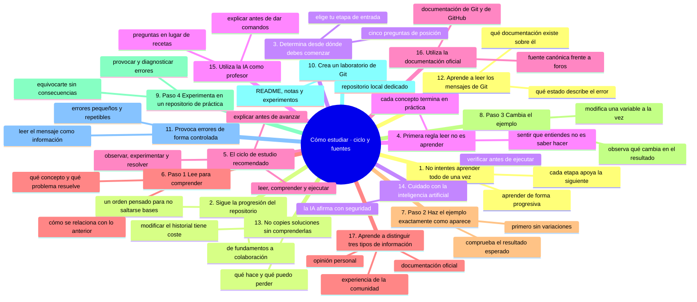
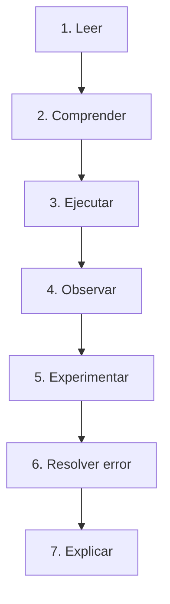

# Cómo estudiar este repositorio

## Una guía para aprender Git y GitHub de verdad

Aprender Git y GitHub no consiste en leer cientos de páginas ni en memorizar una lista interminable de comandos.

Tampoco consiste en copiar comandos desde Internet o pedirle a una inteligencia artificial que nos diga qué escribir cada vez que aparece un error.

El objetivo de este repositorio es desarrollar una habilidad mucho más importante:

> **Comprender qué está ocurriendo, actuar conscientemente y poder resolver problemas por cuenta propia.**

Para conseguirlo, utilizaremos un método progresivo basado en:

```text
Comprender
    ↓
Observar
    ↓
Practicar
    ↓
Experimentar
    ↓
Equivocarse
    ↓
Diagnosticar
    ↓
Corregir
    ↓
Repetir
    ↓
Explicar
    ↓
Aplicar
```

---

## Mapa conceptual de este capítulo



---

# 1. No intentes aprender todo de una vez

Git tiene muchas funcionalidades.

Algunas son sencillas:

```bash
git status
git add
git commit
```

Otras requieren más conocimientos:

```bash
git merge
git rebase
git cherry-pick
git reflog
git bisect
```

Y existen conceptos que aparecen en contextos profesionales:

```text
Pull Requests
Code Review
CI/CD
GitHub Actions
DevSecOps
Gobernanza
Arquitectura de repositorios
```

No intentes aprender todo el primer día.

El conocimiento se construye por capas.

```text
Fundamentos
     ↓
Práctica
     ↓
Integración
     ↓
Profundización
     ↓
Especialización
```

---

# 2. Sigue la progresión del repositorio

La estructura está diseñada deliberadamente para aumentar la complejidad.

En términos generales:

```text
00 — Orientación
       ↓
01 — Computación desde cero
       ↓
02 — GitHub desde cero
       ↓
03 — Cuenta de GitHub
       ↓
04 — GitHub Web
       ↓
05 — GitHub Desktop
       ↓
06 — Git desde cero
       ↓
07 — Cómo funciona Git
       ↓
08 — Ramas
       ↓
09 — Git remoto
       ↓
10 — Conflictos
       ↓
11 — Deshacer y recuperar
       ↓
12 — Git avanzado
       ↓
...
       ↓
26 — Nivel senior
```

No es necesario que absolutamente todas las personas comiencen en el mismo punto.

Sin embargo, **no conviene saltarse conceptos fundamentales simplemente porque parecen demasiado sencillos**.

---

# 3. Determina desde dónde debes comenzar

Antes de estudiar, hazte estas preguntas.

### Pregunta 1

¿Sé utilizar una computadora con comodidad?

Si la respuesta es no:

```text
01-computacion-desde-cero/
```

### Pregunta 2

¿Sé qué es GitHub?

Si no:

```text
02-github-desde-cero/
```

### Pregunta 3

¿Tengo una cuenta de GitHub?

Si no:

```text
03-tu-cuenta-de-github/
```

### Pregunta 4

¿Sé utilizar Git desde la terminal?

Si no:

```text
06-git-desde-cero/
```

### Pregunta 5

¿Entiendo realmente qué ocurre cuando ejecuto `git add` y `git commit`?

Si no:

```text
07-como-funciona-git/
```

La ruta correcta depende de tus conocimientos actuales.

---

# 4. Primera regla: leer no es aprender

Leer una explicación puede producir una sensación de comprensión.

Pero existe una diferencia entre:

> "Esto me parece lógico."

y:

> "Puedo hacerlo yo mismo."

Por ejemplo, puedes leer:

```bash
git commit
```

y pensar que lo entiendes.

Pero el aprendizaje real comienza cuando puedes:

1. realizar un cambio;
2. preparar ese cambio;
3. crear un commit;
4. consultar el historial;
5. identificar qué cambió;
6. explicar qué ocurrió.

Por eso:

> **Cada concepto importante debe terminar en una práctica.**

---

# 5. El ciclo de estudio recomendado

Para cada tema utiliza este ciclo:



Después puedes avanzar.

---

# 6. Paso 1 — Lee para comprender

Cuando leas un capítulo, no intentes memorizarlo inmediatamente.

Busca responder:

* ¿Qué concepto estoy aprendiendo?
* ¿Qué problema resuelve?
* ¿Por qué existe?
* ¿Cómo se relaciona con lo anterior?
* ¿Qué cambia en mi proyecto?
* ¿Qué podría salir mal?

Por ejemplo, al estudiar:

```bash
git add
```

no pienses únicamente:

> "Este comando sirve para agregar archivos."

Pregúntate:

> ¿Agregar dónde?

La respuesta lleva al concepto de **Staging Area**.

Ese tipo de pregunta es lo que transforma una instrucción en comprensión.

---

# 7. Paso 2 — Haz el ejemplo exactamente como aparece

La primera vez que estudies un concepto, realiza el ejemplo sin modificarlo.

Por ejemplo:

```bash
git status
```

Observa el resultado.

Después:

```bash
git add archivo.txt
```

Vuelve a ejecutar:

```bash
git status
```

Compara los resultados.

La diferencia entre ambos estados es parte del aprendizaje.

---

# 8. Paso 3 — Cambia el ejemplo

Cuando el ejemplo funcione, modifícalo.

Si el ejemplo utiliza:

```text
archivo.txt
```

prueba con:

```text
notas.txt
```

Después crea otro archivo.

Después modifica dos archivos.

Después modifica uno y deja otro sin preparar.

La pregunta deja de ser:

> "¿Qué dice el tutorial?"

y comienza a ser:

> "¿Qué ocurre si hago esto?"

Ahí comienza el aprendizaje profundo.

---

# 9. Paso 4 — Experimenta en un repositorio de práctica

Es recomendable tener un repositorio exclusivamente para experimentar.

Por ejemplo:

```text
git-practica/
```

Dentro puedes probar:

* commits;
* ramas;
* merges;
* conflictos;
* revert;
* reset;
* stash;
* rebase.

No necesitas preocuparte por romper un proyecto importante.

Puedes experimentar deliberadamente.

---

# 10. Crea un laboratorio de Git

Un buen método de aprendizaje consiste en crear un pequeño laboratorio.

Por ejemplo:

```text
git-laboratorio/
├── README.md
├── notas.txt
└── experimentos/
```

Después inicializa Git:

```bash
git init
```

Consulta:

```bash
git status
```

Realiza un cambio.

Haz un commit.

Realiza otro cambio.

Haz otro commit.

Después consulta:

```bash
git log
```

Ahora tienes un entorno donde puedes experimentar sin miedo.

---

# 11. Provoca errores de forma controlada

Esto es especialmente importante.

Una persona que nunca provoca errores puede saber ejecutar un tutorial.

Pero una persona que aprende a diagnosticar errores desarrolla una habilidad mucho más útil.

Por ejemplo:

* crear dos ramas;
* modificar la misma línea;
* intentar hacer merge;
* observar el conflicto;
* analizarlo;
* resolverlo.

El objetivo no es romper el proyecto.

El objetivo es **crear una situación controlada para comprender qué ocurre**.

---

# 12. Aprende a leer los mensajes de Git

Git suele proporcionar información útil cuando ocurre un problema.

Por ejemplo:

```text
error: failed to push some refs
```

No pienses inmediatamente:

> "Git está roto."

Pregúntate:

> "¿Qué está intentando decirme Git?"

Después analiza:

* qué comando ejecuté;
* qué estado tenía el repositorio;
* qué cambió;
* qué información proporciona el mensaje;
* qué documentación existe sobre ese error.

Los mensajes de error son parte del aprendizaje.

---

# 13. No copies soluciones sin comprenderlas

Internet está lleno de respuestas como:

⚠️ **RIESGO:** `git reset --hard HEAD~1` elimina el último commit y borra del disco cualquier cambio sin confirmar. El commit se puede recuperar con `git reflog`, pero los cambios que no estaban commiteados no.

```bash
git reset --hard HEAD~1
```

o:

⚠️ **RIESGO:** `git push --force` sobrescribe el historial del repositorio remoto. Si otra persona ya trabajó sobre esos commits, su trabajo puede quedar fuera del repositorio y la recuperación es difícil y manual.

```bash
git push --force
```

Puede que una solución sea correcta para una situación concreta.

Pero eso no significa que sea correcta para tu situación.

Antes de ejecutar un comando debes conocer:

```text
¿Qué hace?
¿Qué modifica?
¿Qué puedo perder?
¿Puedo recuperarlo?
¿Estoy trabajando solo?
¿Estoy modificando una rama compartida?
```

Especialmente cuando el comando modifica el historial.

---

# 14. Cuidado con la inteligencia artificial

La inteligencia artificial puede ser una excelente herramienta de aprendizaje.

Puedes utilizarla para:

* explicar conceptos;
* generar ejercicios;
* analizar errores;
* comparar comandos;
* crear ejemplos;
* hacer preguntas;
* practicar entrevistas;
* revisar tus explicaciones.

Pero no debes convertirla en un sustituto de tu comprensión.

Por ejemplo, no es suficiente preguntar:

> "Dime qué comando debo ejecutar."

Es mejor preguntar:

> "Este es el estado de mi repositorio. Este fue el comando que ejecuté y este es el error. Explícame qué ocurrió y qué alternativas tengo. No me des todavía el comando."

Después puedes analizar las opciones.

Esto desarrolla razonamiento técnico.

---

# 15. Utiliza la IA como profesor, no como piloto automático

Una buena interacción puede seguir este patrón:

```text
Tú:
"Explícame qué ocurrió."

        ↓

IA:
"El repositorio local y remoto tienen
historias diferentes."

        ↓

Tú:
"¿Cómo puedo comprobarlo?"

        ↓

IA:
"Puedes revisar el historial y las referencias."

        ↓

Tú:
"¿Qué alternativas tengo?"

        ↓

IA:
"Puedes integrar los cambios mediante
merge o rebase dependiendo del contexto."

        ↓

Tú:
"Explícame los riesgos."

        ↓

IA:
"Rebase puede reescribir historial..."
```

Así estás aprendiendo.

---

# 16. Utiliza la documentación oficial

Este repositorio busca explicar los conceptos de manera sencilla, pero no reemplaza la documentación oficial de las herramientas.

A medida que avances, aprenderás a consultar documentación de:

* Git;
* GitHub;
* GitHub Actions;
* herramientas relacionadas;
* tecnologías utilizadas por tus proyectos.

Una habilidad profesional importante es:

> **Saber buscar información técnica fiable.**

No depender exclusivamente de tutoriales o respuestas de terceros.

---

# 17. Aprende a distinguir tres tipos de información

Cuando investigues algo, diferencia:

### Documentación oficial

Explica cómo funciona una herramienta según su documentación mantenida por el proyecto o proveedor.

### Experiencia de la comunidad

Puede aportar soluciones prácticas y casos reales.

### Opinión personal

Puede ser útil, pero no necesariamente representa una regla técnica.

Por ejemplo:

> "Siempre debes utilizar rebase."

Eso no es una ley de Git.

La elección depende del contexto, del flujo de trabajo y de las reglas del equipo.

---

### Ejercicio de transferencia

Aplica el ciclo completo a un comando que todavía no domines: léelo en la documentación oficial, ejecútalo exactamente como aparece en el ejemplo, cambia una variable, provoca un error controlado en tu laboratorio y explícalo en voz alta. Entregable: una entrada de tu cuaderno de aprendizaje con las siete fases del ciclo, el error que provocaste y el texto íntegro de su mensaje.

Sigue con [`05-como-estudiar-habitos-y-seguridad.md`](05-como-estudiar-habitos-y-seguridad.md): cuaderno, familias de comandos, comandos peligrosos y cómo volver atrás sin culpa.

## Autopreguntas de cierre

Sin mirar el material, responde mentalmente y luego compruébalo con este capítulo:

1. ¿Por qué la sensación de «esto es lógico» no demuestra que sabes hacerlo tú mismo?
2. Si terminas el ciclo sin la fase de explicar, ¿qué queda sin comprobar?
3. ¿Qué separa provocar un error controlado en el laboratorio de romper por descuido?
4. ¿Cuáles son los tres tipos de información y a cuál acudes primero cuando dudas?
5. ¿Cómo usarías la IA para que te enseñe en lugar de que haga el trabajo por ti?
6. ¿Por qué copiar una solución de internet puede dejarte peor que antes de copiarla?
