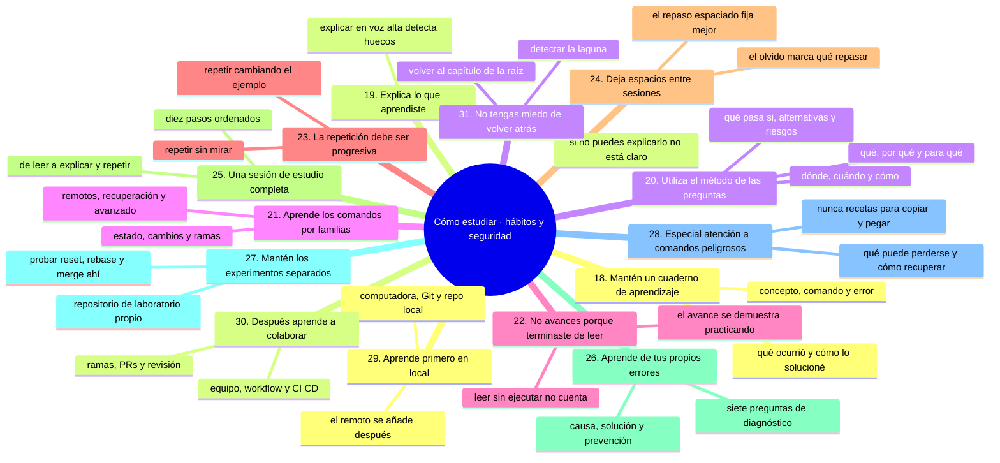
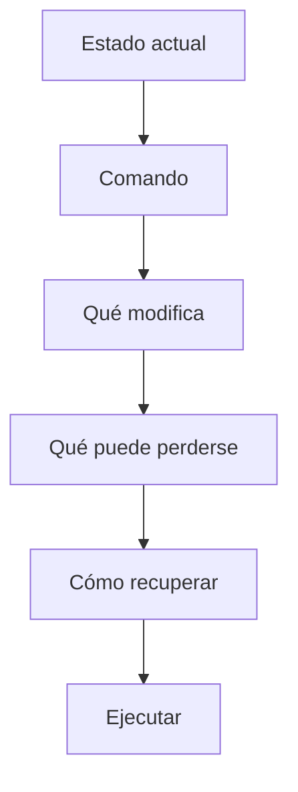
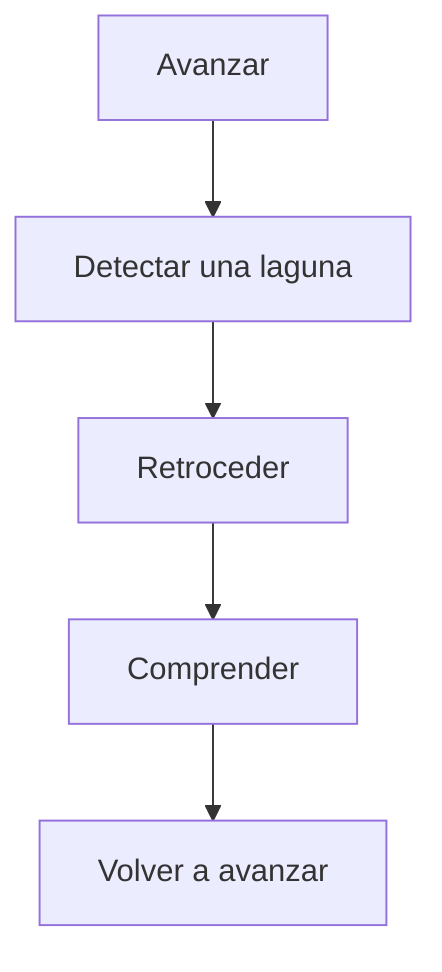

# Cómo estudiar, parte 2: hábitos, seguridad y vuelta atrás

Continuamos donde quedó [`04-como-estudiar-ciclo-y-fuentes.md`](04-como-estudiar-ciclo-y-fuentes.md): ahí están el ciclo de estudio, los cuatro pasos de la práctica y las fuentes en las que te apoyas. Aquí toca construir los hábitos que sostienen ese ciclo —cuaderno, explicación, familias de comandos, repaso espaciado— y la seguridad que permite experimentar sin destruir nada.

La regla que recorre esta parte es simple: **practicar mucho, pero solo donde perder algo no es un problema**.

## Mapa conceptual de este capítulo



---

# 18. Mantén un cuaderno de aprendizaje

Puede ser físico o digital.

Para cada concepto anota:

```text
Concepto:
¿Qué es?
¿Para qué sirve?
¿Qué problema resuelve?
Comando relacionado:
¿Qué ocurre internamente?
Ejemplo:
Error que encontré:
Cómo lo solucioné:
```

Por ejemplo:

```text
Concepto: commit

¿Qué es?
Un registro de cambios en el historial.

¿Para qué sirve?
Para guardar un punto de la evolución del proyecto.

Comando:
git commit

Error:
Intenté hacer commit sin preparar cambios.

Aprendizaje:
Debo comprender el estado del staging area.
```

Con el tiempo tendrás tu propio manual de referencia.

---

# 19. Explica lo que aprendiste

Una de las mejores pruebas de comprensión consiste en explicar un concepto sin mirar las instrucciones.

Por ejemplo:

> "Explícame qué diferencia existe entre `git add` y `git commit`."

Una explicación sencilla podría ser:

> `git add` selecciona cambios para la siguiente fotografía del proyecto y los coloca en el área de preparación. `git commit` registra esos cambios preparados en el historial de Git.

Si puedes explicarlo con tus propias palabras, estás construyendo comprensión.

---

# 20. Utiliza el método de las preguntas

Para cada concepto intenta responder:

### ¿Qué?

¿Qué es?

### ¿Por qué?

¿Por qué existe?

### ¿Para qué?

¿Qué problema resuelve?

### ¿Dónde?

¿Dónde ocurre?

### ¿Cuándo?

¿Cuándo conviene utilizarlo?

### ¿Cómo?

¿Cómo funciona?

### ¿Qué pasa si...?

¿Qué ocurre si algo sale mal?

### ¿Qué alternativas existen?

¿Hay otra forma de resolverlo?

### ¿Qué riesgos existen?

¿Puede provocar pérdida de información?

Este conjunto de preguntas será especialmente importante en los niveles avanzados.

---

# 21. Aprende los comandos por familias

En lugar de memorizar comandos aleatoriamente, agrúpalos por función.

### Estado e inspección

```bash
git status
git log
git diff
git show
```

### Cambios

```bash
git add
git commit
```

### Ramas

```bash
git branch
git switch
git merge
```

### Remotos

```bash
git remote
git fetch
git pull
git push
```

### Recuperación

```bash
git restore
git revert
git reset
git reflog
```

### Avanzado

```bash
git rebase
git cherry-pick
git bisect
git worktree
```

Esto ayuda a construir un mapa mental.

---

# 22. No avances porque "terminaste de leer"

Avanza cuando puedas hacer algo.

Por ejemplo, no consideres terminado el tema de commits simplemente porque leíste el capítulo.

Comprueba si puedes:

* crear un repositorio;
* modificar un archivo;
* preparar el cambio;
* crear un commit;
* consultar el historial;
* explicar lo que ocurrió.

Si no puedes hacerlo, practica nuevamente.

---

# 23. La repetición debe ser progresiva

No necesitas repetir exactamente el mismo ejercicio veinte veces.

Haz variaciones.

Primera vez:

```text
un archivo
```

Segunda:

```text
dos archivos
```

Tercera:

```text
varios commits
```

Cuarta:

```text
dos ramas
```

Quinta:

```text
conflicto
```

Sexta:

```text
recuperación
```

La dificultad debe aumentar gradualmente.

---

# 24. Deja espacios entre sesiones

Aprender Git requiere tiempo.

Es preferible estudiar:

```text
30–60 minutos
```

con concentración y práctica que pasar varias horas leyendo sin experimentar.

Una sesión puede seguir esta estructura:

```text
10 min — repasar
20 min — estudiar
20 min — practicar
10 min — experimentar
```

No es una regla rígida.

Adáptala a tu disponibilidad.

---

# 25. Una sesión de estudio completa

Por ejemplo, si estás estudiando `git commit`:

### 1. Leer

Comprender qué es un commit.

### 2. Preparar

Crear un repositorio de práctica.

### 3. Experimentar

Crear un archivo.

### 4. Observar

Ejecutar:

```bash
git status
```

### 5. Preparar

Ejecutar:

```bash
git add archivo.txt
```

### 6. Observar nuevamente

```bash
git status
```

### 7. Registrar

```bash
git commit -m "Agregar archivo de prueba"
```

### 8. Consultar

```bash
git log
```

### 9. Explicar

Responder:

> ¿Qué ocurrió desde que creé el archivo hasta que hice el commit?

### 10. Repetir

Realizarlo nuevamente sin mirar las instrucciones.

Eso es estudiar.

---

# 26. Aprende de tus propios errores

Cuando cometas un error, registra:

```text
¿Qué intentaba hacer?

¿Qué comando ejecuté?

¿Qué esperaba que ocurriera?

¿Qué ocurrió realmente?

¿Por qué ocurrió?

¿Cómo lo solucioné?

¿Cómo puedo evitarlo?
```

Con el tiempo, tus errores se convierten en conocimiento.

---

# 27. Mantén los experimentos separados de proyectos importantes

Cuando estés aprendiendo comandos avanzados, no experimentes inicialmente sobre un proyecto de producción.

Utiliza:

```text
repositorio-laboratorio/
```

para probar:

```bash
git reset
git rebase
git cherry-pick
git merge
git revert
```

Una vez que comprendas el comportamiento, podrás aplicarlo en escenarios reales con mayor seguridad.

---

# 28. Especial atención a comandos peligrosos

Durante el curso aparecerán comandos que pueden modificar o eliminar información.

Por ejemplo:

⚠️ **RIESGO:** `git reset --hard` descarta cambios sin confirmar, `git clean` borra archivos sin seguimiento (no hay reflog que los recupere) y `git push --force` sobrescribe el historial remoto; `git rebase` reescribe commits ya publicados. Ninguno de los cuatro se prueba fuera del laboratorio.

```bash
git reset --hard
git clean
git push --force
git rebase
```

Antes de utilizar uno de ellos, debes comprender:



No conviertas comandos destructivos en recetas para copiar y pegar.

---

# 29. Aprende primero en local

Cuando estés aprendiendo conceptos nuevos, muchas veces es mejor trabajar primero con un repositorio local.

Por ejemplo:

```text
Computadora
    ↓
Git
    ↓
Repositorio local
```

Después añadiremos:

```text
Repositorio local
    ↓
GitHub
```

Esto permite aislar conceptos.

Primero comprendes Git.

Después comprendes Git + GitHub.

---

# 30. Después aprende a colaborar

Una vez que comprendas Git individualmente, comienza a trabajar con conceptos como:

```text
Branch
Pull Request
Code Review
Merge
Issues
Projects
```

Finalmente llegarás a:

```text
Equipo
   ↓
Workflow
   ↓
CI/CD
   ↓
Seguridad
   ↓
Automatización
```

La progresión importa porque cada nivel utiliza conceptos anteriores.

---

# 31. No tengas miedo de volver atrás

Si estás estudiando ramas y descubres que todavía no comprendes commits:

```text
Vuelve a commits.
```

Si estás estudiando Pull Requests y no comprendes ramas:

```text
Vuelve a ramas.
```

Si estás estudiando CI/CD y no comprendes GitHub Actions:

```text
Vuelve a GitHub Actions.
```

Aprender no es una línea perfectamente recta.

Puede ser:



Eso es normal.

---

### Ejercicio de transferencia

Durante tu próxima sesión de estudio, aplica el control de seguridad previo: antes de cada comando anota en tu cuaderno las seis preguntas del capítulo —estado actual, comando, qué modifica, qué puede perderse, cómo recuperar, ejecutar—. Entregable: una página del cuaderno con tres comandos analizados, al menos uno destructivo, y tu decisión ejecutarlo o no con su justificación.

Sigue con [`06-como-estudiar-progreso-y-consulta.md`](06-como-estudiar-progreso-y-consulta.md): cómo medir tu progreso, verificar operaciones y usar este repositorio como manual de consulta.

## Autopreguntas de cierre

Sin mirar el material, responde mentalmente y luego compruébalo con este capítulo:

1. ¿Qué información debe quedar en tu cuaderno para que te sea útil dentro de tres meses?
2. Si puedes explicar un concepto pero no ejecutarlo, ¿en qué punto del ciclo te has quedado?
3. ¿Por qué la repetición debe cambiar con el tiempo en lugar de repetirse siempre igual?
4. ¿Qué te dice un error que se repite sobre el capítulo que deberías repasar?
5. ¿Por qué los comandos destructivos se prueban en el laboratorio y nunca en el proyecto?
6. ¿Cómo sabes que has vuelto atrás lo suficiente en una laguna sin perder el ritmo del curso?
