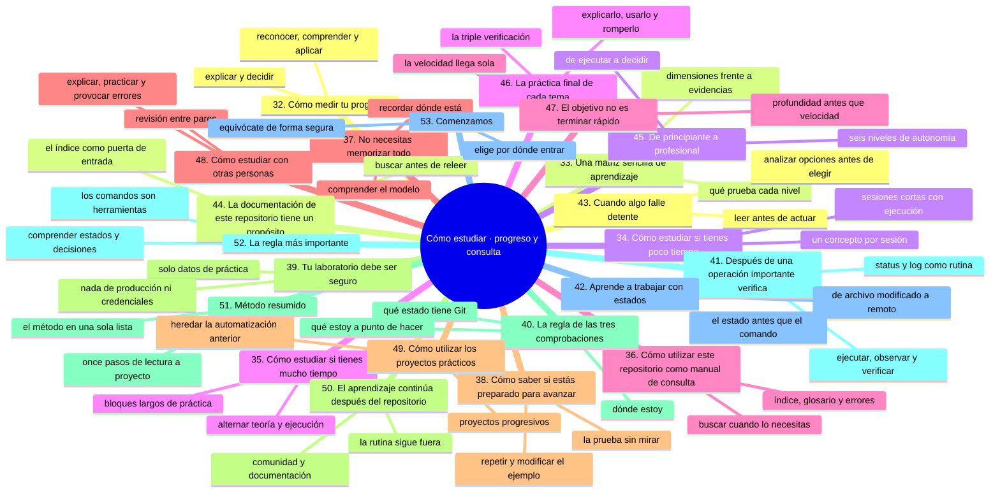
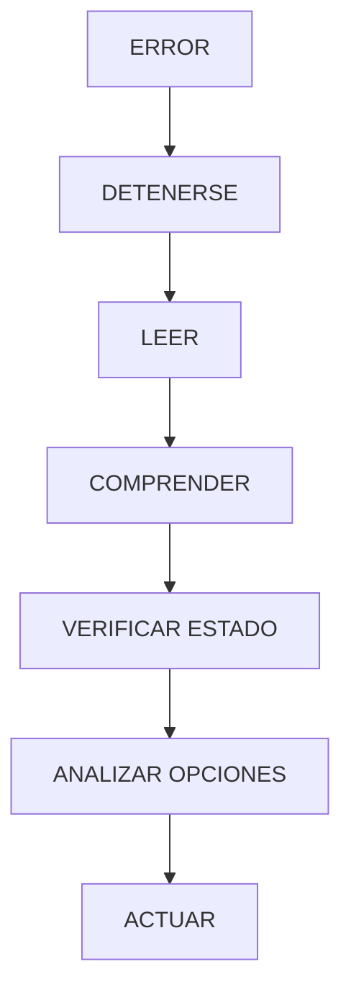
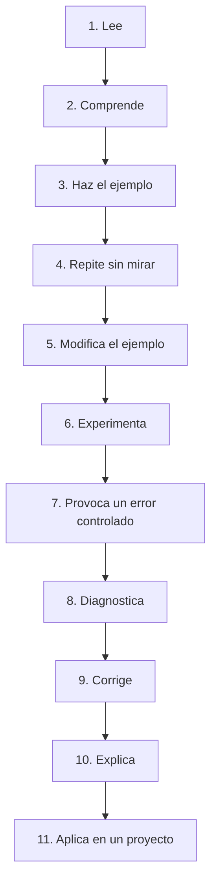

# Cómo estudiar, parte 3: medir el progreso y usar el curso como consulta

Esta parte cierra el capítulo de método. En [`04-como-estudiar-ciclo-y-fuentes.md`](04-como-estudiar-ciclo-y-fuentes.md) construiste el ciclo y las fuentes, y en [`05-como-estudiar-habitos-y-seguridad.md`](05-como-estudiar-habitos-y-seguridad.md) los hábitos y las reglas de seguridad; aquí viene la parte que casi todo el mundo se salta: **medir si estás avanzando de verdad** y usar este repositorio como manual, no como una novela que se lee de corrido.

Si solo te llevas una idea, que sea la de la sección 52: estudias Git para comprender estados y decisiones, no para memorizar comandos.

## Mapa conceptual de este capítulo



---

# 32. Cómo medir tu progreso

Puedes utilizar cuatro niveles.

## Nivel 1 — Reconocer

> "He visto este concepto."

Todavía no es suficiente.

## Nivel 2 — Comprender

> "Puedo explicar qué es."

Ya existe comprensión conceptual.

## Nivel 3 — Aplicar

> "Puedo utilizarlo."

Ya existe habilidad práctica.

## Nivel 4 — Explicar y decidir

> "Puedo utilizarlo, explicar sus consecuencias y decidir cuándo conviene utilizarlo."

Este es el objetivo de los niveles avanzados.

---

# 33. Una matriz sencilla de aprendizaje

| Nivel        | Puedes...                   |
| ------------ | --------------------------- |
| Reconocer    | identificar el concepto     |
| Comprender   | explicarlo                  |
| Aplicar      | utilizarlo                  |
| Diagnosticar | encontrar errores           |
| Comparar     | evaluar alternativas        |
| Decidir      | seleccionar una estrategia  |
| Enseñar      | explicárselo a otra persona |

El objetivo profesional es llegar progresivamente a los últimos niveles.

---

# 34. Cómo estudiar si tienes poco tiempo

No necesitas estudiar durante horas todos los días.

Puedes dividir el aprendizaje:

```text
Lunes
Concepto

Martes
Ejemplo

Miércoles
Práctica

Jueves
Experimento

Viernes
Repaso
```

Incluso pequeñas sesiones constantes pueden ser útiles si realmente practicas.

---

# 35. Cómo estudiar si tienes mucho tiempo

Si tienes varias horas disponibles, evita pasar todo el tiempo leyendo.

Una sesión extensa puede dividirse:

```text
20 % teoría
50 % práctica
20 % experimentación
10 % documentación y repaso
```

La proporción puede variar.

La idea es que la práctica tenga un peso importante.

---

# 36. Cómo utilizar este repositorio como manual de consulta

No tienes que leerlo siempre de principio a fin.

Una vez que tengas experiencia, puedes utilizarlo como referencia.

Por ejemplo:

> "¿Cuál es la diferencia entre revert y reset?"

Consulta:

```text
11-git-deshacer-y-recuperar/
```

> "¿Cómo funcionan las ramas?"

Consulta:

```text
08-git-ramas/
```

> "¿Cómo funcionan los Pull Requests?"

Consulta:

```text
15-pull-requests/
```

> "¿Cómo configuro CI?"

Consulta:

```text
19-github-actions/
```

Así el repositorio se convierte en:

```text
Curso
+
Manual
+
Referencia
+
Laboratorio
```

---

# 37. No necesitas memorizar todo

Incluso profesionales con años de experiencia consultan documentación.

Es normal olvidar:

```bash
git bisect
git worktree
git reflog
```

Lo importante es saber:

> "Existe una herramienta para este problema y sé dónde consultar cómo utilizarla."

Un buen profesional no necesariamente memoriza todo.

Sabe **encontrar, verificar y aplicar información técnica correctamente**.

---

# 38. Cómo saber si estás preparado para avanzar

Antes de pasar al siguiente tema, intenta responder:

```text
□ ¿Sé explicar el concepto?
□ ¿Puedo realizar el ejemplo?
□ ¿Puedo repetirlo sin mirar?
□ ¿Puedo modificar el ejemplo?
□ ¿Sé interpretar el resultado?
□ ¿Sé identificar un error básico?
□ ¿Sé explicar qué ocurrió?
□ ¿Sé dónde consultar si olvido algo?
```

Si puedes marcar la mayoría, continúa.

Si no, practica un poco más.

---

# 39. Tu laboratorio debe ser seguro

Durante el aprendizaje:

* utiliza repositorios de práctica;
* no guardes secretos reales;
* no uses contraseñas reales;
* no experimentes con datos sensibles;
* no ejecutes comandos destructivos sobre proyectos importantes;
* realiza copias cuando sea necesario;
* verifica el repositorio antes de operaciones peligrosas.

Especialmente:

> **Nunca utilices un proyecto de producción como laboratorio de aprendizaje.**

---

# 40. La regla de las tres comprobaciones

Antes de ejecutar una operación importante, comprueba:

### 1. ¿Dónde estoy?

```bash
pwd
```

o utiliza la herramienta equivalente de tu sistema.

### 2. ¿Qué estado tiene Git?

```bash
git status
```

### 3. ¿Qué estoy a punto de hacer?

Comprende el comando antes de ejecutarlo.

Estas tres comprobaciones pueden evitar muchos errores.

---

# 41. Después de una operación importante, verifica

No asumas que el comando produjo exactamente lo que esperabas.

Después de una operación importante:

```bash
git status
```

y, cuando corresponda:

```bash
git log
```

o:

```bash
git diff
```

La secuencia profesional es:

```text
Ejecutar
   ↓
Observar
   ↓
Verificar
   ↓
Continuar
```

---

# 42. Aprende a trabajar con estados

Una parte importante de Git consiste en comprender estados.

Por ejemplo:

```text
Archivo modificado
       ↓
Staging
       ↓
Commit
       ↓
Repositorio local
       ↓
Push
       ↓
Repositorio remoto
```

No pienses únicamente en comandos.

Piensa:

> **¿En qué estado se encuentra mi cambio?**

Esta pregunta será fundamental cuando lleguemos a problemas reales.

---

# 43. Cuando algo falle, detente

Una reacción común ante un error es ejecutar más comandos rápidamente.

Eso puede empeorar el problema.

En cambio:



Esta es una habilidad profesional.

---

# 44. La documentación de este repositorio tiene un propósito

Cada capítulo está diseñado para responder progresivamente:

```text
¿Qué es?
   ↓
¿Por qué existe?
   ↓
¿Qué problema resuelve?
   ↓
¿Cómo se utiliza?
   ↓
¿Qué ocurre internamente?
   ↓
¿Qué puede salir mal?
   ↓
¿Cómo se recupera?
   ↓
¿Cuándo conviene utilizarlo?
```

No todos los temas tendrán la misma profundidad.

Los conceptos básicos se explicarán de forma sencilla.

Los conceptos avanzados aumentarán progresivamente en profundidad técnica.

---

# 45. De principiante a profesional

La evolución esperada es:

### Principiante

> "No sé qué es Git."

### Básico

> "Sé crear commits."

### Intermedio

> "Sé trabajar con ramas y repositorios remotos."

### Avanzado

> "Sé resolver conflictos y recuperar errores."

### Profesional

> "Sé trabajar mediante Pull Requests, revisión, automatización y seguridad."

### Senior

> "Sé diseñar y mejorar estrategias de trabajo basadas en Git para equipos y proyectos."

Ese es el recorrido.

---

# 46. La práctica final de cada tema

Cuando termines un tema importante, intenta hacer tres cosas sin consultar el material.

### 1. Explicarlo

Explícalo con tus propias palabras.

### 2. Utilizarlo

Haz un ejercicio desde cero.

### 3. Romperlo

Crea una situación controlada donde pueda aparecer un error.

Después intenta recuperarte.

Si puedes hacer esas tres cosas, el concepto está mucho más consolidado.

---

# 47. El objetivo no es terminar rápido

No hay ninguna competición.

Terminar 20 capítulos sin comprenderlos vale menos que comprender profundamente cinco.

El objetivo es construir una base sólida.

```text
Velocidad
   ≠
Aprendizaje
```

La velocidad llegará después con la práctica.

---

# 48. Cómo estudiar con otras personas

También puedes aprender en grupo.

Una sesión puede consistir en:

```text
Persona A
explica el concepto

Persona B
realiza el ejercicio

Persona C
intenta provocar un error

Todos
analizan el resultado
```

Enseñar a otra persona suele revelar rápidamente qué partes todavía no comprendemos.

---

# 49. Cómo utilizar los proyectos prácticos

Cuando llegues a `27-proyectos-practicos/`, no intentes simplemente copiar la solución.

Primero:

1. lee los requisitos;
2. intenta resolverlos;
3. crea el repositorio;
4. trabaja con Git;
5. registra commits;
6. crea ramas;
7. documenta;
8. prueba;
9. revisa;
10. compara tu solución con las recomendaciones.

El proyecto debe ser una oportunidad para demostrar comprensión.

---

# 50. El aprendizaje continúa después del repositorio

Git y GitHub continúan evolucionando.

Por eso este repositorio debe considerarse una base de conocimiento que puede actualizarse.

Cuando una herramienta cambie:

* verifica la documentación actual;
* comprueba los comandos;
* revisa las interfaces;
* actualiza los ejemplos;
* documenta los cambios.

Aprender una tecnología también significa aprender a **mantener actualizado el conocimiento técnico**.

---

# 51. Método resumido

Si quieres recordar solamente un método, utiliza este:



---

# 52. La regla más importante

Si solamente recuerdas una cosa de este capítulo, recuerda esto:

> **No estudies Git para recordar comandos. Estudia Git para comprender estados, cambios, historial, colaboración y decisiones técnicas.**

Los comandos son herramientas.

El conocimiento está en comprender **cuándo, por qué y cómo utilizarlas**.

---

# 53. Comenzamos

Ahora que sabes cómo estudiar, puedes comenzar el recorrido.

Si necesitas conocimientos básicos de informática:

```text
01-computacion-desde-cero/
```

Si ya utilizas una computadora con soltura:

```text
02-github-desde-cero/
```

Si ya conoces Git y GitHub, utiliza el mapa de aprendizaje de `EMPIEZA-AQUI.md` para encontrar el punto adecuado.

No tengas prisa.

Lee.

Practica.

Experimenta.

Equivócate de forma segura.

Investiga.

Corrige.

Y vuelve a intentarlo.

> **El objetivo no es que Git deje de parecer complicado. El objetivo es que aprendas a comprenderlo.**

---

### Ejercicio de transferencia

Elige tres temas que ya hayas estudiado y construye tu matriz de progreso en un archivo `MI-MATRIZ.md` de tu repositorio de práctica: para cada tema escribe qué harías para demostrar que lo reconoces, que lo entiendes, que lo aplicas y que puedes explicarlo y decidir con él, con una evidencia concreta por celda (enlace, captura o comando ejecutado). Si alguna celda no tiene evidencia posible, marca el tema como no superado.

## Autopreguntas de cierre

Sin mirar el material, responde mentalmente y luego compruébalo con este capítulo:

1. ¿Qué diferencia hay entre reconocer un comando y poder explicar y decidir con él?
2. Si llevas dos semanas leyendo sin hacer un solo commit, ¿qué señal de este capítulo te está avisando?
3. ¿Qué tres comprobaciones haces antes de ejecutar un comando y por qué en ese orden?
4. ¿Por qué terminar el curso lo más rápido posible puede dejarte sin la competencia que buscas?
5. Si solo dispusieras de 30 minutos al día, ¿qué recorte de esta parte harías y cuál no tocarías?
6. ¿Cómo usarías este repositorio como manual de consulta en lugar de como lectura lineal?
