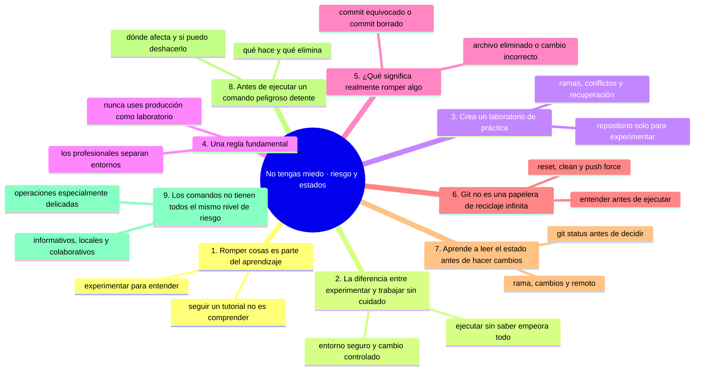
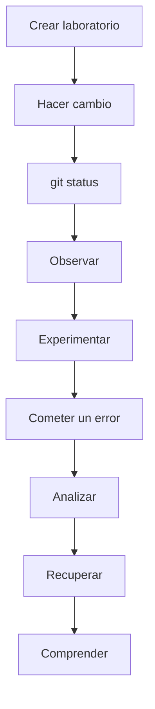

# No tengas miedo a romper cosas

## Introducción

Una de las principales barreras para aprender Git y GitHub no es la dificultad técnica.

Es el miedo.

Muchas personas piensan:

> “¿Y si borro algo?”

> “¿Y si hago un commit incorrecto?”

> “¿Y si daño el repositorio?”

> “¿Y si ejecuto un comando y pierdo todo?”

Ese miedo es comprensible, especialmente cuando se está empezando.

Pero hay una idea fundamental que debes aprender desde el principio:

**Aprender tecnología implica experimentar.**

Y experimentar implica equivocarse.

Git, además, fue diseñado alrededor de una idea especialmente útil para aprender: **mantener un historial de cambios**.

Eso significa que, en muchas situaciones, un error no significa que todo esté perdido.

Sin embargo, también es importante entender que **no todos los errores son automáticamente recuperables**. Algunos comandos pueden eliminar información, sobrescribir cambios o dificultar considerablemente su recuperación.

Por eso, el objetivo de este capítulo no es decir:

> “No puedes romper Git”.

El objetivo es enseñarte a pensar así:

> **“Puedo experimentar de forma controlada, entender el riesgo y saber cómo recuperarme si algo sale mal.”**

---

## Mapa conceptual de este capítulo



---

# 1. Romper cosas es parte del aprendizaje

Cuando una persona aprende algo nuevo, normalmente intenta evitar cualquier error.

En programación y tecnología esto puede convertirse en un problema.

Si solamente haces exactamente lo que dice un tutorial, puedes completar el ejercicio sin comprender realmente qué está sucediendo.

Por ejemplo:

```bash
git add .
git commit -m "Cambios"
git push
```

Puedes aprender a escribir esos comandos.

Pero todavía podrías no saber:

* qué significa `add`;
* qué es el área de preparación;
* qué contiene el commit;
* dónde se guarda;
* qué significa `push`;
* hacia dónde se envían los datos;
* qué ocurre si `push` falla;
* qué sucede si haces un commit incorrecto;
* cómo recuperar un archivo eliminado.

Por eso necesitamos experimentar.

---

# 2. La diferencia entre experimentar y trabajar sin cuidado

Experimentar no significa ejecutar comandos aleatoriamente.

Existe una diferencia importante.

## Experimentar

Significa:

1. Crear un entorno seguro.
2. Hacer un cambio.
3. Observar qué ocurrió.
4. Comprobar el estado.
5. Intentar otra operación.
6. Provocar un error controlado.
7. Analizar el resultado.
8. Recuperar el estado anterior.

Por ejemplo:



## Trabajar sin cuidado

Es algo completamente diferente:

```text
No sé qué hace el comando
        ↓
Lo ejecuto
        ↓
Algo desaparece
        ↓
No sé qué ocurrió
        ↓
Intento otros comandos
        ↓
La situación empeora
```

La primera estrategia produce aprendizaje.

La segunda puede producir pérdida de información.

---

# 3. Crea un laboratorio de práctica

Una de las mejores formas de aprender Git es tener un repositorio exclusivamente para experimentar.

Puedes llamarlo:

```text
laboratorio-git
```

o:

```text
git-practica
```

o:

```text
mis-experimentos-git
```

No necesitas colocar allí información importante.

Puedes crear archivos como:

```text
laboratorio-git/
├── README.md
├── notas.txt
├── prueba.txt
├── ejemplo.md
└── datos/
    └── prueba.csv
```

Este repositorio será tu espacio de entrenamiento.

Puedes:

* crear archivos;
* modificarlos;
* eliminarlos;
* crear ramas;
* hacer commits;
* crear conflictos;
* practicar `restore`;
* practicar `revert`;
* practicar `reset`;
* utilizar `stash`;
* experimentar con `rebase`;
* recuperar commits;
* probar diferentes estrategias.

La finalidad es que aprendas **sin poner en riesgo un proyecto importante**.

---

# 4. Una regla fundamental

## Nunca utilices producción como laboratorio de aprendizaje

Si estás aprendiendo:

```text
NO
↓
Repositorio importante
↓
Experimentar con comandos que todavía no entiendes
```

Es mucho mejor:

```text
SÍ
↓
Repositorio de práctica
↓
Experimentar
↓
Observar
↓
Aprender
```

Esta regla continúa siendo válida incluso cuando tengas experiencia.

Los profesionales también utilizan entornos separados para experimentar.

---

# 5. ¿Qué significa realmente “romper” algo?

Cuando alguien dice:

> “Rompí mi repositorio”.

Puede estar describiendo situaciones completamente diferentes.

Por ejemplo:

### Caso 1: eliminaste un archivo del directorio de trabajo

```text
archivo.txt
    ↓
eliminado
```

Si el archivo estaba registrado por Git y todavía existe en un commit anterior, posiblemente puedas recuperarlo.

---

### Caso 2: hiciste un cambio incorrecto

Por ejemplo:

```text
README.md
```

contenía:

```text
Curso de Git
```

y lo cambiaste accidentalmente por:

```text
Texto incorrecto
```

Si todavía no has confirmado el cambio, Git puede ayudarte a restaurar el estado anterior.

---

### Caso 3: hiciste un commit equivocado

Por ejemplo:

```text
A → B → C
```

y descubres que `C` contiene un error.

Esto no significa necesariamente que todo el repositorio esté perdido.

Dependiendo de la situación, puedes:

* crear otro commit;
* revertir el cambio;
* reorganizar el historial;
* recuperar información;
* utilizar otras herramientas de recuperación.

---

### Caso 4: eliminaste un commit

Aquí la situación requiere mayor atención.

Git mantiene referencias y objetos internos que pueden permitir recuperar información que aparentemente desapareció.

Una herramienta especialmente importante para comprender esto es:

```bash
git reflog
```

Pero no debes interpretar esto como:

> “Git siempre puede recuperar cualquier cosa”.

La recuperación depende de qué ocurrió, de qué referencias existen, de cuánto tiempo ha pasado y de otras circunstancias.

---

# 6. Git no es una papelera de reciclaje infinita

Este concepto es muy importante.

Git guarda historial, pero no significa que todos los datos estén protegidos para siempre.

Por ejemplo, debes tener especial cuidado con comandos como:

⚠️ **RIESGO:** `git reset --hard` mueve la rama a otro commit y descarta del disco cualquier cambio sin confirmar. El commit al que vuelves se recupera con `git reflog`, pero los cambios que no estaban commiteados, no.

```bash
git reset --hard
```

o:

⚠️ **RIESGO:** `git clean` borra archivos sin seguimiento del disco. Git nunca los registró, así que no hay reflog ni objeto que los recupere; ejecuta primero `git clean -n` para ver qué se borraría sin borrar nada.

```bash
git clean
```

y con determinadas operaciones que reescriben historial o eliminan referencias.

También debes tener muchísimo cuidado con:

⚠️ **RIESGO:** `git push --force` sobrescribe el historial del repositorio remoto. Si otra persona ya trabajó sobre esos commits, su trabajo puede quedar fuera de forma difícil de recuperar; en ramas compartidas usa `--force-with-lease` o mejor, no fuerces.

```bash
git push --force
```

especialmente cuando trabajas con otras personas.

Por eso:

> **No ejecutes un comando destructivo solamente porque alguien lo publicó en Internet.**

Primero debes entender:

* qué modifica;
* qué elimina;
* en qué estado estás;
* qué información podría perderse;
* si existe una forma de recuperación;
* si estás trabajando localmente o sobre un repositorio compartido.

---

# 7. Aprende a leer el estado antes de hacer cambios

Uno de los mejores hábitos de Git es utilizar:

```bash
git status
```

antes de tomar decisiones importantes.

Por ejemplo:

```bash
git status
```

puede ayudarte a responder preguntas como:

* ¿En qué rama estoy?
* ¿Tengo archivos modificados?
* ¿Hay archivos preparados para commit?
* ¿Hay archivos sin seguimiento?
* ¿Mi rama está adelantada respecto al remoto?
* ¿Mi rama está atrasada?

Esto convierte una situación que parece confusa en información concreta.

---

# 8. Antes de ejecutar un comando peligroso, detente

Cuando encuentres un comando que no conoces, no tienes que ejecutarlo inmediatamente.

Hazte estas preguntas:

```text
¿Qué hace?
     ↓
¿Qué modifica?
     ↓
¿Qué elimina?
     ↓
¿Afecta mi directorio de trabajo?
     ↓
¿Afecta el staging area?
     ↓
¿Afecta commits?
     ↓
¿Afecta el repositorio remoto?
     ↓
¿Puedo deshacerlo?
```

Si no puedes responderlas, primero investiga.

---

# 9. Los comandos no tienen todos el mismo nivel de riesgo

No todos los comandos Git deben tratarse de la misma manera.

Podemos pensar en diferentes niveles.

## Operaciones generalmente informativas

Por ejemplo:

```bash
git status
git log
git diff
git show
git branch
```

Principalmente sirven para observar información.

---

## Operaciones que modifican el estado local

Por ejemplo:

```bash
git add
git commit
git restore
git reset
git stash
```

Estas operaciones pueden modificar tu estado de trabajo o historial local.

Debes comprenderlas antes de utilizarlas.

---

## Operaciones que afectan colaboración

Por ejemplo:

```bash
git push
git pull
git fetch
```

Estas operaciones involucran comunicación con repositorios remotos.

---

## Operaciones especialmente delicadas

Por ejemplo:

⚠️ **RIESGO:** los tres comandos de este bloque son los más destructivos del bloque de «operaciones delicadas»: `git reset --hard` pierde cambios sin confirmar, `git clean` borra archivos no versionados sin posibilidad de reflog y `git push --force` reescribe el remoto para todo el equipo. Comprueba `git status` y ten una copia de lo que te importa antes de cualquiera de ellos.

```bash
git reset --hard
git clean
git push --force
```

También existen operaciones avanzadas de reescritura del historial, como determinados usos de:

```bash
git rebase
```

No significa que sean comandos “malos”.

Significa que requieren **comprensión del contexto y de sus consecuencias**.

---

### Ejercicio de transferencia

En tu laboratorio de práctica, provoca deliberadamente tres averías: elimina un archivo sin commitear, deja un archivo modificado en el staging y borra el último commit (recupéralo con `git reflog`). Para cada avería aplica el flujo de la sección 43 del capítulo de estudio —ERROR, detente, lee, comprueba el estado, analiza opciones, actúa— y anota qué perdiste, si era recuperable y con qué comando lo recuperaste. Entregable: una entrada de tu cuaderno con las tres averías y su ruta de recuperación.

Sigue con [`08-no-tengas-miedo-errores-y-recuperacion.md`](08-no-tengas-miedo-errores-y-recuperacion.md): leer los mensajes de error como información y recuperarte sin entrar en pánico.

## Autopreguntas de cierre

Sin mirar el material, responde mentalmente y luego compruébalo con este capítulo:

1. ¿Qué diferencia hay entre experimentar en el laboratorio y trabajar sin cuidado en el proyecto?
2. ¿Por qué seguir un tutorial paso a paso puede dejarte sin entender lo que hiciste?
3. ¿Qué tres casos distintos hay detrás de la frase «rompí mi repositorio» y cómo se recuperan?
4. ¿Por qué Git no es una papelera de reciclaje infinita aunque guarde historial?
5. ¿Qué preguntas te haces antes de ejecutar un comando que no conoces?
6. ¿Cómo clasificarías el riesgo de `git restore`, `git fetch` y `git reset --hard`?
7. ¿Por qué la regla del laboratorio sigue vigente cuando ya tienes experiencia?
