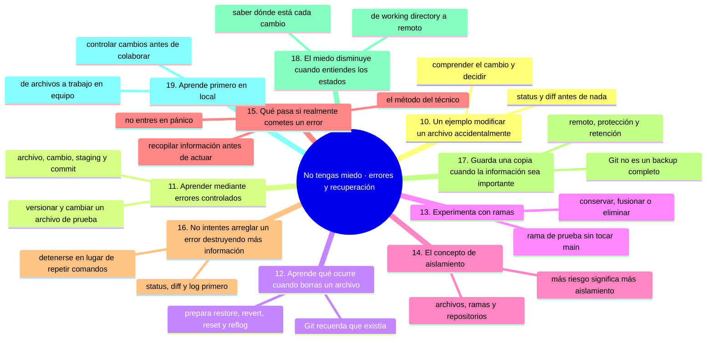
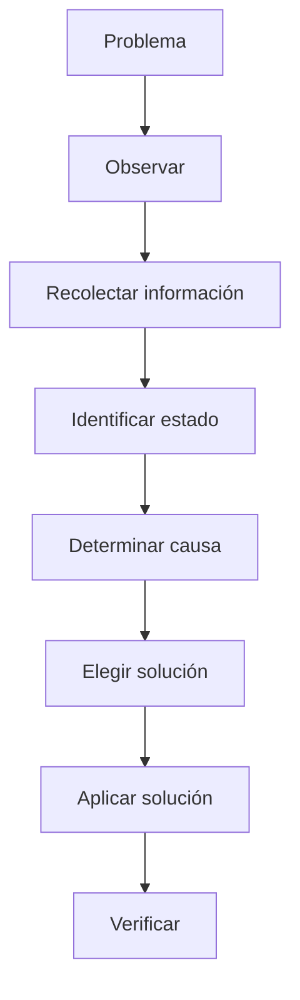
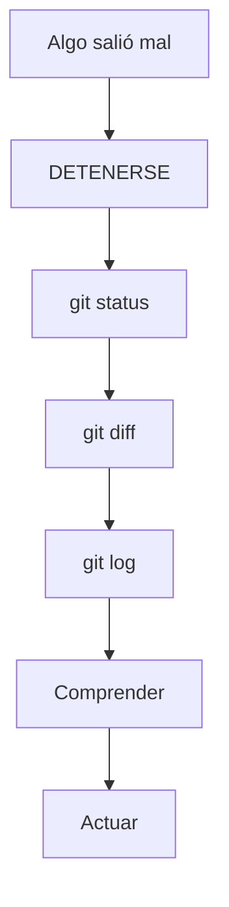

# No tengas miedo, parte 2: errores, diagnóstico y recuperación

En [`07-no-tengas-miedo-riesgo-y-estados.md`](07-no-tengas-miedo-riesgo-y-estados.md) viste que experimentar en un laboratorio es seguro y qué comandos son realmente destructivos. Aquí toca el otro lado: **qué hacer cuando el error ya ocurrió**, cómo diagnosticarlo con información y no con intuición, y cómo construir los hábitos que convierten un susto en aprendizaje.

La idea que ordena esta parte es que reconstruir la situación vale más que memorizar cien comandos.

## Mapa conceptual de este capítulo



---

# 10. Un ejemplo: modificar un archivo accidentalmente

Supongamos que tienes:

```text
README.md
```

y accidentalmente cambias varias líneas.

Antes de hacer cualquier otra cosa puedes consultar:

```bash
git status
```

Después:

```bash
git diff
```

`git diff` permite observar qué cambió.

Este paso es fundamental.

No necesitas adivinar.

Puedes inspeccionar la diferencia.

El flujo mental es:

```text
Cambio accidental
       ↓
git status
       ↓
git diff
       ↓
Comprender el cambio
       ↓
Decidir qué hacer
```

Esta forma de trabajar es mucho más segura que ejecutar comandos al azar.

---

# 11. Aprender mediante errores controlados

Una excelente práctica consiste en provocar errores deliberadamente.

Por ejemplo:

### Ejercicio

Crea:

```text
prueba.txt
```

Escribe:

```text
Versión 1
```

Haz un commit.

Después cambia el archivo:

```text
Versión 2
```

Ahora observa:

```bash
git status
```

Después:

```bash
git diff
```

Ahora cambia nuevamente:

```text
Versión 3
```

Vuelve a observar.

De esta forma puedes comenzar a comprender la relación entre:

```text
Archivo
   ↓
Cambio
   ↓
Working directory
   ↓
Staging
   ↓
Commit
```

---

# 12. Aprende qué ocurre cuando borras un archivo

Otro ejercicio útil es eliminar un archivo de práctica.

Por ejemplo:

```text
prueba.txt
```

Después observa:

```bash
git status
```

Git puede detectar que el archivo fue eliminado.

Ahora puedes estudiar cómo recuperar ese estado.

El objetivo no es memorizar inmediatamente un comando.

El objetivo es comprender:

> “Git sabe que ese archivo existía porque forma parte de su historial”.

Esta idea será fundamental cuando estudies posteriormente:

* `git restore`;
* `git revert`;
* `git reset`;
* `git reflog`.

---

# 13. Experimenta con ramas

Las ramas son especialmente útiles para aprender sin alterar directamente la línea principal de trabajo.

Puedes imaginar:

```text
main
  │
  A
  │
  B
  │
  C
  └───────────────┐
                  │
                prueba
                  │
                  D
                  │
                  E
```

La rama `prueba` puede utilizarse para experimentar.

Puedes crear cambios y observar qué sucede.

Después puedes:

* conservarlos;
* fusionarlos;
* eliminarlos;
* crear otra rama;
* volver a `main`.

Esto permite experimentar de forma mucho más segura.

---

# 14. El concepto de aislamiento

Una habilidad profesional importante es saber **aislar los experimentos**.

Puedes aislar:

* archivos;
* ramas;
* repositorios;
* entornos;
* máquinas;
* contenedores;
* cuentas;
* proyectos.

Por ejemplo:

```text
Proyecto real
      │
      └── No experimentar directamente
               
Laboratorio
      │
      ├── Rama prueba-1
      ├── Rama prueba-2
      └── Rama conflicto
```

Cuanto mayor sea el riesgo, mayor debe ser el nivel de aislamiento.

---

# 15. ¿Qué pasa si realmente cometes un error?

Primero:

**No entres en pánico.**

Segundo:

**No ejecutes cinco comandos más intentando arreglarlo sin saber qué ocurrió.**

Haz una pausa.

Después recopila información.

Por ejemplo:

```bash
git status
```

Luego:

```bash
git log --oneline --decorate --graph --all
```

Y, si corresponde:

```bash
git diff
```

La idea es reconstruir la situación.

Piensa como un técnico:



Esto es mucho más importante que memorizar cien comandos.

---

# 16. No intentes arreglar un error destruyendo más información

Un error común es hacer algo parecido a esto:

```text
Algo salió mal
      ↓
Ejecutar otro comando
      ↓
Sigue mal
      ↓
Ejecutar otro comando
      ↓
Ahora hay dos problemas
      ↓
Ejecutar otro comando
      ↓
Situación más difícil
```

En lugar de eso:



Este hábito diferencia progresivamente a un principiante de una persona que sabe diagnosticar Git.

---

# 17. Guarda una copia cuando la información sea importante

Git es un sistema de control de versiones.

No debe confundirse automáticamente con una estrategia completa de copias de seguridad.

Para información importante pueden existir mecanismos adicionales:

```text
Git
+
Repositorio remoto
+
Copias de seguridad
+
Protección de infraestructura
```

La estrategia adecuada depende del proyecto.

Por ejemplo, un proyecto profesional puede requerir:

* repositorios remotos;
* protección de ramas;
* copias de seguridad;
* almacenamiento redundante;
* políticas de retención;
* control de acceso;
* recuperación ante desastres.

Por eso:

> **Git ayuda a gestionar versiones, pero Git por sí solo no constituye necesariamente una estrategia completa de backup.**

---

# 18. El miedo disminuye cuando entiendes los estados

Muchos principiantes sienten que Git es una especie de caja negra.

Es más fácil entenderlo cuando pensamos en estados.

```text
                 Git

        ┌───────────────────┐
        │ Working Directory  │
        └─────────┬─────────┘
                  │
               git add
                  ↓
        ┌───────────────────┐
        │   Staging Area     │
        └─────────┬─────────┘
                  │
             git commit
                  ↓
        ┌───────────────────┐
        │  Local Repository  │
        └─────────┬─────────┘
                  │
               git push
                  ↓
        ┌───────────────────┐
        │ Remote Repository  │
        │      GitHub        │
        └───────────────────┘
```

Cuando entiendes dónde está cada cambio, resulta mucho más fácil determinar qué puedes hacer con él.

---

# 19. Aprende primero en local

Para una persona que está empezando, una progresión razonable es:

```text
Archivos
   ↓
Git local
   ↓
Commits
   ↓
Ramas
   ↓
Recuperación
   ↓
Repositorio remoto
   ↓
GitHub
   ↓
Trabajo en equipo
```

No necesitas aprender inmediatamente:

* Pull Requests;
* GitHub Actions;
* CI/CD;
* DevOps;
* DevSecOps;
* estrategias complejas de ramas.

Primero aprende a controlar tus propios cambios.

Después aprenderás a colaborar con otras personas.

---

### Ejercicio de transferencia

Reproduce el escenario completo de este capítulo en el laboratorio: crea `prueba.txt`, haz commit, modifica el archivo, bórralo y, a continuación, ejecuta sin mirar dos comandos de arreglo que empeoren la situación. Reconstruye después la situación con `git status`, `git diff` y `git log --oneline --decorate --graph --all`, decide la solución y verifícala. Entregable: una nota con la secuencia errónea, el diagnóstico correcto y la reparación aplicada.

Sigue con [`09-no-tengas-miedo-mentalidad-y-practica.md`](09-no-tengas-miedo-mentalidad-y-practica.md): mentalidad, práctica deliberada y cómo pasar de leer a dominar.

## Autopreguntas de cierre

Sin mirar el material, responde mentalmente y luego compruébalo con este capítulo:

1. ¿Qué tres comandos consultas primero cuando algo ha salido mal y por qué en ese orden?
2. ¿Por qué ejecutar cinco comandos de arreglo sin entender el problema deja todo peor?
3. ¿Qué ganas al provocar tú mismo el error en lugar de esperar a que te ocurra?
4. ¿Qué límites tiene la recuperación con reflog (tiempo, referencias, circunstancias)?
5. ¿Por qué Git, por sí solo, no es una estrategia completa de copias de seguridad?
6. ¿En qué estado queda un cambio después de `git add` y antes de `git commit`?
