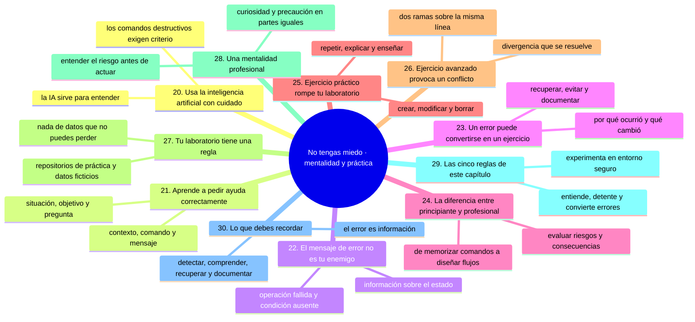
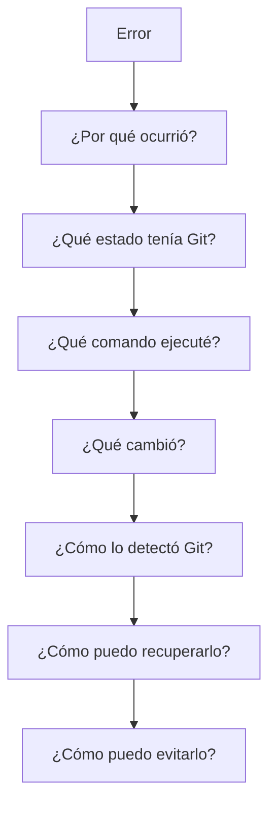
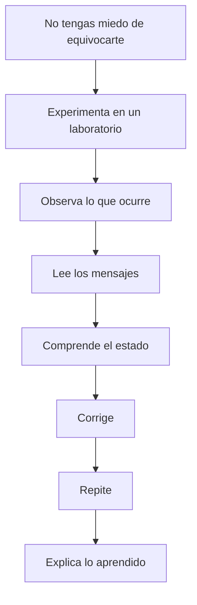

# No tengas miedo, parte 3: mentalidad y práctica deliberada

Tras [`07-no-tengas-miedo-riesgo-y-estados.md`](07-no-tengas-miedo-riesgo-y-estados.md) y [`08-no-tengas-miedo-errores-y-recuperacion.md`](08-no-tengas-miedo-errores-y-recuperacion.md), esta última parte de la sección se ocupa de lo que separa a quien lee de quien sabe: la mentalidad con la que usas la IA y los mensajes de error, y la práctica deliberada que convierte un fallo en conocimiento.

La idea que debes llevarte es la de la sección 30: **un error durante el aprendizaje no es un fracaso, es información**.

## Mapa conceptual de este capítulo



---

# 20. Usa la inteligencia artificial con cuidado

La inteligencia artificial puede ser una excelente herramienta para aprender Git.

Puedes preguntarle:

> “Explícame qué ocurrió con este `git status`.”

o:

> “¿Qué diferencia hay entre `git restore` y `git revert`?”

o:

> “Explícame qué consecuencias tendría este comando antes de ejecutarlo.”

Pero existe una regla importante:

> **No ejecutes automáticamente un comando destructivo solamente porque una IA te lo recomendó.**

Especialmente cuando aparezcan comandos como:

⚠️ **RIESGO:** estos son los tres comandos que la IA (o un foro) puede recomendarte sin advertirte del coste: `git reset --hard` y `git clean` borran cambios sin confirmar, y `git push --force` sobrescribe el historial remoto para todo el equipo. Interroga a la IA por las consecuencias, no le copies los comandos sin comprobarlos.

```bash
git reset --hard
git clean
git push --force
```

Antes de ejecutarlos, comprende:

* qué hacen;
* qué información pueden modificar;
* qué información pueden eliminar;
* si existen cambios sin guardar;
* si estás trabajando con otras personas;
* cómo podrías recuperar el estado anterior.

La IA debe ayudarte a **entender**, no sustituir tu criterio técnico.

---

# 21. Aprende a pedir ayuda correctamente

Si algo sale mal, evita decir solamente:

> “Git no funciona.”

Una buena pregunta contiene información.

Por ejemplo:

```text
Estoy trabajando en una rama llamada prueba.

Ejecuté:
git merge main

Git mostró este mensaje:
[pegar mensaje]

Antes de ejecutar el comando tenía:
[describir situación]

Ahora tengo:
[describir situación]

Quiero conseguir:
[objetivo]

¿Qué ocurrió y cuáles son las opciones seguras para resolverlo?
```

Esta información permite diagnosticar el problema.

Más adelante aprenderás que esta forma de describir problemas es parte del trabajo profesional.

---

# 22. El mensaje de error no es tu enemigo

Cuando Git muestra:

```text
error: ...
```

la reacción inicial puede ser:

> “Algo está mal.”

Una reacción más útil es:

> “Git me está proporcionando información sobre el estado del sistema.”

Los mensajes de error pueden indicar:

* qué operación falló;
* por qué falló;
* qué archivo está involucrado;
* qué rama está involucrada;
* qué condición falta;
* qué operación debes realizar.

No siempre son fáciles de entender.

Pero aprender a leerlos es una habilidad esencial.

---

# 23. Un error puede convertirse en un ejercicio

Supongamos que haces algo incorrecto.

En lugar de pensar únicamente:

> “Tengo que arreglarlo”.

También puedes preguntarte:

> “¿Por qué ocurrió?”

Por ejemplo:



Este proceso convierte un problema en conocimiento.

---

# 24. La diferencia entre principiante y profesional

Un principiante puede pensar:

> “Necesito saber todos los comandos.”

Un usuario intermedio puede pensar:

> “Necesito saber qué comando utilizar.”

Una persona con experiencia empieza a pensar:

> “Necesito entender el estado del repositorio y elegir una operación adecuada.”

Una persona de nivel senior además considera:

> “¿Qué consecuencias tendrá esta operación para el historial, el equipo, la automatización, la seguridad y el sistema de entrega?”

La evolución puede representarse así:

```text
Memorizar comandos
       ↓
Entender comandos
       ↓
Entender estados
       ↓
Diagnosticar problemas
       ↓
Evaluar riesgos
       ↓
Elegir estrategias
       ↓
Diseñar flujos
```

Ese es uno de los objetivos de este repositorio.

---

# 25. Ejercicio práctico: rompe tu laboratorio

Ahora puedes realizar un ejercicio controlado.

## Paso 1. Crea un archivo

```text
experimento.txt
```

Contenido:

```text
Primera versión
```

---

## Paso 2. Regístralo en Git

```bash
git add experimento.txt
git commit -m "Agregar archivo de experimento"
```

---

## Paso 3. Modifícalo

Cambia el contenido a:

```text
Segunda versión
```

---

## Paso 4. Observa

```bash
git status
```

Después:

```bash
git diff
```

---

## Paso 5. Elimina el archivo

Elimínalo utilizando tu sistema operativo.

Después:

```bash
git status
```

Observa qué detecta Git.

---

## Paso 6. Investiga cómo recuperar el archivo

Antes de ejecutar un comando, intenta responder:

> ¿De dónde podría recuperar Git el archivo?

Pista:

```text
Historial
   ↓
Commit anterior
   ↓
Archivo anterior
```

---

## Paso 7. Repite el ejercicio

Realiza el mismo proceso varias veces.

La segunda vez intenta explicar lo que sucede.

La tercera vez intenta enseñárselo a otra persona.

Si puedes explicar:

```text
qué cambió
por qué Git lo detectó
dónde estaba el archivo
qué información conservaba Git
cómo recuperar el estado
```

entonces ya no estás simplemente siguiendo instrucciones.

Estás aprendiendo Git.

---

# 26. Ejercicio avanzado: provoca un conflicto

Cuando llegues al capítulo de ramas, puedes crear dos ramas que modifiquen la misma línea.

Por ejemplo:

```text
main
 │
 A
 │
 B
 ├───────────────┐
 │               │
 │             rama-A
 │               │
 │               C
 │
 └───────────────┐
                 │
               rama-B
                 │
                 D
```

Si ambas ramas modifican la misma parte del mismo archivo, Git puede detectar un conflicto durante la integración.

Esto no significa que Git esté roto.

Significa:

> **Git no puede determinar automáticamente cuál de las dos modificaciones debe conservar.**

El conflicto se convierte entonces en una oportunidad para aprender:

* qué es una divergencia;
* cómo Git compara cambios;
* qué es un conflicto;
* cómo se resuelve;
* qué significa continuar una operación;
* cómo cancelar una operación.

Este tema se estudiará posteriormente con profundidad.

---

# 27. Tu laboratorio tiene una regla

Puedes romper casi cualquier cosa que quieras dentro de tu laboratorio.

Pero debes conocer una regla:

> **No experimentes con información que no puedas permitirte perder.**

Por ejemplo, no utilices como laboratorio:

```text
Repositorio de una empresa
Repositorio de un cliente
Código de producción
Datos personales
Credenciales
Claves privadas
Tokens
Secretos
Información financiera
Información confidencial
```

Para experimentar utiliza:

```text
Repositorio de práctica
Datos ficticios
Cuentas de prueba
Ramas de prueba
Archivos de ejemplo
```

---

# 28. Una mentalidad profesional

La mentalidad que queremos desarrollar no es:

> “Tengo miedo de ejecutar comandos.”

Tampoco:

> “No importa, siempre puedo arreglarlo.”

La mentalidad correcta está entre ambas:

> **“Entiendo el riesgo antes de actuar.”**

Eso significa:

```text
Curiosidad
   +
Experimentación
   +
Observación
   +
Comprensión
   +
Precaución
   =
Aprendizaje técnico
```

---

# 29. Las cinco reglas de este capítulo

## Regla 1

**Experimenta.**

No puedes aprender Git únicamente leyendo.

---

## Regla 2

**Experimenta en un entorno seguro.**

Utiliza un repositorio de práctica.

---

## Regla 3

**Antes de ejecutar algo peligroso, entiende sus consecuencias.**

Especialmente con comandos que modifican o eliminan información.

---

## Regla 4

**Cuando algo salga mal, detente antes de empeorarlo.**

Primero observa:

```bash
git status
```

y utiliza otras herramientas de diagnóstico según corresponda.

---

## Regla 5

**Convierte los errores en conocimiento.**

No preguntes solamente:

> “¿Cómo arreglo esto?”

También pregunta:

> “¿Por qué ocurrió?”

---

# 30. Lo que debes recordar

Git no debe aprenderse desde el miedo.

Pero tampoco desde la imprudencia.

Debes aprender a experimentar con método.

Recuerda:



Y una idea debe acompañarte durante todo este repositorio:

> **Un error durante el aprendizaje no es un fracaso. Es información.**

La verdadera habilidad no consiste en nunca equivocarse.

Consiste en aprender a:

* detectar el error;
* comprender qué ocurrió;
* evaluar el riesgo;
* recuperar el estado cuando sea posible;
* evitar repetirlo;
* documentar lo aprendido.

Ese proceso te llevará progresivamente desde aprender Git hasta **pensar como una persona que trabaja profesionalmente con sistemas de control de versiones**.

---

### Ejercicio de transferencia

Realiza el ejercicio de romper tu laboratorio (sección 25) dos veces: la primera siguiendo los pasos sin más, la segunda explicando en voz alta qué hizo Git en cada estado y enseñándoselo a otra persona. En la misma entrada del cuaderno, formula con el patrón de la sección 21 la duda que te haya quedado sobre la recuperación del archivo. Entregable: las notas de tu explicación y la pregunta bien formulada que salió de ella.

Sigue con [`10-como-pedir-ayuda-formula-y-contexto.md`](10-como-pedir-ayuda-formula-y-contexto.md): la fórmula para pedir ayuda y cómo dar contexto, objetivo y restricciones.

## Autopreguntas de cierre

Sin mirar el material, responde mentalmente y luego compruébalo con este capítulo:

1. ¿Por qué la IA debe ayudarte a entender y no a sustituir tu criterio técnico?
2. ¿Qué información mínima lleva una buena pregunta cuando algo falla en Git?
3. ¿Qué seis cosas puede indicarte un mensaje de error de Git?
4. ¿En qué se diferencia convertir un error en un ejercicio de limitarse a arreglarlo?
5. ¿Qué piensa un principiante y qué piensa una persona senior, y qué cambia entre ambas?
6. ¿Por qué un conflicto de ramas es una oportunidad de aprendizaje y no una avería?
7. ¿Cuáles son las cinco reglas de este capítulo y cuál te cuesta más cumplir?

---

## Próximo paso

Ahora que sabes que puedes experimentar de forma controlada, el siguiente paso es aprender otra habilidad fundamental:

**pedir ayuda correctamente cuando no entiendes algo o cuando Git produce un comportamiento inesperado.**

Ese tema será especialmente importante porque aprender Git no significa aprenderlo todo de memoria. Significa aprender a investigar, formular preguntas y diagnosticar problemas.
