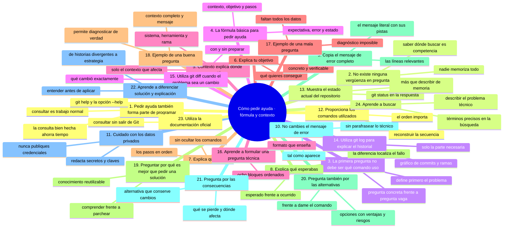
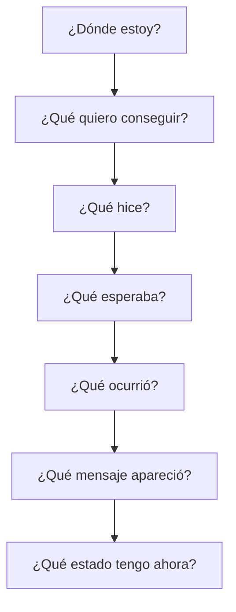
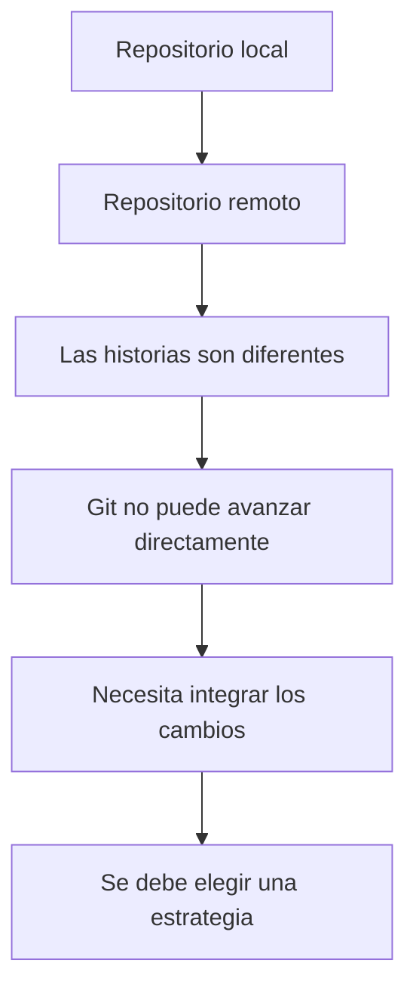

# Cómo pedir ayuda

## Introducción

Aprender Git y GitHub no significa saberlo todo.

Incluso las personas con muchos años de experiencia encuentran problemas que nunca habían visto.

La diferencia entre una persona principiante y una persona con experiencia no consiste en que una nunca tiene problemas.

La diferencia está en **cómo enfrenta el problema**.

Una persona principiante puede decir:

> “Git no funciona.”

Una persona que está aprendiendo a diagnosticar puede decir:

> “Estoy en la rama `feature-login`, intenté hacer `git push`, Git rechazó la operación porque el repositorio remoto contiene cambios que no tengo localmente. Este es el mensaje completo y este era mi estado antes del comando.”

La segunda descripción permite investigar.

Por eso, aprender a pedir ayuda es una habilidad técnica.

---

## Mapa conceptual de este capítulo



---

# 1. Pedir ayuda también forma parte de programar

En tecnología nadie memoriza todas las respuestas.

Los profesionales consultan constantemente:

* documentación;
* manuales;
* ejemplos;
* repositorios;
* especificaciones;
* foros;
* comunidades;
* compañeros;
* herramientas de diagnóstico;
* inteligencia artificial.

La diferencia está en **cómo realizan la consulta**.

Una buena consulta reduce el tiempo necesario para encontrar una solución.

Una mala consulta puede producir muchas respuestas irrelevantes.

---

# 2. No existe ninguna vergüenza en preguntar

Una persona que está comenzando puede pensar:

> “Si pregunto esto, los demás pensarán que no sé nada.”

Esto puede impedir el aprendizaje.

Pero en tecnología existen miles de conceptos.

No es razonable esperar que una persona recuerde:

* todos los comandos;
* todas las opciones;
* todos los mensajes de error;
* todas las configuraciones;
* todas las diferencias entre versiones;
* todas las herramientas;
* todos los casos especiales.

Por eso:

> **Saber dónde buscar información es una competencia técnica.**

---

# 3. La primera pregunta no debe ser “¿qué comando uso?”

Antes de buscar un comando, intenta determinar:

> **¿Cuál es el problema que estoy intentando resolver?**

Por ejemplo:

Incorrecto:

> “¿Qué comando uso para arreglar Git?”

Mucho mejor:

> “Hice un commit local, pero ahora quiero modificar su mensaje porque todavía no lo he enviado al repositorio remoto.”

La segunda pregunta contiene un problema concreto.

---

# 4. La fórmula básica para pedir ayuda

Una buena consulta técnica normalmente contiene:

```text
Contexto
+
Objetivo
+
Qué hiciste
+
Qué esperabas
+
Qué ocurrió realmente
+
Mensaje de error
+
Estado actual
```

Podemos representarlo así:



Esta estructura sirve para Git, programación, bases de datos, Linux, redes, IA y muchas otras áreas.

---

# 5. Contexto: explica dónde estás

El contexto permite entender el problema.

Por ejemplo:

> Estoy trabajando en un repositorio de práctica llamado `laboratorio-git`.

Eso es mejor que:

> “Git me da error.”

También puedes indicar:

```text
Sistema operativo: Windows
Herramienta: Git Bash
Repositorio: laboratorio-git
Rama: feature-prueba
```

No necesitas proporcionar información irrelevante.

El objetivo es proporcionar **el contexto que afecta al problema**.

---

# 6. Explica tu objetivo

Indica qué quieres conseguir.

Por ejemplo:

> Quiero enviar mi rama al repositorio remoto.

o:

> Quiero recuperar un archivo que eliminé accidentalmente.

o:

> Quiero deshacer el último commit sin perder los cambios de los archivos.

o:

> Quiero integrar mi rama con `main`.

El objetivo debe ser concreto.

---

# 7. Explica qué hiciste

No ocultes los pasos que realizaste.

Por ejemplo:

```text
Primero ejecuté:

git add .

Después:

git commit -m "Agregar formulario"

Finalmente:

git push
```

Si el problema apareció después de `git push`, esa información es importante.

---

# 8. Explica qué esperabas

Esta parte es especialmente útil.

Por ejemplo:

> Esperaba que Git enviara mi commit al repositorio remoto.

Ahora puedes comparar:

```text
Esperaba
   ↓
push exitoso
```

con:

```text
Ocurrió
   ↓
push rechazado
```

La diferencia entre ambos estados ayuda a localizar el problema.

---

# 9. Copia el mensaje de error completo

Cuando Git muestra un error, evita escribir solamente:

> “Me salió un error de Git.”

Es mejor copiar el mensaje.

Por ejemplo:

```text
error: failed to push some refs to '...'
```

Si existen más líneas, proporciona también las líneas relevantes.

El mensaje puede contener información fundamental para diagnosticar el problema.

---

# 10. No cambies el mensaje de error

Si estás pidiendo ayuda, intenta copiarlo exactamente.

No hagas esto:

> Git dice que no puedo subir mis archivos.

Si el mensaje real contiene información técnica, es mejor proporcionarlo tal como aparece.

Por ejemplo:

```text
$ git push origin main
To ...
 ! [rejected]        main -> main (non-fast-forward)
error: failed to push some refs to '...'
hint: Updates were rejected because the tip of your current branch is behind
```

El texto adicional puede ser precisamente la pista necesaria.

---

# 11. Cuidado con los datos privados

Copiar un mensaje de error no significa publicar información confidencial.

Antes de compartirlo, revisa si contiene:

* contraseñas;
* tokens;
* API keys;
* claves privadas;
* direcciones privadas;
* información personal;
* nombres internos de servidores;
* rutas sensibles;
* información empresarial confidencial.

Nunca publiques secretos.

Por ejemplo, si aparece:

```text
API_KEY=abc123...
```

no debes copiarla públicamente.

Puedes reemplazarla por:

```text
API_KEY=[REDACTADA]
```

---

# 12. Proporciona los comandos utilizados

Cuando sea relevante, muestra los comandos.

Por ejemplo:

```bash
git status
git branch
git add .
git commit -m "Prueba"
git push
```

Esto permite reconstruir la secuencia de acciones.

En Git, el orden puede ser importante.

No es lo mismo:

```text
commit → pull → push
```

que:

```text
pull → commit → push
```

El estado del repositorio puede ser diferente.

---

# 13. Muestra el estado actual del repositorio

Cuando el problema sea de Git, una de las primeras herramientas de diagnóstico es:

```bash
git status
```

Puedes incluir su resultado.

Por ejemplo:

```text
On branch feature-login

Changes not staged for commit:
  modified:   login.py
```

Esto aporta mucha más información que decir:

> “Tengo problemas con mi rama.”

---

# 14. Utiliza `git log` para explicar el historial

Cuando el problema tenga relación con commits o ramas, puede ser útil mostrar:

```bash
git log --oneline --decorate --graph --all
```

Por ejemplo:

```text
* 91ab234 (HEAD -> feature-login) Agregar formulario
* 32cd876 Agregar validación
| * 88de321 (main) Actualizar documentación
|/
* 71aa123 Crear proyecto
```

Ahora otras personas pueden visualizar la situación.

No siempre necesitas proporcionar un historial enorme.

Puedes compartir solamente la cantidad necesaria para explicar el problema.

---

# 15. Utiliza `git diff` cuando el problema sea un cambio

Si quieres saber qué modificaste:

```bash
git diff
```

puede mostrar las diferencias.

Por ejemplo:

```diff
- contraseña = "1234"
+ contraseña = "abc"
```

Esto permite analizar exactamente qué cambió.

Si el problema está relacionado con cambios preparados para commit, también puede ser útil:

```bash
git diff --staged
```

---

# 16. Aprende a formular una pregunta técnica

Una buena pregunta puede seguir esta estructura:

```text
Contexto:
Estoy trabajando en...

Objetivo:
Quiero...

Pasos realizados:
1. ...
2. ...
3. ...

Esperaba:
...

Ocurrió:
...

Mensaje:
...

Estado actual:
...

Pregunta:
¿Cómo puedo resolverlo y por qué ocurrió?
```

Este formato es excelente para aprender.

---

# 17. Ejemplo de una mala pregunta

```text
Git no funciona.

¿Qué hago?
```

El problema es que faltan demasiados datos.

No sabemos:

* qué sistema operativo utilizas;
* qué repositorio;
* qué comando ejecutaste;
* qué querías hacer;
* qué ocurrió;
* qué mensaje apareció;
* cuál es el estado actual.

---

# 18. Ejemplo de una buena pregunta

```text
Estoy trabajando en un repositorio de práctica llamado
laboratorio-git.

Estoy en la rama feature-login.

Quiero enviar mi trabajo al repositorio remoto.

Ejecuté:

git add .
git commit -m "Agregar login"
git push origin feature-login

El commit se creó correctamente, pero el push fue rechazado.

Git mostró:

[pegar aquí el mensaje completo]

Antes de ejecutar el push, git status mostraba:

[pegar aquí el resultado]

Esperaba que la rama se enviara correctamente.

¿Qué significa este error y qué opciones tengo para resolverlo sin perder mis cambios?
```

Esta pregunta permite comenzar un diagnóstico real.

---

# 19. Preguntar “por qué” es mejor que pedir solamente una solución

Una respuesta que solamente diga:

```bash
git pull
```

puede solucionar temporalmente un problema.

Pero quizá no hayas aprendido nada.

Una pregunta mejor es:

> ¿Por qué Git rechazó el `push` y qué cambia exactamente cuando ejecuto `git pull`?

Ahora estás intentando comprender.

Esto genera conocimiento reutilizable.

---

# 20. Pregunta también por las alternativas

Git suele ofrecer varias formas de resolver una situación.

Por ejemplo, si una rama local y una rama remota han evolucionado de manera diferente, podrían existir diferentes estrategias.

Puedes preguntar:

> ¿Qué opciones tengo?

y después:

> ¿Qué ventajas y riesgos tiene cada una?

Esto es mucho más útil que pedir:

> “Dame el comando.”

---

# 21. Pregunta por las consecuencias

Especialmente con operaciones peligrosas.

Si alguien propone:

⚠️ **RIESGO:** `git reset --hard HEAD~1` elimina el último commit y borra del disco cualquier cambio sin confirmar. Antes de ejecutarlo, pide las consecuencias: qué se pierde, si es recuperable y si existe una alternativa que conserve tus cambios.

```bash
git reset --hard HEAD~1
```

no deberías ejecutarlo automáticamente.

Pregunta:

> ¿Qué cambios perdería con este comando?

También:

> ¿Afecta solamente mi repositorio local o también el remoto?

Y:

> ¿Existe una alternativa que conserve mis cambios?

Estas preguntas desarrollan criterio técnico.

---

# 22. Aprende a diferenciar solución y explicación

Supongamos que tienes este problema:

```text
git push
↓
rechazado
```

Puedes recibir una respuesta que diga:

```bash
git pull
git push
```

Eso podría funcionar en determinadas situaciones.

Pero una explicación completa debería ayudarte a entender:



La solución concreta depende del estado del repositorio y del flujo de trabajo.

---

# 23. Utiliza la documentación oficial

Antes de depender exclusivamente de una respuesta de terceros, aprende a consultar la documentación oficial.

Git dispone de documentación integrada.

Por ejemplo:

```bash
git help
```

También:

```bash
git help status
```

o:

```bash
git status --help
```

Estas herramientas permiten consultar información directamente desde Git.

---

# 24. Aprende a buscar

Una gran parte del trabajo técnico consiste en encontrar información.

Una búsqueda poco útil sería:

```text
Git no funciona
```

Una búsqueda mucho mejor sería:

```text
Git push rejected non-fast-forward explicación
```

O:

```text
Git recuperar archivo eliminado sin commit
```

O:

```text
Git diferencia restore revert reset
```

La búsqueda debe describir el problema técnico.

---

### Ejercicio de transferencia

Toma un problema real que hayas tenido con Git y reescríbelo con la fórmula completa de este capítulo: contexto, objetivo, pasos realizados, qué esperabas, qué ocurrió, mensaje completo, estado actual y pregunta final, redactando cualquier dato privado que aparezca. Compáralo después con la mala pregunta de la sección 17 y cuenta cuántos campos faltaban en ella. Entregable: la pregunta lista para pegar en un foro, en `MI-PREGUNTA.md` de tu repositorio de práctica.

Sigue con [`11-como-pedir-ayuda-ia-y-diagnostico.md`](11-como-pedir-ayuda-ia-y-diagnostico.md): cómo usar la IA para diagnosticar sin delegar tu criterio.

## Autopreguntas de cierre

Sin mirar el material, responde mentalmente y luego compruébalo con este capítulo:

1. ¿Qué diferencia a una consulta técnica útil de una que solo produce respuestas irrelevantes?
2. ¿Por qué el primer paso no es buscar un comando sino definir el problema?
3. ¿Qué bloques contiene la fórmula básica para pedir ayuda?
4. ¿Qué debes redactar antes de publicar un mensaje de error?
5. ¿Por qué el orden de los comandos que ejecutaste cambia el diagnóstico?
6. ¿Qué ganas al preguntar por qué en lugar de pedir el comando?
7. ¿Cómo diferencias una solución rápida de una explicación que sí te enseña?
