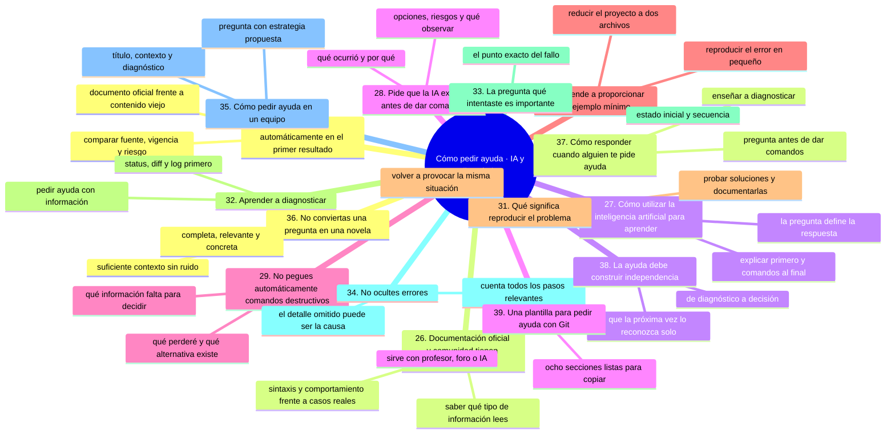
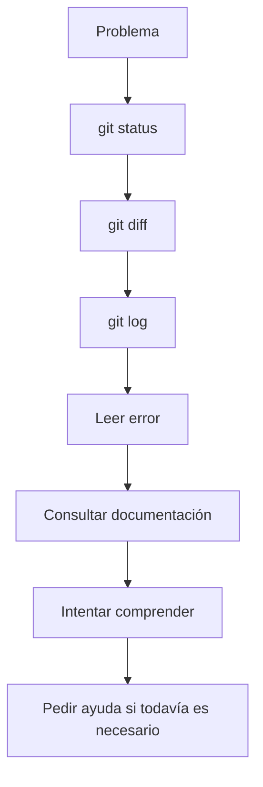
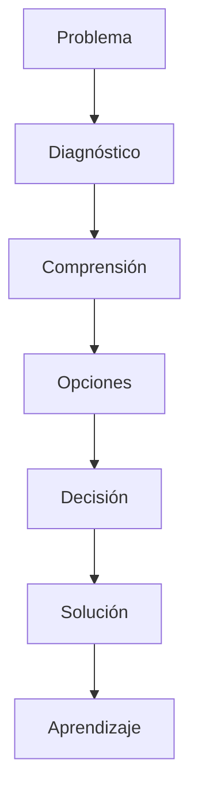

# Cómo pedir ayuda, parte 2: IA, diagnóstico y plantillas

En [`10-como-pedir-ayuda-formula-y-contexto.md`](10-como-pedir-ayuda-formula-y-contexto.md) construiste la fórmula de una buena pregunta y aprendiste qué información lleva. Aquí toca el resto: cómo usar la IA y Internet sin delegar tu criterio, cómo diagnosticar tú antes de preguntar, cómo responder cuando a ti te piden ayuda y con qué plantilla llegas a un foro o a un compañero.

La regla que atraviesa esta parte es que **la ayuda buena construye independencia, no dependencia**.

## Mapa conceptual de este capítulo



---

# 25. No confíes automáticamente en el primer resultado

Internet contiene:

* documentación oficial;
* respuestas correctas;
* respuestas antiguas;
* respuestas incompletas;
* respuestas específicas para una situación diferente;
* comandos peligrosos sin suficiente explicación;
* contenido generado automáticamente;
* tutoriales desactualizados.

Por eso debes comparar información.

Una buena estrategia es:

```text
Resultado encontrado
       ↓
¿Quién lo publicó?
       ↓
¿Es documentación oficial?
       ↓
¿La situación coincide con la mía?
       ↓
¿La información sigue siendo válida?
       ↓
¿Tiene riesgos?
       ↓
¿Comprendo el comando?
```

---

# 26. La documentación oficial y las experiencias de la comunidad cumplen funciones diferentes

La documentación oficial suele ser especialmente útil para:

* comportamiento de comandos;
* opciones;
* sintaxis;
* conceptos;
* configuración;
* características de una herramienta.

Las comunidades pueden ser útiles para:

* experiencias reales;
* casos poco habituales;
* soluciones prácticas;
* problemas específicos;
* diferentes enfoques.

No significa que una fuente comunitaria sea incorrecta.

Significa que debes entender **qué tipo de información estás leyendo**.

---

# 27. Cómo utilizar la inteligencia artificial para aprender

La inteligencia artificial puede ser un excelente tutor.

Pero la forma de preguntar determina mucho la calidad de la respuesta.

Una pregunta débil:

> “Arregla mi Git.”

Una pregunta mucho mejor:

> “Actúa como tutor de Git. Te voy a proporcionar el estado del repositorio y el mensaje de error. Primero explícame qué está ocurriendo. Después enumera las opciones de solución, indica los riesgos de cada una y solamente al final proporciona los comandos.”

Esto obliga a analizar antes de ejecutar.

---

# 28. Pide que la IA explique antes de dar comandos

Especialmente cuando estás aprendiendo.

Puedes utilizar esta estructura:

```text
Primero explica:
1. Qué ocurrió.
2. Por qué ocurrió.
3. Qué estado tiene actualmente Git.
4. Qué opciones existen.
5. Qué riesgos tiene cada opción.

Después proporciona:
6. Los comandos.
7. Qué debería observar después de cada comando.
```

Esto transforma a la IA de un generador de comandos en una herramienta de aprendizaje.

---

# 29. No pegues automáticamente comandos destructivos

Si una IA responde:

⚠️ **RIESGO:** `git reset --hard HEAD~1` elimina el último commit y borra del disco cualquier cambio sin confirmar. No lo pegues porque lo haya dicho una IA: pregunta primero qué perderías, si hay alternativa que conserve tus cambios y qué datos faltan para elegir.

```bash
git reset --hard HEAD~1
```

no significa que debas ejecutarlo.

Primero pregunta:

> ¿Qué perderé si ejecuto este comando?

Después:

> ¿Existe una alternativa que conserve mis cambios?

Y finalmente:

> ¿Qué información necesitas para determinar cuál opción es adecuada?

Este comportamiento es especialmente importante cuando trabajas con repositorios reales.

---

# 30. Aprende a proporcionar un ejemplo mínimo

Cuando el problema sea complejo, intenta reducirlo.

Supongamos que tienes un proyecto con:

```text
proyecto/
├── src/
├── tests/
├── docs/
├── config/
├── datos/
└── cientos de archivos
```

No necesitas enviar todo.

Puedes construir un caso pequeño que reproduzca el problema.

Por ejemplo:

```text
laboratorio/
├── archivo-a.txt
└── archivo-b.txt
```

Después:

```text
Cambio A
↓
Commit
↓
Cambio B
↓
Comando
↓
Error
```

Esto se conoce como reducir el problema a un ejemplo mínimo.

Es una habilidad muy valiosa.

---

# 31. ¿Qué significa “reproducir el problema”?

Reproducir significa poder volver a provocar la misma situación.

Por ejemplo:

```text
Paso 1 → crear archivo
Paso 2 → commit
Paso 3 → crear rama
Paso 4 → modificar archivo
Paso 5 → merge
Paso 6 → aparece conflicto
```

Si puedes repetir el problema, puedes estudiarlo.

Esto permite:

* experimentar;
* probar soluciones;
* comparar alternativas;
* documentar el comportamiento.

---

# 32. Aprender a diagnosticar

Pedir ayuda no debería ser siempre el primer paso.

Primero puedes realizar una pequeña investigación.

Por ejemplo:



Esto no significa que debas resolver todo solo.

Significa que debes aportar información útil cuando solicites ayuda.

---

# 33. La pregunta “¿qué intentaste?” es importante

Cuando alguien te ayuda, probablemente te preguntará:

> “¿Qué intentaste?”

No es una crítica.

Es una pregunta de diagnóstico.

La respuesta puede revelar:

* el estado inicial;
* la secuencia de comandos;
* el punto donde apareció el problema;
* las modificaciones que ya hiciste;
* posibles causas.

Por eso debes informar honestamente qué hiciste.

---

# 34. No ocultes errores

Un error frecuente al pedir ayuda es omitir algo porque pensamos:

> “Esto seguramente no importa.”

Por ejemplo:

> “Antes ejecuté `git reset --hard`, pero después hice algunas cosas.”

Ese detalle puede ser fundamental.

Cuando solicites ayuda:

**explica todos los pasos relevantes.**

---

# 35. Cómo pedir ayuda en un equipo

En un entorno profesional, una pregunta puede tener esta estructura:

```text
Título:
Push rechazado después de actualizar la rama remota

Contexto:
Estoy trabajando en feature/login.

Objetivo:
Enviar los cambios al remoto.

Situación:
La rama remota recibió un commit que no tengo localmente.

Comando:
git push origin feature/login

Resultado:
[error]

Diagnóstico realizado:
git status
git log --oneline --decorate --graph --all

Pregunta:
¿Cuál es la estrategia recomendada para integrar
el cambio remoto sin perder mi trabajo local?
```

Esta estructura facilita la colaboración.

---

# 36. No conviertas una pregunta en una novela

Pedir buena información no significa escribir páginas innecesarias.

Una buena pregunta debe ser:

* completa;
* relevante;
* concreta;
* ordenada.

Evita información que no afecta al problema.

La habilidad consiste en proporcionar **suficiente contexto, pero no ruido**.

---

# 37. Cómo responder cuando alguien te pide ayuda

Esta habilidad también debes aprenderla.

Si alguien pregunta:

> “¿Cómo arreglo este error?”

No respondas inmediatamente con un comando.

Primero puedes preguntar:

> “¿Qué quieres conseguir?”

Después:

> “¿Qué comando ejecutaste?”

Y:

> “¿Qué muestra `git status`?”

Esto permite diagnosticar.

La enseñanza técnica no consiste únicamente en proporcionar respuestas.

Consiste en ayudar a la otra persona a comprender el problema.

---

# 38. La ayuda debe construir independencia

Una buena explicación debería dejar a la persona con más capacidad que antes.

No solamente:

```text
Problema
↓
Comando mágico
↓
Problema solucionado
```

Sino:



El objetivo final es que la próxima vez la persona pueda reconocer el problema por sí misma.

---

# 39. Una plantilla para pedir ayuda con Git

Puedes utilizar esta plantilla:

````text
## Contexto

Estoy trabajando en:
[repositorio/proyecto]

Sistema operativo:
[Windows/macOS/Linux]

Herramienta:
[Git Bash/GitHub Desktop/terminal/otra]

Rama actual:
[nombre de rama]

## Objetivo

Quiero:
[describir objetivo]

## Qué hice

1. [comando]
2. [comando]
3. [comando]

## Qué esperaba

[resultado esperado]

## Qué ocurrió

[resultado real]

## Mensaje de error

```text
[pegar mensaje]
```

## Estado actual

```text
[pegar git status]
```

## Información adicional

[otros datos relevantes]

## Pregunta

¿Qué ocurrió, por qué ocurrió y cuáles son las formas
seguras de resolverlo?

````

Esta plantilla puede utilizarse con:

- un profesor;
- un compañero;
- una comunidad;
- un foro;
- documentación;
- una IA.

---

### Ejercicio de transferencia

Elige un problema real, redúcelo a un ejemplo mínimo en tu laboratorio y reproducélolo tantas veces como haga falta hasta poder provocarlo a voluntad. Antes de preguntar a nadie, diagnostícalo tú con `git status`, `git diff` y `git log`. Termina rellenando la plantilla de la sección 39 con ese caso. Entregable: `PLANTILLA-AYUDA.md` completada y el comando mínimo que reproduce el problema.

Sigue con [`12-como-pedir-ayuda-conceptos-y-ejercicios.md`](12-como-pedir-ayuda-conceptos-y-ejercicios.md): conceptos clave y ejercicios para cerrar la sección.

## Autopreguntas de cierre

Sin mirar el material, responde mentalmente y luego compruébalo con este capítulo:

1. ¿Qué comprobaciones haces antes de fiarte de un resultado encontrado en Internet?
2. ¿Por qué la IA debe explicar antes de darte comandos?
3. ¿Qué preguntas le haces cuando te propone un comando destructivo?
4. ¿Qué significa reducir un problema a un ejemplo mínimo y por qué conviene?
5. ¿Qué diferencia hay entre ayudar a resolver y ayudar a comprender?
6. ¿Por qué ocultar el paso que te avergüenza suele romper el diagnóstico?
7. ¿Qué rasgos tiene una buena pregunta en un equipo y cuándo se convierte en ruido?
