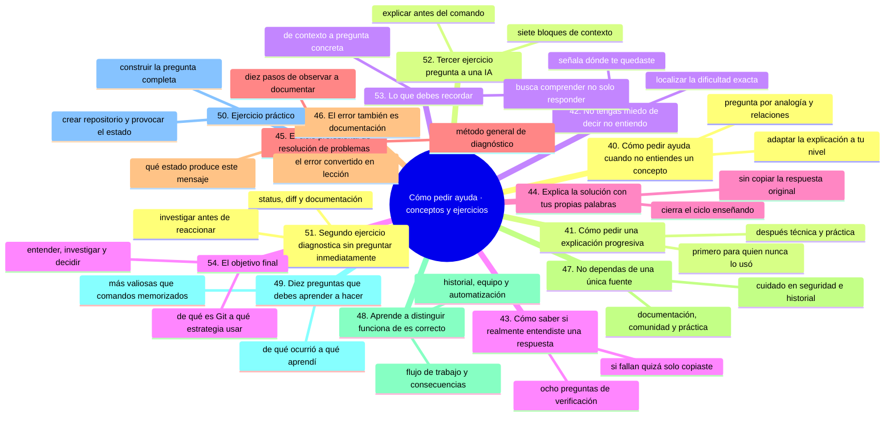
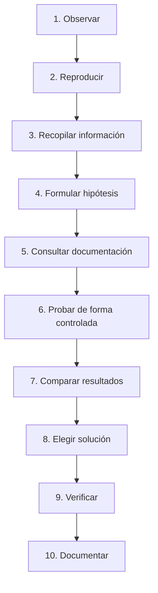
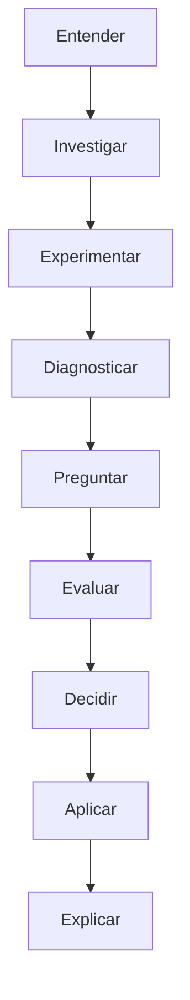

# Cómo pedir ayuda, parte 3: conceptos, ciclos y ejercicios

En [`10-como-pedir-ayuda-formula-y-contexto.md`](10-como-pedir-ayuda-formula-y-contexto.md) viste la fórmula de la buena pregunta y en [`11-como-pedir-ayuda-ia-y-diagnostico.md`](11-como-pedir-ayuda-ia-y-diagnostico.md) cómo usar la IA y diagnosticar por ti mismo. Esta última parte cierra la sección con lo que transforma la respuesta en conocimiento: pedir explicaciones progresivas, verificar que de verdad entendiste, distinguir «funciona» de «es correcto» y practicar los tres ejercicios finales.

Si solo te llevas una idea, que sea la de la sección 53: **no busques únicamente una respuesta, busca comprender el problema**.

## Mapa conceptual de este capítulo



---

# 40. Cómo pedir ayuda cuando no entiendes un concepto

No todos los problemas son errores.

A veces simplemente no entiendes un concepto.

Por ejemplo:

> “No entiendo qué significa `HEAD`.”

Una buena pregunta podría ser:

> “Entiendo que Git utiliza `HEAD`, pero no comprendo qué representa exactamente. ¿Puedes explicarlo primero con una analogía sencilla y después mostrar cómo se relaciona con una rama y un commit?”

Eso permite adaptar la explicación a tu nivel.

---

# 41. Cómo pedir una explicación progresiva

Si un concepto es difícil, puedes pedir:

```text
Explícalo primero para una persona que nunca
ha utilizado Git.

Después explícalo técnicamente.

Finalmente muestra cómo se utiliza en un proyecto real.
````

Esta estrategia es especialmente útil para conceptos como:

* `HEAD`;
* staging area;
* rebase;
* cherry-pick;
* reflog;
* hooks;
* ramas remotas;
* CI/CD;
* GitHub Actions;
* DevOps.

---

# 42. No tengas miedo de decir “no entiendo”

Una frase muy útil es:

> “No entiendo este paso.”

Después especifica:

> “Entiendo hasta aquí, pero no comprendo qué ocurre después de `git add`.”

Esto permite localizar exactamente dónde está la dificultad.

Aprender no consiste en fingir que entiendes.

Consiste en identificar qué parte todavía no comprendes.

---

# 43. Cómo saber si realmente entendiste una respuesta

Después de recibir una explicación, intenta responder:

1. ¿Qué ocurrió?
2. ¿Por qué ocurrió?
3. ¿Qué estado tenía Git?
4. ¿Qué comando solucionó el problema?
5. ¿Por qué ese comando?
6. ¿Qué alternativas existían?
7. ¿Qué riesgos tenía cada alternativa?
8. ¿Qué aprendí para la próxima vez?

Si no puedes responderlas, quizá solamente copiaste una solución.

---

# 44. Explica la solución con tus propias palabras

Una técnica excelente consiste en cerrar el ciclo enseñando.

Por ejemplo:

> “El `push` fue rechazado porque el remoto tenía commits que mi rama local no tenía. Primero debo integrar esos cambios de acuerdo con la estrategia del proyecto y después volver a enviar mi rama.”

Si puedes explicarlo sin copiar la respuesta original, probablemente has aprendido algo.

---

# 45. El ciclo profesional de resolución de problemas

A medida que avances, utiliza este ciclo:



Este método no pertenece exclusivamente a Git.

Es una forma general de resolver problemas técnicos.

---

# 46. El error también es documentación

Un mensaje de error puede enseñarte cómo funciona una herramienta.

Por ejemplo:

```text
error: Your local changes would be overwritten...
```

no es simplemente una barrera.

También te está diciendo que Git detecta cambios locales que podrían ser sobrescritos.

Puedes preguntarte:

> ¿Qué estado debe existir para que Git produzca este mensaje?

Esa pregunta convierte un error en una lección.

---

# 47. No dependas de una única fuente

Cuando una respuesta sea importante, compara fuentes.

Por ejemplo:

```text
Documentación oficial
        +
Documentación del proyecto
        +
Experiencia de comunidad
        +
Experimentación controlada
        +
Análisis propio
```

Esto es especialmente importante en temas como:

* seguridad;
* reescritura de historial;
* autenticación;
* tokens;
* CI/CD;
* permisos;
* despliegues;
* automatización.

---

# 48. Aprende a distinguir “funciona” de “es correcto”

Un comando puede solucionar un problema inmediato y aun así no ser apropiado para el flujo de trabajo.

Por ejemplo:

> “Este comando hizo que funcionara.”

No necesariamente significa:

> “Esta era la estrategia correcta.”

En un proyecto profesional debes considerar:

* historial;
* colaboración;
* seguridad;
* automatización;
* trazabilidad;
* políticas del equipo;
* impacto sobre otras personas.

Por eso una buena pregunta es:

> **“¿Funciona?”**

pero una pregunta todavía mejor es:

> **“¿Por qué funciona y cuáles son sus consecuencias?”**

---

# 49. Diez preguntas que debes aprender a hacer

Cuando tengas un problema técnico, intenta formular algunas de estas preguntas:

1. **¿Qué ocurrió exactamente?**
2. **¿Por qué ocurrió?**
3. **¿Qué estado tiene actualmente el sistema?**
4. **¿Qué esperaba que ocurriera?**
5. **¿Qué información falta para diagnosticarlo?**
6. **¿Qué alternativas existen?**
7. **¿Qué riesgos tiene cada alternativa?**
8. **¿Puedo reproducir el problema?**
9. **¿Cómo verifico que la solución funcionó?**
10. **¿Qué aprendí para evitar el problema en el futuro?**

Estas preguntas son mucho más valiosas que memorizar una lista interminable de comandos.

---

# 50. Ejercicio práctico

Vamos a construir una situación deliberadamente.

## Paso 1

Crea un repositorio de práctica.

```text
laboratorio-preguntas
```

## Paso 2

Crea:

```text
archivo.txt
```

con:

```text
Versión 1
```

## Paso 3

Haz un commit.

```bash
git add archivo.txt
git commit -m "Agregar archivo de prueba"
```

## Paso 4

Modifica el archivo.

```text
Versión 2
```

## Paso 5

Ejecuta:

```bash
git status
```

y:

```bash
git diff
```

## Paso 6

Ahora imagina que no sabes qué hacer.

En lugar de preguntar:

> “¿Cómo deshago esto?”

construye una pregunta completa utilizando la plantilla de este capítulo.

---

# 51. Segundo ejercicio: diagnostica sin preguntar inmediatamente

Provoca un problema sencillo en tu laboratorio.

Después:

1. Ejecuta `git status`.
2. Observa el resultado.
3. Ejecuta `git diff`.
4. Lee cualquier mensaje de Git.
5. Describe el problema por escrito.
6. Formula una hipótesis.
7. Consulta la documentación.
8. Solo después pide ayuda si todavía la necesitas.

Esto entrena una habilidad fundamental:

> **Investigar antes de reaccionar.**

---

# 52. Tercer ejercicio: pregunta a una IA

Proporciona a una IA:

```text
1. Contexto
2. Objetivo
3. Comandos ejecutados
4. Resultado esperado
5. Resultado real
6. Mensaje de error
7. git status
```

Después solicita:

```text
No me des inmediatamente el comando.

Primero explica:

1. Qué ocurrió.
2. Por qué ocurrió.
3. Qué estado tiene Git.
4. Qué alternativas existen.
5. Qué riesgos tiene cada alternativa.

Después proporciona una solución paso a paso.
```

Finalmente, intenta explicar tú mismo la solución.

---

# 53. Lo que debes recordar

Pedir ayuda no es simplemente decir:

> “Tengo un problema.”

Pedir ayuda técnicamente significa proporcionar suficiente información para que otra persona pueda comprender la situación.

Recuerda:

```text
Contexto
   ↓
Objetivo
   ↓
Acciones realizadas
   ↓
Resultado esperado
   ↓
Resultado real
   ↓
Mensaje de error
   ↓
Estado actual
   ↓
Pregunta concreta
```

Y recuerda otra idea fundamental:

> **No busques únicamente una respuesta. Busca comprender el problema.**

---

# 54. El objetivo final

Al principio quizá necesites ayuda para:

```text
¿Qué es Git?
```

Después:

```text
¿Por qué aparece este error?
```

Más adelante:

```text
¿Qué estrategia debería utilizar?
```

Y finalmente podrás llegar a preguntas como:

```text
¿Qué estrategia de ramas,
integración y automatización
es adecuada para este proyecto?
```

Ese cambio representa crecimiento técnico.

El objetivo de este repositorio no es convertirte en una persona que memoriza comandos.

Es ayudarte a desarrollar la capacidad de:



Una persona profesional no es aquella que nunca necesita ayuda.

Es aquella que sabe **cuándo pedirla, cómo buscarla, cómo proporcionar información útil y cómo transformar la respuesta en conocimiento propio**.

---

### Ejercicio de transferencia

Realiza los tres ejercicios de este capítulo en tu laboratorio, en orden y sin saltarte ninguno: construye la pregunta completa (sección 50), diagnostica sin preguntar a nadie (sección 51) y somete el caso a una IA exigiendo explicación antes del comando (sección 52). Entregable: una entrada del cuaderno con la pregunta que redactaste, tu diagnóstico previo y la explicación final en tus propias palabras, aplicando las diez preguntas de la sección 49 a tu caso.

Sigue con [`13-como-leer-los-ejemplos.md`](13-como-leer-los-ejemplos.md): cómo leer los ejemplos de este repositorio para que no se te queden solo en la pantalla.

## Autopreguntas de cierre

Sin mirar el material, responde mentalmente y luego compruébalo con este capítulo:

1. ¿Cómo pides la explicación de un concepto sin quedarte con la definición?
2. ¿Qué dices cuando no entiendes un paso concreto de un comando?
3. ¿Con qué ocho preguntas compruebas que entendiste una respuesta?
4. ¿Qué diferencia hay entre que un comando funcione y que sea la estrategia correcta?
5. ¿Por qué un mensaje de error también es documentación de la herramienta?
6. ¿En cuál de las cuatro preguntas del objetivo final te encuentras hoy y cuál quieres alcanzar?

---

## Próximo paso

Ya conocemos tres habilidades fundamentales para comenzar este recorrido:

```text
No tener miedo de experimentar
            ↓
Saber estudiar y practicar
            ↓
Saber pedir ayuda
```

Ahora podemos comenzar a construir las bases técnicas necesarias para utilizar Git y GitHub con seguridad y comprensión.
