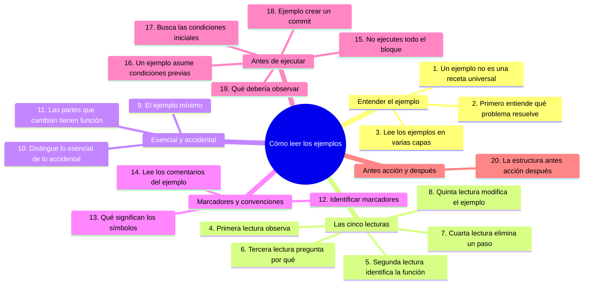
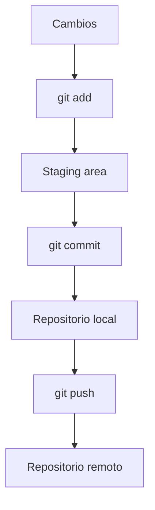
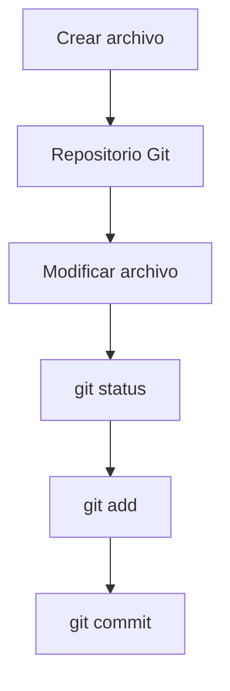

# Cómo leer los ejemplos

## Introducción

En este repositorio encontrarás muchos ejemplos.

Habrá:

* comandos de Git;
* capturas de pantalla;
* estructuras de carpetas;
* diagramas;
* fragmentos de código;
* ejemplos de commits;
* ramas;
* mensajes de error;
* flujos de trabajo;
* configuraciones;
* ejemplos profesionales.

Pero existe una diferencia importante entre **ver un ejemplo** y **comprender un ejemplo**.

Puedes copiar:

```bash
git add .
git commit -m "Cambios"
git push
```

y conseguir que funcione.

Sin embargo, eso no significa necesariamente que hayas aprendido qué está ocurriendo.

El objetivo de este capítulo es enseñarte a leer los ejemplos de manera activa.

La idea fundamental es:

> **No copies un ejemplo para terminarlo. Estúdialo para entender por qué funciona.**

---

## Mapa conceptual de este capítulo



---

# 1. Un ejemplo no es una receta universal

Uno de los errores más comunes al aprender tecnología es pensar:

> “Si aparece este comando en el ejemplo, debo utilizarlo exactamente igual.”

No necesariamente.

Un ejemplo muestra una situación concreta.

Por ejemplo:

```bash
git add README.md
```

significa que se está preparando específicamente `README.md`.

Pero eso no significa que siempre debas ejecutar:

```bash
git add README.md
```

Quizá en otra situación quieras preparar:

```bash
git add archivo.txt
```

o varios archivos:

```bash
git add archivo1.txt archivo2.txt
```

o, dependiendo de tu objetivo:

```bash
git add .
```

El ejemplo enseña un concepto.

Tú debes aprender a reconocer **cuándo ese concepto se aplica a tu situación**.

---

# 2. Primero entiende qué problema resuelve

Antes de estudiar un comando, pregunta:

> **¿Qué problema intenta resolver este ejemplo?**

Por ejemplo:

```bash
git status
```

No lo estudies solamente como:

> “Este es un comando que tengo que memorizar.”

Piensa:

> “Necesito saber cuál es el estado actual de mi repositorio.”

Entonces:

```text
Problema
   ↓
Necesito conocer el estado
   ↓
git status
   ↓
Información del repositorio
```

Esto permite recordar el comando por su propósito.

---

# 3. Lee los ejemplos en varias capas

Un ejemplo técnico puede analizarse en diferentes niveles.

Una buena estrategia es leerlo así:

```text
Nivel 1 → ¿Qué veo?
Nivel 2 → ¿Qué significa?
Nivel 3 → ¿Por qué se hace?
Nivel 4 → ¿Qué ocurre internamente?
Nivel 5 → ¿Cuándo se utiliza?
Nivel 6 → ¿Cuándo NO debería utilizarse?
Nivel 7 → ¿Qué alternativas existen?
Nivel 8 → ¿Qué riesgos tiene?
```

No necesitas estudiar todos los niveles desde el primer día.

La profundidad aumenta conforme avanzas.

---

# 4. Primera lectura: observa

Supongamos que encuentras:

```bash
git add archivo.txt
git commit -m "Agregar archivo"
git push origin main
```

En la primera lectura simplemente identifica:

* hay tres comandos;
* primero aparece `git add`;
* después `git commit`;
* finalmente `git push`.

No intentes memorizar todavía.

Solo observa.

---

# 5. Segunda lectura: identifica la función

Ahora pregunta:

### ¿Qué hace `git add`?

Prepara cambios para el siguiente commit.

### ¿Qué hace `git commit`?

Crea un commit con los cambios preparados.

### ¿Qué hace `git push`?

Envía commits locales hacia un repositorio remoto.

Ahora el ejemplo empieza a tener sentido:



Ya no estás memorizando tres comandos aislados.

Estás observando un flujo.

---

# 6. Tercera lectura: pregunta por qué

Ahora pregunta:

> ¿Por qué `git add` aparece antes de `git commit`?

Porque Git utiliza un área de preparación, conocida como **staging area** o **index**.

Entonces:

```text
Working directory
       ↓
    git add
       ↓
Staging area
       ↓
   git commit
       ↓
Local repository
```

Este análisis es mucho más importante que memorizar la secuencia.

---

# 7. Cuarta lectura: piensa qué ocurriría si eliminas un paso

Supongamos que tienes:

```bash
git add archivo.txt
git commit -m "Agregar archivo"
```

Pregunta:

> ¿Qué ocurriría si no hago `git add`?

La respuesta depende del estado de los archivos y de qué quieras incluir en el commit.

La pregunta importante es:

> **¿Qué información necesita `git commit` para crear el commit?**

Esta forma de estudiar obliga a comprender el funcionamiento de Git.

---

# 8. Quinta lectura: modifica el ejemplo

Una de las mejores maneras de aprender un ejemplo es cambiarlo.

Si encuentras:

```bash
git add README.md
```

prueba mentalmente:

```bash
git add notas.md
```

Después:

```bash
git add README.md notas.md
```

Pregúntate:

> ¿Qué diferencia existe?

Después experimenta en un repositorio de práctica.

La modificación deliberada transforma un ejemplo estático en un ejercicio.

---

# 9. El ejemplo mínimo

Los ejemplos de este repositorio intentarán ser pequeños cuando el objetivo sea explicar un concepto.

Por ejemplo:

```text
proyecto/
└── archivo.txt
```

es más fácil de estudiar que:

```text
empresa/
├── backend/
├── frontend/
├── infraestructura/
├── documentación/
├── tests/
├── scripts/
├── configuración/
├── servicios/
└── ...
```

Cuando estás aprendiendo un concepto, elimina todo lo que no sea necesario.

Después podrás estudiar situaciones más complejas.

---

# 10. Aprende a distinguir lo esencial de lo accidental

Supongamos que un ejemplo muestra:

```bash
git commit -m "Agregar README"
```

Lo esencial es:

```text
git commit
```

y que `-m` permite proporcionar el mensaje del commit.

El texto:

```text
"Agregar README"
```

es específico del ejemplo.

Podrías utilizar:

```bash
git commit -m "Crear documentación inicial"
```

Por eso debes distinguir:

```text
Concepto
   ↓
git commit -m
```

de:

```text
Dato específico del ejemplo
   ↓
"Agregar README"
```

---

# 11. Las partes que cambian suelen tener una función

Observa:

```bash
git clone https://github.com/usuario/proyecto.git
```

No memorices esa dirección como si fuera universal.

Identifica las partes:

```text
git clone
    ↓
comando

https://github.com/usuario/proyecto.git
    ↓
ubicación del repositorio
```

Otro ejemplo:

```bash
git clone https://github.com/otra-persona/otro-proyecto.git
```

El comando es el mismo.

Lo que cambia es el repositorio.

---

# 12. Aprende a identificar marcadores

En documentación técnica puedes encontrar ejemplos como:

```bash
git clone <URL-DEL-REPOSITORIO>
```

Los símbolos:

```text
<URL-DEL-REPOSITORIO>
```

indican que debes sustituir ese valor.

Por ejemplo:

```bash
git clone https://github.com/usuario/proyecto.git
```

Esto es muy diferente de copiar literalmente:

```bash
git clone <URL-DEL-REPOSITORIO>
```

Debes aprender a reconocer los valores que son marcadores.

---

# 13. No todos los textos entre corchetes significan lo mismo

En documentación puedes encontrar:

```text
[opcional]
```

```text
<valor>
```

```text
{nombre}
```

```text
NOMBRE_DE_USUARIO
```

Su significado depende del contexto y de la documentación.

Por eso no debes asumir automáticamente que puedes copiar esos símbolos.

Primero identifica qué representa cada elemento.

---

# 14. Lee los comentarios de los ejemplos

Los comentarios suelen explicar partes importantes.

Por ejemplo:

```bash
# Mostrar el estado del repositorio
git status

# Ver los cambios
git diff
```

Los comentarios no son comandos.

El primer texto:

```text
# Mostrar el estado del repositorio
```

explica el propósito.

El segundo:

```text
git status
```

es la instrucción que debes ejecutar.

Aprender a distinguir explicación y comando evita errores.

---

# 15. No ejecutes todo el bloque automáticamente

Supongamos que encuentras:

```bash
git status
git add .
git commit -m "Cambios"
git push
```

No significa necesariamente:

> “Copia todo y ejecútalo.”

Primero pregunta:

1. ¿En qué directorio estoy?
2. ¿Es realmente un repositorio Git?
3. ¿Qué cambios tengo?
4. ¿Quiero incluir todos los archivos?
5. ¿El commit está correctamente definido?
6. ¿Existe un remoto configurado?
7. ¿Tengo autorización para hacer `push`?
8. ¿Estoy en la rama correcta?

Leer antes de ejecutar es una habilidad fundamental.

---

# 16. Un ejemplo puede asumir condiciones previas

Muchos ejemplos funcionan porque existe una situación previa.

Por ejemplo:

```bash
git push
```

puede asumir que:

* estás dentro de un repositorio;
* tienes una rama;
* existe un remoto;
* existe una relación de seguimiento adecuada;
* tienes autenticación;
* existen commits para enviar.

Si copias solamente el último comando, quizá no funcione.

Por eso pregunta:

> **¿Qué tuvo que ocurrir antes para que este ejemplo funcionara?**

---

# 17. Busca las condiciones iniciales

Antes de ejecutar un ejemplo, identifica:

```text
¿Existe el repositorio?
¿Estoy en el directorio correcto?
¿Git está instalado?
¿Estoy en la rama correcta?
¿Hay cambios?
¿Hay commits?
¿Existe un remoto?
¿Tengo permisos?
```

Esto se puede representar así:

```text
Condiciones iniciales
        ↓
Comando
        ↓
Resultado esperado
```

Si las condiciones iniciales no coinciden, el resultado puede ser diferente.

---

# 18. Ejemplo: crear un commit

Supongamos:

```bash
git add archivo.txt
git commit -m "Agregar archivo"
```

Antes del ejemplo probablemente debe existir:

```text
archivo.txt
```

y debe haber un repositorio Git.

El flujo completo sería:



El ejemplo pequeño representa solamente una parte del proceso.

---

# 19. Pregunta siempre “¿qué debería observar?”

Un buen ejemplo debería permitirte comprobar si funcionó.

Por ejemplo:

```bash
git commit -m "Agregar archivo"
```

Después puedes observar:

```bash
git status
```

o:

```bash
git log --oneline
```

El aprendizaje mejora cuando puedes comparar:

```text
Antes
  ↓
Acción
  ↓
Después
```

---

# 20. La estructura antes → acción → después

Esta es una de las formas más importantes de leer ejemplos.

Por ejemplo:

```text
ANTES

archivo.txt modificado
        ↓
      git add
        ↓
DESPUÉS

archivo.txt preparado
```

Después:

```text
ANTES

cambio en staging
        ↓
      git commit
        ↓
DESPUÉS

nuevo commit
```

Después:

```text
ANTES

commit local
        ↓
      git push
        ↓
DESPUÉS

commit enviado al remoto
```

Esta forma de pensar permite comprender el flujo.

### Ejercicio de transferencia

Elige un ejemplo de un programa que uses a diario —por ejemplo, guardar un documento en Word o subir una foto desde el móvil— y aplícale la estructura antes → acción → después:

1. Describe el **antes** con una frase observable: qué verías en pantalla antes de actuar.
2. Escribe la **acción** exacta que lo cambia: el botón o la combinación de teclas.
3. Escribe cómo comprobarás el **después** sin depender de la memoria.

Entregable: tres líneas en tus notas donde cualquier persona pueda verificar el «después» mirando la pantalla, sin tener que preguntarte qué hiciste.

---

## Autopreguntas de cierre

Sin mirar el material, responde mentalmente y luego compruébalo con este capítulo:

1. ¿Por qué sirve más preguntar «¿qué problema resuelve este ejemplo?» que memorizar la línea de comandos?
2. Si copias un bloque y te funciona pero no puedes explicarlo, ¿qué te falta y cómo lo comprobarías?
3. ¿Por qué puede fallar `git push` aunque hayas copiado exactamente el bloque del capítulo?
4. ¿Qué parte de `git commit -m "Agregar README"` debes aprender y cuál es solo un dato propio del ejemplo?
5. ¿Por qué es mejor leer un ejemplo en varias capas que intentar comprenderlo entero a la primera?
6. ¿Qué descubres al eliminar mentalmente un paso de un flujo y predecir qué falla antes de ejecutar?
7. ¿Por qué te sirve la estructura antes → acción → después también para comprobar que entendiste?

---

## Próximo paso

Ya sabes leer un ejemplo de principio a fin. Sigue con [`14-leer-diagramas-terminales-y-capturas.md`](14-leer-diagramas-terminales-y-capturas.md): la parte visual del material — diagramas, árboles de archivos, comandos y capturas de pantalla.

