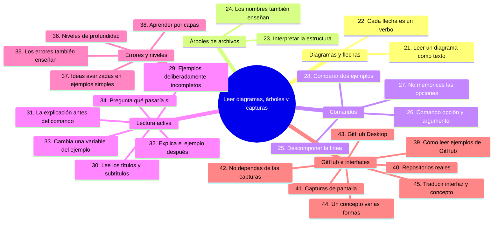
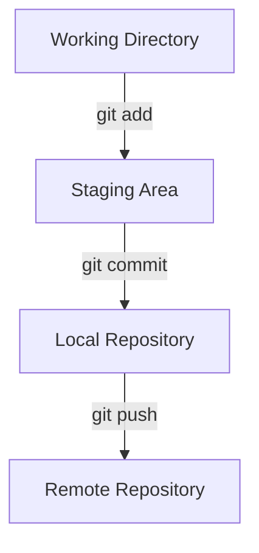
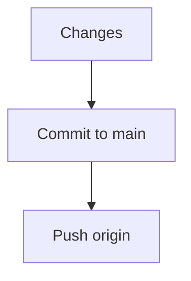

# Cómo leer diagramas, árboles, comandos y capturas

## Introducción

Ya sabes leer un ejemplo paso a paso: distinguir lo esencial de lo accidental, preguntar qué problema resuelve y qué condiciones necesita antes de ejecutarlo. Ahora viene la parte visual: diagramas, árboles de archivos, comandos y capturas de pantalla.

Aquí aprenderás a interpretar cada tipo de material del curso sin depender de su forma: qué significa cada flecha, cómo leer un árbol de carpetas, cómo descomponer una línea de comandos y qué preguntarte frente a una captura de pantalla o una interfaz gráfica.

---

## Mapa conceptual de este capítulo



---

# 21. Aprende a leer diagramas

Los diagramas también son ejemplos.

Por ejemplo:



No debes leerlo solamente como una imagen.

Interpétalo:

> “Un cambio comienza en mi directorio de trabajo, pasa al área de preparación, después se registra en un commit local y finalmente puede enviarse al repositorio remoto.”

Eso es comprensión.

---

# 22. Las flechas tienen significado

Cuando veas:

```text
A → B
```

pregunta:

> ¿Qué representa esta transición?

Puede representar:

* un comando;
* transferencia de datos;
* cambio de estado;
* dependencia;
* flujo de trabajo;
* relación conceptual.

Por ejemplo:

```text
git add
```

puede representar:

```text
Working Directory
       ↓
Staging Area
```

Mientras:

```text
git commit
```

representa:

```text
Staging Area
        ↓
Local Repository
```

### Diagramas y accesibilidad

Todos los diagramas de este repositorio son **texto plano** (bloques con `│`, `├──` y flechas `→`/`↓`) dentro de bloques de código. No son imágenes: por eso se leen en cualquier visor, se copian, se editan y — si usas un lector de pantalla — se leen línea a línea.

Para leer un diagrama sin apoyarte en la forma, sigue este orden:

1. **Lee la línea de título o la oración que lo introduce:** dice qué se está mostrando (el capítulo, además, lo acompaña casi siempre con un «mapa conceptual de este capítulo» que es el índice del diagrama).
2. **Enumera los bloques:** los nombres que aparecen en los recuadros o al inicio de cada rama son los conceptos; el orden vertical u horizontal es el orden de lectura.
3. **Lee las flechas de izquierda a derecha y de arriba a abajo:** cada flecha es una transición (un comando, un paso, una consecuencia). Pregunta siempre «¿qué orden o qué estado produce esta flecha?» — la flecha es el verbo del diagrama.
4. **Busca los marcadores:** `(1)`, `(2)` y los `───` suelen indicar etapas; léelos como una lista ordenada.

Y una regla si vas a contribuir: **todo diagrama nuevo debe llevar una línea de texto antes que lo resuma** («este diagrama muestra X: bloques A y B unidos por el comando C»). Así el diagrama sigue siendo legible aunque su forma no se vea.

---

# 23. Aprende a leer árboles de archivos

Puedes encontrar:

```text
mi-proyecto/
├── README.md
├── .gitignore
├── src/
│   └── main.py
└── tests/
    └── test_main.py
```

No necesitas memorizar la estructura.

Debes aprender a interpretarla.

La primera línea:

```text
mi-proyecto/
```

representa la carpeta principal.

Después:

```text
README.md
.gitignore
```

son archivos.

Y:

```text
src/
tests/
```

son carpetas.

Dentro de `src` existe:

```text
main.py
```

y dentro de `tests`:

```text
test_main.py
```

---

# 24. Los nombres de archivos también enseñan conceptos

Por ejemplo:

```text
README.md
```

te indica que existe documentación en Markdown.

```text
.gitignore
```

es un archivo de configuración de Git.

```text
.github/
```

es un directorio utilizado por GitHub para diferentes configuraciones y automatizaciones.

La estructura de un proyecto puede transmitir información incluso antes de leer el contenido.

---

# 25. Cómo leer ejemplos de comandos

Cuando veas:

```bash
git branch -d nueva-rama
```

separa las partes:

```text
git
 ↓
programa

branch
 ↓
subcomando

-d
 ↓
opción

nueva-rama
 ↓
argumento
```

Esto es mucho mejor que memorizar toda la línea como una sola unidad.

---

# 26. Comando, opción y argumento

Muchos comandos siguen una estructura aproximada:

```text
programa
   ↓
subcomando
   ↓
opciones
   ↓
argumentos
```

Por ejemplo:

```bash
git log --oneline --graph --all
```

Podemos identificar:

```text
git
 └── log
      ├── --oneline
      ├── --graph
      └── --all
```

Las opciones modifican cómo funciona la operación o cómo se muestra el resultado.

Los detalles exactos dependen del comando.

---

# 27. No memorices las opciones inmediatamente

No necesitas recordar:

```bash
git log --oneline --decorate --graph --all
```

desde el primer día.

Puedes consultarlo cuando sea necesario.

Lo importante inicialmente es saber:

> “Existe una forma de visualizar el historial de manera gráfica y resumida.”

Después podrás aprender las opciones.

---

# 28. Aprende a comparar dos ejemplos

Supongamos:

```bash
git pull
```

y:

```bash
git fetch
```

No estudies ambos como dos comandos aislados.

Pregunta:

> ¿Qué problema resuelve cada uno?

Después:

> ¿Qué cambia en mi repositorio?

Y:

> ¿Qué ocurre con mi rama actual?

Comparar ejemplos es una excelente forma de aprender diferencias conceptuales.

---

# 29. Los ejemplos pueden ser deliberadamente incompletos

A veces un ejemplo no muestra todo el proceso.

Esto no necesariamente es un error.

Puede ser que el objetivo sea explicar una operación específica.

Por ejemplo:

```bash
git merge feature-login
```

puede aparecer sin mostrar:

```bash
git switch main
```

porque el capítulo podría estar explicando exclusivamente qué hace `merge`.

Sin embargo, antes de ejecutarlo debes preguntarte:

> ¿En qué rama debo estar para que esta operación tenga sentido?

---

# 30. Lee los títulos y subtítulos

Los títulos proporcionan contexto.

Por ejemplo:

```text
## Crear una rama

git switch -c nueva-funcionalidad
```

El título indica el objetivo.

Después puedes interpretar el comando.

No leas únicamente el bloque de código.

Lee:

```text
Título
   ↓
Explicación
   ↓
Ejemplo
   ↓
Resultado
```

---

# 31. Lee la explicación antes del comando

Cuando estudies este repositorio, evita saltar directamente a los bloques de código.

Primero lee:

1. qué es;
2. para qué sirve;
3. cuándo se utiliza;
4. después observa el ejemplo.

Esto evita convertir la documentación en una lista de comandos para copiar.

---

# 32. Después del ejemplo, intenta explicarlo

Una técnica sencilla:

Después de leer:

```bash
git switch -c nueva-rama
```

cierra temporalmente la documentación y responde:

> ¿Qué hizo este comando?

Si puedes responder:

> “Creó una nueva rama y cambió a ella”

has comprendido el objetivo básico.

Después puedes profundizar.

---

# 33. Cambia una variable del ejemplo

Si el ejemplo dice:

```bash
git switch -c nueva-rama
```

prueba mentalmente:

```bash
git switch -c feature-login
```

Después:

```bash
git switch -c feature-documentacion
```

La estructura permanece.

Lo que cambia es el nombre de la rama.

Esto ayuda a separar:

```text
estructura del comando
```

de:

```text
datos específicos del ejemplo
```

---

# 34. Pregunta “¿qué pasaría si...?”

Una de las mejores técnicas para aprender es modificar mentalmente las condiciones.

Por ejemplo:

> ¿Qué pasa si la rama ya existe?

> ¿Qué pasa si tengo cambios sin commit?

> ¿Qué pasa si estoy en otra rama?

> ¿Qué pasa si el remoto no existe?

> ¿Qué pasa si no tengo permisos?

Estas preguntas transforman una explicación pasiva en razonamiento.

---

# 35. Los ejemplos de errores son especialmente importantes

Si el repositorio muestra:

```text
error: Your local changes would be overwritten...
```

no lo leas como:

> “Esto es un mensaje que debo evitar.”

Pregunta:

> ¿Qué condición provoca este mensaje?

Después:

> ¿Por qué Git evita realizar la operación?

Finalmente:

> ¿Qué opciones existen para resolverlo?

Los errores permiten comprender las reglas internas de Git.

---

# 36. Lee los ejemplos de forma progresiva

No todos los ejemplos tienen el mismo nivel.

Podemos clasificarlos aproximadamente así:

### Nivel 1 — Visual

```text
archivo → carpeta → repositorio
```

### Nivel 2 — Operación básica

```bash
git status
```

### Nivel 3 — Flujo

```bash
git add
git commit
git push
```

### Nivel 4 — Conceptual

```text
Working Directory
→ Staging Area
→ Repository
```

### Nivel 5 — Diagnóstico

```bash
git status
git diff
git log
```

### Nivel 6 — Profesional

```text
Issue
→ Branch
→ Commit
→ Pull Request
→ Review
→ CI
→ Merge
→ Release
```

No necesitas comprender todos los niveles inmediatamente.

El repositorio está diseñado para que profundices progresivamente.

---

# 37. Un ejemplo sencillo puede contener una idea avanzada

Por ejemplo:

```bash
git commit
```

parece muy sencillo.

Pero detrás existe una arquitectura mucho más compleja:

```text
Working Tree
      ↓
Index
      ↓
Commit
      ↓
Tree
      ↓
Blobs
      ↓
Parent Commit
      ↓
Commit Graph
```

Al principio solo necesitas entender:

> “El commit registra una versión del proyecto.”

Más adelante aprenderás cómo Git representa internamente esa información.

Esto es aprendizaje progresivo.

---

# 38. No intentes comprender todo internamente desde el primer día

Es posible profundizar mucho en Git.

Puedes estudiar:

* objetos;
* blobs;
* trees;
* commits;
* referencias;
* HEAD;
* índices;
* reflogs;
* packfiles;
* almacenamiento interno.

Pero si todavía no sabes crear un commit, comenzar por los internals puede dificultar el aprendizaje.

La progresión correcta es:

```text
Uso
 ↓
Comprensión
 ↓
Modelo mental
 ↓
Internals
 ↓
Optimización
 ↓
Diseño profesional
```

---

# 39. Cómo leer ejemplos de GitHub

En GitHub puedes encontrar:

* README;
* código;
* workflows;
* issues;
* Pull Requests;
* releases;
* configuraciones;
* documentación.

No todo debe leerse de la misma manera.

Por ejemplo:

```text
README
↓
¿Qué hace el proyecto?

Código
↓
¿Cómo está implementado?

.github/workflows
↓
¿Qué automatización existe?

Issues
↓
¿Qué problemas o tareas se están gestionando?

Pull Requests
↓
¿Cómo se modificó el proyecto?

Releases
↓
¿Qué versiones se publicaron?
```

Aprender a navegar un repositorio es una habilidad importante.

---

# 40. Aprende leyendo repositorios reales

Después de dominar los ejemplos básicos, puedes abrir repositorios públicos y observar:

```text
README.md
.gitignore
LICENSE
src/
tests/
.github/
```

Pregúntate:

* ¿cómo está organizado?
* ¿qué archivos son importantes?
* ¿cómo documentan el proyecto?
* ¿cómo nombran las ramas?
* ¿cómo describen los commits?
* ¿utilizan Pull Requests?
* ¿tienen automatización?
* ¿existen pruebas?
* ¿cómo publican versiones?

Esto te acerca progresivamente al trabajo real.

---

# 41. Cómo leer una captura de pantalla

Una captura de pantalla también es un ejemplo.

No la mires únicamente para reproducir los clics.

Pregúntate:

1. ¿Qué aplicación aparece?
2. ¿En qué sección estoy?
3. ¿Qué elemento está seleccionado?
4. ¿Qué acción se realizó?
5. ¿Qué cambió después?
6. ¿Qué información muestra?
7. ¿Qué parte es importante para el concepto?

La captura debe ayudarte a construir un modelo mental.

---

# 42. No dependas para siempre de las capturas

Las capturas son útiles para principiantes.

Pero progresivamente debes aprender a reconocer los conceptos aunque la interfaz cambie.

GitHub puede modificar:

* nombres de botones;
* ubicación de opciones;
* diseño;
* menús;
* apariencia.

Por eso:

> **Aprende el concepto, no solamente dónde estaba un botón.**

---

# 43. Cómo leer ejemplos de GitHub Desktop

Supongamos que aparece:



No lo memorices como una secuencia de botones.

Relaciona la interfaz con Git:

```text
Cambios
    ↓
Commit
    ↓
Push
```

La interfaz gráfica está ejecutando operaciones que también puedes realizar mediante Git.

Esto será importante cuando posteriormente estudies:

```text
GitHub Web
GitHub Desktop
Git CLI
```

---

# 44. El mismo concepto puede aparecer de varias formas

Por ejemplo, crear un commit puede hacerse mediante:

### Git

```bash
git add archivo.txt
git commit -m "Agregar archivo"
```

### GitHub Desktop

Mediante la interfaz gráfica.

### GitHub Web

Editando un archivo y realizando un commit desde el sitio.

Las interfaces son diferentes.

El concepto fundamental sigue siendo:

```text
Registrar una nueva versión en el historial
```

Por eso debes aprender primero el concepto y después las herramientas.

---

# 45. Aprende a traducir entre interfaz y concepto

Puedes construir esta relación:

```text
GitHub Desktop
      ↓
Commit
      ↓
Git commit
```

o:

```text
GitHub Desktop
      ↓
Push origin
      ↓
git push
```

Esto te permitirá cambiar de herramienta sin sentir que estás empezando desde cero.

### Ejercicio de transferencia

Toma un diagrama de otra materia —por ejemplo, el ciclo del agua en una lámina escolar o el recorrido de un pedido en una tienda online— y léelo con el mismo procedimiento del capítulo:

1. Enumera los bloques o etapas en el orden en que se leen.
2. Escribe, para cada flecha, el verbo que representa: ¿es un paso, una transferencia o una consecuencia?
3. Señala qué línea resumirías en una frase para alguien que no pueda ver la figura.

Entregable: una lista de 4 a 6 flechas con su verbo y un resumen de una frase del diagrama entero.

---

## Autopreguntas de cierre

Sin mirar el material, responde mentalmente y luego compruébalo con este capítulo:

1. ¿Por qué una flecha en un diagrama es «el verbo» y no simplemente una línea decorativa?
2. ¿Qué información extraes de un árbol de carpetas antes de abrir un solo archivo?
3. ¿Por qué conviene separar `git`, `branch`, `-d` y `nueva-rama` en lugar de memorizar la línea completa?
4. Si la interfaz de GitHub cambia mañana los botones, ¿qué es lo que te protege de perderte?
5. ¿Qué diferencia hay entre leer un ejemplo incompleto y leer un ejemplo mal escrito?
6. ¿Por qué un mensaje de error merece las mismas preguntas que un ejemplo que funciona?
7. ¿Qué ganas al traducir «Commit to main» a la operación `git commit` que hay detrás?

---

## Próximo paso

Ya sabes interpretar la parte visual del material. Sigue con [`15-aplicar-y-practicar-lo-leido.md`](15-aplicar-y-practicar-lo-leido.md): ejercicios para desmontar ejemplos, predecir resultados y detectar errores de lectura.

