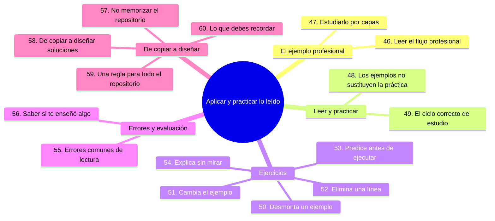
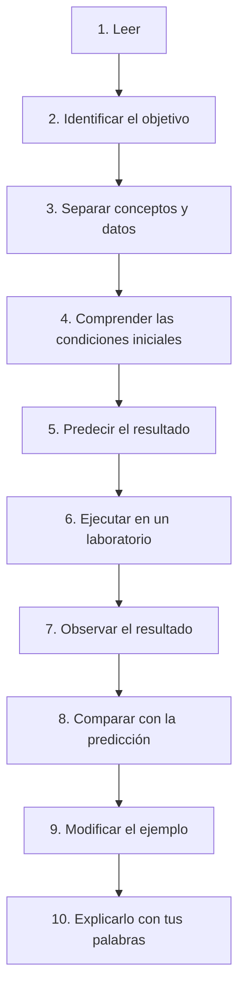
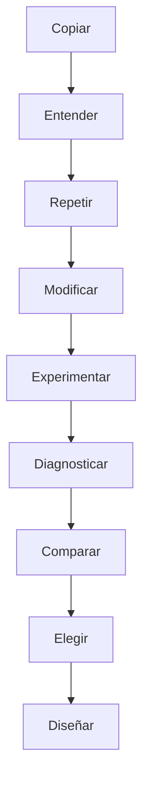

# Cómo aplicar y practicar lo leído

## Introducción

Ya sabes leer ejemplos, diagramas, árboles de archivos, comandos y capturas de pantalla; ahora viene la parte de aplicar lo leído: desmontar los ejemplos, modificarlos, predecir el resultado y detectar los errores de lectura más comunes.

En este capítulo practicarás con ejercicios concretos, estudiarás los errores típicos al leer ejemplos y terminarás con una regla única que podrás aplicar a todo el repositorio.

---

## Mapa conceptual de este capítulo



---

# 46. Cómo leer un ejemplo profesional

Más adelante encontrarás un flujo como:

```text
Issue #42
   ↓
feature/login
   ↓
Cambios
   ↓
Tests
   ↓
Commit
   ↓
Push
   ↓
Pull Request
   ↓
Code Review
   ↓
CI
   ↓
Merge
   ↓
Release
```

No intentes memorizarlo.

Pregúntate:

* ¿qué problema representa la Issue?
* ¿por qué se crea una rama?
* ¿qué función tiene el commit?
* ¿por qué se hace una Pull Request?
* ¿qué comprueba CI?
* ¿qué significa merge?
* ¿qué relación existe entre merge y release?

Esto convierte un diagrama en conocimiento.

---

# 47. Cómo estudiar un ejemplo profesional por capas

Puedes dividirlo:

### Capa 1

¿Qué está ocurriendo?

### Capa 2

¿Qué herramienta participa?

### Capa 3

¿Qué estado cambia?

### Capa 4

¿Por qué existe ese paso?

### Capa 5

¿Qué podría salir mal?

### Capa 6

¿Cómo se controla el riesgo?

### Capa 7

¿Cómo se automatiza?

Esta metodología será especialmente útil cuando llegues a:

* Pull Requests;
* GitHub Actions;
* CI/CD;
* DevOps;
* DevSecOps;
* arquitectura de repositorios.

---

# 48. Los ejemplos no sustituyen la práctica

Leer:

```bash
git branch nueva-rama
```

no equivale a crear una rama.

Leer:

```bash
git merge nueva-rama
```

no equivale a resolver un conflicto.

Leer:

```bash
git revert HEAD
```

no equivale a comprender cuándo utilizar `revert`.

La lectura prepara la práctica.

La práctica confirma la comprensión.

---

# 49. El ciclo correcto para estudiar un ejemplo

Utiliza este proceso:



Este es uno de los métodos más efectivos para convertir documentación en conocimiento.

---

# 50. Ejercicio: desmonta un ejemplo

Toma este ejemplo:

```bash
git switch -c feature-documentacion
git add README.md
git commit -m "Mejorar documentación"
git push -u origin feature-documentacion
```

Ahora responde:

### Pregunta 1

¿Qué hace la primera línea?

### Pregunta 2

¿Qué debe existir antes?

### Pregunta 3

¿Qué significa `feature-documentacion`?

### Pregunta 4

¿Qué archivo se prepara?

### Pregunta 5

¿Qué registra el commit?

### Pregunta 6

¿Qué significa `origin`?

### Pregunta 7

¿Qué significa `-u`?

### Pregunta 8

¿Dónde termina el commit después del `push`?

### Pregunta 9

¿Qué podría hacer que el `push` falle?

### Pregunta 10

¿Qué cambiarías para utilizar otra rama?

No necesitas responderlas todas inmediatamente.

La finalidad es aprender a **desmontar un ejemplo**.

---

# 51. Ejercicio: cambia el ejemplo

Transforma:

```bash
git switch -c feature-documentacion
git add README.md
git commit -m "Mejorar documentación"
git push -u origin feature-documentacion
```

en un flujo para una nueva funcionalidad llamada:

```text
login
```

Podrías terminar con algo conceptualmente parecido a:

```bash
git switch -c feature-login
```

y después adaptar las demás operaciones.

Pero antes de ejecutarlo, explica qué representa cada parte.

---

# 52. Ejercicio: elimina una línea

Observa:

```bash
git add README.md
git commit -m "Mejorar documentación"
git push
```

Ahora elimina mentalmente:

```bash
git add README.md
```

Pregunta:

> ¿Qué cambiaría?

Después elimina:

```bash
git push
```

Pregunta:

> ¿Qué parte del flujo ya no ocurre?

Finalmente elimina:

```bash
git commit
```

Pregunta:

> ¿Puede `git push` enviar un cambio que todavía no está registrado en un commit?

Este ejercicio ayuda a comprender las relaciones entre las operaciones.

---

# 53. Ejercicio: predice antes de ejecutar

Crea:

```text
prueba.txt
```

Después:

```bash
git status
```

Antes de ejecutarlo, escribe qué crees que aparecerá.

Después ejecuta el comando.

Compara:

```text
Predicción
    vs.
Resultado real
```

Si tu predicción fue incorrecta, no significa que fracasaste.

Significa que descubriste una diferencia entre tu modelo mental y el comportamiento real.

Eso es aprendizaje.

---

# 54. Ejercicio: explica sin mirar

Después de estudiar un ejemplo, cierra el documento.

Intenta explicar:

```text
¿Qué hice?
¿Por qué lo hice?
¿Qué ocurrió?
¿Qué cambió?
¿Qué puedo comprobar?
```

Si puedes explicarlo, probablemente lo comprendiste.

Si solamente recuerdas:

```bash
git add ...
git commit ...
git push ...
```

pero no sabes por qué, todavía necesitas profundizar.

### Ejercicio de transferencia

Aplica el ciclo de la sección 49 a algo que no sea Git: por ejemplo, configurar la impresora o darte de alta en un servicio de streaming.

1. Escribe los pasos que normalmente copias sin leer.
2. Predice en papel qué verás después del siguiente paso.
3. Ejecútalo, compara la predicción con el resultado y anota la diferencia.

Entregable: una predicción escrita previa y una nota de una frase explicando en qué se desvió de lo esperado.

---

# 55. Errores comunes al leer ejemplos

## Error 1: copiar sin leer

```text
Copiar → pegar → ejecutar
```

### Problema

No desarrollas comprensión.

---

## Error 2: memorizar literalmente

Pensar:

> “El comando siempre debe utilizar exactamente este nombre.”

### Problema

No sabes adaptarlo.

---

## Error 3: ignorar las condiciones iniciales

Ejecutar un comando sin comprobar el estado del repositorio.

### Problema

El resultado puede ser diferente.

---

## Error 4: ignorar el resultado

Ejecutar un comando y continuar sin comprobar qué ocurrió.

### Problema

Puedes no detectar un error.

---

## Error 5: no modificar los ejemplos

### Problema

Puedes creer que entiendes algo porque solamente repetiste el caso original.

---

## Error 6: aprender solamente la interfaz

Recordar:

> “Tengo que pulsar este botón.”

pero no saber qué operación Git representa.

### Problema

Cuando la interfaz cambia, te desorientas.

---

## Error 7: aprender solamente el comando

Saber:

```bash
git rebase
```

pero no comprender:

* qué problema resuelve;
* qué cambia;
* qué riesgos existen;
* cuándo utilizarlo.

---

# 56. Cómo saber si un ejemplo realmente te enseñó algo

Después de estudiar un ejemplo, deberías poder hacer al menos algunas de estas cosas:

* explicarlo;
* modificarlo;
* reproducirlo;
* predecir su resultado;
* identificar sus condiciones iniciales;
* detectar sus riesgos;
* adaptarlo a otra situación;
* explicar por qué funciona;
* explicar qué ocurre si falla.

Si puedes hacerlas, el ejemplo se convirtió en conocimiento.

---

# 57. El objetivo no es memorizar este repositorio

No queremos que aprendas:

> “En el capítulo 8 aparece este comando.”

Queremos que puedas pensar:

> “Tengo este problema. Sé qué estado tiene Git. Sé qué operación necesito y sé dónde consultar los detalles.”

Esa diferencia es fundamental.

---

# 58. De copiar ejemplos a diseñar soluciones

La progresión educativa debería ser:



Al principio necesitarás ejemplos.

Más adelante podrás construir tus propios flujos.

---

# 59. Una regla para todo el repositorio

Cuando encuentres un ejemplo, recuerda estas siete preguntas:

```text
1. ¿Qué problema resuelve?
2. ¿Qué condiciones necesita?
3. ¿Qué hace cada parte?
4. ¿Qué debería ocurrir?
5. ¿Cómo puedo comprobarlo?
6. ¿Qué pasaría si cambio algo?
7. ¿Qué riesgos o alternativas existen?
```

Si respondes estas preguntas, el ejemplo deja de ser una receta y se convierte en una herramienta de aprendizaje.

---

# 60. Lo que debes recordar

Los ejemplos están aquí para ayudarte a construir un modelo mental.

No son comandos mágicos.

No son recetas universales.

No siempre contienen todo el contexto necesario para ejecutar una operación real.

Aprende a leerlos:

```text
Ejemplo
   ↓
Problema
   ↓
Condiciones
   ↓
Acción
   ↓
Resultado
   ↓
Explicación
   ↓
Experimentación
   ↓
Adaptación
```

Y recuerda:

> **Copiar un ejemplo puede hacer que algo funcione una vez. Comprenderlo te permite resolver problemas nuevos.**

---

## Autopreguntas de cierre

Sin mirar el material, responde mentalmente y luego compruébalo con este capítulo:

1. ¿Por qué un ejemplo profesional conviene leerlo con preguntas en lugar de memorizarlo?
2. ¿Qué ganas al eliminar una línea de un flujo y predecir el fallo antes de probarlo?
3. ¿Por qué una predicción fallada te enseña más que una predicción acertada?
4. ¿Qué te dice el hecho de que puedas explicar un ejemplo pero no reproducirlo?
5. ¿Por qué copiar y pegar sin leer es el error que más rápido se siente como progreso?
6. ¿En qué se diferencia saber el comando `git rebase` de saber cuándo no usarlo?
7. ¿Por qué el objetivo final es diseñar tus propios flujos y no recordar los del curso?

---

## Próximo paso

Ya tienes una metodología básica para comenzar este recorrido:

```text
01 — ¿Qué vamos a aprender?
        ↓
02 — Cómo estudiar
        ↓
03 — No tener miedo a romper cosas
        ↓
04 — Cómo pedir ayuda
        ↓
05 — Cómo leer los ejemplos
```

El siguiente objetivo será llevar esta metodología a la práctica y aprender a **experimentar de forma sistemática**, utilizando pequeños ejercicios para convertir los conceptos de Git y GitHub en habilidades reales.

Continúa con [`16-ruta-de-aprendizaje.md`](16-ruta-de-aprendizaje.md): el mapa de etapas y el criterio para saber en qué nivel estás.
