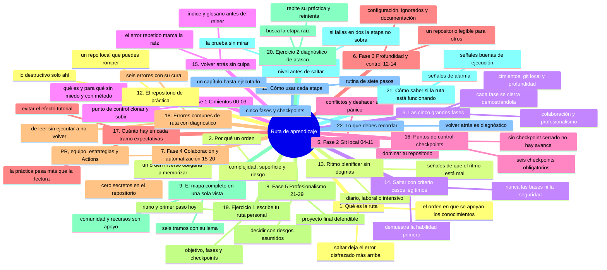
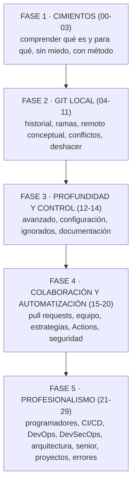
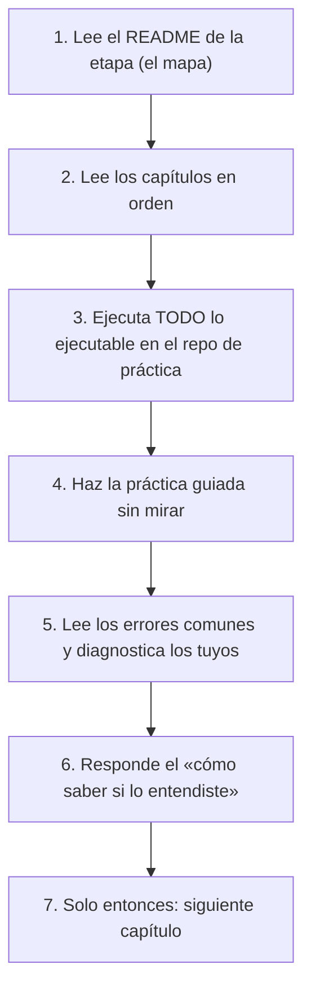

# La ruta de aprendizaje

## Introducción

Este repositorio contiene treinta etapas. Ante un mapa tan grande, la primera pregunta razonable es: «¿por dónde empiezo, en qué orden, y qué hago si me atasco?».

La respuesta es una ruta: un recorrido ordenado, con fases, puntos de control y criterios para saltar o volver sin perder el hilo.

Este capítulo es el mapa del curso entero. No sustituye a las etapas: te dice cómo recorrerlas, cuánto hay en cada tramo y cómo saber que realmente avanzaste.

En este capítulo aprenderás:

* las cinco fases del recorrido y qué objetivo tiene cada una;
* el mapa completo de las etapas 00 a 29;
* cómo comprobar tu nivel antes de saltar contenidos;
* cómo planificar el ritmo (diario, laboral, intensivo);
* errores típicos de ruta (saltarse bases, acumular teoría sin práctica) con diagnóstico completo.

---

## Mapa conceptual de este capítulo



---

## 1. Qué es la ruta

La ruta no es una lista de deseos: es el orden en que los conocimientos se apoyan unos en otros.

```text
Ideas que se apoyan:
   │
   ├── no entiendes «conflictos» sin «ramas»
   │
   ├── no entiendes «ramas» sin «commits»
   │
   ├── no entiendes «commits» sin «áreas de Git»
   │
   └── no entiendes «áreas de Git» sin saber qué es
       un repositorio
```

Saltar un tramo no está prohibido — pero si la base falla, el error reaparece más arriba disfrazado de otra cosa.

---

## 2. Por qué un orden

```text
El curso avanza en tres ejes simultáneos:
   │
   ├── complejidad: concepto → comando → internals →
   │   decisión profesional
   │
   ├── superficie: local → remoto → equipo →
   │   organización
   │
   └── riesgo: operaciones seguras → operaciones que
       reescriben historial → operaciones en equipo
       (con redes de seguridad aprendidas antes)
```

Un orden inverso obligaría a memorizar sin entender, o peor: a ejecutar comandos destructivos sin conocer sus consecuencias.

---

## 3. Las cinco grandes fases



```text
Regla de las fases:
   │
   ├── termina una fase «pensando en voz alta» antes
   │   de dar la siguiente por sentada
   │
   └── cada fase cierra con un proyecto o revisión que
       demuestre lo aprendido
```

---

## 4. Fase 1 — Cimientos (00-03)

```text
00-orientacion        → método, miedo a romper, pedir
                        ayuda, leer ejemplos, esta ruta
01-computacion-desde-cero → archivos, carpetas, rutas,
                        terminal
02-github-desde-cero  → qué es GitHub, repositorios,
                        control de versiones, modelo
                        mental
03-tu-cuenta-de-github → cuenta, perfil, seguridad
                        básica, organizaciones
```

**Objetivo de fase:** poder explicar con tus palabras qué es un repositorio, qué hace Git y qué añade GitHub; moverte por la terminal sin temor.

**Punto de control:** crea un repositorio en la web, clónalo, modifica un archivo y sube el cambio — sin copiar pasos de memoria.

---

## 5. Fase 2 — Git local (04-11)

```text
04-github-desde-la-web   → todo lo que se hace sin
                           terminal (bases para no
                           depender de ella)
05-github-desktop        → flujo gráfico completo
06-git-desde-cero        → init, add, commit, log,
                           diff, status, show, help
07-como-funciona-git     → working directory, staging,
                           objetos, hashes, HEAD, grafo
08-git-ramas             → crear, cambiar, fusionar,
                           rebase, ramas remotas
09-git-remoto            → remote, clone, fetch, pull,
                           push, origin, upstream
10-git-conflictos        → identificar, resolver,
                           abortar, prevenir
11-git-deshacer-y-recuperar → restore, revert, reset,
                           stash
```

**Objetivo de fase:** dominar tu repositorio: historia clara, ramas con criterio, sincronización segura, conflictos resueltos sin pánico y recuperación cuando algo sale mal.

**Punto de control:** monta un mini-proyecto (5-10 commits), trabaja en dos ramas que chocan a propósito, resuelve el conflicto, deshace un commit malo y lo recuperas con el método correcto.

Esta es la fase que más se repite en la práctica diaria. No la tengas «terminada» en teoría: que tus manos la ejecuten.

---

## 6. Fase 3 — Profundidad y control (12-14)

```text
12-git-avanzado        → técnicas que reducen fricción
13-configuracion-e-ignorados → git config, .gitignore,
                           exclude
14-git-y-documentacion → mensajes, README, estilo,
                           documentar decisiones
```

**Objetivo de fase:** personalizar Git, evitar ruido (archivos no deseados) y documentar para humanos.

**Punto de control:** tu repositorio de práctica tiene configuración propia, `.gitignore` sensato y un README que otro puede seguir.

---

## 7. Fase 4 — Colaboración y automatización (15-20)

```text
15-pull-requests       → PR, revisión, merge en web
16-trabajo-en-equipo    → roles, códigos, issues,
                           proyectos
17-estrategias-de-git   → flujo de ramas, release,
                           hotfix
18-github-profesional   → estructura, plantillas,
                           issues, gobernanza
19-github-actions       → workflows, runners,
                           artefactos, despliegue
20-github-security      → secretos, dependencias,
                           escaneos
```

**Objetivo de fase:** trabajar con otros sin fricción y con automatización verificable.

**Punto de control:** un PR real con revisión, un workflow que corre en cada push y ningún secreto en el repositorio.

---

## 8. Fase 5 — Profesionalismo (21-29)

```text
21-git-para-programadores → integraciones, hooks,
                           flujos por lenguaje
22-ci-cd              → pipeline completo build →
                        test → deploy
23-devops             → cultura, infraestructura como
                        código, entornos
24-devsecops          → seguridad integrada, no al final
25-arquitectura-de-repositorios → monorepo, polyrepo,
                        gobernanza
26-nivel-senior       → decisiones, trade-offs,
                        mentoría
27-proyectos-practicos → ejercicios guiados reales
28-proyecto-final     → integración de todo
29-errores-comunes    → catálogo de diagnóstico
```

**Objetivo de fase:** decidir como profesional: no solo «cómo se hace», sino «por qué esta opción y qué riesgos asumo».

**Punto de control:** el proyecto final (28) documentado, automatizado y defendible en una entrevista o revisión de equipo.

---

## 9. El mapa completo en una sola vista

```text
00 ── 03   CIMIENTOS            «¿qué es esto y para qué?»
04 ── 11   GIT LOCAL            «domino mi repositorio»
12 ── 14   PROFUNDIDAD          «configuro y documento»
15 ── 20   COLABORACIÓN         «trabajo con otros»
21 ── 26   PROFESIONAL          «decido y aseguro calidad»
27 ── 29   DEMOSTRACIÓN         «pruebo lo aprendido»

comunidad/  y  recursos/  acompañan CUALQUIER punto de
la ruta (no son etapas: son apoyo transversal)
```

---

## 10. Cómo comprobar tu nivel antes de saltar

Antes de saltarte una etapa, haz la prueba del «sin mirar»:

```text
PRUEBA DE NIVEL (ejemplo antes de saltar 08):
   │
   ├── ¿puedo explicar qué hace `git log --graph` y
   │   leer el resultado?
   │
   ├── ¿sé qué es HEAD sin buscarlo?
   │
   ├── ¿he creado y fusionado ramas en un repo real?
   │
   └── ¿sé qué cambia un merge de un rebase?

Si fallas en 2 o más: la etapa no está «de más».
```

```text
Criterio de salto legítimo:
   │
   ├── demuestras la habilidad en tu repositorio de
   │   práctica
   │
   ├── y puedes explicarla en voz alta (nivel 4 de
   │   06-como-estudiar-progreso-y-consulta)
   │
   └── si solo «recuerdas haberlo leído»: repite
```

---

## 11. Cómo usar cada etapa



---

## 12. El repositorio de práctica

```text
Tu laboratorio:
   │
   ├── un repositorio LOCAL dedicado (no un proyecto
   │   importante todavía)
   │
   ├── puedes romperlo, reescribirlo, borrarlo y
   │   clonarlo de nuevo
   │
   ├── para colaboración simulada: dos carpetas (dos
   │   «personas») o dos cuentas/entornos
   │
   └── regla: los ejercicios destructivos (reset
       --hard, rebase, clean) NUNCA en repos con
       trabajo que no puedas perder
```

---

## 13. Ritmo: planificar sin dogmas

```text
TIPOS DE RITMO (elige el tuyo):
   │
   ├── diario constante (30-60 min): el que mejor
   │   retención produce en la mayoría de personas
   │
   ├── laboral por bloques (2-3 h, fines de semana):
   │   bueno para prácticas largas y proyectos
   │
   └── intensivo (proyecto con fecha): válido si
       alternas teoría y ejecución, no solo lectura
```

```text
Señales de que el ritmo está mal:
   │
   ├── lees tres etapas y no has ejecutado nada
   ├── los capítulos se te olvidan al día siguiente
   └── acumulas «lo termino este fin» desde hace
       semanas
→ baja a un capítulo por sesión EJECUTÁNDOLO
```

---

## 14. Saltar con criterio (casos legítimos)

```text
Saltar está bien cuando:
   │
   ├── ya dominas la habilidad (prueba del punto 10)
   │
   ├── tu trabajo exige UN área ahora (p. ej. solo PRs)
   │   y vuelves al resto después
   │
   └── una etapa es repaso de otra superficie (web vs
       Desktop) y ya entiendes el concepto
```

```text
NUNCA saltes:
   │
   ├── las bases de ramas/conflictos/deshacer por
   │   «ya lo he visto en otro curso» sin demostrarlo
   │
   └── seguridad (20, 24) antes de tocar flujos reales:
       los malos hábitos arraigan primero
```

---

## 15. Volver atrás sin culpa

```text
Volver es diagnóstico, no fracaso:
   │
   ├── ¿el error se repite? → la causa está ABAJO
   │   (vuelve al capítulo de la raíz, no al del
   │   síntoma)
   │
   ├── ejemplo: conflictos raros → repasa 07 (áreas y
   │   HEAD) y 08 (ramas)
   │
   └── usa el índice del capítulo y el glosario antes
       que re-leer etapas enteras
```

---

## 16. Puntos de control (checkpoints)

```text
CHECKPOINTS OBLIGATORIOS:
   │
   C1 · tras 03: crear cuenta, repo web, clonar,
   │    modificar, subir
   │
   C2 · tras 11: mini-proyecto local completo con
   │    ramas, conflicto resuelto y recuperación
   │
   C3 · tras 14: config + ignore + README + mensajes
   │    de calidad
   │
   C4 · tras 20: PR revisado + workflow verde +
   │    cero secretos
   │
   C5 · tras 26: puedes explicar por escrito la
   │    estrategia de ramas y el pipeline de tu
   │    proyecto
   │
   C6 · tras 28: proyecto final público, documentado
   │    y automatizado
```

```text
Regla: no avances de fase sin checkpoint cerrado.
```

---

## 17. Cuánto hay en cada tramo (expectativas)

```text
Tamaño real de la ruta:
   │
   ├── capítulos con práctica ejecutable: la mayoría
   │    del trabajo está AHÍ, no en la lectura
   │
   ├── etapas de concepto (00, 02): leer + reflexionar
   │
   ├── etapas de comando (06-11): leer poco, ejecutar
   │    mucho
   │
   └── etapas profesionales (22-26): leer, decidir y
        escribir (documentar decisiones)
```

```text
Consejo de expectativas:
   │
   ├── pretender «terminar el curso» de golpe produce
   │   el «efecto tutorial»: entender y no poder
   │   hacer
   │
   └── pretender dominar C1..C6 produce un
       profesional; el resto del texto es su apoyo
```

---

## 18. Errores comunes de ruta con diagnóstico completo

### Error 1: leer la etapa entera sin ejecutar nada

**Qué ocurrió:** se «terminó» 06-git-desde-cero y a la semana no sabes hacer un commit sin mirar.

**Por qué posibles:**
* lectura pasiva (nivel 1-2 de 06-como-estudiar-progreso-y-consulta);
* no hay repositorio de práctica a mano;
* capítulos largos leídos en una sentada.

**Cómo comprobarlo:** pide un commit «sin mirar» y comprueba.

**Opciones:** rehacer la etapa con rutina del punto 11 (un capítulo = ejecutar).

**Riesgos:** ilusión de competencia (aparece en el peor momento: en equipo).

**Solución:** ejecutar al leer, siempre.

**Cómo se evita:** checkpoint C1/C2 obligatorios.

---

### Error 2: saltarse las bases por «saber ya programar»

**Qué ocurrió:** alguien con experiencia empieza en 08 o 15 y repite errores de concepto (confunde índice con working directory, fuerza ramas ajenas).

**Por qué:** se asume que el lenguaje de programación explica Git (no lo hace: Git tiene su modelo propio).

**Cómo comprobarlo:** la prueba del punto 10 en 06-07.

**Opciones:** recorrer rápido con evaluación estricta (pruebas), no saltar.

**Riesgos:** hábitos destructivos sin red de seguridad.

**Solución:** fase 2 completa aunque sea a ritmo acelerado.

**Cómo se evita:** respetar los ejes (punto 2), no solo el lenguaje.

---

### Error 3: saltar la práctica de «una sola vez que lo entendí»

**Qué ocurrió:** el conflicto «se entendía» pero la primera vez real (con prisa) salió mal.

**Por qué:** entender ≠ ejecutar (niveles 2-4 de estudio).

**Cómo comprobarlo:** la práctica guiada falla cuando se hace sin mirar.

**Opciones:** repetir la práctica y después variarla (propio de 13-como-leer-los-ejemplos).

**Riesgos:** dependencia de guías en producción.

**Solución:** criterio de «sin mirar».

**Cómo se evita:** checkpoint con variante no idéntica al capítulo.

---

### Error 4: acumular etapas sin cerrar checkpoints

**Qué ocurrió:** «voy por el 19» pero C2 (mini-proyecto con conflicto) nunca se hizo.

**Por qué:** se mide avance por capítulos leídos, no por habilidades demostradas.

**Cómo comprobarlo:** intenta los checkpoints C1-C5 en orden y anota fallos.

**Opciones:** pausar el avance y cerrar los checkpoints atrasados.

**Riesgos:** base trémula; los errores multiplican arriba.

**Solución:** «checkpoint cerrado = etapa cerrada».

**Cómo se evita:** tabla de progreso visible (punto 16).

---

### Error 5: seguir una ruta rígida cuando el objetivo es otro

**Qué ocurrió:** quien solo necesita documentar repositorios invierte semanas en devops antes de lo necesario (o al revés).

**Por qué:** no se declaró el objetivo.

**Cómo comprobarlo:** pregunta «¿qué quiero poder hacer en 8 semanas?» — si la respuesta no mapa a etapas, la ruta está mal elegida.

**Opciones:** elige el tramo prioritario (punto 14), marca el resto como fase posterior.

**Riesgos:** desmotivación por no ver aplicabilidad.

**Solución:** ruta principal + tramo rápido auxiliar.

**Cómo se evita:** escribir tu objetivo en una línea antes de empezar.

---

### Error 6: no volver atrás nunca (orgullo de ruta)

**Qué ocurrió:** se repiten errores de raíz (carpeta sucia, HEAD confuso) porque «ya pasé esa etapa».

**Por qué:** se confunde orden lineal con linealidad del aprendizaje.

**Cómo comprobarlo:** el mismo tipo de error aparece en tres etapas distintas.

**Opciones:** volver al capítulo raíz, repasar con ejercicios, re-cerrar el checkpoint.

**Riesgos:** deuda técnica de conocimiento.

**Solución:** diagnóstico descendente (punto 15).

**Cómo se evita:** tratar checkpoints como reabrirables.

---

## 19. Ejercicio 1: escribe tu ruta personal

### Paso 1

Escribe en una línea tu objetivo (p. ej. «colaborar en el trabajo con PRs seguros»).

### Paso 2

Marca en el mapa (punto 9) la fase mínima que lo cubre.

### Paso 3

Lista los checkpoints que vas a cerrar y en qué fecha realista.

### Paso 4

Define tu ritmo (punto 13) con una sesión fija en tu calendario.

### Paso 5

Crea tu repositorio de práctica (punto 12) y ejecuta C1 si no lo has cerrado.

### Resultado esperado

Un plan de una página: objetivo, fases, checkpoints, ritmo y laboratorio — con el primer paso ejecutado hoy.

---

## 20. Ejercicio 2: diagnóstico de atasco

### Paso 1

Enumera los tres últimos errores que tuviste con Git (reales o en práctica).

### Paso 2

Para cada uno, señala la etapa RAÍZ (no la del síntoma).

### Paso 3

Vuelve solo a ese capítulo, repite su práctica guiada.

### Paso 4

Reintenta el error original.

### Resultado esperado

Haber practicado el método de «volver atrás con criterio» en lugar de re-leer todo.

---

## 21. Cómo saber si la ruta está funcionando

Señales buenas:

```text
   │
   ├── ejecutas más de lo que lees
   │
   ├── los checkpoints se cierran con «sin mirar»
   │
   ├── explicas conceptos sin fórmulas de memoria
   │
   ├── tus errores disminuyen en frecuencia y aumenta
   │   tu velocidad de diagnóstico
   │
   └── usas el repo de práctica por iniciativa propia
```

Señales de alarma:

```text
   │
   ├── acumulas marcadores «lo reviso después»
   │
   ├── evitas la terminal/PRs «hasta terminar de leer»
   │
   └── no has hecho commit en más de una semana de
       estudio
```

---

## 22. Lo que debes recordar

* La ruta tiene cinco fases: cimientos, git local, profundidad, colaboración, profesionalismo;
* el orden importa porque los conceptos se apoyan: conflictos sobre ramas, ramas sobre commits, commits sobre áreas;
* saltar es legítimo SOLO con la prueba «sin mirar» aprobada;
* cerrar checkpoints (C1-C6) vale más que «capítulos leídos»;
* volver atrás es diagnóstico: busca la raíz, no el síntoma;
* el ritmo constante vence al sprint de fin de semana;
* el repositorio de práctica es tu laboratorio: ahí se aprende ejecutando.

---

### Ejercicio de transferencia

Escribe tu ruta personal siguiendo el ejercicio 1 (objetivo en una línea, fase mínima que lo cubre, checkpoints con fecha y ritmo con sesión fija) y, si ya tenías avance, pasa por el ejercicio 2 señalando la etapa raíz de tus tres últimos errores. Entregable: `MI-RUTA.md` de una página en tu repositorio de práctica, con el primer paso ya ejecutado hoy.

## Resumen

En este capítulo aprendiste que:

* el recorrido completo son treinta etapas organizadas en cinco fases, de los cimientos conceptuales a la demostración profesional;
* cada fase tiene objetivo y punto de control, y no se avanza de fase sin cerrar el checkpoint;
* antes de saltar contenidos hay que demostrar la habilidad (explicar, ejecutar, variar);
* la rutina por etapa integra lectura, ejecución, práctica sin mirar y revisión de errores;
* los errores típicos de ruta (lectura pasiva, saltar bases, no ejecutar, acumular sin cerrar, ruta sin objetivo, no volver) se detectan con checklist y se corrigen volviendo a la raíz;
* el plan personal (objetivo, fases, checkpoints, ritmo, laboratorio) convierte el repositorio completo en un recorrido viable.

La idea principal es:

> **La ruta no se cumple leyendo: se cierra checkpoint a checkpoint, con un repositorio de práctica en la mano y permiso explícito para volver atrás cuando el error lo indique.**

---

## Autopreguntas de cierre

Sin mirar el material, responde mentalmente y luego compruébalo con este capítulo:

1. ¿Por qué el orden de la ruta no es una preferencia sino una consecuencia de cómo se apoyan los conceptos?
2. ¿Qué cinco fases tiene el recorrido y qué se demuestra al cerrar cada una?
3. ¿Qué prueba «sin mirar» apruebas antes de saltarte una etapa?
4. ¿Qué diferencia hay entre cerrar un checkpoint y llevar N capítulos leídos?
5. ¿Cómo distingues el síntoma del error de su causa raíz?
6. ¿Qué señales te dicen que tu ritmo de estudio está mal y cuál es la corrección?
7. ¿Qué ejercicios destructivos están permitidos y en qué repositorio?

---

## Próximo paso

Ya tienes el método, el mapa y el plan.

Comienza la primera etapa técnica del recorrido: comprender la máquina sobre la que Git y GitHub van a vivir.

Continúa con:

[`../01-computacion-desde-cero/`](../01-computacion-desde-cero/)
