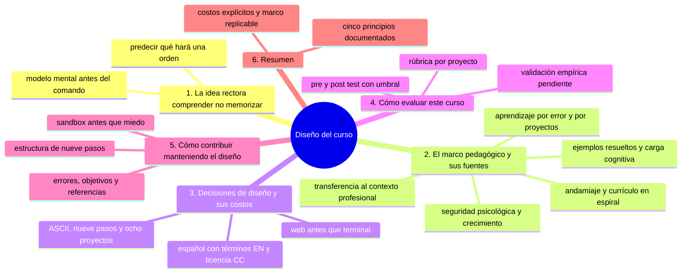
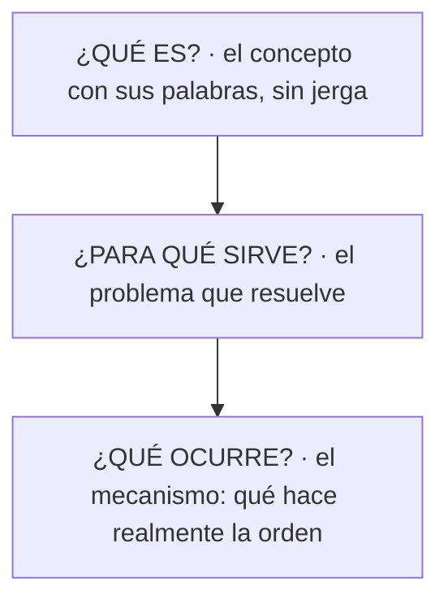

# Cómo fue diseñado este curso

## Introducción

Los primeros capítulos te dicen **qué** estudiar y **cómo** estudiarlo. Este documento hace explícito el **porqué del diseño**: qué principios pedagógicos sostienen la estructura del curso, qué decisiones se tomaron y a qué costo. Está pensado para dos lectores: el estudiante que quiere entender por qué el curso está ordenado así, y el docente o colaborador que quiere replicar el método en otro material.

---

## Mapa conceptual de este capítulo



---

## 1. La idea rectora: comprender, no memorizar

El curso parte de una hipótesis documentada en su propio título: aprender Git no es memorizar comandos. La evidencia es consistente en educación en ciencias de la computación: quien memoriza sintaxis se bloquea ante la primera variación; quien entiende el modelo subyacente (objetos inmutables, referencias, zonas de trabajo) generaliza a comandos que nunca vio (Brooks, 1975 — «es más difícil construir un programa para ser cambiado que construir uno que funcione»: el mismo principio vale para el conocimiento).

Por eso cada capítulo responde siempre tres preguntas antes de mostrar cualquier comando:



El comando aparece **después** de que el modelo mental existe. Si un estudiante puede predecir qué hará una orden antes de ejecutarla, el curso hizo su trabajo.

---

## 2. El marco pedagógico (y sus fuentes)

### 2.1. Andamiaje y currículo en espiral

La progresión 00 → 29 aplica el currículo en espiral (Kenton, 1978): cada tema regresa con mayor profundidad — «control de versiones» aparece en 02 (concepto), en 07 (mecanismo interno) y en 25 (decisión de arquitectura) — y el andamiaje (Bruner, 1976): el material sostiene al estudiante en la parte baja (00–04: cero requisitos) y lo retira en la parte alta (25–29: el estudiante decide).

La regla operativa es: **una sección solo asume las anteriores**. Si un capítulo 15 usa `git rebase`, ese concepto ya fue enseñado en 08 y 09 — y el capítulo lo enlaza en lugar de re-enseñarlo.

### 2.2. Ejemplos resueltos antes de la práctica (carga cognitiva)

La estructura de 9 pasos de cada capítulo (¿qué es?, ¿para qué?, ejemplo de la vida real, ejemplo técnico, comando, ¿qué ocurre?, práctica, errores, resumen) sigue el principio de *worked examples* de la teoría de carga cognitiva (Sweller, 1988): primero se ve el problema resuelto completo (ejemplo técnico comentado), después se practica con soporte (práctica guiada), y el error se estudia como caso de auditoría — nunca como castigo.

El orden «ejemplo de la vida real → ejemplo técnico» no es decorativo: fija la analogía (archivos, carpetas, versiones) antes de introducir la metáfora formal (objects, refs).

### 2.3. Aprendizaje basado en el error

La sección 29 y el bloque «Errores comunes con diagnóstico completo» de cada capítulo aplican el error-based learning: el error se presenta **antes** de que el estudiante lo cometa, con su diagnóstico completo (qué ocurrió, por qué, cómo comprobarlo, opciones, riesgos, solución, prevención). La literatura en educación de programación muestra que los principiantes subestiman sistematicamente su error y sobreestiman su capacidad de recuperarse; el entrenamiento en diagnóstico —no en la evitación— es lo que construye la autonomía (Rubin y colaboradores, investigación en recuperación de errores en ICSE/PLDI).

El diagnóstico de 7 campos es deliberadamente idéntico en todos los capítulos: después de diez errores estudiados, el estudiante internaliza el procedimiento y lo aplica a cualquier mensaje nuevo.

### 2.4. Aprendizaje basado en proyectos (ABP)

Las secciones 27 y 28 son ABP puro (Bloom et al., 2001; la definición de *design-based learning* de Jonassen): el aprendizaje se organiza alrededor de un producto **y de su flujo**. La regla de la sección 27 lo dice explícitamente: «el entregable no es el producto, es el flujo ejecutado de verdad». Ocho proyectos (y no tres) por el principio de espaciado: la práctica distribuida en el tiempo supera a la práctica compacta (Ebbinghaus; la curva del olvido), y cada proyecto hereda la automatización del anterior — el costo marginal de «encender» el flujo baja hasta ser automático.

La *definition of done* (checklist de entrega por proyecto, inspirada en Scrum) es el mecanismo de verificación: convierte «¿terminé?» de sensación a lista.

### 2.5. Seguridad psicológica y mentalidad de crecimiento

«No tengas miedo de romper» (caps. 07-09 de esta sección) no es consuelo: es un diseño. El curso enseña el reflog **antes** que el reset, el sandbox antes que la fuerza y la recuperación antes que el miedo. Dweck (2006) muestra que el error se aprende mejor cuando el estudiante cree que su capacidad es maleable (growth mindset); la secuencia «rompe → recupera → explica por qué recuperaste» construye esa creencia con evidencia propia.

### 2.6. Transferencia al contexto profesional

Cada capítulo cierra con «Nivel profesional»: la transferencia situada (Herrington y Oliver, 2002 — las tareas auténticas requieren contexto, complejidad y evaluación extensa). El concepto doméstico se mapea a su gemelo profesional (commit → review; rama protegida → gobernanza; stash → contexto de trabajo), de modo que el estudiante reconoce el oficio en el día uno de trabajo real.

---

## 3. Decisiones de diseño y sus costos

```text
DECISIÓN                POR QUÉ               COSTO ACEPTADO
─────────────────────────────────────────────────────────────────────
empezar en la web       menos carga cognitiva  la terminal llega «tarde»
(04 antes que 06)       (nueva UI + nuevo      para quien ya la domina —
                        concepto)             el nivel 4 de
                                              EMPIEZA-AQUI es el puente

diagramas ASCII, no     portables, editables,  no son accesibles para
imágenes                versionables, CC       lectores de pantalla — la
                                  convenció de texto alternativo está en
                                  el cap. 13 de esta sección

9 pasos por capítulo    uniformidad =         capítulos «largos» — el
                        procedimiento                                 cap. 13 enseña a leerlos
                        reconocible

8 proyectos             práctica espaciada    tiempo total del curso
                        (ABP)                  ~500–800 h estimadas

español técnico con     audiencia real del     términos EN en cursiva
términos EN             material              cuando el anglicismo es el
                                          estándar del oficio (CONTRIBUTING
                                          §5)

licencia CC BY-NC-SA    reposarable con       no permite uso comercial
                        atribución            — decisión del autor
```

---

## 4. Cómo evaluar este curso (propuesta de investigación)

Si el material se usa en un contexto educativo formal, la evaluación sugerida es:

```text
PRE/POST:
   │
   ├── pre-test: 20 ítems (5 por bloque: conceptos 00–07,
   │   ramas/remoto 08–12, colaboración 15–18,
   │   automatización 19–22, decisiones 25–26)
   ├── post-test: mismos ítems, misma escala
   └── criterio: mejora media ≥ 0.4 puntos y ≥ 70 % de
       acierto en la dimensión «diagnostica un error»
       (la que el curso afirma enseñar)

POR PROYECTO:
   │
   ├── la rúbrica de la sección 28 (cap. 07) como
   │   instrumento de evaluación externa
   └── métricas de proceso: nº de PRs revisados,
       práctica negativa ejercida (prueba en rojo),
       rúbrica temprana commiteada (yes/no)

ESTADO:
   └── el curso no ha sido validado empíricamente: los
       bloques «Objetivos de aprendizaje» y «Autopreguntas
       de cierre» añadidos a cada sección son el primer
       paso hacia esa validación — son los ítems contra
       los que se puede medir
```

---

## 5. Cómo contribuir manteniendo el diseño

Quien agrega contenido debe respetar el marco, no solo el estilo:

1. **Un concepto por capítulo**, con la estructura de 9 pasos (CONTRIBUTING lo formaliza).
2. **Errores con diagnóstico completo**: 7 campos, nunca menos.
3. **Objetivos y autopreguntas**: cada nueva sección incluye bloques de «Objetivos de aprendizaje» y «Autopreguntas de cierre» en su README.
4. **Referencias**: cada sección lleva sus fuentes canónicas; el material con afirmaciones de diseño cita su soporte (como este documento).
5. **Sandbox antes que miedo**: toda práctica con herramienta destructiva ofrece su entorno controlado (ver `recursos/sandboxes/`).
6. **Enlaces, no copias**: se enlaza lo ya enseñado; la duplicación diluye el currículo en espiral.

---

### Ejercicio de transferencia

Aplica el marco de este documento a un capítulo que aún no hayas leído: escribe sus tres preguntas (¿qué es?, ¿para qué sirve?, ¿qué ocurre?), identifica qué principio pedagógico sostiene su estructura y qué costo de diseño acepta, con la referencia que lo respalda. Entregable: una ficha de una página en `ANALISIS-DE-DISENO.md` de tu repositorio de práctica.

## 6. Resumen

En este capítulo aprendiste que:

* el curso se sostiene en cinco principios documentados: andamiaje/espiral, ejemplos resueltos, error-based learning, ABP y transferencia situada;
* cada decisión de diseño tiene un costo explícito (web primero, ASCII, 8 proyectos, español con términos EN, CC BY-NC-SA);
* la evaluación del material empieza con los bloques de objetivos y autopreguntas de cada sección, y se completa con la rúbrica de la sección 28;
* contribuir al curso es respetar el marco: estructura de 9 pasos, diagnóstico de 7 campos, referencias y sandbox.

La idea principal es:

> **Un material educativo es tan bueno como su diseño subyacente: cuando el andamiaje, el error y el proyecto se eligen con criterio — y se documentan —, el lector puede aprenderlo y el docente puede replicarlo.**

---

## Autopreguntas de cierre

Sin mirar el material, responde mentalmente y luego compruébalo con este capítulo:

1. ¿Qué tres preguntas responde cada capítulo antes de mostrar cualquier comando?
2. ¿En qué se diferencian el andamiaje y el currículo en espiral, y cómo se aplican al recorrido 00 → 29?
3. ¿Por qué el error se estudia antes de que el estudiante lo cometa?
4. ¿Qué justifica que haya ocho proyectos y no tres?
5. ¿Qué costo acepta cada decisión de diseño y por qué se documenta?
6. ¿Con qué instrumentos se evaluaría este curso y qué sigue pendiente de validar?

---

## Referencias

* Bruner, J. — «The role of tutoring in problem solving» (1976) — andamiaje.
* Kenton, H. — «The spiral curriculum» (1978, *Educational Leadership*).
* Sweller, J. — «Cognitive load during problem solving: effects on learning» (1988).
* Bloom, B. et al. — *Learning for Application* (AAAS, 2001) — aprendizaje basado en proyectos.
* Dweck, C. — *Mindset: The New Psychology of Success* (2006) — mentalidad de crecimiento.
* Herrington, J. y Oliver, R. — «Designing authentic tasks using constructionist principles» (2002).
* Brooks, F. — *The Mythical Man-Month* (1975).
* Scrum Guide — «Definition of Done» (scrum.org).
* La rúbrica de evaluación del material: [`../28-proyecto-final/07-rubrica-del-proyecto-final.md`](../28-proyecto-final/07-rubrica-del-proyecto-final.md).

---

## Próximo paso

Ahora que conoces el esqueleto del curso, vuelve al material con otro ojo:

[`16-ruta-de-aprendizaje.md`](16-ruta-de-aprendizaje.md)
