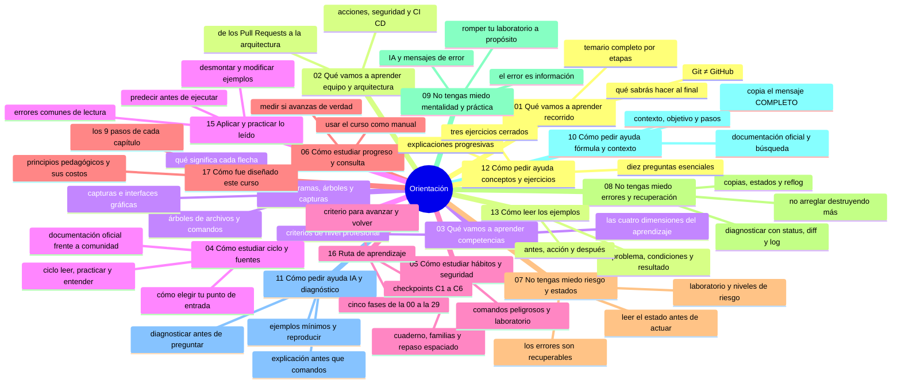
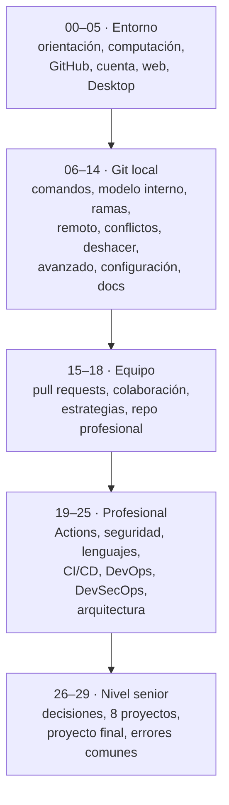

# 00 — Orientación

## Bienvenido a esta sección

Antes de tocar Git necesitas tres cosas: saber **qué vas a aprender y por qué**, **cómo estudiar este material** y **la certeza de que equivocarte aquí es seguro**. Esta sección te da las tres.

No asumimos que sepas programar, usar la terminal, o qué es Git. Cada concepto se explica antes de usarlo. Si nunca has abierto Git ni GitHub, empieza por aquí.

---

## Mapa conceptual

---

## Qué cubre cada capítulo

| Cap | Capítulo | Qué te llevas | Cierre |
|-----|----------|---------------|--------|
| 01 | Qué vamos a aprender: recorrido | Las etapas 1 a 14 y la estructura completa del curso | Saber qué contiene cada sección y por qué ese orden |
| 02 | Qué vamos a aprender: equipo y arquitectura | Las etapas 15 a 25: de los Pull Requests a la arquitectura | Entender cuándo Git deja de ser una herramienta personal |
| 03 | Qué vamos a aprender: competencias | Las etapas 26 a 29 y las competencias finales | Saber qué sabrás hacer cuando todo esto termine |
| 04 | Cómo estudiar: ciclo y fuentes | El ciclo de estudio, los cuatro pasos de la práctica y las fuentes fiables | Tener tu propio horario y método definidos |
| 05 | Cómo estudiar: hábitos y seguridad | Cuaderno, familias de comandos, ritmo, laboratorio y comandos peligrosos | Experimentar sin poner en riesgo un proyecto importante |
| 06 | Cómo estudiar: progreso y consulta | Cómo medir si avanzas de verdad y usar el curso como manual | Saber cuándo avanzar y cómo volver atrás sin culpa |
| 07 | No tengas miedo a romper: riesgo y estados | Qué errores son recuperables, el laboratorio y los niveles de riesgo | Dejar de temer `reset`, conflictos y commits malos |
| 08 | No tengas miedo: errores y recuperación | Diagnosticar con `status`, `diff` y `log` sin empeorar el problema | Recuperarte de un error sin entrar en pánico |
| 09 | No tengas miedo: mentalidad y práctica | IA, mensajes de error, práctica deliberada y las cinco reglas | Convertir cada error en conocimiento |
| 10 | Cómo pedir ayuda: fórmula y contexto | La fórmula de una buena pregunta y la información que hay que incluir | Copiar errores completos sin recortar ni filtrar datos |
| 11 | Cómo pedir ayuda: IA y diagnóstico | Diagnosticar antes de preguntar, ejemplos mínimos y plantillas | Pedir ayuda aportando diagnóstico propio |
| 12 | Cómo pedir ayuda: conceptos y ejercicios | Explicaciones progresivas, verificación de comprensión y tres ejercicios | Comprobar que entendiste y explicarlo con tus palabras |
| 13 | Cómo leer los ejemplos | El método de lectura activa: qué problema resuelve, qué necesita y la estructura antes → acción → después | Saber qué líneas ejecutar tú y cuáles son solo ejemplo |
| 14 | Cómo leer diagramas, árboles, comandos y capturas | Diagramas, árboles de archivos, líneas de comandos y capturas de pantalla | Interpretar cualquier material visual sin memorizar su forma |
| 15 | Cómo aplicar y practicar lo leído | Ejercicios de desmontaje, predicción y los errores de lectura más comunes | Desmontar un ejemplo, modificarlo y comprobar que lo entendiste |
| 16 | Ruta de aprendizaje | Las cinco fases 00–29, los checkpoints C1–C6 y el criterio de avance | Situarte en tu fase real y elegir el punto de entrada |
| 17 | Cómo fue diseñado este curso | Los 9 pasos de cada capítulo, sus principios pedagógicos y sus costos | Entender el método para usarlo a tu favor |

---

## La ruta completa del curso

Cada etapa prepara la siguiente. No es obligatorio avanzar al mismo ritmo: puedes volver a cualquier capítulo cuando necesites repasar.

Si dudas por dónde empezar, la guía de entrada es [`../EMPIEZA-AQUI.md`](../EMPIEZA-AQUI.md).

---

## En esta sección estudiarás

* el temario completo y qué competencias adquieres al final de cada etapa;
* el método de estudio y sus variantes según el tiempo disponible;
* por qué los errores en Git son recuperables y qué operaciones son realmente peligrosas;
* a pedir ayuda copiando el mensaje de error completo y con el contexto necesario;
* a leer bloques de código y ejemplos de terminal sin ejecutar lo que no toca;
* a interpretar diagramas, árboles de archivos, comandos y capturas de pantalla;
* a aplicar lo leído: desmontar ejemplos, predecir resultados y detectar errores de lectura;
* tu ruta: las cinco fases del curso, los checkpoints C1-C6 y el criterio para avanzar o volver atrás;
* el marco pedagógico: los 9 pasos de cada capítulo y las 4 dimensiones del aprendizaje.

## Objetivos de aprendizaje

Al terminar esta sección serás capaz de:

* identificar la estructura del curso y el papel de cada sección en la progresión;
* elegir tu ruta de estudio según tu nivel actual sin saltarte cimientos;
* explicar la metodología del curso: cada capítulo sigue los mismos nueve pasos;
* explicar por qué equivocarse es parte del proceso y qué familias de errores en Git son recuperables;
* diferenciar Git (la herramienta local) de GitHub (la plataforma) con tus propias palabras.

---

## ¿Qué aprenderás en esta sección?

1. [`01-que-vamos-a-aprender-recorrido.md`](01-que-vamos-a-aprender-recorrido.md) — el temario completo hasta la etapa 14.
2. [`02-que-vamos-a-aprender-equipo-y-arquitectura.md`](02-que-vamos-a-aprender-equipo-y-arquitectura.md) — de los Pull Requests a la arquitectura (etapas 15-25).
3. [`03-que-vamos-a-aprender-competencias.md`](03-que-vamos-a-aprender-competencias.md) — las últimas etapas y las competencias finales.
4. [`04-como-estudiar-ciclo-y-fuentes.md`](04-como-estudiar-ciclo-y-fuentes.md) — el ciclo de estudio, la práctica y las fuentes fiables.
5. [`05-como-estudiar-habitos-y-seguridad.md`](05-como-estudiar-habitos-y-seguridad.md) — cuaderno, familias de comandos, ritmo y comandos peligrosos.
6. [`06-como-estudiar-progreso-y-consulta.md`](06-como-estudiar-progreso-y-consulta.md) — medir tu progreso y usar el curso como manual.
7. [`07-no-tengas-miedo-riesgo-y-estados.md`](07-no-tengas-miedo-riesgo-y-estados.md) — los errores recuperables, el laboratorio y los niveles de riesgo.
8. [`08-no-tengas-miedo-errores-y-recuperacion.md`](08-no-tengas-miedo-errores-y-recuperacion.md) — diagnosticar un error y recuperarte sin empeorarlo.
9. [`09-no-tengas-miedo-mentalidad-y-practica.md`](09-no-tengas-miedo-mentalidad-y-practica.md) — la mentalidad, la IA y la práctica deliberada.
10. [`10-como-pedir-ayuda-formula-y-contexto.md`](10-como-pedir-ayuda-formula-y-contexto.md) — la fórmula de la buena pregunta y su contexto.
11. [`11-como-pedir-ayuda-ia-y-diagnostico.md`](11-como-pedir-ayuda-ia-y-diagnostico.md) — diagnosticar antes de preguntar y usar la IA con criterio.
12. [`12-como-pedir-ayuda-conceptos-y-ejercicios.md`](12-como-pedir-ayuda-conceptos-y-ejercicios.md) — conceptos, verificación de comprensión y ejercicios.
13. [`13-como-leer-los-ejemplos.md`](13-como-leer-los-ejemplos.md) — cómo leer los ejemplos, el problema que resuelven y las condiciones que necesitan.
14. [`14-leer-diagramas-terminales-y-capturas.md`](14-leer-diagramas-terminales-y-capturas.md) — diagramas, árboles, comandos y capturas.
15. [`15-aplicar-y-practicar-lo-leido.md`](15-aplicar-y-practicar-lo-leido.md) — aplicar lo leído: ejercicios y errores de lectura.
16. [`16-ruta-de-aprendizaje.md`](16-ruta-de-aprendizaje.md) — el mapa de fases, checkpoints y su criterio de avance.
17. [`17-como-fue-disenado-este-curso.md`](17-como-fue-disenado-este-curso.md) — el marco pedagógico del curso y sus decisiones.

## Cómo estudiar esta sección

Lee los capítulos 01-03 en orden: te dan el mapa completo del curso. Los 04-06 construyen el método de estudio; los 07-09 tratan el miedo a romper, la recuperación y la mentalidad; los 10-12, cómo pedir ayuda sin desviar el problema. Los 13-15 son de consulta — vuelve a ellos cuando dudes (¿qué línea ejecuto?, ¿cómo se lee este diagrama?, ¿lo he entendido de verdad?). El capítulo 16 es una decisión: elige tu ruta antes de continuar. El capítulo 17 explica el método del curso. La sección 01-computacion-desde-cero es tu primer contenido práctico.

## Referencias

* Chacon, S. y Straub, B. — *Pro Git* (cap. 1), disponible en git-scm.com/book/es/v2.
* Git — Documentación oficial (git-scm.com).
* GitHub — Documentación oficial (docs.github.com).
* Licencia del curso: CC BY-NC-SA 4.0 (creativecommons.org/licenses/by-nc-sa/4.0/).

---

## Checkpoint C0 — Antes de avanzar

Antes de entrar a `01-computacion-desde-cero/`, demuestra que puedes:

1. **Nombrar** la diferencia entre Git y GitHub sin mirar el material.
2. **Señalar** en el mapa de arriba en qué etapa estás y cuál sigue.
3. **Explicar** por qué un error en Git no equivale a borrar tu proyecto.
4. **Copiar** un mensaje de error completo (sin recortar) de cualquier programa.
5. **Decidir** tu nivel actual (0-3) y justificarlo en una frase.

Si puedes hacerlo **sin mirar instrucciones**, el checkpoint está cerrado.

---

## Autopreguntas de cierre

Sin mirar el material, responde mentalmente y luego compruébalo con los capítulos de la sección:

1. ¿Cuál es la diferencia entre Git y GitHub, explicada sin mirar el material?
2. Un estudiante nunca ha abierto la terminal: ¿por qué se empieza por esta sección y qué debe sacar de ella?
3. ¿Cuáles son los nueve pasos que sigue cada capítulo del curso y para qué sirven?
4. ¿Qué familias de errores en Git son recuperables y qué hace posible esa recuperación?
5. Estás leyendo un ejemplo con cinco comandos `git`: ¿cómo sabes cuáles debes ejecutar tú?
6. ¿Qué te dice tu número de nivel (0-3) sobre por dónde empezar y qué te impide saltártelo?
7. ¿Por qué el curso enseña la terminal al final del bloque 05 y no en la primera lección?
8. Mencionas un error de Git en un foro: ¿qué cuatro cosas debes incluir para que te ayuden?

---

## Próximo paso

Cuando termines los diecisiete capítulos, continúa con la base computacional que Git necesita:

[`../01-computacion-desde-cero/`](../01-computacion-desde-cero/)
