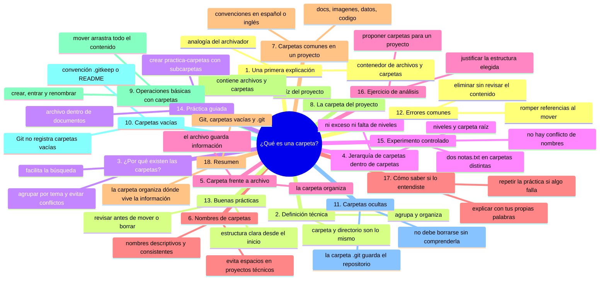
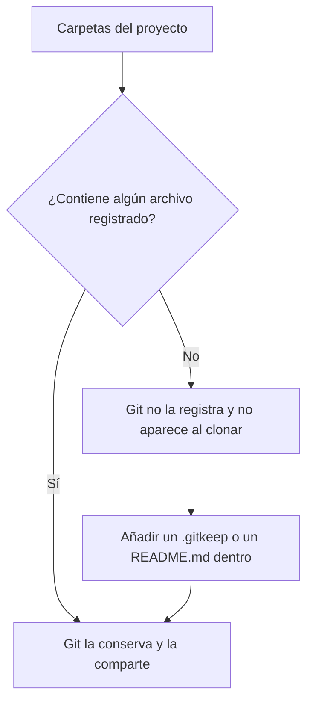

# ¿Qué es una carpeta?

## Introducción

En el capítulo anterior aprendiste que un archivo es una unidad de información almacenada bajo un nombre.

Pero un proyecto real no suele contener un solo archivo.

Puede contener decenas, cientos o miles.

Si todos estuvieran mezclados en el mismo lugar, encontrar algo sería difícil, y trabajar en equipo resultaría todavía más complicado.

Para resolver ese problema existen las **carpetas**.

En este capítulo aprenderás:

* qué es una carpeta;
* qué diferencia existe entre una carpeta y un archivo;
* cómo se organizan las carpetas dentro de otras carpetas;
* por qué la organización importa en un proyecto;
* qué operaciones básicas pueden realizarse con carpetas;
* qué relación tiene una carpeta con un repositorio Git.

No necesitas utilizar la terminal.

---

## Mapa conceptual



---

## 1. Una primera explicación

Una carpeta es un contenedor que agrupa archivos y otras carpetas.

Puedes imaginarla como una caja etiquetada dentro de un archivador.

Si en un archivador físico guardaras todos los documentos sueltos, sin divisiones ni etiquetas, tardarías mucho en encontrar uno. En cambio, si los organizaras en secciones como «facturas», «contratos» y «correspondencia», localizar cualquier documento sería mucho más rápido.

Las carpetas digitales cumplen esa misma función:

```text
Archivador físico              Sistema de archivos
─────────────────              ───────────────────
Cajón o sección                Carpeta
Documento                      Archivo
Etiqueta de sección            Nombre de la carpeta
```

La analogía ayuda a comprender la idea general. La definición técnica es un poco más precisa.

---

## 2. Definición técnica

Una **carpeta**, también llamada **directorio**, es una estructura del sistema de archivos que agrupa archivos y otras carpetas.

Recuerda que el sistema de archivos es el mecanismo que utiliza el sistema operativo para organizar, nombrar, almacenar y localizar la información en un dispositivo.

```text
Dispositivo de almacenamiento
            │
            ▼
Sistema de archivos
            │
            ├── carpetas
            │      └── pueden contener archivos
            │      └── pueden contener otras carpetas
            └── archivos
```

### Carpeta y directorio

En la práctica, **carpeta** y **directorio** significan lo mismo.

La diferencia está en el contexto donde se utiliza cada término:

* **carpeta** es el término habitual en las interfaces gráficas y en el lenguaje cotidiano;
* **directorio** es el término frecuente en la terminal, en la documentación técnica y en los sistemas tipo Unix.

Durante este curso utilizaremos principalmente la palabra **carpeta**, pero debes reconocer ambas, porque aparecerán en mensajes, documentación y herramientas.

---

## 3. ¿Por qué existen las carpetas?

Las carpetas no son un adorno visual. Resuelven problemas concretos.

### 3.1. Agrupar por tema

Permiten mantener juntos los elementos relacionados.

```text
documentos/
├── informe.docx
├── carta.docx
└── acta.docx
```

### 3.2. Evitar conflictos de nombres

Dos archivos pueden llamarse igual si están en carpetas diferentes.

```text
documentos/
└── notas.txt

datos/
└── notas.txt
```

Esto ya lo mencionamos en el capítulo anterior: el nombre por sí solo no identifica un archivo de manera única. La ubicación también forma parte de su identidad.

### 3.3. Facilitar la búsqueda

Una estructura clara permite encontrar la información sin revisar todo el contenido de un proyecto.

### 3.4. Separar tipos de contenido

Puedes mantener separados los documentos, las imágenes, los datos y el código.

```text
mi-proyecto/
├── documentos/
├── imagenes/
├── datos/
└── codigo/
```

### 3.5. Organizar de forma jerárquica

Una carpeta puede contener otras carpetas, lo que permite representar relaciones más complejas.

```text
documentos/
├── informes/
│   ├── informe-enero.docx
│   └── informe-febrero.docx
└── actas/
    └── acta-2026-10-01.docx
```

### 3.6. Aplicar controles

Según el sistema operativo, pueden aplicarse permisos y otras reglas a una carpeta completa, y no solamente archivo por archivo.

Este tema se profundizará más adelante, cuando estudiemos seguridad y control de acceso.

---

## 4. Jerarquía: carpetas dentro de carpetas

La organización de carpetas forma una **jerarquía**, es decir, una estructura de niveles.

Puedes representarla como un árbol:

```text
mi-proyecto/
├── documentos/
│   ├── informes/
│   └── actas/
├── imagenes/
├── datos/
└── codigo/
```

La carpeta principal, `mi-proyecto/`, contiene cuatro carpetas.

A su vez, `documentos/` contiene dos carpetas más.

La carpeta que contiene a todas las demás se denomina **carpeta raíz del proyecto**. Más adelante, cuando estudiemos rutas y repositorios, esta idea aparecerá con mayor precisión.

### ¿Cuántos niveles son razonables?

No existe un número universal.

Una estructura con demasiados niveles puede volverse incómoda:

```text
proyecto/
└── area/
    └── subarea/
        └── tema/
            └── subtema/
                └── version/
                    └── archivo.txt
```

Una estructura con muy pocos niveles puede concentrar demasiados archivos en un mismo lugar:

```text
proyecto/
├── informe.docx
├── foto.jpg
├── datos.csv
├── acta.docx
├── imagen.png
├── notas.txt
└── script.py
```

La organización adecuada depende del tamaño del proyecto y del equipo. La buena práctica es que resulte comprensible para quien la utiliza.

---

## 5. Carpeta frente a archivo

Conviene mantener clara la diferencia.

| Característica | Archivo | Carpeta |
|---|---|---|
| Contenido | Información: texto, imagen, datos, etc. | Archivos y otras carpetas |
| Extensión | Habitual, como `.txt` o `.md` | Normalmente no tiene |
| Se abre con | Un programa según su tipo | El explorador o gestor de archivos |
| Ejemplo | `notas.txt` | `documentos/` |

No se trata de que una sea más importante que la otra. Cumplen funciones distintas:

```text
Archivo
   └── guarda información

Carpeta
   └── organiza archivos y carpetas
```

### Una precisión técnica

En algunos sistemas, un directorio también se representa internamente como una entrada especial del sistema de archivos. No necesitas profundizar en ese detalle ahora.

Para este curso, la distinción práctica es suficiente:

* un **archivo** contiene información;
* una **carpeta** agrupa y organiza.

---

## 6. Nombres de carpetas

Las recomendaciones del capítulo anterior también se aplican a las carpetas. No las repetiremos completas, pero conviene añadir algunos criterios específicos.

### Nombres poco claros

```text
Nueva carpeta
cosas
varios
temporal
copia
```

### Nombres más claros

```text
documentos
imagenes
datos
pruebas
configuracion
```

### Recomendaciones generales

* Utiliza nombres descriptivos.
* Mantén una convención coherente en todo el proyecto.
* Decide si utilizarás nombres en singular o en plural, y respétalo.
* Evita los espacios cuando el proyecto vaya a utilizarse desde herramientas técnicas; en su lugar, considera guiones o guiones bajos.
* Evita caracteres especiales que puedan causar problemas entre sistemas.
* No dependas de nombres como `final`, `nuevo` o `copia` para distinguir versiones.

### Sobre los espacios en los nombres

Los espacios están permitidos en la mayoría de los sistemas, pero pueden complicar su uso en la terminal y en algunas herramientas, porque suelen requerir comillas o mecanismos de escape.

Compara:

```text
documentos importantes/
```

con:

```text
documentos-importantes/
```

Ambos nombres son válidos. La segunda forma suele ser más cómoda cuando el proyecto se trabajará con herramientas de desarrollo. Este tema se comprenderá mejor cuando estudiemos la línea de comandos.

---

## 7. Carpetas comunes en un proyecto

Con el tiempo encontrarás nombres de carpetas que se repiten en muchos proyectos.

| Carpeta | Contenido habitual |
|---|---|
| `docs/` o `documentacion/` | Documentación del proyecto |
| `imagenes/` o `assets/` | Recursos visuales |
| `datos/` o `data/` | Datos de trabajo o de ejemplo |
| `src/` o `codigo/` | Código fuente |
| `pruebas/` o `tests/` | Pruebas automatizadas |
| `config/` o `configuracion/` | Archivos de configuración |

No existe una única convención universal.

Algunos ecosistemas y comunidades prefieren nombres en inglés, como `src`, `tests` y `docs`. Otros equipos prefieren nombres en español. Lo importante es que el proyecto mantenga un criterio consistente y que la estructura sea comprensible para quienes trabajan en él.

---

## 8. La carpeta del proyecto

Cuando hablamos de **la carpeta del proyecto**, nos referimos a la carpeta principal que contiene todo el trabajo.

Ejemplo:

```text
mi-proyecto/
├── README.md
├── documentos/
├── imagenes/
├── datos/
└── codigo/
```

Todo lo que está dentro forma parte del proyecto.

Más adelante, cuando estudiemos repositorios, verás que esta carpeta principal también se denomina **raíz del repositorio**. Es un concepto que aparecerá con frecuencia en Git y en GitHub.

Por ahora, basta con recordar:

```text
Carpeta del proyecto
        │
        ├── archivos
        └── carpetas
```

---

## 9. Operaciones básicas con carpetas

Al igual que con los archivos, existen operaciones fundamentales.

### Crear

Desde el explorador de archivos de tu sistema:

1. Abre la ubicación donde deseas crear la carpeta.
2. Haz clic con el botón derecho en un espacio vacío.
3. Selecciona la opción para crear una carpeta nueva.
4. Escribe el nombre y confirma.

El nombre exacto de la opción puede variar según el sistema y el idioma de la interfaz, pero el procedimiento es similar en Windows, macOS y la mayoría de los entornos de escritorio de Linux.

### Abrir o entrar

Para entrar en una carpeta, haz doble clic sobre ella.

El contenido que ves en pantalla cambia: ahora estás dentro de esa carpeta.

### Renombrar

Puedes cambiar el nombre de una carpeta sin modificar los archivos que contiene.

Sin embargo, ten en cuenta una consecuencia importante:

> Si otras personas o herramientas hacen referencia a esa carpeta por su nombre, el cambio puede romper esas referencias.

### Mover, copiar y eliminar

Estas operaciones se estudiarán con detalle en el capítulo 05.

Por ahora, recuerda una idea esencial:

> Al mover una carpeta, se mueve todo su contenido.

```text
Antes:
proyecto/
└── documentos/
    ├── informe.docx
    └── acta.docx

Después de mover documentos/ a otra ubicación:
documentos/
├── informe.docx
└── acta.docx
```

Los archivos no se quedaron atrás. Se movieron junto con la carpeta.

---

## 10. Carpetas vacías

Una carpeta puede existir sin contener archivos.

```text
proyecto/
└── documentos/
    └── (vacía)
```

Esto es válido y no representa ningún error.

Sin embargo, existe un comportamiento de Git que conviene conocer desde ahora.

### Git no registra carpetas vacías

Git está diseñado para registrar el contenido de los archivos y sus cambios. Las carpetas, por sí mismas, no forman parte de lo que Git registra.

Consecuencia práctica:

```text
Si una carpeta no contiene ningún archivo registrado,
no aparecerá al compartir el proyecto mediante Git.
```



Por eso, cuando alguien clona un repositorio, las carpetas que estaban vacías en el equipo original pueden no aparecer.

### La convención de `.gitkeep`

Para conservar una carpeta vacía dentro de un repositorio, suele utilizarse un archivo pequeño y sin contenido real, con un nombre como:

```text
.gitkeep
```

Este archivo no forma parte oficial de Git. Es una convención extendida entre desarrolladores:

```text
documentos/
└── .gitkeep
```

La carpeta ya no está vacía: contiene un archivo, y por lo tanto puede conservarse en el repositorio.

También se utiliza a veces un `README.md` dentro de la carpeta para explicar su propósito. Este enfoque aporta documentación además de conservar la carpeta.

Estudiaremos estas prácticas con mayor profundidad en los módulos de Git y GitHub.

---

## 11. Carpetas ocultas

Algunos sistemas ocultan ciertas carpetas en la vista habitual.

En el capítulo anterior explicamos que un archivo oculto no ha desaparecido ni es necesariamente peligroso. Con las carpetas ocurre lo mismo.

Un ejemplo importante para este curso es la carpeta `.git`.

Cuando una carpeta se convierte en un repositorio Git, Git crea dentro de ella una carpeta oculta llamada `.git`, que contiene la información interna del repositorio:

* el historial;
* las referencias;
* los objetos;
* la configuración del repositorio.

```text
mi-proyecto/
├── README.md
├── codigo/
└── .git/          ← información interna de Git
```

Dos ideas importantes:

> La carpeta `.git` no debe eliminarse ni modificarse manualmente si no comprendes exactamente qué contiene.

> Una carpeta se convierte en repositorio Git precisamente porque contiene la carpeta `.git`.

Este es uno de los puntos donde el conocimiento de este capítulo se conectará directamente con Git. Lo estudiaremos en detalle cuando lleguemos a `git init`.

---

## 12. Errores comunes

### Error 1: guardar archivos en la carpeta equivocada

Es frecuente crear un archivo y no encontrarlo después porque fue guardado en una ubicación distinta de la esperada. Antes de guardar, revisa la ubicación.

### Error 2: crear niveles innecesarios

```text
proyecto/proyecto/proyecto-copia/proyecto/
```

Cada nivel debe tener una razón clara. La profundidad excesiva dificulta la navegación.

### Error 3: mezclar contenido personal con contenido del proyecto

Un proyecto profesional no debería contener facturas personales, fotografías familiares ni archivos sin relación con su propósito.

### Error 4: nombres ambiguos

Nombres como `Nueva carpeta`, `cosas` o `copia` no explican qué contienen. Con el tiempo se vuelven un problema.

### Error 5: eliminar una carpeta sin revisar su contenido

Eliminar una carpeta elimina también todo lo que contiene. Antes de hacerlo, revisa qué hay dentro y confirma que tienes una copia o un método de recuperación.

### Error 6: mover una carpeta y romper referencias

Si un documento, un programa o una persona espera encontrar la carpeta en una ubicación concreta, moverla puede provocar errores. Los enlaces y las rutas pueden dejar de funcionar.

### Error 7: pensar que una carpeta vacía quedará guardada en Git

Como vimos en la sección 10, Git no registra carpetas vacías. Necesitas al menos un archivo dentro.

### Error 8: confundir un archivo comprimido con una carpeta

Un archivo con extensión `.zip`, `.rar` o `.7z` es un archivo, no una carpeta.

```text
proyecto.zip
```

Puede contener muchos archivos comprimidos, pero sigue siendo un archivo único. Para ver su contenido, normalmente se extrae.

---

## 13. Buenas prácticas

* Define una estructura clara desde el inicio del proyecto.
* Utiliza nombres descriptivos y consistentes.
* Mantén una profundidad razonable de niveles.
* Separa el contenido por función: documentos, datos, imágenes, código.
* No dupliques estructuras sin necesidad.
* Documenta la estructura cuando el proyecto crezca.
* Revisa el contenido antes de eliminar o mover una carpeta.
* Mantén el contenido personal fuera de los proyectos de trabajo.

---

## 14. Práctica guiada

En esta práctica crearás una estructura de carpetas mediante una aplicación gráfica. No necesitas utilizar comandos.

### Objetivo

Crear una carpeta principal con tres subcarpetas y comprobar cómo se organiza la jerarquía.

### Paso 1: crea la carpeta principal

En una ubicación segura, como tu escritorio o tu carpeta de documentos, crea una carpeta llamada:

```text
practica-carpetas
```

### Paso 2: entra en la carpeta

Ábrela con doble clic.

Comprueba que está vacía.

### Paso 3: crea tres subcarpetas

Dentro de `practica-carpetas`, crea:

```text
documentos
imagenes
datos
```

### Paso 4: crea un archivo dentro de una subcarpeta

Entra en `documentos` y crea un archivo de texto llamado:

```text
notas.txt
```

Contenido:

```text
Este archivo está dentro de la carpeta documentos.
```

### Resultado esperado

La estructura debe verse así:

```text
practica-carpetas/
├── documentos/
│   └── notas.txt
├── imagenes/
└── datos/
```

Comprueba que puedes navegar entre los niveles: entra y sal de cada carpeta y observa cómo cambia el contenido que se muestra.

### Ejercicio de transferencia

En tu carpeta de Documentos (o en el escritorio) crea `practica-transferencia-02/` con tres subcarpetas: `trabajo`, `fotos` y `musica`. Dentro de `trabajo` crea un archivo `pendientes.txt` con dos tareas y dentro de `musica` crea otro archivo también llamado `pendientes.txt` con dos canciones. Entrega la estructura completa escrita en un archivo `estructura.txt` (o una captura) mostrando que los dos `pendientes.txt` conviven sin chocar.

---

## 15. Experimento controlado

Este experimento te permitirá comprobar una propiedad importante de la organización por carpetas.

### Pasos

1. Entra en `practica-carpetas/documentos`.
2. Crea un archivo llamado `notas.txt` si todavía no existe.
3. Entra en `practica-carpetas/datos`.
4. Crea otro archivo llamado `notas.txt`.

### Resultado esperado

```text
practica-carpetas/
├── documentos/
│   └── notas.txt
├── imagenes/
└── datos/
    └── notas.txt
```

Dos archivos con el mismo nombre coexisten sin conflicto.

### Preguntas

* ¿Por qué pueden existir dos archivos con el mismo nombre?
* ¿Qué diferencia a un `notas.txt` del otro?
* ¿Qué ocurriría si ambos estuvieran en la misma carpeta?

La respuesta se relaciona directamente con lo estudiado en el capítulo anterior: el nombre identifica al archivo dentro de su ubicación, pero no en todo el sistema.

---

## 16. Ejercicio de análisis

Observa esta carpeta:

```text
proyecto/
├── foto1.jpg
├── notas.txt
├── informe-final.docx
├── cancion.mp3
├── datos.csv
├── foto2.jpg
├── informe-final-2.docx
└── script.py
```

Responde:

1. ¿Qué problemas de organización presenta?
2. ¿Qué carpetas propondrías crear?
3. ¿Qué archivos colocarías en cada una?
4. ¿Qué archivos podrían permanecer en la carpeta principal y por qué?
5. ¿Qué nombres de carpetas serían más claros?

No existe una única respuesta correcta, pero tu propuesta debe ser coherente y justificable.

---

## 17. Cómo saber si lo entendiste

Deberías poder explicar con tus propias palabras:

* qué es una carpeta;
* qué diferencia existe entre una carpeta y un archivo;
* por qué las carpetas permiten evitar conflictos de nombres;
* qué es una jerarquía de carpetas;
* qué significa «carpeta raíz del proyecto»;
* por qué Git no registra carpetas vacías;
* qué es la convención `.gitkeep`;
* qué contiene la carpeta `.git` y por qué no debe eliminarse;
* por qué mover una carpeta afecta a todo su contenido.

Si alguna respuesta todavía no está clara, vuelve a la sección correspondiente y repite la práctica.

---

## 18. Resumen

En este capítulo aprendiste que:

* una carpeta, o directorio, es una estructura que agrupa archivos y otras carpetas;
* las carpetas resuelven problemas de organización, búsqueda y conflicto de nombres;
* las carpetas pueden anidarse y formar una jerarquía;
* la carpeta principal de un proyecto se denomina carpeta raíz del proyecto;
* un archivo contiene información; una carpeta organiza;
* las convenciones de nombres deben ser claras y consistentes;
* mover una carpeta mueve todo su contenido;
* Git no registra carpetas vacías; por eso existe la convención `.gitkeep`;
* la carpeta `.git` contiene la información interna del repositorio y no debe modificarse sin comprender su función.

La idea principal es:

> **Una carpeta no guarda información por sí misma: organiza el lugar donde esa información vive.**

---

## Autopreguntas de cierre

Sin mirar el material, responde mentalmente y luego compruébalo con este capítulo:

1. ¿Por qué pueden coexistir dos archivos llamados `notas.txt` y qué información hace que cada uno sea distinto?
2. Mueves la carpeta `documentos/` fuera del proyecto: ¿qué puede romperse y quién o qué podría seguir esperándola en su sitio?
3. ¿Qué le ocurre a una carpeta vacía cuando compartes el proyecto con Git y qué solución convencional existe?
4. Si borras la carpeta `.git`, ¿qué pierde el proyecto aunque los archivos sigan ahí? ¿Por qué no deberías tocarla?
5. Un proyecto con siete niveles de carpetas dentro de carpetas y otro con todos los archivos sueltos en la raíz: ¿qué problemas distintos tiene cada uno?
6. ¿Por qué importa el nombre de la carpeta raíz del proyecto para la persona que clonará el repositorio?
7. ¿En qué se diferencia un archivo `proyecto.zip` de una carpeta `proyecto/` y por qué confundirlos cambia cómo se comparte el trabajo?
8. Al mover una carpeta completa, ¿qué ocurre con sus archivos internos y qué cabría esperar que pasara si estuvieran en un repositorio Git?

---

## Próximo paso

Ya sabes qué es un archivo y qué es una carpeta.

El siguiente paso es comprender cómo se expresa la ubicación exacta de ambos dentro del sistema.

Continúa con:

[`03-rutas-y-direcciones.md`](03-rutas-y-direcciones.md)
