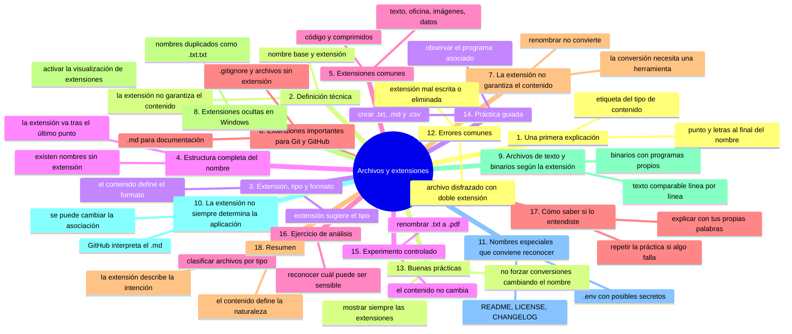
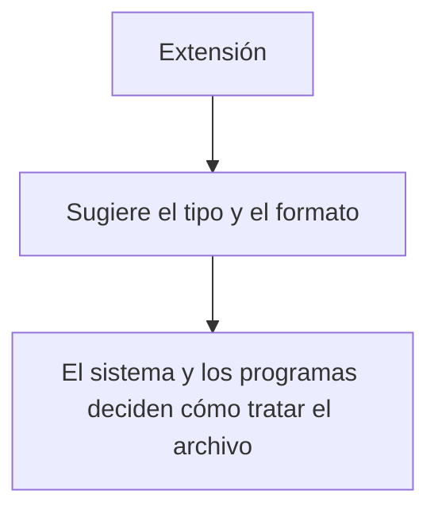
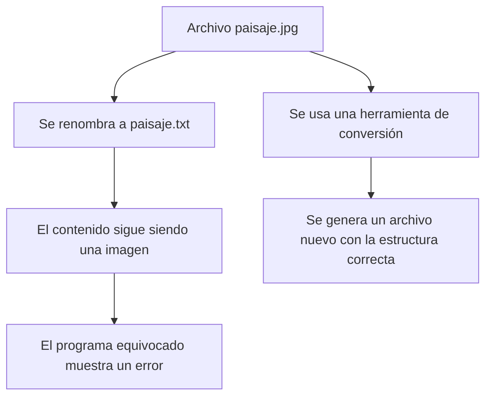

# Archivos y extensiones

## Introducción

En el capítulo 01 viste que un archivo puede tener un nombre, un contenido, un tipo y una ubicación.

También mencionamos que la parte final del nombre, como `.txt` o `.png`, suele llamarse **extensión**, y quedó pendiente estudiarla con detalle.

Ese es el tema de este capítulo.

Comprender las extensiones es importante por varias razones:

* ayudan a identificar el tipo de contenido;
* determinan qué programas pueden abrirlo;
* influyen en cómo Git compara los cambios;
* permiten reconocer archivos de configuración y archivos de datos;
* explican por qué cambiar el nombre de un archivo no cambia su contenido real.

En este capítulo aprenderás:

* qué es una extensión;
* qué relación existe entre extensión, tipo y formato;
* cuáles son las extensiones más comunes;
* cómo identificar un archivo por su nombre completo;
* por qué cambiar la extensión no convierte el archivo;
* qué extensiones son especialmente relevantes para Git y GitHub;
* qué errores son habituales cuando las extensiones están ocultas o mal escritas.

---

## Mapa conceptual



---

## 1. Una primera explicación

Observa estos nombres:

```text
notas.txt
fotografia.jpg
informe.pdf
datos.csv
programa.py
pagina.html
```

Cada uno termina con un punto seguido de unas letras.

Esa terminación es la **extensión**:

```text
notas.txt          →  .txt
fotografia.jpg     →  .jpg
informe.pdf        →  .pdf
datos.csv          →  .csv
programa.py        →  .py
pagina.html        →  .html
```

Puedes imaginarla como una etiqueta al final del nombre que indica qué clase de contenido contiene el archivo.

De forma parecida, en un archivador físico podrías tener etiquetas como «factura», «contrato» o «fotografía» para saber qué hay dentro sin abrir cada documento.

---

## 2. Definición técnica

Una **extensión** es una parte del nombre de un archivo que, por convención, indica su tipo o formato.

En la mayoría de los sistemas se escribe después de un punto:

```text
nombre.extension
```

Por ejemplo:

```text
informe.docx
│       │
│       └── extensión
└── nombre base
```

### Precisión importante

La extensión es solamente una parte del nombre.

El sistema operativo y las aplicaciones suelen utilizarla como una pista para decidir qué hacer con el archivo, pero **la extensión por sí sola no garantiza el contenido real**.

Un archivo llamado `fotografia.jpg` podría, en realidad, contener texto si alguien lo renombró incorrectamente.

Esta idea es fundamental y la desarrollaremos en la sección 7.

---

## 3. Extensión, tipo y formato

Estos tres términos se relacionan, pero no significan exactamente lo mismo.

### Extensión

Es la parte del nombre que suele indicar el tipo:

```text
.txt
.png
.pdf
```

### Tipo de archivo

Es la categoría general del contenido:

```text
texto
imagen
audio
video
datos
documento
```

### Formato

Es la manera concreta en que la información está organizada dentro del archivo.

Por ejemplo, dos archivos pueden ser imágenes, pero estar guardados en formatos diferentes:

```text
fotografia.png    →  imagen en formato PNG
fotografia.jpg    →  imagen en formato JPEG
```

Ambos son imágenes, pero su estructura interna es distinta.

### Relación general



La extensión es una convención. El contenido real es lo que determina el formato.

---

## 4. Estructura completa del nombre

Un nombre de archivo puede contener varios puntos.

Ejemplo:

```text
informe.ventas.2026.pdf
```

¿Cuál es la extensión?

La última parte después del último punto:

```text
informe.ventas.2026.pdf
                   └── extensión: .pdf
```

El resto se considera el nombre base:

```text
informe.ventas.2026
```

### Regla práctica

> La extensión suele ser la parte que aparece después del último punto.

Sin embargo, existen excepciones y convenciones especiales según el sistema y la herramienta. No es necesario memorizarlas todas.

### Nombres sin extensión

Algunos archivos no tienen extensión:

```text
LICENSE
README
Makefile
```

Esto no significa que estén dañados.

Muchos archivos de texto plano, archivos de configuración y documentos de proyectos se identifican por su nombre completo, sin extensión.

Git y GitHub utilizan varios archivos de este tipo. Por ejemplo, el archivo `LICENSE`, que indica las condiciones legales de uso de un proyecto, normalmente no lleva extensión.

### Nombres con varios puntos

```text
archivo.tar.gz
```

Aquí, `.gz` indica una compresión y `.tar` indica un formato de empaquetado. La combinación `.tar.gz` describe ambas operaciones.

```text
datos.csv.bak
```

Aquí, `.bak` suele indicar una copia de seguridad del archivo `datos.csv`.

Estas convenciones dependen de las herramientas utilizadas.

---

## 5. Extensiones comunes

A continuación encontrarás una referencia general. No necesitas memorizarla.

### Texto y documentación

| Extensión | Uso habitual |
|---|---|
| `.txt` | Texto plano sin formato |
| `.md` | Markdown, utilizado en documentación y en GitHub |
| `.rst` | reStructuredText, documentación técnica |
| `.pdf` | Documento portátil |

### Documentos de oficina

| Extensión | Uso habitual |
|---|---|
| `.docx` | Documento de texto |
| `.xlsx` | Hoja de cálculo |
| `.pptx` | Presentación |

### Imágenes

| Extensión | Uso habitual |
|---|---|
| `.png` | Imagen con soporte de transparencia |
| `.jpg` / `.jpeg` | Fotografía comprimida |
| `.gif` | Imagen animada o simple |
| `.svg` | Gráfico vectorial basado en texto |

### Audio y video

| Extensión | Uso habitual |
|---|---|
| `.mp3` | Audio comprimido |
| `.wav` | Audio sin compresión |
| `.mp4` | Video |
| `.mov` | Video |

### Datos

| Extensión | Uso habitual |
|---|---|
| `.csv` | Datos tabulares separados por comas |
| `.json` | Datos estructurados |
| `.xml` | Datos estructurados |
| `.yaml` / `.yml` | Datos estructurados y configuración |

### Código y web

| Extensión | Uso habitual |
|---|---|
| `.py` | Python |
| `.js` | JavaScript |
| `.ts` | TypeScript |
| `.html` | Página web |
| `.css` | Estilos de una página web |
| `.java` | Java |
| `.c` / `.cpp` | C y C++ |
| `.sh` | Script de shell |

### Configuración

| Extensión | Uso habitual |
|---|---|
| `.ini` | Configuración sencilla |
| `.toml` | Configuración estructurada |
| `.env` | Variables de entorno |
| `.gitignore` | Archivo especial de Git, sin extensión tradicional |

### Archivos comprimidos

| Extensión | Uso habitual |
|---|---|
| `.zip` | Archivo comprimido |
| `.rar` | Archivo comprimido |
| `.7z` | Archivo comprimido |
| `.tar` | Empaquetado |
| `.gz` | Compresión |

> **Observación:** la misma extensión puede tener usos ligeramente distintos según el ecosistema. Las tablas anteriores son una referencia general, no una regla absoluta.

---

## 6. Extensiones importantes para Git y GitHub

Algunas extensiones aparecerán constantemente durante este curso.

### `.md` — Markdown

Es el formato utilizado para la documentación de la mayoría de los repositorios.

Ejemplos:

```text
README.md
CONTRIBUTING.md
GLOSARIO.md
CHANGELOG.md
```

GitHub muestra estos archivos con formato en lugar de mostrarlos como texto sin procesar.

Este mismo repositorio está escrito en Markdown.

### `.txt` — Texto plano

Aparece en notas, listas y archivos auxiliares.

### `.json`, `.yaml` y `.yml` — Configuración y datos

Son formatos estructurados muy utilizados en herramientas, automatización y CI/CD.

Por ejemplo, los archivos de GitHub Actions utilizan `.yml` o `.yaml`.

### `.sh` — Scripts de shell

Aparecen en automatización y tareas de línea de comandos.

### `.py`, `.js`, `.ts`, `.html`, `.css` y otros

Son formatos de código que encontrarás en proyectos reales.

### `.gitignore`

No es exactamente una extensión, sino un archivo con un nombre especial que estudiaremos más adelante.

Indica a Git qué archivos o carpetas debe ignorar.

### Archivos sin extensión relevantes

```text
LICENSE
CODEOWNERS
Dockerfile
Makefile
```

Estos nombres son convenciones reconocidas por sus herramientas correspondientes.

---

## 7. La extensión no garantiza el contenido

Este es uno de los conceptos más importantes del capítulo.

Supongamos que tienes una fotografía llamada:

```text
paisaje.jpg
```

Si la renombras como:

```text
paisaje.txt
```

el archivo **no** se convierte en texto.

Lo único que cambió fue el nombre.

### ¿Qué ocurre internamente?

```text
Contenido real:  datos de imagen
Nombre anterior: paisaje.jpg
Nombre nuevo:    paisaje.txt
```

El contenido sigue siendo el mismo. Solo se modificó la etiqueta del nombre.

Como consecuencia, el sistema o los programas podrían intentar abrir el archivo con la herramienta equivocada y mostrar un error o contenido incomprensible.

### Consecuencia práctica

> Cambiar la extensión no convierte el archivo. Para convertir un formato realmente se necesita una herramienta que lea el contenido original y lo transforme al nuevo formato.

Ejemplos de conversión real:

* exportar un documento a PDF desde un procesador de texto;
* convertir una imagen de PNG a JPG con un editor de imágenes;
* convertir un archivo de audio de WAV a MP3 con un programa especializado.

En todos estos casos, el programa **reinterpreta el contenido** y genera un archivo nuevo con la estructura correcta.



---

## 8. Extensiones ocultas en Windows

Windows tiene una característica que puede provocar confusión: por defecto, en muchos casos **oculta las extensiones conocidas** en el explorador de archivos.

Esto significa que un archivo llamado realmente:

```text
notas.txt
```

puede mostrarse como:

```text
notas
```

### ¿Por qué es un problema?

Supongamos que quieres crear un archivo llamado `informe.txt`.

Si las extensiones están ocultas y escribes:

```text
informe.txt
```

Windows podría guardarlo como:

```text
informe.txt.txt
```

porque añade automáticamente la extensión conocida de la aplicación que estás usando.

El nombre visible podría ser `informe.txt`, pero el nombre real es `informe.txt.txt`.

### Recomendación

Activa la visualización de extensiones en el explorador de archivos.

Así verás siempre el nombre completo y podrás:

* detectar extensiones duplicadas;
* comprobar el tipo real del archivo;
* evitar errores al crear archivos con nombres específicos;
* reconocer archivos como `.gitignore` o `.env`.

Este detalle será importante cuando crees archivos de configuración para Git, porque algunos nombres deben ser exactos.

---

## 9. Archivos de texto y binarios según la extensión

En el capítulo 01 explicamos la diferencia general entre archivos de texto y binarios.

Ahora podemos relacionarla con las extensiones.

### Extensiones que suelen indicar archivos de texto

```text
.txt
.md
.csv
.json
.xml
.yaml
.yml
.html
.css
.js
.py
```

Estos archivos pueden abrirse con un editor de texto y sus cambios suelen compararse línea por línea.

### Extensiones que suelen indicar archivos binarios

```text
.jpg
.png
.gif
.mp3
.mp4
.pdf
.docx
.xlsx
.zip
.exe
```

Estos formatos requieren programas específicos para interpretarse correctamente.

### ¿Por qué importa para Git?

Git puede controlar ambos tipos, pero:

* en archivos de texto muestra diferencias comprensibles;
* en archivos binarios normalmente indica que el archivo cambió, sin mostrar el detalle;
* los archivos binarios grandes pueden aumentar el tamaño del repositorio rápidamente.

Esta diferencia influirá en decisiones prácticas, como qué archivos conviene versionar y cuáles deberían excluirse.

> **Precisión:** algunas extensiones habituales pueden sorprender. Un `.docx` o un `.xlsx` contienen, en realidad, estructuras comprimidas con varios componentes internos. Aunque se relacionan con documentos, no son texto plano en el sentido estricto.

---

## 10. La extensión no siempre determina la aplicación

En la práctica, la mayoría de los sistemas operativos asocian extensiones con programas.

Por ejemplo:

```text
.pdf   →  lector de PDF
.jpg   →  visor de imágenes
.txt   →  editor de texto
```

Sin embargo:

* puedes cambiar esa asociación;
* un programa puede abrir varios formatos;
* un mismo formato puede abrirse con distintos programas;
* un archivo sin extensión puede abrirse correctamente si eliges el programa adecuado.

### El caso de `.md`

Un archivo `.md` es texto plano.

Puede abrirse con:

* un editor de texto común;
* un editor especializado en Markdown;
* GitHub, que lo muestra con formato.

Que GitHub lo muestre con títulos, listas y tablas no significa que el archivo contenga ese formato visual. El archivo contiene texto y símbolos Markdown, y GitHub los interpreta al mostrarlos.

---

## 11. Nombres especiales que conviene reconocer

Algunos nombres son convenciones importantes en proyectos y repositorios.

| Nombre | Función |
|---|---|
| `README.md` | Presentación del proyecto |
| `LICENSE` | Condiciones legales de uso |
| `CHANGELOG.md` | Historial de versiones |
| `CONTRIBUTING.md` | Guía para contribuir |
| `CODE_OF_CONDUCT.md` | Normas de convivencia |
| `CODEOWNERS` | Responsables de revisar cambios |
| `.gitignore` | Archivos que Git debe ignorar |
| `.gitattributes` | Reglas sobre cómo Git trata ciertos archivos |
| `.env` | Variables de entorno, potencialmente sensibles |

No necesitas comprenderlos todos ahora.

Lo importante es reconocer que estos nombres no son arbitrarios: cumplen una función y su escritura exacta importa.

> **Atención:** `README.md` y `readme.md` pueden comportarse de manera diferente según el sistema. Mantén la convención oficial del proyecto.

---

## 12. Errores comunes

### Error 1: creer que cambiar la extensión convierte el archivo

Ya lo explicamos: solo cambia el nombre. La conversión real requiere una herramienta adecuada.

### Error 2: no ver las extensiones y crear nombres duplicados

```text
informe.txt.txt
foto.jpg.jpg
```

Activa la visualización de extensiones para evitarlo.

### Error 3: escribir mal la extensión

```text
programa.pyy
datos.csvv
pagina.htlm
```

El sistema puede no reconocer el archivo o abrirlo con el programa equivocado.

### Error 4: usar mayúsculas de forma inconsistente

```text
foto.JPG
foto.jpg
```

En muchos casos se tratan igual, pero en otros pueden generar confusión, especialmente al compartir proyectos entre sistemas.

### Error 5: eliminar la extensión

```text
programa
```

Puede seguir siendo un archivo válido, pero el sistema ya no sabrá con qué programa abrirlo de forma predeterminada.

### Error 6: confundir un archivo comprimido con una carpeta

```text
proyecto.zip
```

Es un archivo. Debes extraerlo para ver su contenido.

### Error 7: incluir credenciales en archivos con extensiones de configuración

```text
.env
config.json
credenciales.yaml
```

Estos archivos pueden contener información sensible. Nunca deben publicarse sin revisión.

> **Recordatorio de seguridad:** en este curso utilizaremos siempre valores ficticios, como `API_KEY=TU_API_KEY_AQUI` o `TOKEN=[REDACTADO]`.

### Error 8: asumir que una extensión conocida garantiza contenido seguro

Un archivo puede estar maliciosamente renombrado.

```text
documento.pdf.exe
```

La extensión final es `.exe`. Este tipo de manipulación se utiliza para engañar a las personas.

La seguridad informática se estudiará con más detalle en módulos posteriores. Por ahora, la recomendación es tratar con cautela archivos de origen desconocido.

---

## 13. Buenas prácticas

* Activa la visualización de extensiones en tu sistema.
* Utiliza la extensión correcta según el contenido real.
* Evita duplicar extensiones.
* Mantén un criterio consistente con mayúsculas y minúsculas.
* No cambies extensiones para «forzar» una conversión.
* No publiques archivos de configuración que puedan contener secretos.
* Reconoce las convenciones importantes del proyecto, como `README.md` o `.gitignore`.
* Antes de abrir un archivo desconocido, revisa su nombre completo y su origen.

---

## 14. Práctica guiada

En esta práctica crearás archivos con extensiones diferentes y comprobarás cómo se comportan. No necesitas utilizar comandos.

### Objetivo

Identificar la extensión de distintos archivos y observar cómo el sistema elige un programa según el tipo.

### Paso 1: activa la visualización de extensiones

Si utilizas Windows, activa la opción para mostrar extensiones de archivos conocidos.

En otros sistemas, verifica que puedes ver los nombres completos.

### Paso 2: crea una carpeta de práctica

Crea una carpeta llamada:

```text
practica-extensiones
```

### Paso 3: crea tres archivos de texto

Utiliza un editor de texto para crear:

```text
notas.txt
lista.md
datos.csv
```

Contenido sugerido:

```text
notas.txt:
Esta es una nota de práctica.

lista.md:
# Lista de práctica
- Elemento uno
- Elemento dos

datos.csv:
nombre,edad
Ana,30
Luis,25
```

### Paso 4: observa las extensiones

Comprueba que cada archivo termina con la extensión correcta y que no se duplicó.

### Paso 5: abre cada archivo

Observa qué programa utiliza tu sistema para abrirlos.

### Resultado esperado

Deberías ver tres archivos con extensiones diferentes, cada uno con su contenido correspondiente.

### Ejercicio de transferencia

En la carpeta `practica-extensiones` (o en una nueva llamada `practica-transferencia-04`) crea un archivo `correo.txt` con dos líneas de texto y activa la visualización de extensiones si no la tenías. Copia el archivo como `correo.pdf` e intenta abrirlo con un lector de PDF. Entrega el archivo `correo.pdf` y una explicación escrita de tres líneas: qué ocurrió al abrirlo, qué contenía realmente y qué haría falta para obtener un PDF de verdad.

---

## 15. Experimento controlado

Este experimento te permitirá comprobar que cambiar la extensión no convierte el archivo.

> **Advertencia:** trabaja únicamente con los archivos de práctica creados en este capítulo. No experimentes con archivos importantes.

### Pasos

1. Dentro de `practica-extensiones`, copia `notas.txt` como `notas-copia.txt`.
2. Renombra la copia como `notas-copia.pdf`.
3. Intenta abrir `notas-copia.pdf` con un lector de PDF.
4. Observa qué ocurre.
5. Renómbrala de nuevo como `notas-copia.txt` y ábrela con un editor de texto.

### Preguntas

* ¿El contenido cambió al renombrar el archivo?
* ¿Por qué el lector de PDF no pudo interpretarlo correctamente?
* ¿Qué diferencia existe entre cambiar el nombre y convertir el formato?
* ¿Qué necesitarías para obtener un PDF real a partir del texto?

### Conclusión esperada

El archivo siempre contuvo texto plano. El cambio de extensión solo modificó la etiqueta del nombre, no la estructura del contenido.

---

## 16. Ejercicio de análisis

Observa estos nombres:

```text
informe.pdf
informe.docx
informe.txt
informe.md
foto.jpg
foto.png
foto.svg
datos.csv
datos.json
datos.yaml
programa.py
pagina.html
estilos.css
script.sh
config.toml
.env
```

Responde:

1. ¿Qué archivos probablemente contienen texto plano?
2. ¿Qué archivos probablemente contienen datos estructurados?
3. ¿Qué archivos podrían contener información sensible?
4. ¿Qué archivos están relacionados con documentación de repositorios?
5. ¿Qué archivos son imágenes, y en qué se diferencian sus formatos?
6. ¿Cuál de estos nombres no sigue el patrón habitual de extensión?

---

## 17. Cómo saber si lo entendiste

Deberías poder explicar con tus propias palabras:

* qué es una extensión;
* qué diferencia existe entre extensión, tipo y formato;
* qué representa la parte del nombre antes del último punto;
* por qué cambiar la extensión no convierte el archivo;
* por qué Windows puede ocultar las extensiones y qué problema genera;
* qué extensiones suelen indicar archivos de texto;
* qué extensiones suelen indicar archivos binarios;
* por qué `.md` es importante en GitHub;
* por qué `.env` requiere precaución especial.

Si alguna respuesta todavía no está clara, vuelve a la sección correspondiente y repite la práctica.

---

## 18. Resumen

En este capítulo aprendiste que:

* la extensión es la parte del nombre que, por convención, indica el tipo o formato del archivo;
* extensión, tipo y formato son conceptos relacionados pero diferentes;
* la extensión suele ser la parte posterior al último punto, aunque existen convenciones especiales;
* muchos archivos relevantes no tienen extensión, como `LICENSE`;
* cambiar la extensión no convierte el contenido;
* Windows puede ocultar las extensiones y provocar nombres duplicados;
* los archivos de texto y los binarios presentan diferencias importantes para Git;
* extensiones como `.md`, `.json`, `.yml`, `.py` y `.sh` aparecerán constantemente en proyectos y repositorios;
* `.env` y otros archivos de configuración pueden contener secretos y no deben publicarse sin revisión;
* algunos nombres especiales, como `README.md` o `.gitignore`, cumplen funciones concretas y su escritura exacta importa.

La idea principal es:

> **La extensión describe la intención del archivo, pero el contenido real es lo que define su verdadera naturaleza.**

---

## Autopreguntas de cierre

Sin mirar el material, responde mentalmente y luego compruébalo con este capítulo:

1. Renombras `notas.txt` como `notas.pdf`: ¿puede abrirse ya como PDF? ¿Qué sigue conteniendo el archivo y qué se modificó?
2. ¿Por qué Windows oculta extensiones por defecto y qué errores concretos provoca, como el caso de `informe.txt.txt`?
3. Un archivo se llama `documento.pdf.exe`: ¿cuál es su extensión real y por qué es una trampa frecuente?
4. GitHub muestra tu `README.md` con títulos y tablas: ¿guarda el archivo ese formato visual o solo texto con símbolos?
5. ¿Por qué un archivo `.env` no debería subirse a un repositorio público aunque su nombre parezca inocente?
6. Archivos como `LICENSE` o `Makefile` no tienen extensión: ¿están dañados y cómo los identifica Git?
7. Quieres convertir un `.txt` en un PDF real: ¿qué debes hacer y quién reescribe el contenido del archivo?
8. Si la extensión y el contenido real no coinciden, ¿qué decide realmente cómo se comporta el archivo?

---

## Próximo paso

Ya sabes qué es un archivo, qué es una carpeta, cómo se expresa su ubicación y cómo se identifican por su extensión.

El siguiente paso es aprender a realizar operaciones sobre ellos: copiar, mover, renombrar y eliminar.

Continúa con:

[`05-copiar-mover-y-eliminar.md`](05-copiar-mover-y-eliminar.md)
