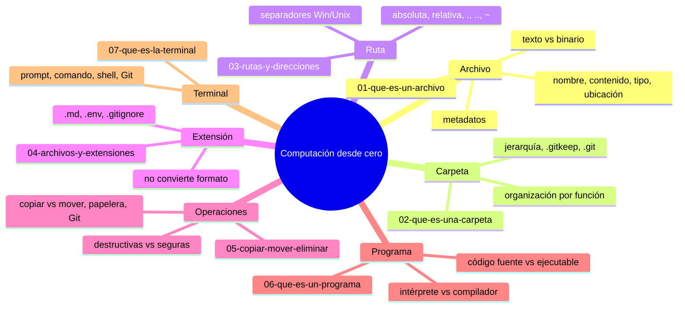

# 01 — Computación desde cero

## Los 6 conceptos que Git usa

Git no opera en el vacío. Trabaja con **archivos** dentro de **carpetas** ubicadas mediante **rutas**, identificados por su **extensión**, creados por **programas** y manipulados desde la **terminal**.

Este capítulo cubre **solo** esos seis conceptos. La orientación general, metodología, ruta completa y filosofía están en [`00-orientacion/`](../00-orientacion/).

---

## Mapa conceptual



---

## Qué cubre cada subcapítulo

| Cap | Concepto | Qué aprenderás (competencia) | Práctica guiada | Error controlado | Conexión con Git |
|-----|----------|------------------------------|-----------------|------------------|------------------|
| 01 | Archivo | Distinguir nombre, contenido, tipo, ubicación; explicar por qué `guardar ≠ commit` | Crear/modificar/guardar `mi-primer-archivo.txt` y copia | Cambiar extensión `.txt` → `.pdf` y ver que no convierte | Git detecta cambios en contenido, no en nombre |
| 02 | Carpeta | Organizar en jerarquía; explicar por qué Git no registra carpetas vacías | Crear `practica-carpetas/{documentos,imagenes,datos}` + archivo | Crear dos `notas.txt` en carpetas distintas y ver que no chocan | `.git/` es una carpeta; `.gitkeep` conserva vacías |
| 03 | Ruta | Leer/escritura rutas absolutas y relativas; usar `.` `..` `~` | Identificar ruta absoluta de `notas.txt` y relativa desde raíz | Mezclar separadores `\` y `/`; ruta absoluta al compartir | `git add docs/notas.txt` usa ruta relativa |
| 04 | Extensión | Reconocer `.md`, `.env`, `.gitignore`, `.yml`; activar visibilidad en Windows | Crear `notas.txt`, `lista.md`, `datos.csv` y ver programas asociados | Renombrar `notas.txt` → `notas.pdf` y fallar al abrir | `.gitignore` sin extensión; `.env` sensible |
| 05 | Operaciones | Diferenciar copiar/mover/renombrar/eliminar; papelera ≠ backup | Copiar → modificar copia → verificar original intacto | Eliminar carpeta con contenido; recuperar de papelera | `git mv` = mover + staging; `git rm` = eliminar + staging |
| 06 | Programa | Distinguir código fuente vs ejecutable; intérprete vs compilador | Comparar `datos.txt` (datos) vs `saludo.py` (instrucciones) | Renombrar `saludo.py` → `saludo.txt` y ver que Python no lo ejecuta | Git versiona código fuente; ignora ejecutables |
| 07 | Terminal | Identificar prompt, carpeta actual; ejecutar comando de consulta | Abrir terminal → `dir`/`ls` → leer prompt → `cd` a carpeta práctica | Escribir comando inexistente `holamundo` y leer error | `git status` se ejecuta en terminal; prompt muestra rama |

---

## Progresión de profundidad (currículo en espiral)

```
Capa 1 (01-02):  Reconocer — "¿Qué es un archivo/carpeta?"
Capa 2 (03-04):  Comprender — "¿Cómo se localiza e identifica?"
Capa 3 (05):     Aplicar — "¿Cómo lo modifico sin perder info?"
Capa 4 (06):     Conectar — "¿Qué programa lo crea/usa?"
Capa 5 (07):     Operar — "¿Cómo le doy órdenes a Git?"
```

Cada capa añade una dimensión: **concepto → ubicación → manipulación → origen → interfaz**.

---

## Checkpoint C0 — Comprobación obligatoria

Antes de avanzar a `02-github-desde-cero/`, demuestra que puedes:

1. **Navegar** en terminal a una carpeta de práctica
2. **Crear** un archivo `demo.txt` con contenido
3. **Listar** archivos (`dir` / `ls`) y verlo
4. **Renombrarlo** a `demo.md` desde el explorador
5. **Volver a listar** en terminal y confirmar el cambio
6. **Explicar** en una frase: "¿Qué cambió realmente, el contenido o solo el nombre?"

Si puedes hacerlo **sin mirar instrucciones**, el checkpoint está cerrado.

---

## Referencias rápidas

| Concepto | Capítulo | Documentación oficial |
|----------|----------|----------------------|
| Sistema de archivos (Windows) | 01, 02, 03 | learn.microsoft.com/windows/win32/fileio/file-systems |
| Sistema de archivos (Linux) | 01, 02, 03 | kernel.org/doc/Documentation/filesystems/ |
| Extensiones MIME | 04 | iana.org/assignments/media-types/ |
| Terminal/PowerShell | 07 | learn.microsoft.com/powershell/ |
| Bash | 07 | gnu.org/software/bash/manual/ |

---

## Autopreguntas de cierre

Sin mirar el material, responde mentalmente y luego compruébalo con los capítulos 01-07:

1. ¿Qué diferencia hay entre un archivo y una carpeta y puede una carpeta contener carpetas?
2. Al mover un archivo de carpeta, ¿qué se puede romper y por qué?
3. ¿Qué tiene de frágil el nombre `Informe_FINAL_ahora_si.docx` y qué propone Git en su lugar?
4. ¿Qué te da un repositorio que no te da «guardar con otro nombre»?
5. ¿Por qué `git add docs/notas.txt` usa ruta relativa y no absoluta?
6. ¿Qué ocurre si renombras `script.py` a `script.txt` e intentas ejecutarlo con Python?
7. ¿Qué información muestra el prompt de la terminal y por qué importa antes de un `git commit`?

---

## Próximo paso

Has completado la base computacional. Ahora entraremos a GitHub.

Continúa con:

[`../02-github-desde-cero/README.md`](../02-github-desde-cero/README.md)