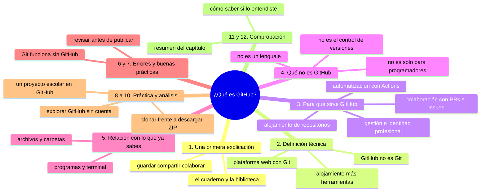
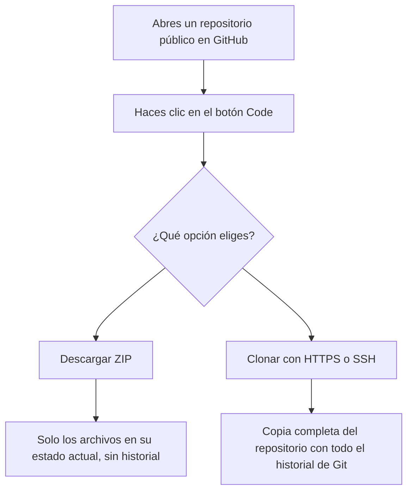

# ¿Qué es GitHub?

## Introducción

En el capítulo anterior aprendiste qué es un programa y qué es la terminal.

También viste que Git es un programa que se ejecuta desde la terminal para gestionar versiones de archivos.

Ahora es el momento de conocer **GitHub**, que es mucho más que un simple alojamiento para repositorios Git.

GitHub es una plataforma que utiliza Git como su sistema de control de versiones subyacente, pero añade muchas funcionalidades que facilitan la colaboración, el desarrollo y la gestión de proyectos.

En este capítulo aprenderás:

* qué es GitHub;
* para qué sirve;
* cómo se diferencia de Git;
* qué tipo de servicios ofrece;
* por qué es tan popular entre desarrolladores y equipos de trabajo;
* cómo se relaciona con lo que ya sabes sobre archivos, programas y terminal.

No necesitas utilizar la terminal en este capítulo. Nos enfocaremos en comprender el concepto a un nivel conceptual y visual.

---

## Mapa conceptual de este capítulo



---

## 1. Una primera explicación

Imagina que tienes un cuaderno de trabajo donde anotas tus ideas, dibujos y cálculos.

Este cuaderno es tuyo y lo puedes usar cuando quieras, pero está limitado a tu escritorio.

Ahora imagina que existe una biblioteca pública donde:

* puedes guardar una copia de tu cuaderno;
* otras personas pueden verlo y comentarlo;
* puedes trabajar en el mismo cuaderno con tus compañeros al mismo tiempo;
* se guarda un historial completo de todos los cambios que se han hecho;
* tienes herramientas para organizar tu trabajo y compartirlo con otros.

GitHub funciona de manera similar, pero para proyectos digitales en lugar de cuadernos de papel.

Es un lugar en internet donde puedes guardar tu trabajo, compartirlo con otros y colaborar de manera eficiente.

---

## 2. Definición técnica

**GitHub** es una plataforma web que proporciona alojamiento para repositorios Git y herramientas adicionales para la colaboración, el desarrollo y la gestión de proyectos.

Utiliza el sistema de control de versiones Git como su tecnología subyacente, pero agrega capas de funcionalidad que hacen más fácil trabajar en equipo y gestionar el ciclo de vida del software.

Puedes pensar en GitHub como:

```text
GitHub
    │
    ├── Alojamiento de repositorios Git (la base)
    │
    ├── Herramientas de colaboración (Pull Requests, Issues, etc.)
    │
    ├── Funcionalidades de desarrollo (Projects, Actions, etc.)
    │
    └── Servicios de seguridad y gestión (Permisos, seguridad de código, etc.)
```

### GitHub no es Git

Esta distinción es fundamental y la mantendremos durante todo el curso:

```text
Git
    │
    └── Sistema distribuido de control de versiones
        (encargado de registrar cambios y gestionar historial)

GitHub
    │
    └── Plataforma que utiliza Git y agrega servicios de
        colaboración, desarrollo y gestión
```

Git puede funcionar completamente sin GitHub (de hecho, lo hace en muchos entornos). GitHub, por otro lado, depende de Git para su funcionamiento principal.

---

## 3. ¿Para qué sirve GitHub?

GitHub sirve para muchos propósitos diferentes, dependiendo de quién lo utilice y para qué proyecto.

### 3.1. Alojamiento de repositorios

La función más básica de GitHub es proporcionar un lugar en internet donde puedes guardar tus repositorios Git.

Esto significa que:

* tu código no está limitado a una sola computadora;
* puedes acceder a tu repositorio desde cualquier dispositivo con conexión a internet;
* tienes una copia de seguridad remota de tu trabajo;
* puedes compartir tu trabajo con otras personas fácilmente.

### 3.2. Facilitar la colaboración

GitHub hace que trabajar en equipo sea mucho más sencillo mediante:

* **Pull Requests**: forma estructurada de proponer y revisar cambios;
* **Issues**: sistema para seguir tareas, errores y mejoras;
* **Discussions**: espacios para conversaciones abiertas sobre el proyecto;
* **Revisión de código**: herramientas para comentar y aprobar cambios antes de integrarlos.

### 3.3. Automatización de tareas

Con **GitHub Actions**, puedes automatizar flujos de trabajo como:

* ejecutar pruebas cada vez que se hace un commit;
* construir y desplegar aplicaciones automáticamente;
* enviar notificaciones cuando ocurren ciertos eventos;
* realizar verificaciones de seguridad y calidad de código.

### 3.4. Gestión de proyectos

GitHub incluye herramientas para organizar y seguir el progreso de tu trabajo:

* **Projects**: tableros tipo Kanban para planificar y seguir tareas;
* **Milestones**: objetivos agrupados por fecha o lanzamiento;
* **Labels**: etiquetas para categorizar y filtrar información;
* **Wikis**: documentación adicional para tu proyecto.

### 3.5. Construir una identidad profesional

Tu perfil en GitHub puede convertirse en una parte importante de tu historial profesional:

* muestra tus proyectos y contribuciones;
* permite a otros ver tu trabajo y tu estilo de codificación;
* facilita el descubrimiento por parte de reclutadores y colaboradores;
* sirve como portafolio de tus habilidades y experiencia.

---

## 4. Qué no es GitHub

Para evitar confusiones, es importante aclarar qué GitHub **no** es:

### 4.1. No es un sistema de control de versiones por sí mismo

GitHub utiliza Git para el control de versiones, pero no lo reemplaza. Si GitHub desapareciera mañana, tus repositorios locales seguirían funcionando normalmente con Git.

### 4.2. No es un lenguaje de programación

GitHub no te enseña a programar ni proporciona un lenguaje para escribir código. Es una plataforma que aloja y gestiona el código que otros escriben.

### 4.3. No es exclusivamente para programadores

Aunque es muy popular entre desarrolladores, GitHub puede utilizarse para cualquier tipo de proyecto que se beneficie del control de versiones y la colaboración: documentos, libros, sitios web, datos, presentaciones, etc.

### 4.4. No es un servicio de alojamiento web tradicional

Aunque puedes alojar sitios web estáticos mediante GitHub Pages, su función principal no es ser un servidor web general purpose.

---

## 5. Cómo se relaciona con lo que ya sabes

Vamos a conectar GitHub con los conceptos que ya hemos estudiado:

### 5.1. Con archivos y carpetas

GitHub aloja repositorios, que a su vez contienen archivos y carpetas organizados en una estructura de proyecto.

```text
Tu repositorio en GitHub
    │
    ├── README.md
    ├── documentos/
    │   └── informe.txt
    ├── imagenes/
    │   └── diagrama.png
    └── codigo/
        └── programa.py
```

### 5.2. Con programas

Si eres programador, GitHub es particularmente útil porque:

* permite guardar y compartir tu código fuente;
* facilita la colaboración en el desarrollo de software;
* integra herramientas de pruebas y despliegue;
* es utilizado por millones de desarrolladores en todo el mundo.

### 5.3. Con la terminal

Aunque en este capítulo no utilizamos la terminal, más adelante verás que:

* puedes interactuar con GitHub desde la terminal usando comandos de Git;
* existen herramientas que conectan tu entorno local con GitHub;
* la combinación de terminal + GitHub es estándar en el desarrollo profesional.

---

## 6. Errores comunes

### Error 1: pensar que GitHub es necesario para usar Git

Git funciona perfectamente sin GitHub. Muchos desarrolladores utilizan Git localmente o con otros servidores.

### Error 2: confiar únicamente en GitHub como copia de seguridad

Aunque GitHub proporciona una copia remota, sigue siendo importante tener buenas prácticas de copia de seguridad y no depender exclusivamente de un solo servicio.

### Error 3: creer que todos los repositorios en GitHub son públicos

GitHub permite crear repositorios privados que solo tú o las personas que autorices pueden ver.

### Error 4: pensar que GitHub es solo para código

Aunque es muy popular para código fuente, GitHub puede alojar cualquier tipo de archivo que se beneficie del control de versiones.

### Error 5: asumir que necesitas ser experto en terminal para usar GitHub

Puedes comenzar a utilizar GitHub completamente desde su interfaz web, sin necesidad de tocar la terminal.

---

## 7. Buenas prácticas

* Comprende la diferencia entre Git y GitHub antes de continuar;
* Utiliza GitHub para proyectos que se beneficien de la colaboración y el control de versiones;
* Explora la interfaz web antes de adentrarte en la terminal;
* No publiques información sensible sin revisarla primero;
* Aprovecha las herramientas de organización como Projects y Issues;
* Recuerda que tu actividad en GitHub puede formar parte de tu historial profesional.

---

## 8. Práctica guiada

En esta práctica explorarás la interfaz de GitHub sin necesidad de crear una cuenta todavía.

### Objetivo

Familiarizarte con la apariencia general de GitHub y comprender qué tipo de información encontrarás.

### Paso 1: visita la página principal de GitHub

Abre tu navegador web y ve a:

```text
https://github.com
```

### Paso 2: observa la página principal

Tómate un momento para observar qué ves en la página. Busca elementos como:

* el logotipo de GitHub;
* campos para iniciar sesión o crear una cuenta;
* información sobre qué es GitHub;
* ejemplos de proyectos populares;
* secciones que explican sus características principales.

### Paso 3: explora un repositorio público

GitHub permite explorar repositorios públicos sin necesidad de tener una cuenta.

Busca en la página principal un enlace como "Explore GitHub" o "Trending repositories" y haz clic en él.

Selecciona cualquier repositorio que llame tu atención y observa:

* el nombre del repositorio y su descripción;
* los archivos y carpetas que contiene;
* el archivo README si tiene uno;
* el lenguaje de programación predominante (si lo muestra);
* los botones para "Star" y "Fork".

### Resultado esperado

Deberías poder identificar:

* que GitHub es una plataforma web con interfaz gráfica;
* que contiene repositorios públicos que cualquiera puede ver;
* que cada repositorio tiene una estructura de archivos y carpetas;
* que hay información adicional como descripciones, lenguajes y estadísticas.

---

## 9. Experimento controlado

Este experimento te ayudará a comprender la diferencia entre ver un repositorio en GitHub y tenerlo en tu computadora local.

### Pasos

1. En la página de un repositorio público que hayas elegido, busca el botón llamado "Code".
2. Haz clic en él y observa las opciones que aparecen:
   * Descargar ZIP
   * Clonar con HTTPS
   * Clonar con SSH
   * Abrir con GitHub Desktop
3. No necesitas descargar nada todavía; solo observa qué opciones están disponibles.

Lo que acabas de ver se resume así:



### Preguntas

* ¿Qué significa "clonar" un repositorio?
* ¿Por qué existen diferentes métodos para clonar (HTTPS, SSH, GitHub Desktop)?
* ¿Qué obtienes al descargar un ZIP frente a clonar un repositorio?
* ¿Cómo se relaciona esto con lo que ya sabes sobre copias y versiones?

### Conclusión esperada

Clonar obtiene una copia completa del repositorio con su historial de Git, mientras que descargar un ZIP solo obtiene los archivos en su estado actual, sin el historial de Git.

---

### Ejercicio de transferencia

Sin crear cuenta y sin instalar nada: abre github.com, busca un repositorio público sobre cualquier tema que te interese y completa una ficha de cinco líneas.

Entregable: nombre del repositorio, tres archivos o carpetas que contiene, qué problema resuelve el proyecto, qué botón usa para obtener una copia y una frase explícita que compare «clonar» con «descargar ZIP».

---

## 10. Ejercicio de análisis

Observa esta situación:

Imagina que tienes un proyecto escolar que consiste en:

* un documento de texto con tu investigación;
* una hoja de cálculo con tus datos;
* una presentación para exponer tus resultados;
* algunas imágenes que utilizaste en tu presentación.

Responde:

1. ¿Cómo podrías utilizar GitHub para gestionar este proyecto?
2. ¿Qué beneficios obtendrías al utilizar GitHub en comparación con guardar todo en una carpeta de tu computadora?
3. ¿Qué funcionalidades de GitHub serían particularmente útiles para este tipo de proyecto?
4. ¿Qué precauciones deberías tomar al compartir tu proyecto en GitHub?

---

## 11. Cómo saber si lo entendiste

Deberías poder explicar con tus propias palabras:

* qué es GitHub;
* para qué sirve;
* qué diferencia existe entre Git y GitHub;
* qué es un repositorio y qué tipos existen;
* cuáles son las principales funcionalidades que ofrece GitHub para la colaboración;
* cómo se relaciona GitHub con los archivos, los programas y la terminal que ya estudiaste;
* por qué es útil tener una copia remota de tu trabajo;
* qué precauciones debes tomar al compartir información en GitHub.

Si alguna respuesta todavía no está clara, vuelve a la sección correspondiente y repite la práctica.

---

## 12. Resumen

En este capítulo aprendiste que:

* GitHub es una plataforma web que proporciona alojamiento para repositorios Git y herramientas adicionales para colaboración, desarrollo y gestión;
* Git y GitHub son diferentes: Git es el sistema de control de versiones, GitHub es la plataforma que lo utiliza y le agrega funcionalidades;
* GitHub sirve para alojar repositorios, facilitar la colaboración, automatizar tareas, gestionar proyectos y construir una identidad profesional;
* GitHub aloja repositorios que contienen archivos y carpetas organizados en una estructura de proyecto;
* GitHub no es necesario para usar Git, pero complementa su funcionamiento;
* GitHub puede utilizarse para cualquier tipo de proyecto, no solo para código;
* es posible comenzar a utilizar GitHub completamente desde su interfaz web sin tocar la terminal.

La idea principal es:

> **GitHub es una plataforma que mejora la forma en que trabajamos con Git al añadir herramientas para colaboración, desarrollo y gestión, pero sin reemplazar el sistema de control de versiones subyacente.**

---

## Autopreguntas de cierre

Sin mirar el material, responde mentalmente y luego compruébalo con este capítulo:

1. ¿Por qué GitHub necesita a Git para funcionar y Git no necesita a GitHub?
2. Si mañana GitHub desapareciera, ¿qué seguirías pudiendo hacer con tus proyectos y qué perderías?
3. ¿Qué ganas al proponer cambios con un Pull Request frente a enviar archivos por correo electrónico?
4. ¿Cuándo tiene sentido usar GitHub para un proyecto que no es de programación?
5. ¿Por qué confiar solo en GitHub como copia de seguridad es un error?
6. ¿Qué diferencia práctica hay entre clonar un repositorio y descargar su ZIP?

---

## Próximo paso

Ya sabes qué es GitHub y para qué sirve.

El siguiente paso es comprender con más detalle qué es un repositorio y qué tipos existen.

Continúa con:

[`02-para-que-sirve-github.md`](02-para-que-sirve-github.md)
