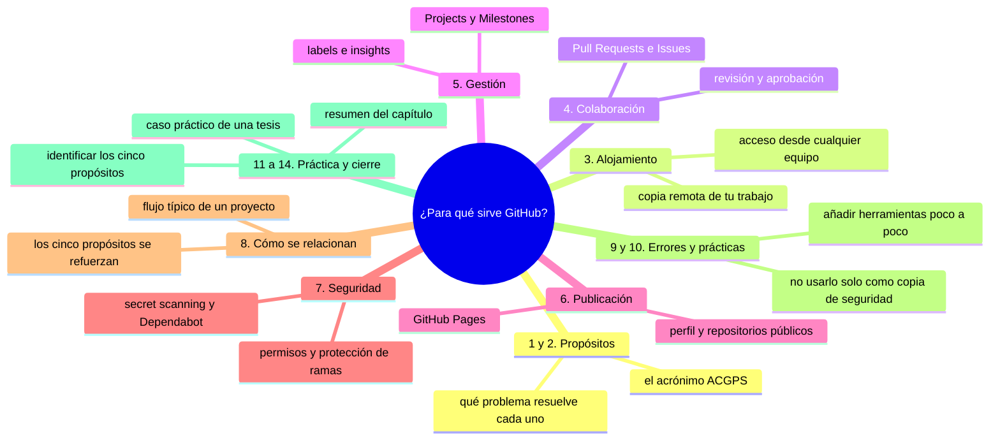
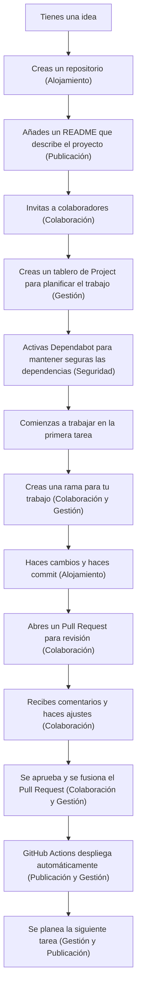

# ¿Para qué sirve GitHub?

## Introducción

En el capítulo anterior aprendiste qué es GitHub y viste que es una plataforma web que aloja repositorios Git y agrega funcionalidades de colaboración, desarrollo y gestión.

Ahora es el momento de profundizar en **para qué sirve GitHub** exactamente.

Entender los propósitos específicos de GitHub te ayudará a utilizar sus herramientas de manera más efectiva y a elegir cuándo es apropiado utilizarlo en lugar de otras opciones.

En este capítulo aprenderás:

* los propósitos principales de GitHub;
* cómo se diferencia de simples servicios de alojamiento de archivos;
* qué problemas específicos resuelve cada funcionalidad;
* cuándo es apropiado utilizar cada característica;
* cómo se relacionan entre sí las distintas funcionalidades;
* ejemplos concretos de uso en diferentes tipos de proyectos.

No necesitas utilizar la terminal en este capítulo. Continuaremos enfocándonos en la comprensión conceptual y los ejemplos visuales.

---

## Mapa conceptual de este capítulo



---

## 1. Una primera explicación

Imagina que tienes una herramienta multifunción que puede hacer muchas cosas diferentes, pero cada una está diseñada para resolver un problema específico.

Un smartphone, por ejemplo, no es solo un teléfono: también es una cámara, un reproductor de música, una calculadora, un mapa y mucho más.

GitHub funciona de manera similar: no es solo una cosa, sino una colección de servicios diseñados para resolver problemas específicos que aparecen cuando trabajamos en proyectos, especialmente en equipo.

En lugar de preguntarnos "¿Qué es GitHub?", es más útil preguntarnos: **"¿Qué problemas resuelve cada parte de GitHub?"**

Este enfoque nos ayuda a entender mejor cuándo utilizar cada herramienta y por qué existe.

---

## 2. Los propósitos principales de GitHub

GitHub sirve para cinco propósitos principales, que podemos recordar con el acrónimo **A.C.G.P.S.**:

| Letra | Propósito | Descripción breve |
|---|---|---|
| **A** | **Alojamiento** | Guardar repositorios Git en la nube |
| **C** | **Colaboración** | Trabajar en equipo de manera eficiente |
| **G** | **Gestión** | Organizar y seguir el progreso del proyecto |
| **P** | **Publicación** | Compartir resultados y construir presencia profesional |
| **S** | **Seguridad** | Proteger el código y detectar vulnerabilidades |

Vamos a explorar cada uno de estos propósitos en detalle.

---

## 3. Alojamiento (A)

### 3.1. Qué es

El alojamiento es la función más básica de GitHub: proporcionar un lugar en internet donde puedes guardar tus repositorios Git.

### 3.2. Problema que resuelve

Antes de servicios como GitHub, si querías compartir tu trabajo con alguien más, tenías que:

* enviar archivos por correo electrónico (lo que generaba múltiples versiones confusas);
* copiar archivos a unidades USB o discos externos;
* configurar tu propio servidor (lo que requería conocimientos técnicos y mantenimiento);
* depender de unidades de red que podrían no estar disponibles fuera de la oficina.

### 3.3. Cómo lo hace

GitHub proporciona:

* servidores confiables y siempre disponibles;
* interfaz web para explorar tus repositorios;
* protocolos seguros para transferir datos (HTTPS y SSH);
* escalabilidad para manejar proyectos de cualquier tamaño;
* redundancia para proteger contra pérdida de datos.

### 3.4. Características clave

* Repositorios ilimitados (con algunas limitaciones en cuentas gratuitas);
* Historial completo de cambios accesible en cualquier momento;
* Capacidad para descargar versiones específicas del proyecto;
* Integración con herramientas locales de Git mediante HTTPS o SSH;
* Opciones de repositorios públicos y privados.

### 3.5. Cuándo utilizarlo

Utiliza el alojamiento de GitHub cuando:

* quieres tener una copia de seguridad remota de tu trabajo;
* necesitas acceder a tu proyecto desde diferentes computadoras o ubicaciones;
* quieres compartir tu trabajo con otras personas;
* estás trabajando en un proyecto que podría beneficiarse de colaboración futura;
* necesitas un lugar confiable para guardar tu trabajo a largo plazo.

---

## 4. Colaboración (C)

### 4.1. Qué es

La colaboración se refiere a las herramientas que GitHub proporciona para que múltiples personas trabajen juntas en el mismo proyecto.

### 4.2. Problema que resuelve

Antes de herramientas como las de GitHub, colaborar en código o documentos implicaba:

* enviar archivos de ida y vuelta por correo electrónico (generando versiones como "final_v2_Jorge_revisado_por_Ana.docx");
* intentar fusionar cambios manualmente, lo que era propenso a errores;
* perder el seguimiento de quién había hecho qué cambio;
* dificultades para discutir cambios específicos sin reuniones largas;
* falta de un registro claro de decisiones y aprobaciones.

### 4.3. Cómo lo hace

GitHub proporciona herramientas estructuradas para la colaboración:

* **Pull Requests**: forma formal de proponer, discutir y aprobar cambios;
* **Issues**: sistema para seguir tareas, errores y mejoras;
* **Discussions**: espacios para conversaciones abiertas y preguntas;
* **Revisión de línea a línea**: capacidad para comentar cambios específicos en el código;
* **Aprobaciones requeridas**: posibilidad de requerir que ciertas personas aprueben cambios antes de integrarlos.

### 4.4. Características clave

* Historial completo de quién propuso qué y cuándo;
* Discusiones vinculadas directamente al código o a tareas específicas;
* Notificaciones automáticas cuando se actualizan asuntos que te interesan;
* Posibilidad de solicitar cambios específicos antes de aprobar;
* Integración con el flujo de trabajo de Git (branches, merges, etc.).

### 4.5. Cuándo utilizarlo

Utiliza las herramientas de colaboración de GitHub cuando:

* trabajas con otras personas en el mismo proyecto;
* necesitas revisar y aprobar cambios antes de integrarlos;
* quieres seguir el progreso de tareas y errores;
* deseas tener un registro claro de decisiones y quién las tomó;
* buscas reducir la comunicación innecesaria mediante estructuras claras;
* necesitas integrar el trabajo de múltiples contribuyentes de manera ordenada.

---

## 5. Gestión (G)

### 5.1. Qué es

La gestión se refiere a las herramientas que GitHub proporciona para organizar, planificar y seguir el progreso de tu proyecto.

### 5.2. Problema que resuelve

Antes de herramientas de gestión adecuadas, los proyectos suelen sufrir de:

* falta de visibilidad sobre qué se está haciendo y qué queda por hacer;
* dificultad para priorizar tareas y asignar responsabilidades;
* reuniones innecesarias para simplemente intercambiar información;
* planes que cambian constantemente sin un registro claro de por qué;
* dificultad para estimar cuándo se completará un proyecto;
* pérdida de conocimiento institucional cuando las personas se van del proyecto.

### 5.3. Cómo lo hace

GitHub proporciona:

* **Projects**: tableros tipo Kanban para visualizar el flujo de trabajo;
* **Milestones**: agrupación de issues y pull requests por objetivos o fechas;
* **Labels**: sistema de etiquetado flexible para categorizar información;
* **Project boards**: vistas personalizadas para seguir diferentes aspectos del trabajo;
* **Insights y estadísticas**: gráficos y reportes sobre actividad y progreso.

### 5.4. Características clave

* Visualización clara de qué tareas están pendientes, en progreso y completadas;
* Capacidad para arrastrar y soltar tarjetas entre columnas en los tableros;
* Vinculación automática entre issues, pull requests y commits;
* Filtros y búsquedas potentes para encontrar información específica;
* Informes de progreso que muestran velocidad y tendencias a lo largo del tiempo.

### 5.5. Cuándo utilizarlo

Utiliza las herramientas de gestión de GitHub cuando:

* tu proyecto tiene más de unas pocas tareas o contribuyentes;
* necesitas planificar y seguir el progreso hacia objetivos específicos;
* quieres reducir el tiempo dedicado a reuniones de estado;
* deseas mejorar la transparencia y la responsabilidad en el equipo;
* buscas identificar cuellos de botella y áreas de mejora en tu proceso;
* quieres tener datos objetivos para mejorar tu forma de trabajar.

---

## 6. Publicación (P)

### 6.1. Qué es

La publicación se refiere a las formas en que GitHub te permite compartir tu trabajo con el mundo y construir una presencia profesional.

### 6.2. Problema que resuelve

Antes de plataformas como GitHub, era difícil:

* mostrar tu trabajo a potenciales empleadores o colaboradores;
* recibir retroalimentación de la comunidad sobre tus proyectos;
* encontrar proyectos interesantes a los que contribuir;
* demostrar tus habilidades de manera tangible y verificable;
* construir una reputación en áreas técnicas específicas.

### 6.3. Cómo lo hace

GitHub proporciona:

* **Perfiles de usuario**: página personal que muestra tus repositorios y actividad;
* **Repositorios públicos**: que cualquiera puede ver, clonar y contribuir;
* **GitHub Pages**: servicio para alojar sitios web estáticos directamente desde repositorios;
* **Explore**: sección para descubrir proyectos populares y interesantes;
* **Trending**: listas de repositorios que están ganando popularidad recientemente;
* **Patrocinios**: forma de apoyar financieramente a proyectos de código abierto.

### 6.4. Características clave

* Perfiles que muestran contribuciones en un gráfico de calendario;
* Capacidad para fijar repositorios importantes en la parte superior de tu perfil;
* Descripciones detalladas de repositorios con tecnologías utilizadas;
* Integración con redes profesionales como LinkedIn;
* Opciones para destacar proyectos específicos o logros técnicos.

### 6.5. Cuándo utilizarlo

Utiliza las funcionalidades de publicación de GitHub cuando:

* quieres mostrar tu trabajo a otros (empleadores, clientes, colaboradores);
* buscas recibir retroalimentación de la comunidad sobre tus proyectos;
* deseas contribuir a proyectos de código abierto y construir experiencia;
* necesitas alojar un sitio web estático para un proyecto, evento o portafolio;
* quieres descubrir proyectos interesantes a los que aprender o contribuir;
* buscas construir una reputación técnica en áreas específicas de interés.

---

## 7. Seguridad (S)

### 6.1. Qué es

La seguridad se refiere a las herramientas que GitHub proporciona para proteger los repositorios y detectar vulnerabilidades.

### 6.2. Problema que resuelve

Antes de herramientas de seguridad integradas, los proyectos suelen enfrentar:

* credenciales accidentalmente comprometidas en repositorios públicos;
* vulnerabilidades de seguridad desconocidas que podrían ser explotadas;
* dependencias con problemas de seguridad que no se detectan a tiempo;
* falta de visibilidad sobre quién tiene acceso a qué partes del proyecto;
* dificultad para cumplir con requisitos de seguridad en entornos regulados;
* riesgos de cadena de suministro cuando se utilizan bibliotecas de terceros.

### 6.3. Cómo lo hace

GitHub proporciona:

* **Secret scanning**: detección automática de credenciales filtradas (llaves API, tokens, etc.);
* **Dependabot**: monitoreo automático de dependencias y generación de pull requests para actualizaciones;
* **Code scanning**: análisis del código en busca de vulnerabilidades de seguridad conocidas;
* **Security advisories**: notificaciones sobre vulnerabilidades descubiertas en dependencias;
* **Permisos granulares**: control detallado sobre quién puede hacer qué en el repositorio;
* **Branch protection**: reglas que evitan cambios peligrosos en ramas importantes;
* **Registro de auditoría**: historial completo de quién hizo qué y cuándo.

### 6.4. Características clave

* Detección automática de patrones comunes de credenciales en código;
* Alertas cuando se encuentran vulnerabilidades en dependencias utilizadas;
* Integración con el flujo de trabajo para bloquear cambios que introducen riesgos;
* Información detallada sobre vulnerabilidades y cómo solucionarlas;
* Capacidad para requerir revisiones de seguridad antes de integrar cambios;
* Transparencia total sobre permisos y accesos al repositorio.

### 6.5. Cuándo utilizarlo

Utiliza las herramientas de seguridad de GitHub cuando:

* tu proyecto contiene o podría contener información sensible (llaves API, tokens, etc.);
* utilizas dependencias de terceros y quieres mantenerlas actualizadas y seguras;
* necesitas cumplir con requisitos de seguridad específicos (por ejemplo, en empresas o instituciones);
* trabajas en un proyecto de código abierto que otros dependen;
* quieres proteger tu repositorio contra accesos no autorizados o cambios maliciosos;
* buscas reducir el riesgo de que vulnerabilidades lleguen a producción.

---

## 8. Cómo se relacionan los propósitos

Los cinco propósitos de GitHub no funcionan de forma aislada. Se complementan y se refuerzan mutuamente.

### Ejemplo de flujo típico



### Visualización de la relación

```text
                ┌──────────────┐
                │  Alojamiento │
                └──────┬───────┘
                       │
        ┌──────────────▼──────────────┐
        │                             │
    ┌──────────────┐           ┌──────────────┐
    │  Colaboración │           │  Gestión     │
    └──────┬───────┘           └──────┬───────┘
           │                         │
        ┌────▼────┐             ┌────▼────┐
        │  Publicación │       │  Seguridad │
        └──────────────┘       └──────────────┘
```

Cada propósito puede fortalecer a los otros, creando un ecosistema más potente que la suma de sus partes.

---

## 9. Errores comunes

### Error 1: pensar que GitHub solo es para código

Aunque es muy popular para código fuente, GitHub sirve para cualquier proyecto que se beneficie de versionado y colaboración: documentos, libros, sitios web, datos, presentaciones, tesis, etc.

### Error 2: utilizar GitHub solo como copia de seguridad y nada más

Si solo lo usas como alojamiento sin aprovechar las herramientas de colaboración, gestión, publicación y seguridad, estás perdiendo gran parte de su valor.

### Error 3: descuidar la seguridad por "ser solo un proyecto pequeño"

Incluso los proyectos pequeños pueden contener credenciales accidentalmente comprometidas o dependencias con vulnerabilidades conocidas.

### Error 4: pensar que la publicación es solo para expertos

Cualquiera puede utilizar GitHub para compartir su trabajo, aprender de otros y construir experiencia, sin importar su nivel.

### Error 5: creer que la colaboración solo es para equipos grandes

Incluso trabajando solo, las herramientas de Issues y Projects pueden ayudarte a organizar tu pensamiento y seguir tu progreso.

### Error 6: creer que la gestión es burocracia innecesaria

Una buena gestión no elimina la flexibilidad; simplemente hace que el trabajo sea más previsible, eficiente y satisfactorio para todos los involucrados.

---

## 10. Buenas prácticas

* Identifica cuál de los cinco propósitos es más importante para tu proyecto actual y enfócate en él inicialmente;
* No intentes utilizar todas las funcionalidades de una vez; añádelas gradualmente según las necesites;
* Recuerda que el alojamiento es la base, pero los demás propósitos son lo que hace a GitHub realmente poderoso;
* Utiliza las herramientas de colaboración incluso cuando trabajas solo, para organizar tu pensamiento;
* Aprovecha la publicación no solo para mostrar resultados finales, sino también para compartir tu proceso de aprendizaje;
* Considera la seguridad desde el principio, no como un añadido al final;
* Recuerda que GitHub es una herramienta para servirte a ti y a tu equipo, no un fin en sí mismo.

---

## 11. Práctica guiada

En esta práctica explorarás los cinco propósitos de GitHub en un repositorio público existente.

### Objetivo

Identificar ejemplos de cada uno de los cinco propósitos (Alojamiento, Colaboración, Gestión, Publicación, Seguridad) en un repositorio real de GitHub.

### Paso 1: elige un repositorio público

Visita GitHub y elige un repositorio público que te interese. Puede ser sobre un tema que conozcas o simplemente uno que llame tu atención.

Algunos buenos candidatos para principiantes son repositorios de documentación de proyectos populares o tutoriales educativos.

### Paso 2: identifica cada propósito

Explora el repositorio y busca ejemplos de:

**Alojamiento (A)**
- ¿Puedes ver el historial de commits?
- ¿Puedes descargar el repositorio completo?
- ¿Está disponible para clonar?

**Colaboración (C)**
- ¿Hay Issues abiertos o cerrados?
- ¿Hay Pull Requests recientes?
- ¿Hay Discussions activas?
- ¿Hay comentarios en commits o en el código?

**Gestión (G)**
- ¿Hay un tablero de Projects visible?
- ¿Hay Milestones definidos?
- ¿Hay Labels utilizados en Issues o Pull Requests?
- ¿Hay un wiki o documentación estructurada?

**Publicación (P)**
- ¿Tiene un perfil de usuario o organización asociado?
- ¿Se muestra el lenguaje de programación principal?
- ¿Tiene una descripción atractiva y un README bien escrito?
- ¿Se pueden ver estadísticas de estrellas (stars) y fork?

**Seguridad (S)**
- ¿Hay alertas de Dependabot visibles?
- ¿Hay algún mensaje sobre secretos detectados o code scanning?
- ¿Hay reglas de protección de rama visibles?
- ¿Hay información sobre permisos o accesos?

### Paso 3: toma notas

Para cada propósito, anota:
- Un ejemplo específico que encontraste;
- Dónde lo encontraste en la interfaz;
- Qué problema específica resuelve;
- Cómo te beneficiaría si estuvieras trabajando en ese proyecto.

### Resultado esperado

Deberías poder identificar al menos un ejemplo claro de cada uno de los cinco propósitos en el repositorio que exploraste.

---

### Ejercicio de transferencia

Elige un proyecto real de tu vida que todavía no está en GitHub (los apuntes de un curso, el inventario de un negocio familiar, el guion de una boda) y aplica los cinco propósitos A.C.G.P.S. por escrito.

Entregable: cinco bullets, uno por propósito, donde cada bullet diga exactamente qué harías en GitHub para ese proyecto (por ejemplo: «Gestión: tablero de 12 tareas con las fechas de cada trámite»). Si un propósito no le aplica, explica en una línea por qué.

---

## 12. Ejercicio de análisis

Observa esta situación:

Tu amigo Alejandro está trabajando en una tesis de licenciatura sobre energías renovables. Tiene:

* 47 documentos de Word con sus investigaciones;
* 12 hojas de cálculo con datos de mediciones;
* 8 presentaciones para sus avances semanales;
* 15 imágenes y gráficos que utilizó en sus presentaciones;
* 2 programas en Python que utilizó para analizar sus datos;
* un cronograma de 6 meses con hitos mensuales.

Le estás ayudando a organizar su trabajo y le has sugerido utilizar GitHub.

Responde:

1. ¿Para cada uno de los cinco propósitos de GitHub, cómo podría beneficiar específicamente el trabajo de Alejandro?
2. ¿Qué funcionalidades específicas de GitHub le recomendarías que utilice primero y por qué?
3. ¿Qué precauciones deberías darle antes de comenzar a utilizar GitHub?
4. ¿Cómo podría estructurar su repositorio para aprovechar al máximo las herramientas de GitHub?
5. ¿Qué beneficios a largo plazo podría obtener al utilizar GitHub consistentemente durante su tesis?

---

## 13. Cómo saber si lo entendiste

Deberías poder explicar con tus propias palabras:

* los cinco propósitos principales de GitHub (Alojamiento, Colaboración, Gestión, Publicación, Seguridad);
* qué problema específico resuelve cada propósito;
* cómo se relacionan entre sí los distintos propósitos;
* cuándo es apropiado utilizar cada característica;
* ejemplos concretos de uso en diferentes tipos de proyectos;
* la diferencia entre utilizar GitHub solo como alojamiento y utilizar todo su potencial;
* cómo GitHub facilita la colaboración incluso cuando trabajas solo;
* por qué es importante considerar la seguridad desde el principio, no como un añadido al final;
* cómo las herramientas de gestión pueden mejorar la planificación y el seguimiento del trabajo;
* qué beneficios profesionales puede obtener al utilizar GitHub de manera consistente.

Si alguna respuesta todavía no está clara, vuelve a la sección correspondiente y repite la práctica.

---

## 14. Resumen

En este capítulo aprendiste que:

* GitHub sirve para cinco propósitos principales: Alojamiento, Colaboración, Gestión, Publicación y Seguridad;
* El alojamiento guarda repositorios Git en la nube, resolviendo problemas de acceso y copia de seguridad;
* La colaboración facilita el trabajo en equipo mediante Pull Requests, Issues y herramientas de revisión de código;
* La gestión organiza y sigue el trabajo mediante Projects, Milestones, Labels e Insights;
* La publicación permite compartir resultados y construir presencia profesional mediante perfiles, repositorios públicos y GitHub Pages;
* La seguridad protege el código y detecta vulnerabilidades mediante secret scanning, Dependabot, code scanning y permisos granulares;
* Los cinco propósitos trabajan mejor juntos, creando un ecosistema más potente que la suma de sus partes;
* GitHub es mucho más que un simple servicio de alojamiento de archivos; es una plataforma integral para el trabajo moderno en proyectos;
* Puedes comenzar a utilizar los propósitos que más te beneficien inicialmente y añadir otros gradualmente según tus necesidades.

La idea principal es:

> **GitHub no es solo un lugar para guardar código; es una plataforma completa que resuelve problemas específicos de acceso, colaboración, gestión, publicación y seguridad en el trabajo con proyectos digitales.**

---

## Autopreguntas de cierre

Sin mirar el material, responde mentalmente y luego compruébalo con este capítulo:

1. ¿Qué cuatro propósitos estás dejando sin aprovechar si usas GitHub solo para guardar archivos?
2. ¿Por qué un Pull Request resuelve mejor la revisión de cambios que un hilo de correos con archivos adjuntos?
3. ¿Qué problema concreto evita un Issue bien escrito que no evita una reunión de estado?
4. ¿Cuándo un tablero de Project aporta más que una lista de tareas en papel?
5. ¿Por qué la seguridad conviene activarla al principio y no cuando el proyecto ya está publicado?
6. ¿En qué se diferencia un proyecto donde los cinco propósitos funcionan juntos de uno donde solo hay alojamiento?
7. Si trabajas solo, ¿qué de los cinco propósitos sigue siendo útil y por qué?

---

## Próximo paso

Ya sabes qué es GitHub y para qué sirve.

El siguiente paso es comprender con más detalle qué es un repositorio y qué tipos existen.

Continúa con:

[`03-que-es-un-repositorio.md`](03-que-es-un-repositorio.md)
