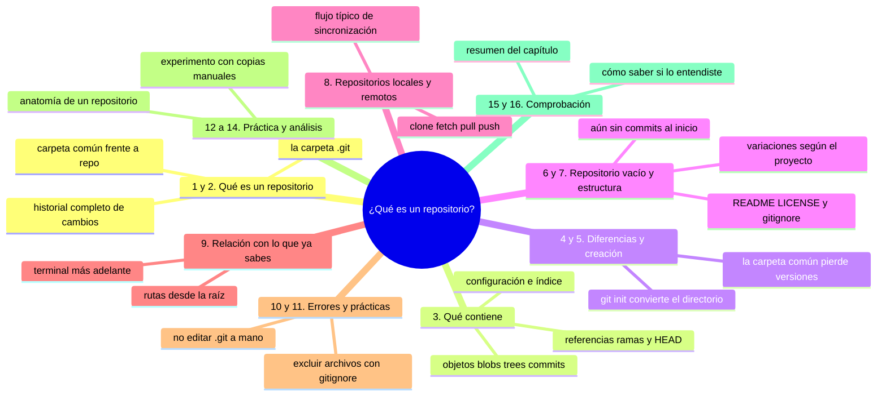
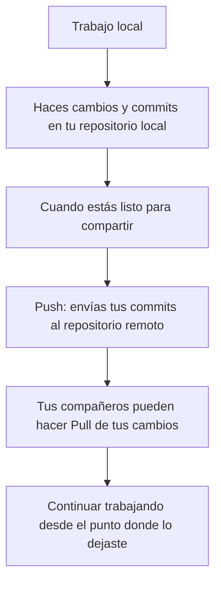

# ¿Qué es un repositorio?

## Introducción

En los capítulos anteriores aprendiste qué es GitHub y para qué sirve.

Viste que GitHub aloja repositorios y que estos repositorios contienen tu trabajo organizado de cierta manera.

Ahora es el momento de comprender con más detalle **qué es un repositorio**, que es el concepto fundamental sobre el cual se basa todo lo que hacemos con Git y GitHub.

En este capítulo aprenderás:

* qué es un repositorio desde el punto de vista de Git;
* qué diferencia existe entre un repositorio y una simple carpeta de archivos;
* qué contiene el interior de un repositorio (la famosa carpeta .git);
* cómo se estructura un repositorio típico;
* qué es un repositorio vacío y cómo se crea;
* la diferencia entre repositorios locales y remotos;
* cómo se relacionan los repositorios con los conceptos de archivos, carpetas y rutas que ya estudiaste;
* por qué entender los repositorios es esencial para trabajar eficazmente con Git y GitHub.

No necesitas utilizar la terminal en este capítulo. Nos enfocaremos en comprender el concepto a un nivel conceptual y visual, preparándonos para los pasos futuros donde sí utilizaremos comandos.

---

## Mapa conceptual de este capítulo



---

## 1. Una primera explicación

Imagina que tienes una caja de herramientas especial que no solo guarda tus herramientas, sino que también recuerda exactamente cómo las has organizado en cada momento del tiempo.

Cada vez que terminas de trabajar, la caja toma una "fotografía" de cómo están organizadas todas tus herramientas en ese preciso momento y la guarda en su memoria interna.

Más adelante, si quieres ver cómo estaban tus herramientas hace una semana, o comparar cómo estaban hoy con cómo estaban hace dos días, o incluso recuperar una herramienta que accidentalmente tiraste, esa caja puede mostrarte exactamente esa información.

Un **repositorio Git** funciona de manera similar, pero para tus archivos digitales en lugar de herramientas físicas.

Es una estructura especial que no solo guarda tus archivos actuales, sino que también mantiene un historial completo de cómo han cambiado esos archivos a lo largo del tiempo.

---

## 2. Definición técnica

Un **repositorio** (o **repo** en forma abreviada) es una estructura de datos que almacena el historial completo de un conjunto de archivos y carpetas a lo largo del tiempo.

Más específicamente, un repositorio Git es un sistema de control de versiones que:

* almacena un registro completo de todos los cambios realizados en un conjunto de archivos;
* permite recuperar versiones anteriores de esos archivos;
* facilita la combinación de cambios realizados por diferentes personas;
* permite explorar el historial para entender cómo y cuándo se modificó algo;
* proporciona herramientas para gestionar ramas (líneas de trabajo independiente);
* incluye mecanismos para detectar y resolver conflictos cuando los cambios entran en conflicto.

### El corazón del repositorio: la carpeta .git

Lo que hace especial a un repositorio no son los archivos visibles que ves en tu explorador de archivos, sino una carpeta especial que normalmente está oculta:

```text
mi-proyecto/
├── README.md
├── src/
│   └── programa.py
├── datos/
│   └── resultados.csv
└── .git/                 ← ¡Este es el repositorio real!
```

La carpeta `.git` contiene toda la información que hace que un directorio ordinario se convierta en un repositorio Git. Sin esta carpeta, tienes solo una carpeta normal de archivos. Con esta carpeta, tienes un repositorio completo de control de versiones.

> **Importante:** Nunca modifiques manualmente el contenido de la carpeta `.git` a menos que sepas exactamente lo que estás haciendo. Git la gestiona automáticamente para ti.

---

## 3. Qué contiene un repositorio

Dentro de la carpeta `.git`, Git almacena varios tipos de información esencial. No necesitas memorizar todos los detalles ahora, pero es útil comprender en términos generales qué contiene.

### 3.1. Objetos de Git (Git Objects)

Git almacena todo su contenido como **objetos**, que son unidades básicas de información. Hay cuatro tipos principales:

* **Blob** (objeto binario grande): almacena el contenido de un archivo;
* **Tree** (árbol): representa un directorio, contiene referencias a blobs y otros trees;
* **Commit** (confirmación): representa un punto en el tiempo, contiene un árbol, información de autor y fecha, y una referencia al commit anterior;
* **Tag** (etiqueta): marca un commit específico con un nombre legible (usualmente para versiones como "v1.0").

### 3.2. Referencias (References)

Git utiliza referencias para llevar la pista de dónde están ciertas cosas importantes:

* **Branches** (ramas): referencias móviles que apuntan a commits y se actualizan conforme se añaden nuevos commits;
* **HEAD**: referencia especial que indica en qué commit estás posicionado actualmente;
* **Tags**: referencia fijas que marcan commits específicos;
* **Remotes**: referencias a ramas en repositorios remotos.

### 3.3. Configuración y estado

La carpeta .git también contiene:

* Archivos de configuración (como `.git/config`);
* Información sobre el estado actual del working directory y el staging area;
* Otros datos internos que Git necesita para funcionar correctamente.

### 3.4. Estructura simplificada

Puedes imaginar el interior de un repositorio como:

```text
.git/
├── objects/          ← Almacena todos los blobs, trees y commits
├── refs/             ← Contiene las referencias (branches, tags, etc.)
│   ├── heads/        ← Branches locales
│   ├── tags/         ← Tags locales
│   └── remotes/      ← Referencias a branches remotos
├── HEAD              ← Apunta a la branch actual o directamente a un commit
├── config            ← Archivo de configuración del repositorio
├── index             ← Representa el staging area (área de preparación)
└── logs/             ← Historial de cambios en referencias (reflog)
```

No necesitas conocer todos estos detalles ahora, pero es útil saber que existe una organización interna sofisticada que permite que Git haga todo lo que hace.

---

## 4. Repositorio vs. Carpeta común

Es crucial comprender la diferencia entre un repositorio Git y una carpeta común de archivos.

### 4.1. Carpeta común

Una carpeta común simplemente contiene archivos y subcarpetas en su estado actual.

```text
Carpeta común/
├── documento.txt      ← Solo existe la versión actual
├── imagen.jpg         ← Solo existe la versión actual
└── datos/
    └── números.csv    ← Solo existe la versión actual
```

Si eliminas un archivo o lo modificas y guardas los cambios, la versión anterior se pierde (a menos que hayas hecho una copia manual).

### 4.2. Repositorio Git

Un repositorio Git contiene no solo el estado actual, sino también un historial completo de cómo han cambiado esos archivos.

```text
Repositorio Git/
├── documento.txt      ← Versión actual + historial de cambios
├── imagen.jpg         ← Versión actual + historial de cambios
├── datos/
│   └── números.csv    ← Versión actual + historial de cambios
└── .git/              ← ¡El cerebro que almacena todo el historial!
```

Con un repositorio, puedes:

* recuperar el documento.txt tal como estaba hace tres semanas;
* ver exactamente qué cambió en la imagen.jpg entre ayer y hoy;
* comparar dos versiones diferentes de los números.csv;
* ver quién hizo cada cambio y cuándo;
* combinar cambios realizados por diferentes personas sin perder trabajo;
* y mucho más.

---

## 5. ¿Cómo se crea un repositorio?

Un repositorio se crea mediante el comando `git init`, pero en este capítulo nos enfocaremos en el concepto, no en el comando.

Conceptualmente, crear un repositorio implica:

1. Tomar un directorio existente (o crear uno nuevo);
2. Inicializar la estructura interna de Git (crear la carpeta .git y sus componentes internos);
3. Preparar el sistema para comenzar a registrar cambios.

Una vez que un directorio se convierte en un repositorio, Git comienza a observar los archivos que contiene y está listo para registrar cambios cuando se le indique.

### Antes de git init
```text
mi-proyecto/
├── informe.txt
└── datos.csv
```
(Solo una carpeta común)

### Después de git init
```text
mi-proyecto/
├── informe.txt
├── datos.csv
└── .git/              ← ¡Ahora es un repositorio Git!
```

> **Nota:** No necesitas entender los detalles internos de cómo funciona `git init` todavía. Lo importante es comprender el concepto: un directorio ordinario se convierte en un repositorio capaz de registrar cambios.

---

## 6. Repositorio vacío

Inmediatamente después de crear un repositorio con `git init`, el repositorio está **vacío** en el sentido de que aún no tiene ningún commit registrado.

Sin embargo, técnicamente ya contiene la estructura interna necesaria para comenzar a registrar cambios.

Un repositorio vacío se ve así:

```text
mi-proyecto/
├── (archivos que ya existían)
└── .git/
    ├── objects/       ← Vacío (aún no hay blobs, trees o commits)
    ├── refs/          ← Contendrá branches y tags cuando se creen
    ├── HEAD           ← Apuntará a una branch que aún no existe
    ├── config         ← Configuración básica del repositorio
    └── index          ← Representa el staging area (vacío inicialmente)
```

El primer commit que hagas será el que realmente poblará el repositorio con contenido.

---

## 7. Estructura de un repositorio típico

Un repositorio típico de un proyecto se organiza de ciertas maneras comunes, aunque no existe una estructura única que deba seguirse en todos los casos.

### 7.1. Estructura básica de proyecto

Muchos proyectos siguen una estructura como esta:

```text
mi-proyecto/
├── README.md              ← Présentation y explicación del proyecto
├── LICENSE                ← Condiciones legales de uso
├── .gitignore             ← Archivos que Git debe ignorar
├── documentación/         ← Documentación adicional del proyecto
├── src/ o código/         ← Código fuente del proyecto
│   ├── módulo1/
│   │   └── archivo.py
│   └── módulo2/
│       └── otro.js
├── datos/                 ← Datos de entrada, salida o de ejemplo
│   ├── entrada.csv
│   └── resultados.json
├── pruebas/ o tests/      │   Pruebas automatizadas
│   ├── test_módulo1.py
│   └── test_módulo2.js
├── recursos/              │   Otros recursos (imágenes, estilos, etc.)
│   ├── estilos.css
│   └── logo.png
└── scripts/               │   Scripts de ayuda, despliegue, etc.
    ├── despliegue.sh
    └── utilidades.py
```

### 7.2. Variaciones según el tipo de proyecto

La estructura óptima depende del tipo de proyecto:

* **Sitio web**: podría tener carpetas como `html/`, `css/`, `js/`, `assets/`;
* **Análisis de datos**: podría tener `datos/`, `scripts/`, `resultados/`, `graficos/`;
* **Documentación técnica**: podría tener `capítulos/`, `figuras/`, `referencias/`, `apéndices/`;
* **Proyecto multimedia**: podría tener `audio/`, `video/`, `imágenes/`, `guiones/`;
* **Proyecto de hardware**: podría tener `esquemáticos/`, `placas/`, `firmware/`, `documentación/`.

> **Idea clave:** No existe una estructura única correcta. Lo importante es que la estructura sea clara, consistente y adecuada para el tipo de proyecto y el equipo que trabaja en él.

---

## 8. Repositorios locales y remotos

Hasta ahora hemos hablado de repositorios en términos generales, pero es importante distinguir entre dos tipos:

### 8.1. Repositorio local

Un **repositorio local** es un repositorio que existe en tu computadora personal.

Es donde:
* haces tus cambios;
* realizas tus commits;
* experimentas y pruebas;
* trabajas en tu día a día.

Cuando trabajas en tu repositorio local, tienes control total y puedes hacer prácticamente cualquier cosa (incluso cosas que podrían destruir el historial, aunque deberías evitar esas a menos que sepas exactamente lo que estás haciendo).

### 8.2. Repositorio remoto

Un **repositorio remoto** es una copia de un repositorio que existe en otro lugar, generalmente en un servidor como GitHub.

Es donde:
* guardas una copia de seguridad de tu trabajo;
* compartes tu trabajo con otras personas;
* colaboras con otros mediante Pull Requests y otros mecanismos;
* mantienes una versión centralizada que otros pueden clonar;
* tienes una referencia para recuperar tu trabajo si algo le sucede a tu computadora local.

### 8.3. La relación entre local y remoto

El repositorio local y el remoto están conectados mediante operaciones como:

* **clone**: crear una copia local de un repositorio remoto;
* **fetch**: obtener información sobre cambios en el remoto sin integrarlos;
* **pull**: obtener cambios del remoto y integrarlos en tu rama actual;
* **push**: enviar tus commits locales al repositorio remoto;
* **fetch + merge**: equivalente a pull, pero realizado en dos pasos separados.

### 8.4. Flujo típico

El flujo típico de trabajo con repositorios locales y remotos es:



Este flujo permite que múltiples personas trabajen en el mismo proyecto manteniendo sus copias locales sincronizadas con una versión centralizada.

---

## 9. Cómo se relaciona con lo que ya sabes

Vamos a conectar el concepto de repositorio con los conceptos que ya hemos estudiado:

### 9.1. Con archivos y carpetas

Un repositorio contiene archivos y carpetas, pero añade la capacidad de registrar cambios históricos.

```text
Repositorio Git
    │
    ├── archivos y carpetas (con historial)
    │
    └── .git/ (el cerebro que almacena el historial)
```

### 9.2. Con rutas

Los repositorios tienen una **raíz del repositorio**, que es la carpeta que contiene la carpeta `.git`. Todas las rutas dentro del repositorio se miden desde esta raíz.

```text
C:\proyectos\mi-proyecto\  ← Raíz del repositorio (en Windows)
/home/ana/proyectos/mi-proyecto/  ← Raíz del repositorio (en Linux/macOS)
```

Las rutas dentro del repositorio se expresan normalmente como rutas relativas a esta raíz:

```text
documentos/informe.txt     ← Desde la raíz del proyecto
src/módulo1/archivo.py     ← Desde la raíz del proyecto
datos/resultados.csv       ← Desde la raíz del proyecto
```

### 9.3. Con programas

Si eres programador, el repositorio contiene tu código fuente, que es lo que realmente importa para el control de versiones.

Los programas ejecutables generados a partir de tu código fuente normalmente no se almacenan en el repositorio, porque:
* son binarios y pueden ser grandes;
* se pueden regenerar a partir del código fuente;
* cambian con cada compilación;
* no aportan información útil al historial de versiones.

### 9.4. Con la terminal

Más adelante aprenderás que:
* el comando `git init` convierte un directorio común en un repositorio creando la carpeta `.git`;
* los comandos como `git status`, `git add` y `git commit` trabajan con la estructura interna del repositorio;
* comprender qué es un repositorio te ayudará a entender qué hacen realmente esos comandos.

---

## 10. Errores comunes

### Error 1: pensar que el repositorio son solo los archivos visibles

Muchos principiantes creen que el repositorio son solo los archivos que ven en su explorador de archivos, olvidando que el componente esencial (la carpeta `.git`) está normalmente oculto.

### Error 2: intentar editar manualmente la carpeta .git

A menos que sepas exactamente lo que estás haciendo, editar manualmente la carpeta `.git` puede corromper el repositorio y hacer imposible recuperar tu trabajo.

### Error 3: creer que un repositorio necesita estar conectado a Internet para funcionar

Un repositorio Git funciona completamente sin conexión a Internet. Solo necesitas conexión cuando quieras interactuar con un repositorio remoto (como uno en GitHub).

### Error 4: confundir el repositorio con el proyecto

Aunque a menudo usamos los términos indistintamente, técnicamente:
* El **proyecto** es el trabajo que estás realizando (el qué y el porqué);
* El **repositorio** es el sistema que registra y gestiona los cambios en ese trabajo (el cómo).

### Error 5: asumir que todos los archivos en un repositorio deben ser versionados

Algunos archivos (como archivos de compilación, dependencias descargadas o archivos temporales) normalmente no deben versionarse y deben excluirse mediante `.gitignore`.

### Error 6: pensar que crear un repositorio implica subir algo a GitHub

Crear un repositorio con `git init` solo crea un repositorio local. Para subirlo a GitHub necesitas pasos adicionales (crear un repositorio remoto y hacer push).

---

## 11. Buenas prácticas

* Comprende la diferencia entre una carpeta común y un repositorio Git;
* Recuerda que el componente esencial de un repositorio es la carpeta `.git`, no los archivos visibles;
* No modifiques manualmente la carpeta `.git` a menos que sepas exactamente lo que estás haciendo;
* Inicializa un repositorio tan pronto como comiences un proyecto que quieras versionar;
* Considera la estructura de tu repositorio desde el principio, no como un añadido al final;
* Utiliza `.gitignore` desde el principio para excluir archivos que no deben versionarse;
* Recuerda que un repositorio local es suficiente para comenzar a trabajar; puedes agregar un remoto más tarde;
* Entiende que el historial es valioso: no elimines información del repositorio a menos que tengas una muy buena razón para hacerlo;
* Trabaja con repositorios pequeños y simples antes de intentar proyectos complejos con múltiples colaboradores.

---

## 12. Práctica guiada

En esta práctica explorarás la diferencia entre una carpeta común y un repositorio Git utilizando una analogía visual.

### Objetivo
Comprender la diferencia conceptual entre una carpeta común y un repositorio Git.

### Paso 1: imagina una carpeta común

Visualiza una carpeta común que contiene:

```text
mi-proyecto/
├── informe.txt
├── datos.csv
└── imagen.png
```

Esta carpeta solo contiene el estado actual de los archivos. Si modificas algo y guardas, la versión anterior se pierde.

### Paso 2: imagina el mismo proyecto como repositorio Git

Ahora visualiza el mismo proyecto, pero con la estructura interna de un repositorio:

```text
mi-proyecto/
├── informe.txt      ← Versión actual + acceso al historial
├── datos.csv        ← Versión actual + acceso al historial
├── imagen.png       ← Versión actual + acceso al historial
└── .git/            ← El cerebro que almacena todo el historial
```

Dentro de `.git/` tienes acceso a:
* Todas las versiones anteriores de cada archivo;
* Información sobre quién cambió qué y cuándo;
* La capacidad de comparar versiones;
* La capacidad de recuperar versiones anteriores;
* Y mucho más.

### Paso 3: compara las dos situaciones

Responde mentalmente:
* ¿Qué puedes hacer con el repositorio que no puedes hacer con la carpeta común?
* ¿Qué información adicional tienes disponible en el repositorio?
* ¿Cómo afecta esto a tu capacidad para trabajar en el proyecto?

### Resultado esperado
Deberías reconocer que el repositorio te da capacidades que la carpeta común simplemente no tiene: acceso al historial, capacidad de recuperación, comparación de versiones, etc.

---

## 13. Experimento controlado

Este experimento te ayudará a comprender la diferencia entre una copia simple de archivos y un repositorio con historial.

> **Advertencia:** realiza este experimento únicamente con archivos de prueba que no te importen perder.

### Pasos

1. Crea una carpeta llamada `proyecto-comun` con estos archivos:
   ```text
   proyecto-comun/
   ├─ notas.txt
   └─ datos.txt
   ```
   Contenido de ambos archivos:
   ```
   Versión inicial
   ```

2. Haz una copia de esta carpeta llamada `proyecto-repositorio`:
   ```text
   proyecto-repositorio/
   ├─ notas.txt
   └─ datos.txt
   ```
   (Esta será nuestra "simulación" de repositorio)

3. En `proyecto-comun`, simula trabajar sin historial:
   * Modifica `notas.txt` a "Versión A" y guarda;
   * Modifica `datos.txt` a "Datos A" y guarda;
   * Guarda copias manuales con nombres como `notas-vA.txt`, `datos-vA.txt`;
   * Modifica nuevamente `notas.txt` a "Versión B" y guarda;
   * Guarda otra copia manual: `notas-vB.txt`, `datos-vB.txt`.

4. En `proyecto-repositorio`, imagina que tienes un repositorio Git real:
   * Tendrías el estado actual de ambos archivos;
   * Tendrías acceso al historial completo de cambios;
   * Podrías recuperar cualquier versión anterior con un comando simple;
   * Podrías ver exactamente qué cambió entre versiones;
   * No necesitarías hacer copias manuales de todo el proyecto cada vez.

### Preguntas

* ¿Cuál enfoque te resulta más cómodo para seguir el historial de cambios?
* ¿Qué enfoque te daría más confianza al experimentar con cambios?
* ¿Qué enfoque sería más fácil si necesitieras recuperar una versión específica de hace varios cambios atrás?
* ¿Qué enfoque sería menos propenso a errores humanos en el seguimiento de versiones?

### Conclusión esperada
El enfoque de repositorio Git (aunque lo estemos imaginando) resulta superior para seguir cambios, recuperar versiones y trabajar con confianza, especialmente a medida que el proyecto crece en complejidad.

---

### Ejercicio de transferencia

En tu equipo de trabajo o de estudio, elige una carpeta que edites con frecuencia (Documentos, una carpeta de fotos o la de este curso) y haz un inventario con el explorador de archivos.

Entregable: la ruta absoluta de esa carpeta, dos archivos que cambian a menudo, el nombre de una copia confusa que encuentres (algo tipo informe-v2-final) o la afirmación de que no hay ninguna, y una línea que diga qué información se perdería si sobrescribes un archivo sin historial. Termina indicando que ahí es donde iría la carpeta `.git`.

---

## 14. Ejercicio de análisis

Observa esta estructura de archivos:

```text
mi-proyecto/
├── README.md
├── LICENSE
├── .gitignore
├── src/
│   ├── main.py
│   └── utils/
│       └── helper.py
├── datos/
│   ├── entrada.csv
│   └── resultados.json
├── documentos/
│   ├── propuesta.pdf
│   └── informe-final.docx
└── .git/
    ├── objects/
    ├── refs/
    │   ├── heads/
    │   │   └── main
    │   └── tags/
    └── HEAD
```

Responde:

1. ¿Qué componentes identificarías como parte del repositorio Git (la parte .git)?
2. ¿Qué archivos probablemente contienen código fuente?
3. ¿Qué archivos probablemente contienen documentación del proyecto?
4. ¿Qué archivos probablemente contienen datos de entrada o salida?
5. ¿Qué información crees que estaría contenida en la carpeta `.git/objects`?
6. ¿Qué crees que estaría contenida en `.git/refs/heads/main`?
7. ¿Qué crees que estaría contenida en `.git/HEAD`?
8. ¿Cómo crees que se relaciona el archivo `LICENSE` con el resto del proyecto?
9. ¿Por qué crees que el archivo `.gitignore` está en la raíz del proyecto?
10. ¿Qué beneficios obtendrías al tener esta estructura en lugar de solo las carpetas y archivos visibles?

---

## 15. Cómo saber si lo entendiste

Deberías poder explicar con tus propias palabras:

* qué es un repositorio Git y cómo se diferencia de una carpeta común de archivos;
* qué es la carpeta `.git` y por qué es esencial para un repositorio;
* qué tipos de información almacena Git internamente (blobs, trees, commits, referencias);
* cómo un repositorio permite acceder al historial de cambios y recuperar versiones anteriores;
* la diferencia entre un repositorio vacío y uno con historial;
* la diferencia entre repositorios locales y remotos;
* cómo se relaciona un repositorio con los conceptos de archivos, carpetas y rutas que ya estudiaste;
* por qué el repositorio es el concepto fundamental sobre el cual se basa todo lo que hacemos con Git y GitHub;
* qué información crees que estaría disponible en un repositorio típico de un proyecto de software;
* cómo entender los repositorios te ayudará a utilizar comandos de Git de manera más efectiva en el futuro.

Si alguna respuesta todavía no está clara, vuelve a la sección correspondiente y repite la práctica.

---

## 16. Resumen

En este capítulo aprendiste que:

* un repositorio Git es una estructura de datos que almacena el historial completo de un conjunto de archivos y carpetas a lo largo del tiempo;
* el componente esencial de un repositorio es la carpeta `.git`, que contiene todo el historial interno;
* un repositorio no es solo las archivos visibles, sino un sistema que registra cambios y permite recuperarlos;
* un repositorio contiene blobs (contenido de archivos), trees (estructura de directorios), commits (puntos en el tiempo) y referencias (branches, tags, HEAD);
* un repositorio vacío tiene la estructura interna necesaria pero aún no tiene commits registrados;
* crear un repositorio implica inicializar la estructura interna de Git mediante `git init`;
* un repositorio típico de proyecto incluye archivos como README, LICENSE, código fuente, datos y documentación, todos ellos con historial accesible;
* existen diferencias importantes entre repositorios locales (en tu computadora) y remotos (en servidores como GitHub);
* entender los repositorios es esencial porque es el concepto fundamental sobre el cual se basa todo lo que hacemos con Git y GitHub;
* los repositorios nos permiten recuperar versiones anteriores, comprender cómo y cuándo cambió algo, trabajar en equipo sin perder trabajo y mucho más.

La idea principal es:

> **Un repositorio no es solo un lugar para guardar archivos; es un sistema que recuerda exactamente cómo han cambiado esos archivos a lo largo del tiempo, lo que nos permite trabajar con confianza, recuperar errores y colaborar de manera efectiva.**

---

## Autopreguntas de cierre

Sin mirar el material, responde mentalmente y luego compruébalo con este capítulo:

1. ¿Por qué una carpeta con archivos no es un repositorio aunque tenga toda la documentación del proyecto?
2. ¿Qué hay dentro de `.git` y por qué Git no te deja editarla a mano?
3. ¿Qué cambia en un directorio cuando ejecutas `git init` y qué no cambia en sus archivos?
4. ¿Qué diferencia hay entre un recién creado repositorio vacío y uno con cien commits?
5. ¿Por qué `git init` no sube nada a GitHub y qué pasos faltarían después?
6. ¿Qué operaciones conectan un repositorio local con uno remoto y en qué dirección va cada una?
7. ¿Qué ganas teniendo el historial en tu equipo aunque no tengas conexión a internet?

---

## Próximo paso

Ya sabes qué es un repositorio y cómo se almacena el historial de cambios.

El siguiente paso es comprender la diferencia entre GitHub y Git, y por qué es importante distinguirlos claramente.

Continúa con:

[`04-github-vs-git.md`](04-github-vs-git.md)
