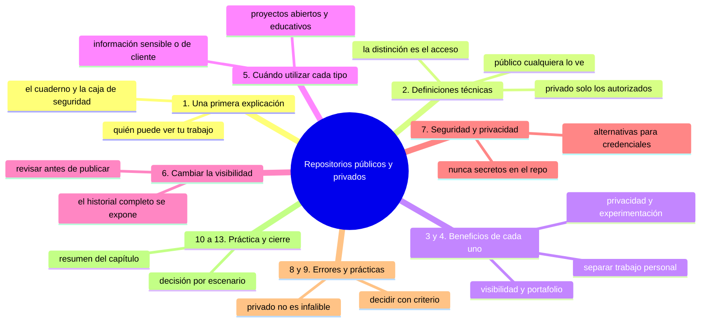
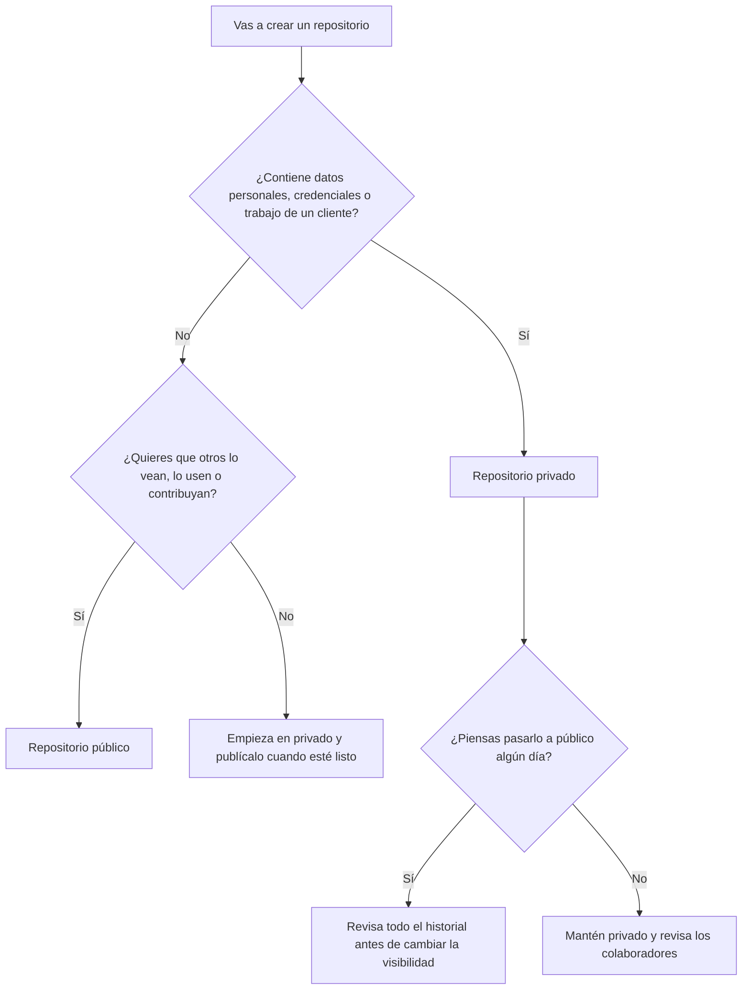

# Repositorios públicos y privados

## Introducción

En los capítulos anteriores aprendiste qué es GitHub y la diferencia entre Git y GitHub.

Viste que GitHub aloja repositorios y que estos repositorios permiten registrar cambios en archivos a lo largo del tiempo.

Ahora es el momento de comprender una distinción importante que afecta directamente quién puede ver y trabajar con tu trabajo: **la diferencia entre repositorios públicos y privados**.

Esta es una decisión importante que afecta la visibilidad, la colaboración y la seguridad de tu trabajo, y es algo que deberás considerar cada vez que crees un nuevo repositorio.

En este capítulo aprenderás:

* qué es un repositorio público y qué es un repositorio privado;
* las diferencias clave entre ellos en términos de acceso, visibilidad y control;
* cuándo es apropiado utilizar cada tipo;
* los beneficios y limitaciones de cada enfoque;
* consideraciones de seguridad y privacidad que debes tener en cuenta;
* cómo cambiar la visibilidad de un repositorio si tus necesidades cambian;
* ejemplos concretos de uso en diferentes escenarios;
* errores comunes que surgen al elegir entre públicos y privados;
* buenas prácticas para tomar esta decisión de manera informada.

No necesitas utilizar la terminal en este capítulo. Continuaremos enfocándonos en la comprensión conceptual y los ejemplos visuales.

---

## Mapa conceptual de este capítulo



---

## 1. Una primera explicación

Imagina que tienes un cuaderno de trabajo donde anotas tus ideas, dibujos y cálculos.

Este cuaderno es tuyo y lo puedes usar cuando quieras, pero tienes que decidir quién puede verlo:

* ¿Lo dejas sobre tu escritorio en casa, donde solo tú y tu familia pueden verlo?
* ¿Lo pones en una biblioteca pública donde cualquiera puede entrar y leerlo?
* ¿Lo compartes con un grupo específico de compañeros de estudio, pero nadie más puede acceder a él?
* ¿Lo pones en una caja de seguridad con llave, donde solo tú tienes acceso?

Estas mismas opciones existen en GitHub, pero aplicadas a repositorios digitales en lugar de cuadernos de papel.

Un **repositorio público** es como dejar tu cuaderno en una biblioteca pública: cualquiera puede verlo y leerlo.

Un **repositorio privado** es como guardar tu cuaderno en una caja de seguridad con llave: solo tú y las personas que specifically autorices pueden verlo.

La elección entre público y privado afecta directamente quién puede ver tu trabajo, quién puede contribuir a él y qué información estás compartiendo con el mundo.

---

## 2. Definiciones técnicas

### 2.1. Repositorio público

Un **repositorio público** es un repositorio que está disponible para que cualquiera en internet lo vea, lo lea y (en muchos casos) lo clone o lo descargare.

Características clave:
* Cualquiera puede ver el repositorio sin necesidad de tener una cuenta en GitHub;
* Cualquiera puede clonar o descargar el repositorio;
* Cualquiera puede ver el historial de commits y explorar el código;
* Cualquiera puede crear un fork (copia personal) del repositorio para trabajar en él;
* Solo los colaboradores especificados pueden hacer push directamente al repositorio original (a menos que se cambien los permisos);
* Cualquiera puede proponer cambios mediante Pull Requests (que luego deben ser aprobados por los propietarios).

### 2.2. Repositorio privado

Un **repositorio privado** es un repositorio que solo está disponible para personas específicas que tú has autorizado explícitamente.

Características clave:
* Solo tú y las personas que has agregado como colaboradores pueden ver el repositorio;
* Nadie más puede verlo, clonarlo o acceder a él de ninguna manera (ni siquiera sabiendo que existe);
* Tienes control total sobre quién puede acceder y qué nivel de acceso tienen;
* Los repositorios privados están disponibles en todos los planes de GitHub, incluyendo los gratuitos (con algunas limitaciones en el número de colaboradores);
* Puedes cambiar un repositorio de privado a público y viceversa en cualquier momento (con algunas consideraciones).

### 2.3. La distinción fundamental

La diferencia clave es **quién puede acceder al repositorio**:

```text
Repositorio público
    │
    └── Accesible para cualquiera en internet (lectura)
        │
        └── Contribuir requiere permisos específicos (generalmente mediante PRs)

Repositorio privado
    │
    └── Accesible solo para usuarios explícitamente autorizados
        │
        └── Nadie más puede verlo ni saber que existe (más allá de los autorizados)
```

Esta distinción afecta directamente quién puede ver tu trabajo, quién puede colaborar en él y qué información estás compartiendo con el mundo.

---

## 3. Beneficios de los repositorios públicos

### 3.1. Visibilidad y descubrimiento

* Tu trabajo es visible para cualquiera interesado en el tema;
* Otros pueden encontrar tu proyecto mediante búsquedas o recomendaciones;
* Puedes recibir contribuciones de personas que nunca has conocido;
* Tu trabajo puede inspirar o ayudar a otros en proyectos similares.

### 3.2. Construir presencia profesional

* Tu trabajo público puede servir como portafolio de tus habilidades;
* Los empleadores pueden evaluar tu código y tu estilo de trabajo;
* Puedes demostrar tu capacidad para trabajar en proyectos de código abierto;
* Tu actividad en repositorios públicos contribuye a tu historial profesional.

### 3.3. Colaboración abierta

* Puedes recibir contribuciones de la comunidad (correcciones de errores, mejoras, nuevas características);
* Puedes participar en proyectos de código abierto como colaborador externo;
* Puedes aprender de cómo otros estructuran y resuelven problemas similares;
* Puedes construir redes profesionales a través de contribuciones y discusiones.

### 3.4. Costo y accesibilidad

* Los repositorios públicos son gratuitos en todos los planes de GitHub;
* No hay límites en la cantidad de repositorios públicos que puedes tener;
* Son accesibles desde cualquier lugar del mundo sin restricciones de IP o ubicación.

### 3.5. Educación y aprendizaje

* Otros pueden aprender de tu código y tu enfoque para resolver problemas;
* Puedes utilizar repositorios públicos como materiales de enseñanza;
* Los estudiantes pueden estudiar proyectos reales y ver cómo se estructuran y se mantienen;
* Fomenta la transparencia y el intercambio de conocimiento.

---

## 4. Beneficios de los repositorios privados

### 4.1. Privacidad y control

* Solo las personas que tú autorices pueden ver tu trabajo;
* Nadie más sabe que el repositorio existe ni qué contiene;
* Tienes control total sobre quién puede acceder y qué nivel de acceso tienen;
* Puedes trabajar en proyectos sensibles sin preocuparte por la exposición accidental.

### 4.2. Seguridad de información sensible

* Puedes almacenar de forma segura credenciales, tokens, claves API y otros secretos (aunque aún es mejor usar secretos de GitHub o variables de entorno);
* Puedes trabajar en proyectos que contienen información propietaria o confidencial;
* Puedes cumplir con requisitos de confidencialidad en entornos académicos o corporativos;
* Puedes proteger información que aún no está lista para ser compartida públicamente.

### 4.3. Libertad para experimentar

* Puedes experimentar con ideas sin preocuparte por cómo se verán públicamente;
* Puedes probar enfoques que puedan fallar sin que nadie más lo vea;
* Puedes trabajar en proyectos personales sin presión externa;
* Puedes iterar rápidamente sin preocuparte por la percepción externa.

### 4.4. Trabajo profesional y empresarial

* Puedes desarrollar productos propietarios sin revelar tu código a la competencia;
* Puedes trabajar en proyectos para clientes que requieren confidencialidad;
* Puedes mantener separaciones claras entre trabajo personal y profesional;
* Puedes cumplir con políticas corporativas sobre compartición de información.

### 4.5. Preparación para publicación futura

* Puedes trabajar en un proyecto en privado hasta que esté listo para ser compartido;
* Puedes pasar de privado a público cuando estés listo para compartir tu trabajo;
* Puedes utilizar el repositorio privado como un espacio de preparación y pulido.

---

## 5. Cuándo utilizar cada tipo

### 5.1. Utiliza un repositorio público cuando:

* Quieres compartir tu trabajo abiertamente con el mundo;
* Estás trabajando en un proyecto de código abierto que deseas que otros contribuyan;
* Quieres construir una presencia profesional y mostrar tu código a posibles empleadores;
* Estás creando recursos educativos que otros puedan utilizar y aprender de ellos;
* El proyecto no contiene información sensible o propietaria;
* Quieres recibir contribuciones de la comunidad;
* Estás creando un proyecto que podría beneficiarse de la colaboración externa;
* Necesitas cumplir con requisitos de financiación que exijan código abierto;
* Quieres que tu trabajo sea citado y reconocido públicamente;
* Estás creando herramientas, bibliotecas o frameworks que otros podrían utilizar;
* Estás documentando un proceso o metodología que otros podrían beneficiarse.

### 5.2. Utiliza un repositorio privado cuando:

* El trabajo contiene información sensible, propietaria o confidencial;
* Estás trabajando en un proyecto para un cliente que requiere confidencialidad;
* Estás en las etapas iniciales de un proyecto y no estás listo para compartirlo públicamente;
* El proyecto contiene credenciales, tokens, claves API u otros secretos (aunque aún es mejor usar mecanismos de seguridad adecuados);
* Estás desarrollando un producto propietario que planeas vender o licenciar;
* Estás trabajando en investigación que aún no está lista para ser compartida públicamente;
* El proyecto contiene datos personales o información que debe mantenerse confidencial por razones legales o éticas;
* Quieres experimentar con ideas sin preocuparte por la percepción pública;
* Estás en un entorno corporativo con políticas que restringen el compartimiento de ciertos tipos de trabajo;
* Necesitas cumplir con requisitos regulatorios que exijan mantener ciertos trabajos privados;
* Estás en una etapa temprana de aprendizaje y prefieres praticar en privado antes de compartir públicamente.

### 5.3. El árbol de decisión en una imagen



---

## 6. Cambiar entre públicos y privados

Puedes cambiar la visibilidad de un repositorio en cualquier momento desde la configuración del repositorio en GitHub.

### 6.1. De privado a público

Cuando pasas de privado a público:
* El repositorio se vuelve accesible para cualquiera en internet;
* Cualquiera puede ver el historial completo de cambios (incluyendo el historial privado);
* Cualquiera puede clonar, forkear o descargar el repositorio;
* El historial completo se vuelve público, incluyendo cualquier trabajo que se hizo mientras era privado;
* Debes revisar cuidadosamente el contenido antes de hacer este cambio para asegurarte de que no hay información sensible que no debería ser pública;
* Este cambio es irreversible en el sentido de que, aunque puedas volver a hacerlo privado después, el historial que se hizo público mientras estuvo público siempre estará disponible para quien lo haya visto o descargado.

### 6.2. De privado a privado

Cuando pasas de público a privado:
* El repositorio deja de ser accesible para cualquiera en internet;
* Solo los usuarios autorizados pueden verlo y acceder a él;
* El historial completo permanece accesible para los usuarios autorizados;
* Cualquiera que haya clonado o forked el repositorio mientras era público seguirá teniendo acceso a su copia;
* No puedes "deshacer" el hecho de que el repositorio fue público en algún momento;
* Este cambio protege el acceso futuro, pero no puede recuperar el acceso que ya se ha otorgado.

> **Importante:** NUNCA debes pasar un repositorio de privado a público sin revisar cuidadosamente su contenido para asegurarte de que no contiene información sensible que no debería ser pública.

---

## 7. Consideraciones de seguridad y privacidad

### 7.1. Información que nunca debe estar en repositorios públicos (ni privados sin protección adecuada)

Nunca debes colocar directamente en un repositorio (ni público ni privado sin protección adecuada):
* Credenciales de bases de datos;
* Llaves API de servicios externos;
* Tokens de autenticación;
* Claves privadas de cifrado;
* Números de seguridad social o información de identificación personal;
* Información financiera como números de cuenta o tarjetas de crédito;
* Información de salud protegida (PHI) bajo regulaciones como HIPAA;
* Información protegida por derechos de autor que no tienes derecho a distribuir;
* Cualquier información que pudiera ser utilizada para comprometer la seguridad de sistemas o personas.

### 7.2. Alternativas seguras para información sensible

En lugar de colocar información sensible directamente en tu repositorio, utiliza:
* **Secretos de GitHub**: almacenamiento seguro de credenciales que pueden utilizarse en GitHub Actions;
* **Variables de entorno**: para aplicaciones que necesitan credenciales en tiempo de ejecución;
* **Gestor de secretos especializado**: como HashiCorp Vault, AWS Secrets Manager, etc.;
* **Archivos de configuración separados** que se excluyan del repositorio mediante `.gitignore`;
* **Servicios de gestión de configuración** externos;
* **Encriptación** de archivos sensibles (aunque aún así, es mejor no almacenarlos en el repositorio si es posible evitarlo).

### 7.3. La regla de los secretos

> **Nunca almacenes secretos directamente en tu repositorio Git, ya sea público o privado.**
> 
> Si necesitas credenciales o información sensible, utiliza mecanismos de almacenamiento seguro diseñados específicamente para ese propósito.

### 7.4. Revisión antes de hacer público

Antes de pasar un repositorio de privado a público, siempre debes:
* Revisar cuidadosamente todo el historial de commits (no solo el estado actual);
* Verificar que no hay credenciales accidentalmente comprometidas en ningún commit;
* Verificar que no hay información sensible en archivos que posteriormente se eliminaron pero que aún están en el historial;
* Verificar que no hay información confidencial en documentación, comentarios o archivos de configuración;
* Considerar usar herramientas como `git filter-branch` o `bfg` para limpiar el historial si es necesario (aunque esto debe hacerse con extrema precaución).

---

## 8. Errores comunes

### Error 1: asumir que un repositorio privado es completamente seguro

Un repositorio privado protege contra acceso no autorizado desde fuera, pero:
* No protege contra amenazas internas (colaboradores malintencionados o descuidados);
* No protege contra credenciales accidentalmente comprometidas dentro del repositorio;
* No protege contra vulnerabilidades en el código que podrían ser explotadas si alguien obtiene acceso;
* No protege contra errores de configuración que expongan el repositorio de manera inadvertida.

### Error 2: creer que pasar de privado a público es "seguro" si el estado actual parece limpio

El historial completo se hace público, incluyendo:
* Commits que posteriormente se modificaron o eliminaron;
* Comentarios en el código que revelaron información sensible;
* Archivos que se eliminaron pero que aún están en el historial;
* Credenciales que se agregaron y luego se eliminaron pero que aún están en el historial;
* Información que se pensó que era segura pero que en realidad contenía datos sensibles.

### Error 3: usar repositorios privados como excusa para malas prácticas de seguridad

Solo porque un repositorio es privado no significa que debes descuidar las buenas prácticas de seguridad:
* Siempre debes revisar lo que pones en tu repositorio;
* Nunca debes poner credenciales directamente en el código;
* Siempre debes utilizar mecanismos adecuados para manejar información sensible;
* Siempre debes ser consciente de que incluso los repositorios privados pueden verse comprometidos.

### Error 4: asumir que los repositorios gratuitos de GitHub tienen las mismas limitaciones de privados que los pagos

Aunque GitHub ofrece repositorios privados gratuitos, hay algunas limitaciones:
* Número limitado de colaboradores en repositorios privados gratuitos (limitado a un cierto número);
* Algunas características avanzadas de seguridad pueden requerir planes pagos;
* Algunos límites de almacenamiento o ancho de banda pueden aplicar;
* Siempre revisa los términos de servicio actuales para entender las limitaciones exactas.

### Error 5: pensar que un repositorio público significa que "cualquiera puede cambiarlo"

En un repositorio público:
* Cualquiera puede verlo, clonarlo y forkearlo;
* Solo los colaboradores autorizados pueden hacer push directo al repositorio original;
* Cualquiera puede proponer cambios mediante Pull Requests, pero estos deben ser aprobados antes de integrarse;
* El propietario mantiene el control final sobre qué cambios se aceptan en el repositorio principal.

### Error 6: creer que los repositorios privados son solo para proyectos "serios" o profesionales

Los repositorios privados son útiles para:
* Proyectos de aprendizaje y experimentación;
* Trabajo personal que no está listo para compartir;
* Proyectos en etapas muy tempranas de desarrollo;
* Cualquier trabajo que prefieras mantener privado por cualquier razón válida;
* No hay nada de "menos válido" en querer mantener algo privado.

---

## 9. Buenas prácticas

* Piensa cuidadosamente en la visibilidad antes de crear un repositorio;
* Considera si tu trabajo contiene información sensible antes de decidir entre público y privado;
* Revisa cuidadosamente el historial antes de pasar un repositorio de privado a público;
* Nunca almacenes secretos directamente en tu repositorio, ya sea público o privado;
* Utiliza los repositorios públicos para compartir trabajo que se beneficie de la visibilidad y la colaboración externa;
* Utiliza los repositorios privados para trabajo que necesita confidencialidad, privacidad o control de acceso;
* Recuerda que puedes cambiar entre públicos y privados según cambien tus necesidades (pero revisa cuidadosamente antes de hacerlo público);
* Aprovecha los repositorios privados gratuitos para aprender y experimentar sin presión externa;
* Considera usar repositorios públicos para proyectos educativos, de código abierto y de divulgación científica;
* Considera usar repositorios privados para trabajo en etapas tempranas, proyectos clientes y trabajo experimental;
* Recuerda que la decisión entre público y privado no es permanente: puedes cambiarla según evolucionen tus necesidades y circunstancias;
* Siempre prioriza la seguridad y la privacidad cuando haya dudas.

---

## 10. Práctica guiada

En esta práctica explorarás las diferencias entre repositorios públicos y privados mediante un ejercicio de decisión.

### Objetivo
Aprender a tomar decisiones informadas sobre cuándo utilizar repositorios públicos o privados.

### Paso 1: elige un escenario de proyecto

Imagina que estás trabajando en uno de los siguientes escenarios (elige uno o más para analizar):
* Un proyecto de tesis de licenciatura sobre energías renovables;
* Una aplicación web para gestionar el inventario de una tienda local;
* Una colección de scripts de análisis de datos para un proyecto de investigación;
* Una biblioteca de funciones de utilidad en Python que crees que otros podrían utilizar;
* Un juego sencillo que estás creando para divertirte con tus amigos;
* Un sitio web estático para tu portafolio profesional;
* Un proyecto de análisis de datos para un cliente que requiere confidencialidad;
* Un conjunto de notas y resúmenes de tus estudios universitarios;
* Una colección de recetas familiares que quieres compartir con tu familia extendida;
* Un proyecto experimental de inteligencia artificial que aún está en etapas muy tempranas.

### Paso 2: analiza cada propósito

Para tu escenario elegido, analiza:
* ¿Qué tipo de información contiene el proyecto?
* ¿El proyecto contiene información sensible, propietaria o confidencial?
* ¿Quieres que otros puedan ver y potencialmente contribuir al trabajo?
* ¿Quieres construir una presencia profesional mostrando este trabajo?
* ¿El proyecto se beneficiaría de contribuciones externas?
* ¿Hay requisitos legales, éticos o contractuales que afecten la visibilidad?
* ¿Estás en una etapa temprana de desarrollo donde prefieres experimentar en privado?
* ¿Planeas compartir el trabajo públicamente en algún momento en el futuro?

### Paso 3: toma una decisión

Basado en tu análisis, decide:
* ¿Sería mejor utilizar un repositorio público o privado para este proyecto?
* ¿Cuáles son las razones principales para tu decisión?
* ¿Qué beneficios obtendrías de tu elección?
* ¿Qué riesgos o limitaciones debes tener en cuenta?
* ¿Qué precauciones deberías tomar si eliges esa opción?

### Paso 4: considera el futuro

También piensa en:
* ¿Podría cambiar tu decisión en el futuro a medida que el proyecto evoluciona?
* ¿Qué indicaría que es tiempo de cambiar de privado a público (o viceversa)?
* ¿Qué pasos necesitarías tomar para hacer ese cambio de manera segura?
* ¿Qué precauciones deberías tomar al hacer el cambio?

### Resultado esperado
Deberías poder explicar claramente tu decisión y las razones detrás de ella, considerando todos los factores relevantes.

---

### Ejercicio de transferencia

Abre el explorador de archivos de tu equipo y elige tres carpetas o archivos reales (por ejemplo: fotos familiares, apuntes de un curso y un presupuesto). Decide para cada uno su visibilidad futura en GitHub, aunque todavía no lo crees.

Entregable: una tabla de tres filas con la ruta del elemento, «público» o «privado», y el motivo en una línea; además de la frase que diga qué revisarías antes de pulsar «hacer público» en el caso más delicado de los tres.

---

## 11. Ejercicio de análisis

Observa estos escenarios y determina si sería más apropiado utilizar un repositorio público o privado para cada uno:

**Escenario A:** 
Un proyecto de ciencia de datos para analizar tendencias de lluvia en tu ciudad utilizando datos públicos de la agencia meteorológica local.

**Escenario B:** 
Una aplicación móvil que utilizas para gestionar tus finanzas personales y que contiene información detallada sobre tus gastos, ingresos y inversiones.

**Escenario C:** 
Una colección de tutoriales y ejercicios que has creado para enseñar programación a principiantes en tu comunidad.

**Escenario D:** 
Un algoritmo novedoso que has desarrollado para optimizar rutas de entrega que crees que podría tener valor comercial.

**Escenario E:** 
Un conjunto de análisis y visualizaciones que has creado para un proyecto de investigación financiado por una agencia gubernamental que requiere que todos los resultados sean de acceso público.

**Escenario F:** 
Un juego sencillo que estás creando para divertirte con tus amigos durante el fin de semana y que no planeas compartir más allá de tu círculo cercano.

**Escenario G:** 
Una herramienta de línea de comandos que has creado para automatizar tareas repetitivas en tu trabajo diario y que crees que podría ser útil para otros en tu profesión.

**Escenario H:** 
Un proyecto de análisis de datos que contiene información de salud de pacientes que has recopilado con su consentimiento pero que está sujeto a regulaciones de privacidad de salud.

Responde para cada escenario:
1. ¿Repositorio público o privado y por qué?
* ¿Qué factores influyeron en tu decisión?
* ¿Qué beneficios obtendrías de tu elección?
* ¿Qué precauciones deberías tener en cuenta?
* ¿Qué podría salir mal si eligieras la opción opuesta?

---

## 12. Cómo saber si lo entendiste

Deberías poder explicar con tus propias palabras:

* qué es un repositorio público y qué es un repositorio privado;
* las diferencias clave entre ellos en términos de acceso, visibilidad y control;
* cuándo es apropiado utilizar cada tipo;
* los beneficios y limitaciones de cada enfoque;
* consideraciones de seguridad y privacidad que debes tener en cuenta;
* cómo cambiar la visibilidad de un repositorio si tus necesidades cambian;
* ejemplos concretos de uso en diferentes escenarios;
* errores comunes que surgen al elegir entre públicos y privados;
* buenas prácticas para tomar esta decisión de manera informada.

Si alguna respuesta todavía no está clara, vuelve a la sección correspondiente y repite la práctica.

---

## 13. Resumen

En este capítulo aprendiste que:

* un repositorio público es accesible para cualquiera en internet para ver, clonar y contribuir (mediante PRs);
* un repositorio privado es accesible solo para usuarios explícitamente autorizados que tú has autorizado;
* los repositorios públicos son ideales para trabajo que se beneficia de la visibilidad, la colaboración externa y la construcción de presencia profesional;
* los repositorios privados son ideales para trabajo que necesita confidencialidad, privacidad, control de acceso o que contiene información sensible;
* puedes cambiar entre públicos y privados según evolucionen tus necesidades, pero debes revisar cuidadosamente el historial antes de hacer privado a público;
* nunca debes almacenar secretos directamente en tu repositorio, ya sea público o privado;
* los repositorios públicos y privados están disponibles en todos los planes de GitHub, incluyendo los gratuitos (con algunas limitaciones);
* la elección entre público y privado afecta directamente quién puede ver tu trabajo, quién puede contribuir a él y qué información estás compartiendo con el mundo;
* tomar una decisión informada entre público y privado requiere considerar la naturaleza de tu trabajo, tus objetivos, tus preocupaciones de seguridad y privacidad, y tus planes futuros.

La idea principal es:

> **La elección entre repositorios públicos y privados no es solo técnica; es una decisión que afecta directamente quién puede ver tu trabajo, quién puede contribuir a él y qué información estás compartiendo con el mundo. Tomar esta decisión de manera informada requiere equilibrar tus necesidades de colaboración, visibilidad, control de acceso, privacidad y seguridad.**

---

## Autopreguntas de cierre

Sin mirar el material, responde mentalmente y luego compruébalo con este capítulo:

1. ¿Qué diferencia real hay entre privado y público si nadie conoce la dirección del repositorio?
2. ¿Por qué borrar un archivo hoy no garantiza que deje de ser visible si el repositorio fue público?
3. ¿Qué se expone exactamente al pasar de privado a público y por qué hay que revisar el historial completo?
4. ¿Qué puede hacer cualquiera con un repositorio público y qué NO puede hacer sin ser colaborador?
5. ¿Por qué un repositorio privado no te libra de guardar credenciales fuera del repositorio?
6. ¿En qué casos empezarías en privado aunque el proyecto acabe siendo público?
7. ¿Qué pierde tu equipo si cada quien decide la visibilidad sin acordar criterios?

---

## Próximo paso

Ya sabes qué es un repositorio y la diferencia entre públicos y privados.

El siguiente paso es comprender qué es el control de versiones y por qué es fundamental para trabajar con archivos que cambian a lo largo del tiempo.

Continúa con:

[`06-que-es-el-control-de-versiones.md`](06-que-es-el-control-de-versiones.md)
