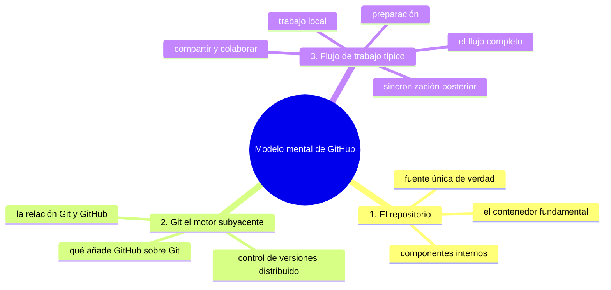
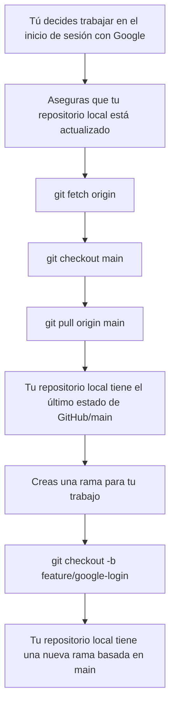

# Modelo mental de GitHub

## Introducción

En los capítulos anteriores has aprendido:
* Qué es GitHub y para qué sirve;
* La diferencia entre Git y GitHub;
* Qué es un repositorio y los tipos (público y privado);
* Qué es el control de versiones y cómo funciona;

Ahora es el momento de integrar todo este conocimiento en un **modelo mental coherente** que te ayude a comprender cómo GitHub funciona como sistema completo.

Un modelo mental es una representación interna de cómo algo funciona en el mundo real. Tener un buen modelo mental de GitHub te permitirá:
* Predecir qué pasará cuando realices ciertas acciones;
* Solucionar problemas de manera más efectiva cuando algo no funciona como esperas;
* Comunicarte mejor con otros sobre cómo trabajar con el sistema;
* Aprender nuevas funcionalidades más fácilmente al relacionarlas con lo que ya sabes;
* Tomar mejores decisiones sobre cómo estructurar tu trabajo y tu colaboración.

En este capítulo desarrollarás un modelo mental de GitHub que integre:
* El repositorio como unidad fundamental de trabajo;
* Git como motor de control de versiones subyacente;
* GitHub como plataforma de alojamiento y colaboración;
* El flujo de trabajo típico de desarrollo;
* Las características clave de colaboración (Issues, Pull Requests, etc.);
* Los aspectos de gestión y automatización;
* Cómo todo esto se relaciona con tu trabajo local y el de tu equipo.

No necesitas utilizar la terminal en este capítulo. Continuaremos enfocándonos en la comprensión conceptual y los ejemplos visuales.

---

## Mapa conceptual de este capítulo



---

## 1. El repositorio: el contenedor fundamental

Comencemos con el concepto más básico en GitHub: **el repositorio**.

### 1.1. Qué es un repositorio en tu modelo mental

Piensa en un repositorio como:
* **Una carpeta especializada** que contiene todo el historial de un proyecto;
* **Una base de datos de cambios** que registra quién hizo qué y cuándo;
* **Un contenedor de colaboración** que facilita que múltiples personas trabajen juntas;
* **Una unidad de propiedad** que tiene visibilidad definida (pública o privada);
* **Un punto de entrada** para automatización y gestión de proyectos.

### 1.2. Componentes internos de un repositorio

En tu modelo mental, un repositorio GitHub consiste en:

```text
Repositorio GitHub
    │
    ├── Código fuente y archivos
    │   │
    │   └── Estado actual de todos los archivos rastreados
    │
    ├── Historial de versiones (powered by Git)
    │   │
    │   ├── Snapshots/commits ordenados cronológicamente
    │   │
    │   ├── Ramas (branches) que representan líneas de trabajo
    │   │
    │   └── Etiquetas (tags) que marcan versiones importantes
    │
    ├── Configuración del repositorio
    │   │
    │   ├── Visibilidad (pública/privada)
    │   │
    │   ├── Ramas protegidas
    │   │
    │   ├── Política de fusiones
    │   │
    │   └── Otros ajustes de comportamiento
    │
    ├── Herramientas de colaboración
    │   │
    │   ├── Issues (tareas, errores, mejoras)
    │   │
    │   ├── Pull Requests (propuestas de cambio)
    │   │
    │   └── Discussions (conversaciones abiertas)
    │
    ├── Servicios de gestión
    │   │
    │   ├── Projects (tableros de organización)
    │   │
    │   ├── Wiki (documentación)
    │   │
    │   ├── Packages (alojamiento de artefactos)
    │   │
    │   └── Security (alertas de vulnerabilidades)
    │
    └── Automatización e integraciones
        │
        ├── GitHub Actions (CI/CD)
        │
        ├── Webhooks (notificaciones HTTP)
        │
        └── Integraciones de terceros
```

### 1.3. El repositorio como fuente única de verdad

En tu modelo mental, el repositorio en GitHub representa la **fuente única de verdad** para tu proyecto:

```text
Tu trabajo local          Trabajo de compañeros
    │                            │
    │ fetch/pull                 │ fetch/pull
    ▼                            ▼
[Repositorio en GitHub] ←─[Centro de verdad compartida]─→ [Repositorio en GitHub]
    │                            │
    │ push                       │ push
    ▼                            ▼
Tu repositorio local      Repositorio local de compañeros
```

Cualquier cambio que quieras compartir con tu equipo debe pasar por el repositorio en GitHub. Este se convierte en el punto de sincronización donde todos los miembros del equipo convergen y divergen su trabajo.

---

## 2. Git: el motor subyacente

Ahora veamos cómo encaja Git en tu modelo mental.

### 2.1. Git como motor de control de versiones

En tu modelo mental, Git es:
* **El motor que hace posible el historial de versiones**;
* **El responsable de almacenar y gestionar snapshots**;
* **El que maneja ramas, fusiones y recuperación de estados**;
* **El que opera principalmente en tu entorno local**;
* **El que se comunica con el repositorio remoto en GitHub mediante protocolos de red**.

### 2.2. La relación Git-GitHub en tu modelo mental

Visualiza esta relación así:

```text
Tu computadora
    │
    ├── Entorno local de trabajo
    │   │
    │   ├── Archivos de tu proyecto (working directory)
    │   │
    │   ├── Área de preparación (staging/index)
    │   │
    │   └── Repositorio Git local (base de datos de objetos)
    │
    │       ▲
    │       │ push/fetch/pull
    │       │
    ▼       │
[GitHub] ←─[Red de internet]─→ [Otra computadora]
    ▲
    │
    └─ Repositorio Git remoto (almacenado en servidores de GitHub)
```

En este modelo:
* Tu **repositorio Git local** es donde haces commit y gestionas tu historial local;
* El **repositorio Git remoto en GitHub** es donde se almacena la versión compartida que todos pueden acceder;
* Las operaciones **push, fetch y pull** son los mecanismos de sincronización entre local y remoto;
* GitHub agrega capas de colaboración, gestión y automatización alrededor del repositorio Git remoto.

### 2.3. Qué hace GitHub que Git no hace

En tu modelo mental, GitHub extiende Git con:

```text
Git (solo)
    │
    └── Control de versiones distribuido
        │
        ├── Historial de commits
        │
        ├── Ramas y fusiones
        │
        └── Operaciones locales (commit, branch, merge, etc.)

GitHub (Git +)
    │
    ├── Todo lo que Git hace
    │
    ├── Alojamientode repositorios Git remotos
    │
    ├── Interfaz web para explorar historial y archivos
    │
    ├── Herramientas de colaboración (Issues, PRs, Reviews)
    │
    ├── Gestión de acceso y permisos
    │
    ├── Automatización (GitHub Actions)
    │
    ├── Servicios de paquetes y registro
    │
    ├── Seguridad y alertas de vulnerabilidades
    │
    └── Integraciones con herramientas externas
```

---

## 3. Flujo de trabajo típico: poniéndolo todo junto

Desarrollemos un modelo mental del flujo de trabajo típico usando un escenario concreto.

### 3.1. Escenario: agregando una nueva característica

Imagina que quieres agregar una característica de "inicio de sesión con Google" a una aplicación web.

#### Paso 1: preparación



#### Paso 2: trabajo local

```text
[Tú] editas archivos para agregar la funcionalidad de login con Google
    │
    ▼
Pruebas tus cambios localmente
    │
    ▼
Cuando llegas a un punto de guardado lógico:
    │
    ▼
Revisas qué archivos cambiaste (git status)
    │
    ▼
Preparas los cambios específicos que quieres incluir (git add -p)
    │
    ▼
Haces commit con mensaje descriptivo
    │
    ▼
git commit -m "Agregar endpoint de autenticación con Google"
    │
    ▼
[Tu repositorio local] ahora tiene un nuevo commit en feature/google-login
    │
    ▼
Repetir según necesites más trabajo
```

#### Paso 3: compartir y colaborar

```mermaid
flowchart TD
    A["Cuando tu trabajo está listo para revisión"] --> B["Envías tu rama al repositorio remoto en GitHub"]
    B --> C["git push origin feature/google-login"]
    C --> D["GitHub ahora tiene tu rama feature/google-login con tus commits"]
    D --> E["Abres un Pull Request desde feature/google-login hacia main"]
    E --> F["GitHub muestra el PR con:<br/>Resumen de cambios<br/>Diff línea por línea<br/>Espacio para descripción y contexto<br/>Lista de verificaciones requeridas"]
    F --> G["Notificas a tus compañeros para que revisen tu PR"]
    G --> H["GitHub envía notificaciones a los revisores asignados"]
    H --> I["Tus compañeros revisan tu código, dejan comentarios y sugieren cambios"]
    I --> J["Tú atiendes los comentarios:<br/>Haces más commits locales<br/>Los pusheas a la misma rama<br/>El PR se actualiza automáticamente<br/>Resolvés los hilos de comentario"]
    J --> K["Cuando todos están satisfechos"]
    K --> L["Los revisores aprueban el PR"]
    L --> M["GitHub ejecuta verificaciones automatizadas CI"]
    M --> N["Si todo pasa"]
    N --> O["Se mergea el PR a la rama main"]
    O --> P["GitHub crea un merge commit si se configura así o aplica squash o rebasing"]
    P --> Q["GitHub/main ahora incluye tu característica"]
    Q --> R["Opcional: se elimina la rama feature/google-login"]
```



#### Paso 4: sincronización posterior

```text
Después del merge:
    │
    ▼
[Tú] actualizas tu rama main local
    │
    ▼
git checkout main
    │
    ▼
git pull origin main
    │
    ▼
[Tu repositorio local/main] ahora tiene el merge de tu característica
    │
    ▼
Eliminas tu rama local de trabajo (opcional)
    │
    ▼
git branch -d feature/google-login
    │
    ▼
Continuas con el próximo trabajo
```

### 3.2. Visualizando el flujo completo en tu modelo mental

```text
Inicio
    │
    ▼
[Crear rama local] ←─[Actualizar desde main]─┐
    │                                       │
    ▼                                       │
[Trabajo local y commits] ←─[Iterar según necesidad]─┐
    │                                       │        │
    ▼                                       │        │
[Push rama a GitHub]                        │        │
    │                                       │        │
    ▼                                       │        │
[Crear Pull Request]                        │        │
    │                                       │        │
    ▼                                       │        │
[Revisión de código] ←─[Comentarios y cambios]─┘        │
    │                                       │              │
    ▼                                       │              │
[Apobaciones y verificaciones]              │              │
    │                                       │              │
    ▼                                       │              │
[Merge a main]                              │              │
    │                                       │              │
    ▼                                       │              │
[Actualizar main local]                     │              │
    │                                       │              │
    ▼                                       │              │
[Limpiar ramas locales] ←─[Fin]             │              │
    │                                       │              │
    └───────────────────────────────────────┘              │
                                                           ▼
                                                    [Esperar próximo trabajo]
```

### Ejercicio de transferencia

Usa el modelo mental para un proyecto que no sea software: por ejemplo, organizar la mudanza de una vivienda entre dos personas.

1. Escribe quién es el «repositorio compartido» (el lugar único donde está la información fiable) y quiénes son los «compañeros».
2. Describe cómo sería tu «push»: qué debe quedar registrado para que la otra persona lo vea.
3. Señala qué decisiones quedan en tu «rama local» y cuáles requieren acordar con el otro.

Entregable: un párrafo de 5 a 7 líneas donde aparezcan al menos tres términos del capítulo (repositorio, push, rama) aplicados a la mudanza.

---

## Autopreguntas de cierre

Sin mirar el material, responde mentalmente y luego compruébalo con este capítulo:

1. ¿Por qué el repositorio en GitHub es la «fuente única de verdad» si cada persona tiene una copia local?
2. ¿Qué se perdería si cada quien guardara sus cambios solo en su equipo, sin push?
3. ¿Por qué `git add` debe existir antes que `git commit` y no es un paso que se pueda saltar por costumbre?
4. ¿Qué diferencia hay entre «Git en la web» y una plataforma de colaboración como GitHub?
5. ¿Por qué el flujo con Pull Request es más seguro que hacer push directo en main?
6. ¿Qué problemas de tu equipo local no puede resolver GitHub aunque tenga todas sus herramientas?
7. ¿Qué ganas al describir el flujo completo con tus palabras antes de ejecutarlo?

---

## Próximo paso

Ya tienes el esqueleto del modelo mental. Sigue con [`08-capacidades-limites-y-escenarios.md`](08-capacidades-limites-y-escenarios.md): las capacidades de GitHub, sus límites y los escenarios cotidianos.

