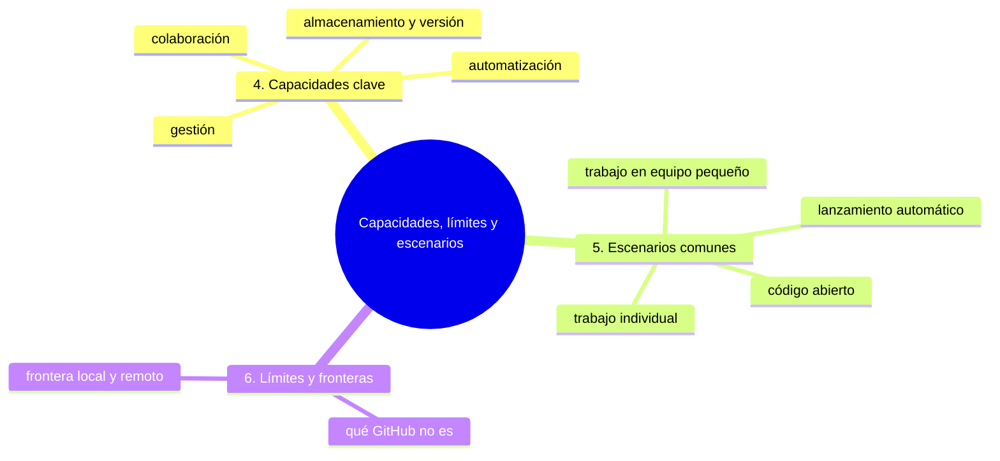
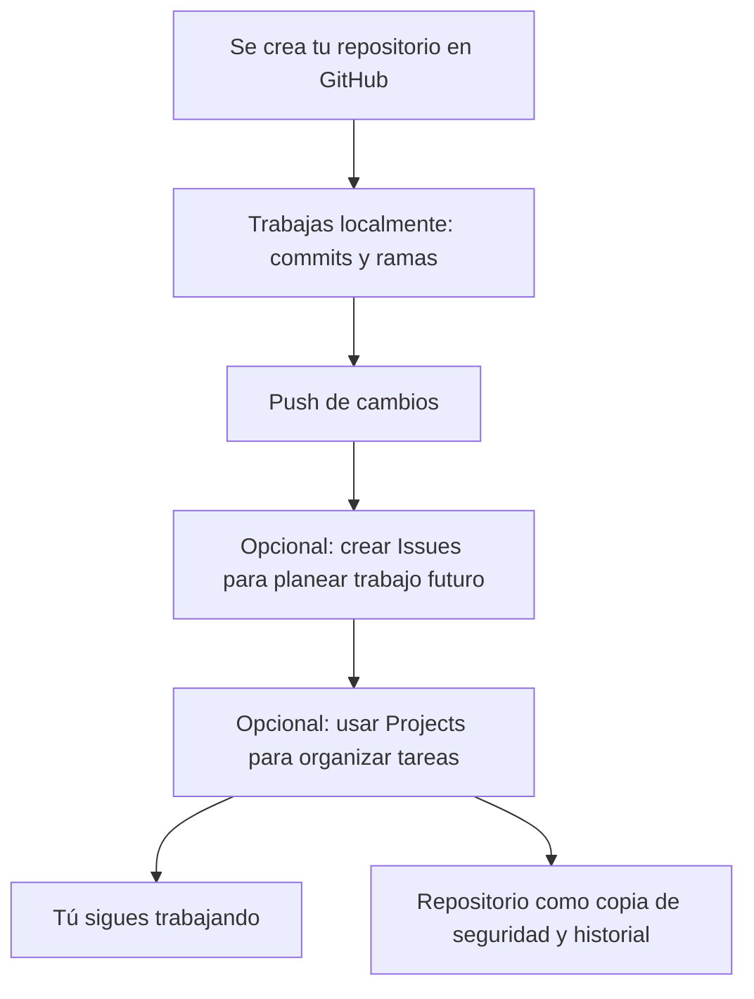
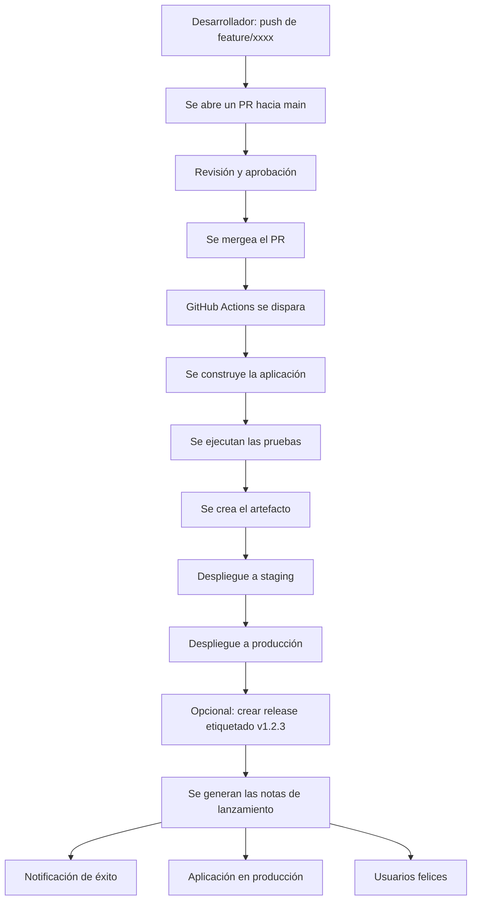

# Capacidades, límites y escenarios de GitHub

## Introducción

Ya tienes el esqueleto del modelo mental: el repositorio como unidad fundamental, Git como motor y el flujo de trabajo típico. Ahora le añades detalle: qué sabe hacer GitHub, qué no puede hacer y cómo se ven los escenarios cotidianos dentro de ese modelo.

En este capítulo ordenarás las capacidades clave en cuatro categorías, marcarás los límites del sistema y recorrerás cuatro escenarios reales de uso.

---

## Mapa conceptual de este capítulo



---

## 4. Capacidades clave de GitHub en tu modelo mental

Organicemos las capacidades de GitHub en categorías que tenga sentido en tu modelo mental.

### 4.1. Capacidades de almacenamiento y versión

```text
Almacenamiento y versiones
    │
    ├── Alojamientode repositorios Git remotos
    │   │
    │   ├── Accesible vía HTTPS y SSH
    │   │
    │   ├── Historial completo disponible para clonar
    │   │
    │   └── Protección contra pérdida de datos
    │
    ├── Exploración de historial mediante web
    │   │
    │   ├── Visualización de commits y cambios
    │   │
    │   ├── Navegación de ramas y etiquetas
    │   │
    │   └── Búsqueda en el código y el historial
    │
    └── Descarga y clonación
        │
        ├── Clonar repositorio completo
        │
        ├── Descargar archivos específicos
        │
        └── Descargar releases etiquetados
```

### 4.2. Capacidades de colaboración

```text
Colaboración
    │
    ├── Issues (trabajo a realizar)
    │   │
    │   ├── Seguimiento de errores, características y tareas
    │   │
    │   ├── Asignación, etiquetado y priorización
    │   │
    │   ├── Discusión mediante comentarios
    │   │
    │   └── Vinculación a commits y PRs
    │
    ├── Pull Requests (propuestas de cambio)
    │   │
    │   ├── Proponer fusión de ramas
    │   │
    │   ├── Revisión de código línea por línea
    │   │
    │   ├── Comentarios y discusión estructurada
    │   │
    │   ├── Integración con revisiones requeridas
    │   │
    │   └── Verificaciones automatizadas (CI/CD)
    │
    ├── Discussions (conversaciones abiertas)
    │   │
    │   ├── Preguntas y respuestas abiertas
    │   │
    │   ├── Intercambio de ideas y retroalimentación
    │   │
    │   └── Construcción de conocimiento comunitario
    │
    └── Forks (copias personales)
        │
        ├── Experimentación sin afectar al original
        │
        ├── Contribución a proyectos externos
        │
        └── Puntos de partida para trabajo derivado
```

### 4.3. Capacidades de gestión

```text
Gestión
    │
    ├── Configuración del repositorio
    │   │
    │   ├── Visibilidad (pública/privada)
    │   │
    │   ├── Ramas protegidas
    │   │
    │   ├── Política de fusiones (squash, merge, rebase)
    │   │
    │   ├── Regla de asignación automática de revisores
    │   │
    │   └── Plantillas de Issues y PRs
    │
    ├── Gestión de acceso y permisos
    │   │
    │   ├── Roles (lectura, escritura, administración)
    │   │
    │   ├── Equipos y organizaciones
    │   │
    │   ├── Protección de ramas mediante reglas
    │   │
    │   └── Control de acceso granular
    │
    ├── Project Management
    │   │
    │   ├── Tableros Kanban (Projects)
    │   │
    │   ├── Seguimiento de progreso mediante hitos
    │   │
    │   └── Integración con Issues y PRs
    │
    └── Documentación
        │
        ├── Wikis para documentación colaborativa
        │
        ├── Páginas de lectura automática (README)
        │
        └── GitHub Pages para sitios de documentación
```

### 4.4. Capacidades de automatización

```text
Automatización
    │
    ├── GitHub Actions (CI/CD)
    │   │
    │   ├── Flujo de trabajo basado en eventos
    │   │
    │   ├── Construcción, prueba y despliegue
    │   │
    │   ├── Ejecución en respuesta a push, PR, etc.
    │   │
    │   ├── Matriz de pruebas (multiplataforma, versiones)
    │   │
    │   └── Despliegue a diversos servicios (Azure, AWS, etc.)
    │
    ├── Webhooks
    │   │
    │   ├── Notificaciones HTTP personalizadas
    │   │
    │   ├── Integración con servicios externos
    │   │
    │   └── Automatización de flujos de trabajo externos
    │
    ├── Packages (registro de paquetes)
    │   │
    │   ├── Almacenamiento de paquetes npm, Docker, Maven, etc.
    │   │
    │   ├── Versionamiento y distribución de artefactos
    │   │
    │   └── Integración con flujos de construcción
    │
    └── Seguridad
        │
        ├── Escaneo de dependencias vulnerables
        │
        ├── Análisis de seguridad de código
        │
        ├── Alertas automatizadas de vulnerabilidades
        │
        └── Políticas de seguridad de repositorio
```

---

## 5. Escenarios comunes y cómo encajan en tu modelo mental

Veamos cómo diferentes situaciones comunes se representan en tu modelo mental.

### 5.1. Trabajo individual en un proyecto personal



En este escenario, GitHub funciona principalmente como:
* Copia de seguridad remota;
* Historial accesible desde cualquier lugar;
* Plataforma opcional para organización de trabajo (Issues, Projects);
* Medio para mostrar tu trabajo a otros (portafolio).

### 5.2. Trabajo en equipo pequeño

```text
[Desarrollador A]      [Desarrollador B]      [Desarrollador C]
    │                         │                         │
    │ fetch/pull main         │ fetch/pull main         │ fetch/pull main
    │                         │                         │
    ▼                         ▼                         ▼
[Trabajo local y commits] [Trabajo local y commits] [Trabajo local y commits]
    │                         │                         │
    │ push ramas              │ push ramas              │ push ramas
    ───────────────────────►  ───────────────────────►  ───────────────────────►
    │                         │                         │
    │                         │                         │
    ▼                         ▼                         ▼
                    [GitHub]
                    │
                    ├─ Recibir push de todas las ramas
                    ├─ Alojar repositorio central
                    ├─ Facilitar PRs entre desarrolladores
                    ├─ Ejecutar verificaciones automatizadas
                    └─ Mantener historial unificado
                    │
                    ▼
            [Main actualizada con trabajo integrado]
                    │
                    ▲ fetch/pull main
                    │                         │
                    │                         │
                    └─────────────────────────┘
```

En este escenario, GitHub funciona como:
* Centro de colaboración y sincronización;
* Mediador para revisiones de código mediante PRs;
* Ejecutor de verificaciones automatizadas;
* Mantenedor de historial unificado y accesible.

### 5.3. Contribución a proyecto de código abierto

```text
[Tú (contribuidor)]    [Mantenedores del proyecto]
    │                         │
    │ fork del repositorio    │
    ◄─────────────────────────┘
    │                         │
    │ trabajar en fork        │
    │ (commits, ramas, etc.)  │
    │                         │
    │ push cambios al fork    │
    ─────────────────────────►
    │                         │
    │ abrir PR desde fork     │
    │ hacia repositorio original
    ◄─────────────────────────┘
    │                         │
    │ revisar PR, comentar    │
    │ sugerir cambios         │
    │                         │
    │ atender comentarios     │
    │ hacer más commits       │
    │ push al mismo fork      │
    ─────────────────────────►
    │                         │
    │ aprobar y mergear PR    │
    │                         │
    ▼                         ▼
[Fork actualizado]    [Repositorio original con nueva contribución]
    │                         │
    │ sync con upstream       │
    │ (opcional)              │
    ◄─────────────────────────┘
```

En este escenario, GitHub funciona como:
* Facilitador de fork para experimentación sin permisos de push directo;
* Medio para proponer cambios mediante PRs desde forks;
* Plataforma para revisión pública y discusión comunitaria;
* Garantía de que los mantenedores mantienen el control final sobre qué se integra.

### 5.4. Flujo de trabajo con lanzamiento automático



En este escenario, GitHub funciona como:
* Iniciador de flujos de trabajo automatizados;
* Origen de eventos que desencadenan construcción y despliegue;
* Mediador entre código y sistemas de entrega;
* Proveedor de visibilidad sobre el estado del proceso de lanzamiento.

### Ejercicio de transferencia

Elige un escenario que NO esté en el capítulo —por ejemplo, un club vecinal que organiza una fiesta anual— y aplícale el modelo mental:

1. Escribe en qué fase entra el trabajo individual y en qué fase empieza lo compartido.
2. Indica qué capacidad de GitHub usarías (Issues, Projects, ramas, Actions) para cada fase y por qué.
3. Señala qué quedaría fuera de lo que GitHub puede hacer por ese club.

Entregable: un esquema de 6 a 10 líneas con las fases, la capacidad elegida en cada una y una frase de límite.

---

## 6. Límites y fronteras en tu modelo mental

Es importante también entender qué **no** es parte de GitHub o dónde termina su responsabilidad.

### 6.1. Qué GitHub no es

```text
GitHub NO es:
    │
    ├── Tu entorno local de desarrollo
    │   │
    │   ├── Tu editor de código (VS Code, IntelliJ, etc.)
    │   │
    │   ├── Tu compilador o intérprete
    │   │
    │   └── Tu base de datos local o servicios de desarrollo
    │
    ├── El único lugar donde existe tu código
    │   │
    │   │ (también existe en tu máquina local y en los forks de otros)
    │   │
    │   └── (el historial está distribuido, aunque GitHub aloja una copia autoritativa)
    │
    ├── Un servicio de alojamiento general de archivos
    │   │
    │   │ (está optimizado para repositorios Git, no para almacenamiento arbitrario)
    │   │
    │   └── (para archivos grandes binary, se recomienda Git LFS o servicios externos)
    │
    ├── Un reemplazo para la comunicación directa del equipo
    │   │
    │   │ (complementa, pero no reemplaza reuniones, chat, llamadas, etc.)
    │   │
    │   └── (la comunicación efectiva sigue requiriendo interacción humana directa)
    │
    └── Una garantía de calidad de código
        │
        │ (proporciona herramientas para revisión y pruebas, pero no asegura calidad por sí mismo)
        │
        └── (la calidad depende de las prácticas del equipo, no solo de las herramientas)
```

### 6.2. La frontera entre local y remoto

En tu modelo mental, esta frontera es crucial:

```text
Frontera Local ←─► Remoto
    │                       │
    │  Lo que controlas completamente: │  Lo que compartes y sincronizas:
    │  │                               │
    │  ├─ Working directory           │  ├─ Historial compartido (push/pull)
    │  ├─ Área de preparación         │  ├─ Ramas visibles para otros
    │  ├─ Commits locales             │  ├─ Issues y PRs
    │  ├─ Ramas locales               │  ├─ Revisión de código
    │  ├─ Historial local no pusheado │  ├─ Verificaciones automatizadas
    │  │                               │  ├─ Lanzamientos y releases
    │  └─ Experimentación privada     │  └─ Configuración del repositorio
    │                                 │
    ▼                                 ▼
Lo que es privado y aislado     Lo que es público y colaborativo
    │                                 │
    │  Puedes reescribir historial    │  Historial es inmutable una vez compartido
    │  Puedes experimentar libremente │  Cambios afectan a otros
    │  No afectas a otros directamente│  Requieren consenso y coordinación
    ▼                                 ▼
Libertad individual             Responsabilidad compartida
```

---

## Autopreguntas de cierre

Sin mirar el material, responde mentalmente y luego compruébalo con este capítulo:

1. Si GitHub estuviera caído un día, ¿qué trabajo seguiría funcionando en tu equipo y por qué?
2. ¿Por qué Issues y Pull Requests son herramientas de colaboración y no solo de almacenamiento?
3. ¿Qué diferencia práctica hay entre «repositorio como copia de seguridad» y «repositorio como centro de trabajo»?
4. ¿Qué es lo que GitHub no puede hacer por tu equipo aunque uses todas sus herramientas?
5. ¿Por qué el historial ya compartido es «inmutable» mientras que tu historial local puedes reescribirlo?
6. ¿Qué problema tendría un equipo que intentara coordinar su comunicación diaria solo con Issues?
7. ¿Por qué conviene ordenar las capacidades en cuatro categorías en lugar de memorizar una lista larga de funciones?

---

## Próximo paso

Ya sabes qué hace GitHub, qué no hace y cómo se ven los escenarios reales. Sigue con [`09-usar-y-evolucionar-tu-modelo-mental.md`](09-usar-y-evolucionar-tu-modelo-mental.md): usar el modelo mental para diagnosticar problemas y hacerlo evolucionar.

