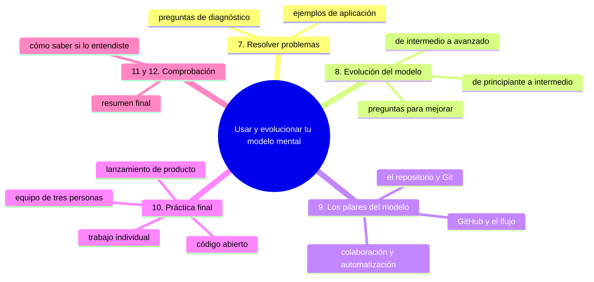
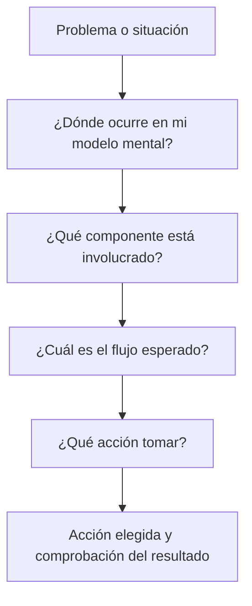
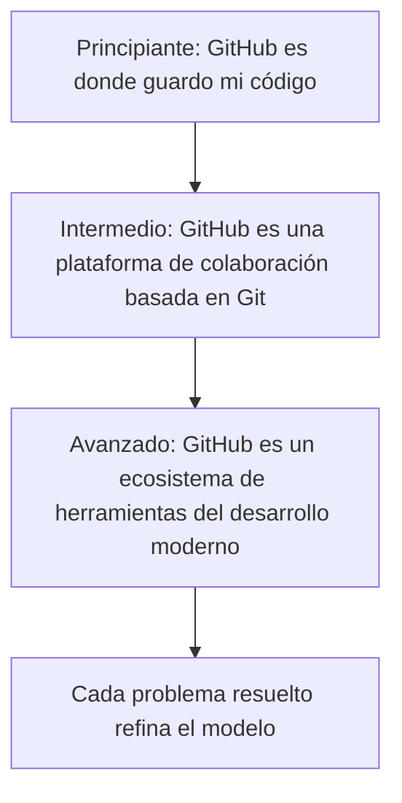

# Usar y evolucionar tu modelo mental de GitHub

## Introducción

Ya tienes descrito tu modelo mental de GitHub: componentes, capacidades, límites y escenarios. En este capítulo lo conviertes en una herramienta de trabajo: lo usarás para diagnosticar problemas reales, verás cómo evoluciona con la experiencia y lo aplicarás a situaciones nuevas.

Terminarás con los pilares del modelo, una práctica final con cuatro escenarios y las preguntas para comprobar que lo entendiste.

---

## Mapa conceptual de este capítulo

---

## 7. Cómo usar tu modelo mental para resolver problemas

Tu modelo mental de GitHub no es solo para entender: es una herramienta para razonar y resolver problemas.

### 7.1. Preguntas que tu modelo mental te ayuda a responder

Cuando te encuentres con una situación, pregúntate:

#### ¿Dónde ocurre esto en mi modelo mental?
* ¿Es un problema local (en mi máquina) o remoto (en GitHub)?
* ¿Está relacionado con el historial, las ramas, la colaboración o la automatización?
* ¿Está en el flujo de trabajo de desarrollo o en la gestión del repositorio?

#### ¿Qué componente está involucrado?
* ¿Es el motor Git subyacente o una capa de GitHub (Issues, PRs, Actions)?
* ¿Está en el almacenamiento, la colaboración, la gestión o la automatización?
* ¿Es algo que afecta a mi trabajo individual o al trabajo del equipo?

#### ¿Cuál sería el flujo esperado según mi modelo mental?
* ¿Qué debería suceder paso a paso según mi comprensión?
* ¿En qué punto se desvía la realidad de lo esperado?
* ¿Qué suposición de mi modelo mental podría estar incorrecta o incompleta?

#### ¿Qué acción tomar basada en mi modelo mental?
* ¿Necesito trabajar localmente (commit, branch, reset)?
* ¿Necesito interactuar con el remoto (push, pull, fetch)?
* ¿Necesito usar las herramientas de colaboración de GitHub (PR, Issues)?
* ¿Necesito ajustar la configuración o permisos del repositorio?

### 7.2. Ejemplos de aplicación

#### Problema: "Mis cambios no aparecen en GitHub después de hacer commit"

**Análisis con modelo mental:**
* Commit es operación local (en mi repositorio Git local);
* Para que aparezca en GitHub, necesito push;
* Probablemente olvidé hacer push después del commit.

**Solución:** `git push origin nombre-de-rama`

#### Problema: "No puedo hacer pull porque dice que tengo cambios conflictos"

**Análisis con modelo mental:**
* Pull intenta fusionar cambios remotos con mi working directory;
* Tengo cambios locales no committeados que entrarían en conflicto;
* Git no permite sobreescribir cambios no committeados durante pull.

**Solución:** O bien `git stash` mis cambios locales, hacer pull, luego `git stash pop`;
O bien committear mis cambios locales primero, luego hacer pull.

#### Problema: "Abrí un PR pero no se ejecuta ninguna verificación"

**Análisis con modelo mental:**
* Los PRs en GitHub pueden desencadenar GitHub Actions;
* Si no se ejecutan verificaciones, quizás:
  * No hay workflows configurados en `.github/workflows/`;
  * Los workflows no se disparan por eventos de PR;
  * Hay permisos insuficientes para ejecutar Actions;
  * El workflow tiene condiciones que no se cumplen.

**Solución:** Verificar existencia y configuración de workflows; revisar permisos; revisar condiciones del workflow.

#### Problema: "Quiero volver a un estado anterior pero temo perder trabajo"

**Análisis con modelo mental:**
* Tengo opciones según si los cambios están locales o ya pusheados:
  * Si están solo locales: `git reset` o `git checkout` pueden ayudar;
  * Si ya están pusheados: debo considerar el impacto en otros;
  * Para volver sin afectar historial compartido: `git revert` es más seguro;
  * Para trabajo experimental: debería estar en una rama separada.

**Solución:** Depende del contexto, pero mi modelo mental me recuerda considerar el alcance y las consecuencias antes de actuar.

---

## 8. Evolución de tu modelo mental

Tu modelo mental no es estático: debe evolucionar a medida que ganas experiencia.

### 8.1. Desde principiante a intermedio

**Principiante ve:**
* GitHub = "lugar donde guardo mi código";
* Commit = "guardar archivo";
* Push = "subir a internet";
* Pull Request = "enviar código para que lo miren";
* Issues = "lista de cosas por hacer".

**Intermedio ve:**
* GitHub = "plataforma de colaboración basada en Git";
* Commit = "instantánea del estado del proyecto con contexto";
* Push = "sincronizar mi historial local con el remoto compartido";
* Pull Request = "propuesta estructurada para integrar trabajo con revisión";
* Issues = "sistema de seguimiento de trabajo vinculado al código";
* Ramas = "líneas de desarrollo aisladas para trabajo paralelo";
* Fusiones = "puntos de integración donde se combina trabajo";
* Actions = "automatización que responde a eventos del repositorio".

### 8.2. Desde intermedio a avanzado

**Intermedio ve lo anterior; avanzado añade:**
* GitHub = "ecosistema de herramientas que soportan el desarrollo moderno de software";
* Commit = "unidad básica de trabajo colaborativo y trazabilidad histórica";
* Push/pull = "mecanismo de consenso para convergencia y divergencia de trabajo";
* Pull Request = "interfaz para revisión de calidad, transferencia de conocimiento y decisión colectiva";
* Issues = "lenguaje compartido para describir trabajo, prioridades y dependencias";
* Ramas = "estructuras para gestionar incertidumbre, experimentación y riesgo";
* Fusiones = "puntos de síntesis donde se resuelven conflictos creativos y técnicos";
* Actions = "infraestructura programable que convierte el repositorio en un sistema activo";
* Seguridad y permisos = "marcos de confianza que permiten colaboración a escala";
* Forks = "mecanismo para permiso colaborativo sin compromiso directo";
* Releases = "puntos de entrega que separan desarrollo interno de valor externo";

### 8.3. Preguntas para evolucionar tu modelo mental

Para seguir mejorando tu modelo mental, pregúntate periódicamente:

* ¿Qué aspectos de GitHub aún me parecen mágicos o misteriosos?
* ¿Qué situaciones comunes me hacen sentir que falta alguna pieza en mi comprensión?
* ¿Qué nuevas características he visto y cómo las encajaría en mi modelo existente?
* ¿Qué flujos de trabajo complejos he observado y cómo los explicaría con mi modelo?
* ¿Qué limitaciones he encontrado y cómo explicaría esas limitaciones desde mi modelo?
* ¿Qué metáforas o analogías me ayudan a explicar GitHub a otros con diferentes niveles de experiencia?

---

## 9. Resumen: los pilares de tu modelo mental de GitHub

Consolidemos los elementos clave que deberías tener en tu modelo mental:

### 9.1. El repositorio como núcleo
* Contenedor fundamental que combina código, historial y colaboración;
* Fuente única de verdad para el trabajo compartido del equipo;
* Unidad de propiedad con visibilidad definida (pública/privada).

### 9.2. Git como motor subyacente
* Responsable del control de versiones distribuido;
* Opera principalmente en el entorno local con sincronización remota;
* Maneja snapshots, ramas, fusiones y recuperación de estados.

### 9.3. GitHub como plataforma extensor
* Aloja repositorios Git remotos y los hace accesibles;
* Añade capas de colaboración (Issues, PRs, Reviews);
* Proporciona gestión de acceso, protección de ramas y configuración;
* Ofrece automatización mediante Actions y webhooks;
* Integra servicios de paquetes, seguridad y documentación.

### 9.4. Flujo de trabajo como patrón de vida
* Trabajo aislado en ramas locales;
* Compartición periódica mediante push;
* Propuesta estructurada de cambios mediante Pull Requests;
* Revisión de código y discusión como paso previo a la integración;
* Integración controlada mediante fusión a ramas principales;
* Sincronización regular mediante pull para mantenerse actualizado;
* Eliminación de ramas temporales tras fusión exitosa.

### 9.5. Colaboración como propiedad emergente
* Transparencia mediante historial visible y atribuible;
* Responsabilidad mediante autoría clara y mensajería descriptiva;
* Consenso mediante revisión y aprobación antes de la fusión;
* Transferencia de conocimiento mediante comentarios y discusión vinculada al código;
* Independencia mediante trabajo asincrónico y ramas aisladas.

### 9.6. Automatización como fuerza multiplicadora
* Respuesta a eventos (push, PR, issue) mediante workflows definidos;
* Construcción, prueba y despliegue automáticos;
* Retroalimentación temprana sobre calidad y compatibilidad;
* Liberación de esfuerzo humano para tareas creativas y de decisión;
* Consistencia mediante ejecución reproducible de procesos.

### 9.7. Evolución como principio
* Tu modelo mental debe mejorar con la experiencia y el uso;
* Cada situación problemática es una oportunidad para refinar tu comprensión;
* La metáfora adecuada depende del contexto y la audiencia;
* El verdadero valor no está en las herramientas, sino en las prácticas que permiten;
* El objetivo final es habilitar trabajo humano efectivo, creativo y sostenible.

---

## 10. Práctica final: aplicar tu modelo mental

Para consolidar tu aprendizaje, aplica tu modelo mental a estos escenarios:

### Escenario A: Trabajo individual
Quieres aprender un nuevo framework y crear un proyecto de prueba para experimentar.

**Aplica tu modelo mental:**
* ¿Cómo estructurarías tu repositorio?
* ¿Qué usarías localmente vs. lo que compartirías en GitHub?
* ¿Cómo usarías ramas para experimentar sin afectar tu trabajo principal?
* ¿Cómo documentarías tu aprendizaje para futuras referencias?

### Escenario B: Equipo de tres personas
Tres desarrolladores están creando una aplicación móvil juntos.

**Aplica tu modelo mental:**
* ¿Cómo dividirían el trabajo usando ramas?
* ¿Cómo manejarían las dependencias entre su trabajo?
* ¿Cómo usarían Pull Requests para asegurar la calidad?
* ¿Cómo usarían Issues para planificar y seguir el progreso?
* ¿Cómo configurarían protección de ramas para su main?
* ¿Cómo usarían Actions para probar en cada cambio?

### Escenario C: Proyecto de código abierto
Quieres contribuir a un proyecto popular que usas frecuentemente.

**Aplica tu modelo mental:**
* ¿Cómo harías un fork para empezar a trabajar?
* ¿Cómo crearías una rama para tu contribución específica?
* ¿Cómo escribirías un buen mensaje de commit para tu cambio?
* ¿Cómo abrirías un Pull Request que sea fácil de revisar?
* ¿Cómo atenderías los comentarios de los mantenedores?
* ¿Cómo mantendrías tu fork actualizado con el proyecto principal?

### Escenario D: Lanzamiento de producto
Tu equipo está preparando el lanzamiento de una versión importante de su software.

**Aplica tu modelo mental:**
* ¿Cómo usarían etiquetas (tags) para marcar la versión para lanzamiento?
* ¿Cómo crearían una rama de release para preparativos finales?
* ¿Cómo usarían Issues para seguir tareas pendientes de lanzamiento?
* ¿Cómo configurarían Actions para construir y desplegar automáticamente?
* ¿Cómo usarían Releases en GitHub para distribuir la versión lanzada?
* ¿Cómo documentarían el lanzamiento para usuarios y desarrolladores internos?

### Ejercicio de transferencia

Elige un proyecto que no sea de software —por ejemplo, publicar el boletín mensual de una asociación— y decide con tu modelo mental:

1. Qué harías en tu «rama local» (trabajo aislado) y qué compartirías en GitHub desde el primer día.
2. Qué capacidad usarías para que otra persona revise el boletín antes de publicarlo y por qué.
3. Qué parte automatizarías con Actions y qué parte dejarías a criterio humano.

Entregable: un párrafo de 6 a 9 líneas con tres decisiones justificadas y al menos dos términos del capítulo (rama, Pull Request, Actions) usados correctamente.

---

## 11. Cómo saber si lo entendiste

Deberías poder explicar con tus propias palabras:

* el repositorio como unidad fundamental que combina código, historial y colaboración;
* Git como motor subyacente de control de versiones que opera localmente y se sincroniza con remotos;
* GitHub como plataforma que extiende Git con colaboración, gestión y automatización;
* el flujo de trabajo típico que integra ramas locales, push, Pull Requests, revisión y fusión;
* cómo las capacidades de colaboración (Issues, PRs) facilitan el trabajo en equipo;
• cómo las capacidades de gestión (protección de ramas, permisos) permiten trabajo a escala;
* cómo las capacidades de automatización (Actions, webhooks) convierten el repositorio en un sistema activo;
* los límites y fronteras entre lo local y lo remoto, lo privado y lo compartido;
* cómo usar tu modelo mental para razonar sobre problemas y decidir acciones;
* cómo tu modelo mental debe evolucionar con la experiencia y el uso compartido;
* cómo aplicar tu modelo mental a diferentes escenarios de trabajo individual, en equipo y código abierto.

Si alguna respuesta todavía no está clara, vuelve a la sección correspondiente y repite la práctica, enfocándote en cómo las piezas se integran en tu modelo mental completo.

---

## 12. Resumen final

En este capítulo has desarrollado un modelo mental integral de GitHub que integra:

* **El repositorio** como contenedor fundamental de código, historial y colaboración;
* **Git** como motor subyacente de control de versiones que opera principalmente localmente;
* **GitHub** como plataforma que aloja repositorios remotos y agrega colaboración, gestión y automatización;
* **El flujo de trabajo típico** que combina trabajo aislado en ramas locales, compartir mediante push, proponer cambios mediante Pull Requests, revisar código y fusionar a ramas principales;
* **Las capacidades clave** de almacenamiento, colaboración, gestión y automatización que hacen de GitHub más que solo un repositorio Git remoto;
* **Los límites y fronteras** que definen qué es local vs. remoto, privado vs. compartido, individual vs. equipo;
* **Cómo usar tu modelo mental** para razonar sobre problemas, predecir resultados y decidir acciones apropiadas;
* **Cómo evolucionar tu modelo mental** con la experiencia para abordar situaciones cada vez más complejas;

La idea principal es:

> **GitHub no es solo un lugar para guardar código, ni es solo Git en la web. Es una plataforma integrada que combina el poder del control de versiones distribuido con herramientas sofisticadas para colaboración, gestión y automatización. Un buen modelo mental de GitHub te permite ver cómo estas piezas se integran para habilitar trabajo humano efectivo, creativo y sostenible en proyectos de software modernos.**

---

## Autopreguntas de cierre

Sin mirar el material, responde mentalmente y luego compruébalo con este capítulo:

1. ¿Por qué el diagnóstico empieza preguntando «¿dónde ocurre el problema?» y no «¿qué comando ejecuto?»?
2. Si tus cambios no aparecen en GitHub después de hacer commit, ¿qué pieza del modelo te lleva a la respuesta y por qué?
3. ¿Qué suposición de tu modelo mental podría estar equivocada cuando un comando se comporta distinto de lo esperado?
4. ¿Por qué `git revert` es más seguro que `git reset` cuando el cambio ya está compartido?
5. ¿Qué ganas al describir GitHub como plataforma integrada en lugar de «un sitio para guardar código»?
6. ¿Cómo te ayuda el límite entre local y remoto a decidir si puedes reescribir historial?
7. ¿Qué señales te dicen que tu modelo mental dejó de crecer y que necesitas un escenario nuevo?

---

## Próximo paso

Has completado la sección 02-github-desde-cero. Ahora tienes una comprensión sólida de:

* Qué es GitHub y para qué sirve;
* La diferencia entre Git y GitHub;
* Qué es un repositorio y los tipos (público y privado);
* Qué es el control de versiones y cómo funciona;
* Un modelo mental completo de cómo GitHub funciona como sistema integrado;

Continúa con la siguiente sección del tutorial o aplica lo aprendido a tus propios proyectos.

¡Felicitaciones por completar esta sección fundamental del tutorial GitHub Paso a Paso!