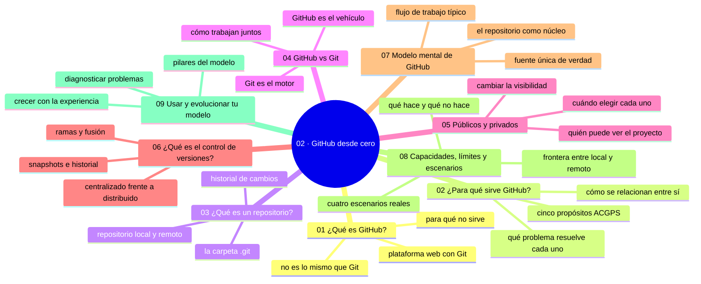

# 02 — GitHub desde cero

## Bienvenido a la sección de GitHub desde cero

En esta sección aprenderás los conceptos básicos de GitHub, la plataforma que utilizaremos durante el resto del recorrido.

Ya comprendiste qué es un archivo, una carpeta, una ruta, una extensión, un programa y la terminal. Ahora es el momento de conocer GitHub, que es mucho más que un simple alojamiento para repositorios Git.

En esta sección estudiarás:

* qué es GitHub y para qué sirve;
* la diferencia fundamental entre Git y GitHub;
* qué es un repositorio y los tipos de repositorios (públicos y privados);
* el concepto de control de versiones;
* cómo se relacionan la colaboración, el historial, los commits y las ramas;
* la diferencia entre repositorios locales y remotos.

Al finalizar esta sección, estarás listo para comenzar a utilizar GitHub desde su interfaz web, el siguiente paso lógico en nuestro recorrido.

---

## Objetivos de aprendizaje

Al terminar esta sección serás capaz de:

* explicar qué es GitHub y qué problema resuelve para un equipo de desarrollo;
* diferenciar Git (sistema de control de versiones) de GitHub (plataforma);
* identificar la estructura de un repositorio y decidir entre público y privado;
* explicar el concepto de control de versiones y la relación entre historial, commits y ramas;
* distinguir un repositorio local de un repositorio remoto.

---

## Mapa conceptual

---

## ¿Qué aprenderás en esta sección?

Cada capítulo de esta sección está diseñado para construir tu comprensión progresivamente:

1. **¿Qué es GitHub?** - Conocerás la plataforma y su propósito principal.
2. **¿Para qué sirve GitHub?** - Exploraremos las funcionalidades que ofrece más allá del control de versiones.
3. **¿Qué es un repositorio?** - Entenderás el concepto fundamental de repositorio y su estructura.
4. **GitHub vs Git** - Comprenderás claramente la diferencia entre el sistema de control de versiones y la plataforma.
5. **Repositorios públicos y privados** - Aprenderás los tipos de repositorios y cuándo utilizar cada uno.
6. **¿Qué es el control de versiones?** - Profundizaremos en el concepto que subyace a todo lo que hacemos con Git.
7. **Modelo mental de GitHub** - Integrarás lo aprendido en un modelo coherente: el repositorio, Git y el flujo de trabajo típico.
8. **Capacidades, límites y escenarios** - Ordenarás lo que sabe y no sabe hacer GitHub y lo aplicarás a cuatro escenarios reales.
9. **Usar y evolucionar tu modelo mental** - Usarás el modelo para diagnosticar problemas y lo harás crecer con la experiencia.

---

## Cómo estudiar esta sección

Cada capítulo incluye:

* Explicaciones claras y progresivas;
* Ejemplos visuales y prácticos;
* Diagramas que ilustran los conceptos;
* Prácticas guiadas para que apliques lo aprendido;
* Experimentos controlados para verificar tu comprensión;
* Ejercicios de análisis para desarrollar tu pensamiento crítico;
* Resúmenes que consolidan las ideas principales;
* Enlaces al siguiente capítulo para continuar tu aprendizaje.

Recuerda: no se trata de memorizar definiciones, sino de comprender qué problema resuelve cada concepto y cómo se aplica en situaciones reales.

---

## Referencias

* Chacon, S. y Straub, B. — *Pro Git* (cap. 1), disponible en git-scm.com/book/es/v2.
* GitHub — Documentación oficial: «About GitHub» (docs.github.com).
* Git — Documentación oficial (git-scm.com/doc).

---

## Checkpoint 02 — Comprobación obligatoria

Antes de avanzar a `03-tu-cuenta-de-github/`, demuestra que puedes (en un repositorio de práctica real):

1. **Crear** un repositorio en GitHub desde la web, eligiendo tú el nombre, la descripción y la visibilidad (público o privado).
2. **Explicar** en voz alta la diferencia entre Git y GitHub usando una comparación de tu vida diaria.
3. **Abrir** dos repositorios públicos y señalar en pantalla su historial de commits, su README y su pestaña de Issues.
4. **Decidir** la visibilidad de tres proyectos reales (uno personal, uno con datos sensibles, uno para compartir) y justificar cada elección en una línea.
5. **Comparar** dos versiones de un mismo archivo explicando qué cambió entre ellas y por qué poder volver atrás importa.
6. **Enunciar** qué podría hacer Git sin GitHub y qué podría hacer GitHub sin Git local.

Si puedes hacerlo **sin mirar instrucciones**, el checkpoint está cerrado.

---

## Autopreguntas de cierre

Sin mirar el material, responde mentalmente y luego compruébalo con los capítulos de la sección:

1. ¿Qué hace Git que no hace GitHub, y viceversa?
2. ¿En qué caso creas un repositorio privado en lugar de público?
3. ¿Qué te da el control de versiones que «guardar copia final.docx» no te da?
4. ¿Dónde vive el historial de un repositorio local y dónde el de un remoto?
5. Si borras hoy un archivo de un proyecto que luego pasará de privado a público, ¿qué puede seguir visible y por qué?
6. ¿Por qué un equipo necesita tanto el historial local de Git como la plataforma de GitHub para colaborar bien?
7. ¿En qué momento de un proyecto real notarías que te falta control de versiones y no solo «guardar copias»?
8. ¿Qué perderías si GitHub desapareciera mañana y qué seguirías pudiendo hacer con lo que ya tienes en tu equipo?

---

## Próximo paso

Una vez que completes esta sección, estarás listo para comenzar a utilizar GitHub desde su interfaz web.

Continúa con:

[`03-tu-cuenta-de-github/`](../03-tu-cuenta-de-github/)
