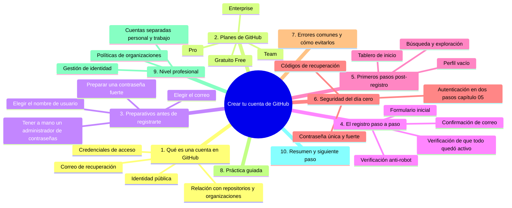
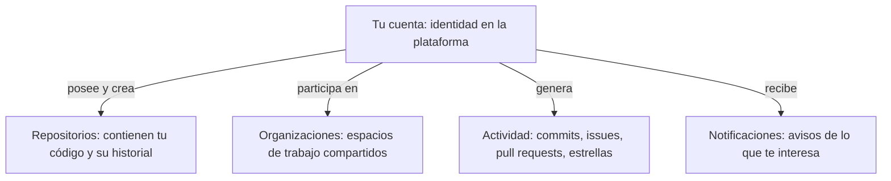
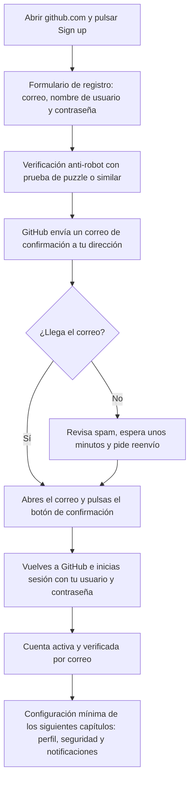

# Crear tu cuenta de GitHub

## Introducción

En la sección 02 aprendiste qué es GitHub, para qué sirve, qué es un repositorio y cómo se diferencia Git de GitHub.

Ahora llega el momento de dar el primer paso verdaderamente práctico del curso: crear tu cuenta.

Sin cuenta no puedes hacer casi nada en GitHub. No puedes crear repositorios, no puedes clonar proyectos privados, no puedes abrir Pull Requests, no puedes recibir notificaciones ni colaborar con otros. La cuenta es la llave de entrada a toda la plataforma.

Pero crear una cuenta no es solamente rellenar un formulario. La forma en que la creas tiene consecuencias duraderas: tu nombre de usuario será tu identidad pública en el mundo del desarrollo, tu correo será la llave maestra para recuperar el acceso si alguna vez lo pierdes, y tus decisiones iniciales de seguridad determinarán qué tan sólida es tu presencia en una plataforma que guarda el trabajo de miles de proyectos.

Este capítulo está diseñado para que, al terminarlo:

* tengas una cuenta creada con criterio, no por impulso;
* entiendas qué datos pide GitHub y por qué los pide;
* hayas elegido un nombre de usuario pensando a cinco o diez años de distancia;
* hayas configurado las medidas de seguridad mínimas del día cero;
* sepas qué errores cometen los usuarios novatos y cómo evitarlos.

No necesitas instalar nada. Solo necesitas un navegador web, un correo electrónico al que puedas acceder desde tu computadora, y diez minutos de atención. Si prefieres esperar a instalar nada hasta más adelante, estás en el capítulo correcto: esta sección entera ocurre dentro del navegador.

---

## Mapa conceptual de este capítulo

Antes de entrar en detalle, este es el mapa que recorre el contenido:



Recorre los diez bloques en orden. Cada uno depende del anterior.

---

## 1. Qué es una cuenta en GitHub

### 1.1. La cuenta como identidad

En el mundo físico, una identidad se compone de tres elementos:

```text
Identidad en el mundo físico
       │
       ├── Nombre o apodo
       │      (cómo te llaman los demás)
       │
       ├── Documento de identidad
       │      (el papel que acredita que eres tú)
       │
       └── Domicilio o lugar de contacto
              (dónde te encuentran)
```

En GitHub ocurre algo análogo:

```text
Identidad en GitHub
       │
       ├── Nombre de usuario
       │      (cómo te identifican en las URLs y commits)
       │      Ejemplo: github.com/tu-usuario
       │
       ├── Correo electrónico verificado
       │      (el documento que acredita que eres tú)
       │      (y la llave para recuperar el acceso)
       │
       └── Nombre real en el perfil
              (cómo te presentas cuando alguien
               abre tu perfil público)
```

La diferencia importante es que, en el mundo físico, tu identidad te la da el Estado. En GitHub, tu identidad te la das tú con los datos que registras, y GitHub la valida parcialmente a través del correo confirmado.

### 1.2. Qué contiene exactamente tu cuenta

Cuando creas una cuenta, GitHub almacena internamente un conjunto de datos. Conviene conocerlos porque algunos son públicos, otros privados, y de eso depende qué información estás exponiendo:

```text
Datos de tu cuenta
       │
       ├── PÚBLICOS (visible para cualquiera con el enlace)
       │      ├── Nombre de usuario (URL única)
       │      ├── Nombre real (si lo completas)
       │      ├── Biografía (si la completas)
       │      ├── Avatar (si lo subes)
       │      ├── Ubicación (si la completas)
       │      ├── Repositorios públicos
       │      ├── Actividad pública (commits, estrellas, following)
       │      └── Fechas de alta en el perfil
       │
       └── PRIVADOS (solo tú, salvo que lo compartas explícitamente)
              ├── Correo electrónico verificado
              ├── Contraseña (nunca se almacena en claro)
              ├── Configuración de la cuenta
              ├── Repositorios privados
              ├── Organizaciones a las que perteneces
              ├── Dos factores (2FA) y códigos de recuperación
              └── Historial de sesiones activas
```

Distinguir estos dos planos es fundamental para el resto del curso, porque en la sección 05 (repositorios públicos y privados) y en la sección 20 (seguridad) vas a tomar decisiones basadas en esta diferencia.

### 1.3. La cuenta como relación con GitHub

Un punto que muchos principiantes pasan por alto: tu cuenta no es tu código. Es tu relación con la plataforma.



⚠️ **RIESGO:** eliminar tu cuenta de GitHub borra de forma irreversible tus repositorios públicos, tu identidad y las organizaciones donde seas el único propietario; no existe «deshacer».

Si algún día eliminas tu cuenta (algo que GitHub permite), desaparecen los repositorios públicos que tú posees y las organizaciones donde seas el único propietario. Por eso conviene crearla bien desde el principio.

---

## 2. Planes de GitHub

### 2.1. Los cuatro niveles

GitHub ofrece varios niveles de servicio. Antes de registrarte conviene saber qué obtienes y qué te falta, no porque vayas a pagar hoy, sino para que entiendas más adelante qué significa cada límite que encuentres.

```text
Plan gratuito (Free)
   │
   │  · Repositorios públicos ilimitados
   │  · Repositorios privados con colaboradores limitados
   │  · Issues, Pull Requests, Projects
   │  · GitHub Actions con minutos mensuales gratuitos
   │  · Protección básica de rama (limitada)
   │
   │  ─────────────────────────────────────────────
   │
Plan Pro (personal, pago por mes)
   │
   │  · Todo lo del plan gratuito
   │  · Colaboradores ilimitados en repositorios privados
   │  · GitHub Actions con más minutos de ejecución
   │  · Código Copilot opcional (si se contrata aparte)
   │  · Insights avanzados (analíticas de repositorios)
   │  · Codespaces con más horas mensuales
   │
   │  ─────────────────────────────────────────────
   │
Plan Team (equipos, pago por persona y mes)
   │
   │  · Todo lo del plan Pro
   │  · Herramientas de equipo y gobernanza
   │  · Asignación de roles más detallada
   │  · Proyectos con campos avanzados
   │
   │  ─────────────────────────────────────────────
   │
Plan Enterprise (organizaciones grandes)
   │
   │  · Todo lo del plan Team
   │  · Gestión centralizada de seguridad y cumplimiento
   │  · Retención de datos, SAML SSO
   │  · Control granular de políticas
   │
   ▼
```

### 2.2. Qué significa «repositorios privados con colaboradores limitados»

En el plan gratuito, puedes crear todos los repositorios privados que quieras, pero solo puedes invitar a un número pequeño de colaboradores a cada uno (historicamente, hasta 3 colaboradores; verifica el límite vigente en la documentación oficial de GitHub en el momento que uses el curso, porque estos números cambian).

Para el propósito de este curso, el plan gratuito es suficiente: vas a trabajar de forma individual durante las primeras secciones, y cuando llegues a la sección 16 (trabajo en equipo) podrás practicar con repositorios públicos o con el límite disponible.

### 2.3. Cuándo conviene pagar

Para una persona que está aprendiendo: nunca es necesario pagar. Si más adelante entras a trabajar en una empresa, el plan lo pagará esa empresa. Si más adelante decides aportar a un proyecto de código abierto, eso es gratuito. El pago solo es necesario cuando necesitas colaboradores ilimitados en repositorios privados o capacidades avanzadas de gobernanza.

```text
Decisión
   │
   ├── ¿Estás aprendiendo?
   │      └── Plan gratuito. Siempre.
   │
   ├── ¿Trabajas en una empresa con GitHub?
   │      └── La empresa paga el plan adecuado a su equipo.
   │
   ├── ¿Contribuyes a código abierto?
   │      └── Gratis: los repositorios son públicos.
   │
   └── ¿Tienes un proyecto propio con equipo grande
       y necesitas privacidad + colaboradores?
          └── Ahí sí tiene sentido Pro o Team.
```

---

## 3. Preparativos antes de registrarte

Crear una cuenta de forma impulsiva suele llevar a errores que después cuestan corregir: un correo temporal que se pierde, un nombre de usuario que no te representa, una contraseña débil reutilizada. Dedica cinco minutos a estos cuatro preparativos antes de abrir la página de registro.

### 3.1. Elegir el correo electrónico

Tu correo es la llave maestra de la cuenta. Con él confirmas el alta, recuperas el acceso si olvidas la contraseña y validas acciones sensibles.

```text
Jerarquía de correos (de más a menos recomendado)
   │
   ├── 1. Correo profesional o personal permanente
   │      (el que llevas años y seguirás teniendo)
   │
   ├── 2. Correo personal nuevo, dedicado a desarrollo
   │      (creado en un proveedor serio, con 2FA activado)
   │
   ├── 3. Correo universitario o de la empresa
   │      (funciona, pero si termina la relación
   │       educativa o laboral, lo pierdes)
   │
   └── 4. Correo temporal o desechable
         (NUNCA: perderías la cuenta para siempre)
```

Reglas concretas:

* Usa un correo al que tengas acceso a largo plazo.
* Activa la autenticación en dos pasos en ese correo (si el proveedor lo permite).
* No uses un correo de una institución que pueda caducar (carreras terminadas, empleos anteriores).
* Guarda ese correo en tu administrador de contraseñas junto con la cuenta de GitHub.

### 3.2. Elegir el nombre de usuario

Es la decisión más visible de la registro, y la que más cuesta cambiar bien (cambiarla rompe enlaces antiguos).

```text
Criterios de selección de usuario
   │
   ├── Permanencia
   │      └── Asume que lo tendrás 10 años.
   │          Evita «estudiante2026» o «junior-dev»:
   │          no serás estudiante ni junior para siempre.
   │
   ├── Profesionalidad
   │      └── Aparecerá en commits, Pull Requests y
   │          búsquedas de reclutadores.
   │          Evita apodos de juego o datos personales.
   │
   ├── Legibilidad
   │      └── Debe poder decirse en voz alta sin deletrear:
   │          «me encuentras en github.com/anatorres».
   │          Evita cadenas de números y guiones dobles.
   │
   ├── Disponibilidad
   │      └── Si ya está tomado, GitHub ofrece variantes.
   │          Considera un guion en lugar de un punto:
   │          anatorres-dev en lugar de anatorres-2026-99.
   │
   └── Coherencia
          └── Que coincida con tus otros perfiles
              (LinkedIn, portafolio personal) si es posible.
```

Ejemplos razonables:

```text
nombre-apellido        →  maria-lopez
nombre-mas-el-area     →  lucas.datos
nombre-mas-el oficio   →  sofia-dev
apodo-profesional      →  anatorres
```

Ejemplos que conviene evitar:

```text
juan_2003_gamer
user12345
mi-primer-repo
test-account
```

### 3.3. Preparar una contraseña fuerte

GitHub exige una longitud mínima (15 caracteres en las últimas políticas vigentes; verifica el requisito en el formulario actual) y valora la complejidad.

Si no usas un administrador de contraseñas, este es el momento de empezar. Herramientas ampliamente usadas incluyen KeePass (local y gratuito), Bitwarden (gratuito y de código abierto) y las integradas en los navegadores modernos (Edge, Chrome, Firefox). Cualquiera de ellas es mejor que recordar contraseñas en la cabeza o anotarlas en un archivo de texto.

```text
Contraseña débil                     Contraseña fuerte (frase de paso)
   │                                        │
   ├── Tamaño corto (<12)                   ├── Larga (4 o más palabras)
   ├── Contiene el nombre                   ├── Sin relación con datos personales
   ├── Reutilizada en otro sitio            ├── Única: solo para esta cuenta
   ├── Fácil de adivinar                   ├── Fácil de recordar para ti
   └── Se roba con un ataque de diccionario └── Resistente a fuerza bruta
```

Ejemplo de frase de paso (falsa, solo ilustrativa):

```text
luna-verde-caminar-37-marzo
```

Este tipo de contraseñas son más largas (resistencia a fuerza bruta) y más fáciles de recordar que «P@ssw0rd123» (que además aparece en todas las listas de contraseñas más comunes).

### 3.4. Reunir los preparativos

Antes de pulsar «Sign up», ten a mano:

```text
Lista de preparativos
   │
   ├── [ ] Correo elegido y accesible desde este navegador
   │       (inicia sesión en él antes de empezar)
   │
   ├── [ ] Nombre de usuario (tres opciones por si la primera está tomada)
   │
   ├── [ ] Contraseña fuerte guardada en el administrador de contraseñas
   │
   └── [ ] Administrador de contraseñas abierto en otra pestaña
           para guardar la credencial en cuanto se cree
```

---

## 4. El registro paso a paso

### 4.1. Diagrama de flujo completo del registro

Este es el recorrido completo desde que abres el navegador hasta que tu cuenta está plenamente activa:



### 4.2. Formulario de registro

1. Abre el navegador y escribe `https://github.com`.

2. En la esquina superior derecha encontrarás los botones de acceso y registro. El botón de registro aparece como un rectángulo con texto en inglés (la interfaz de registro puede mostrarse en inglés aunque tu navegación posterior pueda cambiarse a español desde la configuración).

3. Pulsa el botón de registro.

4. El formulario solicita los datos en este orden:

   **Correo electrónico.** Escribe el correo que elegiste en los preparativos. GitHub valida en tiempo real que el formato sea correcto (que tenga parte local, arroba y dominio). Si el correo ya está registrado, te indicará que la cuenta existe y te ofrecerá iniciar sesión o recuperar la contraseña.

   **Nombre de usuario.** Al escribirlo, GitHub comprueba en tiempo real si está disponible. Si ya existe, verás un aviso y una lista de sugerencias. Prueba con tus tres opciones preparadas.

   **Contraseña.** GitHub muestra un indicador de fortaleza que reacciona a la longitud y la variedad de caracteres. Un indicador en rojo significa que no se permitirá avanzar; uno en verde (o equivalente) indica que cumple los requisitos mínimos.

5. Es posible que el formulario incluya una casilla adicional con la invitación a recibir correos informativos de GitHub. Es opcional. Puedes dejarla marcada o no: afecta a boletines, no a la seguridad de la cuenta.

### 4.3. Verificación anti-robot

GitHub muestra un desafío de verificación para evitar registros automatizados. Sigue las instrucciones de la pantalla (suele ser un puzzle visual). Si no carga el desafío:

```text
Diagnóstico
   │
   ├── El desafío no aparece
   │      ├── Recarga la página
   │      ├── Desactiva extensiones de bloqueo temporalmente
   │      ── Verifica que JavaScript esté habilitado
   │
   ├── El desafío aparece pero no funciona
   │      ── Prueba con otro navegador
   │
   └── No supera la verificación repetidamente
          ── Espera unos minutos y vuelve a intentarlo
              (hay límite de intentos)
```

### 4.4. Confirmación de correo

Este paso es obligatorio. Hasta confirmarlo, la cuenta queda en estado limitado.

```text
Flujo de confirmación
   │
   ├── GitHub envía un correo a la dirección registrada
   │      │
   │      ├── Asunto: verificación de cuenta
   │      └── Contiene un botón o enlace de confirmación
   │
   ├── Tú abres tu bandeja de entrada
   │      │
   │      ├── ¿No lo ves? Revisa la carpeta de spam o correo no deseado
   │      ├── ¿No llega? Espera 5 minutos y pide reenvío
   │      └── ¿Esperaste y nada? Revisa que escribiste bien el correo
   │               │
   │               └── Si el correo estaba mal escrito, puedes
   │                   corregirlo desde la configuración de cuenta
   │                   o crear una cuenta nueva con el correo correcto
   │
   ├── Pulsas el botón de confirmación
   │      │
   │      └── Te devuelve a GitHub con el estado actualizado
   │
   └── Estado de la cuenta: VERIFICADA
```

Consejo: confirma el correo desde el mismo navegador en el que te registraste. GitHub asocia la sesión y el proceso se completa sin pedirte volver a iniciar sesión.

### 4.5. Estado de la cuenta después del registro

Una vez confirmado el correo, tu cuenta pasa a estar activa. Compruébalo:

```text
Comprobación
   │
   ├── Abre https://github.com/tu-usuario
   │      └── Debe cargar tu página de perfil (aún vacía)
   │
   ├── Abre https://github.com
   │      └── En la esquina superior derecha debe verse tu avatar
   │           o tus iniciales
   │
   └── Abre Settings (Configuración)
          └── En la sección de correo debe aparecer
              tu correo con la marca de verificado
```

Si las tres comprobaciones pasan, la cuenta está lista para el resto del curso.

---

## 5. Primeros pasos post-registro

### 5.1. Qué verás al entrar por primera vez

Al confirmar el correo y entrar, GitHub te muestra el tablero inicial. Verás:

```text
Tablero inicial
   │
   ├── Tu avatar o iniciales arriba a la derecha
   │
   ├── Un panel de bienvenida que invita a crear
   │   el primer repositorio o a empezar un tutorial
   │   (puedes omitirlo: este curso te llevará por ese camino)
   │
   ├── Un buscador arriba, para encontrar repositorios
   │   y usuarios
   │
   └── Un menú «+» con opciones de creación
        (se verá en detalle en la sección 04)
```

No hay que hacer nada urgente aquí. El resto del curso se ocupa de cada elemento.

### 5.2. Qué NO hacer todavía

```text
Evitar por ahora
   │
   ├── No crear repositorios todavía (sección 04)
   │
   ├── No pegar contraseñas ni tokens en ningún archivo
   │
   ├── No copiar y pegar comandos de internet sin leerlos
   │
   ├── No unirte a organizaciones de origen desconocido
   │
   └── No cambiar el nombre de usuario por impulso
        (las consecuencias se explican en el punto 3.2)
```

### 5.3. Explorar sin comprometerte

Puedes aprovechar el momento para explorar con seguridad: busca proyectos públicos que te interesen, abre un par de repositorios, mira un Pull Request público. Es una forma de familiarizarte con la interfaz antes de que tengas que crear algo tú.

---

## 6. Seguridad del día cero

La seguridad no se deja para una sección lejana del curso. Se instala desde el primer día, porque las malas prácticas arraigan.

### 6.1. Modelo de seguridad de la cuenta

Este es el modelo mental que vas a mantener durante todo el curso:

```text
Tu cuenta de GitHub
       │
       │ protegida por
       │
       ├── CAPA 1: Contraseña fuerte y única
       │      (primera barrera: algo que sabes)
       │
       ├── CAPA 2: Autenticación en dos pasos (2FA)
       │      (segunda barrera: algo que tienes)
       │      ── se configura en el capítulo 05 de esta sección
       │
       ├── CAPA 3: Códigos de recuperación
       │      (red de seguridad si pierdes el dispositivo)
       │      ── se generan al activar el 2FA
       │
       └── CAPA 4: Monitorización
              (revisar sesiones activas y alertas)
              ── hábito que se instala aquí
```

Cada capa es independiente: si falla una, las demás siguen protegiendo. Es la idea de «defensa en profundidad» que repetirás en la sección 20 (seguridad) con mucha más profundidad.

### 6.2. La contraseña: primera barrera

Puntos clave, que ya se prepararon en el 3.3 y se aplican al crear la cuenta:

* Frase de paso larga (cuatro o más palabras o 16+ caracteres).
* Única: no la uses en ningún otro sitio.
* Guardada en el administrador de contraseñas, no en la cabeza ni en un archivo.
* Nunca compartida: nadie de tu equipo necesita tu contraseña; para trabajar en equipo se usan colaboradores y permisos (sección 16).

### 6.3. Qué pasa si no hay segunda capa

Sin 2FA, basta con que alguien obtenga tu contraseña (por un robo de credenciales, un correo de phishing o una base de datos filtrada de otro sitio) para acceder a toda tu cuenta: tus repositorios privados, tus configuraciones, tus tokens.

Con 2FA activado, una contraseña robada no basta: el atacante necesitaría además tu segundo factor (tu teléfono con la aplicación autenticadora). Este tema tiene su propio capítulo completo más adelante; aquí solo queda instalada la idea.

### 6.4. Errores de seguridad típicos del día cero

```text
Error                                    Consecuencia
─────────────────────────────────────────────────────────────────
Usar el correo del trabajo para          Al cambiar de trabajo pierdes
una cuenta personal                      la llave maestra de la cuenta

Reutilizar la contraseña de              Un filtraje en otro sitio
otro sitio                               expone tu cuenta de GitHub

Guardar la contraseña en un              Cualquiera con acceso al
archivo de texto plano                   archivo tiene tu acceso

Dejar la casilla de correos              Bandeja saturada y mayor
promocionales marcada sin necesidad      riesgo de phishing por exceso
                                         de correos

Omitir la confirmación de                Cuenta limitada: no verás
correo                                   todo el contenido y no podrás
                                         realizar ciertas acciones
```

---

## 7. Errores comunes y cómo evitarlos

En este bloque se reúnen los errores de registro y posregistro, con diagnóstico completo.

### Error 1: Nombre de usuario impulsivo

⚠️ **RIESGO:** cambiar el nombre de usuario rompe los enlaces antiguos a tu perfil y a tus repositorios y deja huérfanas las referencias en commits de terceros; el nombre anterior puede ser reclamado por otra persona.

**Qué ocurrió:** se eligió un nombre de forma rápida (un apodo, un número, algo temporal).

**Por qué ocurre:** la interfaz pide el nombre de inmediato y la prisa invita a rellenarlo sin pensar.

**Cómo comprobarlo:** revisa tu URL: `github.com/tu-usuario`.

**Consecuencias:** cambiar de usuario rompe enlaces, referencias en commits de otros y tu huella pública.

**Solución:** si el nombre es malo, haz el cambio cuanto antes y de una vez (cuanto más tarde, más repositorios y colaboraciones acumulados).

**Cómo evitarlo:** aplicar los criterios del punto 3.2 antes de registrarse.

### Error 2: Correo temporal o institucional

**Qué ocurrió:** se usó un correo de una universidad, una empresa anterior o un servicio de correo desechable.

**Consecuencias:** al perder ese correo se pierde la recuperación de la cuenta. Sin acceso al correo, recuperar una cuenta de GitHub puede llegar a ser un proceso difícil o imposible.

**Solución:** si aún tienes acceso al correo, cámbialo ahora por uno permanente desde Settings → Emails.

**Cómo evitarlo:** usar un correo personal permanente desde el registro.

### Error 3: No confirmar el correo

**Qué ocurrió:** se creó la cuenta y se siguió sin abrir el correo.

**Consecuencias:** la cuenta queda limitada; no puedes ver todos los repositorios privados a los que te inviten ni completar ciertas acciones.

**Solución:** abrir la bandeja y pulsar el enlace de confirmación. Si el correo no llega, revisar spam, esperar y pedir reenvío.

### Error 4: Contraseña reutilizada

**Qué ocurrió:** se usó la misma contraseña que en otra plataforma.

**Consecuencias:** cualquier filtraje de esa otra plataforma pone en riesgo tu cuenta de GitHub.

**Solución:** cambiar la contraseña desde Settings → Password ahora mismo, y empezar a usar el administrador de contraseñas.

**Cómo evitarlo:** única contraseña por servicio, desde el primer día.

### Error 5: Escribir mal el correo en el registro

**Qué ocurrió:** un carácter de más o de menos en la dirección.

**Cómo comprobarlo:** no llega el correo de confirmación.

**Solución:** si la cuenta no está confirmada, generalmente puedes repetir el registro con el correo correcto o corregirlo en el flujo de confirmación; si ya está creada y confirmada con el correo erróneo, la recuperación es mucho más difícil. Ante la duda, crear una cuenta nueva con el correo correcto y eliminar la incorrecta.

### Error 6: Guardar la contraseña en el navegador sin administrador

**Qué ocurrió:** se confió en el autocompletado del navegador sin control.

**Valoración:** el gestor integrado del navegador moderno es aceptable para uso personal si el equipo está protegido y actualizado. El riesgo aparece si el equipo es compartido o está comprometido. La recomendación robusta sigue siendo un administrador de contraseñas propio con 2FA.

### Error 7: Registrarse en un equipo o wifi público sin red segura

**Consecuencias:** en redes manipuladas es posible interceptar credenciales si el sitio no está en HTTPS correcto (GitHub siempre usa HTTPS; el riesgo real está en extensiones y robo de sesión).

**Cómo evitarlo:** registrarse desde tu propia conexión o una red de confianza; no hacerlo desde cibercafés sin necesidad.

---

## 8. Práctica guiada

### Objetivo

Crear tu cuenta de GitHub con todos los preparativos y verificaciones del capítulo.

### Paso 1: Preparativos

1. Abre tu administrador de contraseñas (o prepáralo).
2. Escribe en un lugar seguro (el administrador) tres candidatos de nombre de usuario.
3. Elige el correo permanente y abre sesión en él en otra pestaña del navegador.
4. Genera una frase de paso larga y guárdala.

### Paso 2: Registro

1. Abre `https://github.com` y pulsa el botón de registro.
2. Introduce correo, usuario (primera opción) y contraseña.
3. Supera la verificación anti-robot.

### Paso 3: Confirmación

1. Abre tu correo en la otra pestaña.
2. Localiza el mensaje de verificación.
3. Pulsa el botón de confirmación.
4. Vuelve a GitHub y comprueba que estás dentro.

### Paso 4: Verificación de estado

Realiza las tres comprobaciones del punto 4.5:

```text
[ ] https://github.com/tu-usuario carga tu perfil
[ ] Tu avatar o iniciales aparecen en la esquina superior derecha
[ ] Settings → Emails muestra tu correo como verificado
```

### Paso 5: Guardar credenciales

Guarda usuario y contraseña en el administrador de contraseñas con una nota: «Cuenta de GitHub — creada el [fecha]».

### Resultado esperado

Cuenta activa, correo verificado, credenciales guardadas en un administrador y preparativos de seguridad listos para los siguientes capítulos.

### Conclusión esperada

El registro dura pocos minutos, pero las decisiones de correo, usuario y contraseña son de largo aliento. Cada una tiene consecuencias prácticas: recuperación de acceso, identidad pública y barrera de seguridad.

### Ejercicio de transferencia

Aplica los preparativos de este capítulo a tu cuenta real: comprueba en Settings → Emails que tu correo principal es permanente y está verificado, y revisa que tu URL `github.com/tu-usuario` cumple los criterios del punto 3.2 para los próximos cinco años. Entrega una lista escrita de los cuatro preparativos (correo, nombre de usuario con su justificación, frase de paso en el gestor, gestor abierto) más una captura de Settings → Emails con el correo marcado como verificado.

---

## 9. Nivel profesional

Más allá del uso individual, este es el punto donde se introducen las prácticas que verás en organizaciones.

### 9.1. Cuenta personal y cuenta de trabajo

En entornos profesionales se usa una separación frecuente:

```text
Equipo de trabajo
   │
   ├── La organización te da acceso a sus repositorios
   │      (acceso gestionado con tu cuenta)
   │
   └── Recomendación frecuente: una sola cuenta, distinta
       del correo personal, con 2FA y sin instalar
       credenciales personales en ella

Cuenta personal
   │
   └── Proyectos propios, aprendizaje, código abierto
```

Algunas empresas prefieren que uses tu cuenta personal para acceder a sus repositorios (identidad unificada); otras crean una cuenta corporativa. Ambos modelos existen y no hay uno universalmente superior: la diferencia se estudia en las secciones 16 (trabajo en equipo) y 18 (GitHub profesional).

### 9.2. Qué mira un profesional al revisar la cuenta de alguien

Si algún día revisas cuentas (como revisor, mantenedor o administrador), estos son los indicadores de una cuenta bien formada:

```text
Indicadores de una cuenta profesional
   │
   ├── Correo verificado y dominio coherente
   ├── 2FA activado (visible en el perfil como «Signed-in 2FA»)
   ├── Nombre de usuario estable y legible
   ├── Perfil con información mínima (nombre, bio)
   ├── Sin actividad sospechosa en las sesiones
   └── Organizaciones acotadas (no decenas de grupos desconocidos)
```

Estos indicadores se formalizan en políticas de organización más adelante (sección 18), pero se instalan aquí como criterio.

### 9.3. Gobernanza: quién puede crear cuentas y con qué reglas

En empresas y universidades, el alta de cuentas suele estar gobernada:

```text
Gobernanza de accesos (visión profesional)
   │
   ├── Creación de cuentas
   │      └── Alta individual (free)
   │          o alta gestionada por el administrador (Enterprise)
   │
   ├── Requisitos mínimos
   │      └── 2FA obligatorio, correo corporativo, nombre real
   │
   └── Baja y traspaso
          └── La cuenta sale de la organización sin
              perder su identidad personal
```

Este modelo se estudia en detalle en la sección 18 (GitHub profesional) y 25 (arquitectura de repositorios).

---

## 10. Resumen

En este capítulo aprendiste que:

* la cuenta de GitHub es tu identidad en la plataforma: nombre de usuario, correo verificado y datos de perfil;
* distingues dos planos de datos: los públicos (usuario, nombre, actividad) y los privados (correo, contraseña, configuración, repositorios privados);
* el plan gratuito es suficiente para todo el curso, y conviene saber qué limita cada plan para interpretar los límites que encuentres después;
* los preparativos (correo permanente, nombre de usuario pensado, frase de paso única, administrador de contraseñas) evitan los errores más costosos de corregir;
* el registro tiene un flujo fijo: formulario, verificación anti-robot, confirmación de correo, verificación de estado;
* la seguridad empieza el día cero: contraseña única y fuerte como primera barrera, 2FA como segunda, códigos de recuperación como tercera y monitorización como hábito;
* los errores más comunes (usuario impulsivo, correo temporal, no confirmar, contraseña reutilizada, correo mal escrito) tienen diagnóstico y solución definidos;
* a nivel profesional se valoran cuentas verificadas, con 2FA, identidad estable y actividad ordenada.

La idea principal es:

> **Crear la cuenta no es un trámite de dos minutos: es la primera decisión técnica del curso, porque fija tu identidad pública, tu llave de recuperación y tu barrera de seguridad inicial.**

---

## Autopreguntas de cierre

Sin mirar el material, responde mentalmente y luego compruébalo con este capítulo:

1. ¿Por qué un correo temporal o de una institución que caduca deja tu cuenta permanentemente huérfana?
2. Si el nombre que querías está tomado, ¿qué criterios aplicas para elegir la variante y por qué no tomas la primera sugerencia?
3. ¿Qué consecuencias prácticas tiene no confirmar el correo en las primeras 24 horas?
4. Si reutilizas la contraseña de otra plataforma y esa plataforma se filtra, ¿qué camino sigue el atacante hasta tu cuenta?
5. ¿Por qué la contraseña sola no es suficiente el día cero, aunque sea larga y única?
6. Cuando eliminas una cuenta de GitHub, ¿qué desaparece contigo y qué queda en manos de otras personas?
7. Si dentro de cinco años cambias de trabajo, ¿qué decisiones de este capítulo se mantienen intactas y cuáles se resienten?

## Próximo paso

Ya tienes la cuenta creada y con las bases de seguridad colocadas.

El siguiente paso es configurar tu perfil para que presente una imagen profesional coherente con el nombre de usuario que elegiste.

Continúa con:

[`02-configurar-perfil.md`](02-configurar-perfil.md)
