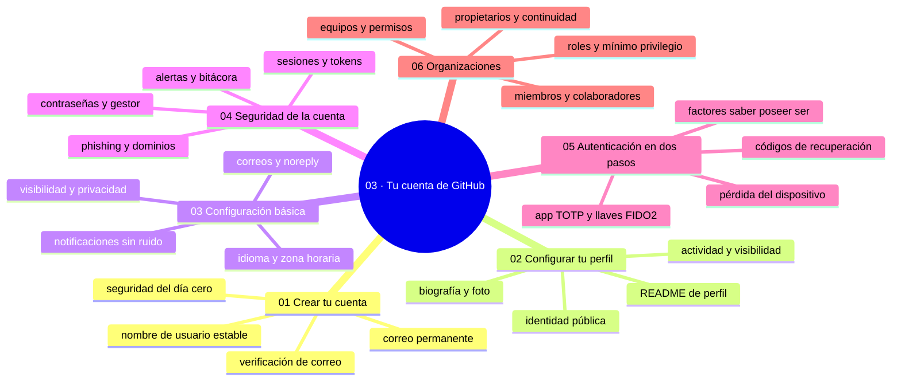

# 03 — Tu cuenta de GitHub

## Bienvenido a la sección de tu cuenta de GitHub

En esta sección crearás y configurarás tu identidad en GitHub, la base sobre la que se apoya todo lo demás del recorrido.

Ya comprendiste qué es GitHub, qué es un repositorio y por qué el control de versiones cambia la forma de trabajar. Ahora es el momento de tener una cuenta lista: segura, presente y preparada para colaborar en equipo.

En esta sección estudiarás:

* cómo crear una cuenta de GitHub paso a paso y con seguridad desde el primer día;
* cómo configurar tu perfil público para que represente tu trabajo;
* qué es la configuración básica (correos, notificaciones, privacidad);
* cómo proteger tu cuenta con contraseñas, sesiones, tokens y 2FA;
* cómo funciona la autenticación en dos pasos y su recuperación;
* qué son las organizaciones, los equipos y los roles.

Al finalizar esta sección, tendrás una cuenta endurecida y presente, lista para trabajar con la interfaz web de GitHub, que es el siguiente paso del recorrido.

---

## Objetivos de aprendizaje

Al terminar esta sección serás capaz de:

* crear y configurar una cuenta de GitHub con las capas básicas de seguridad (contraseña, 2FA, códigos de recuperación);
* configurar el perfil público y las preferencias esenciales (correos, notificaciones, privacidad);
* explicar la diferencia entre contraseña, token de acceso personal y clave SSH y cuándo usar cada una;
* recuperar el acceso a la cuenta con el procedimiento de recuperación del 2FA;
* identificar los roles de una organización y aplicar el principio de mínimo privilegio.

## Mapa conceptual

---

## ¿Qué aprenderás en esta sección?

Cada capítulo de esta sección está diseñado para construir tu comprensión progresivamente:

1. **Crear tu cuenta** - Registro paso a paso, verificación de correo y seguridad del día cero.
2. **Configurar tu perfil** - Identidad pública: nombre, biografía, foto, README y visibilidad.
3. **Configuración básica** - Correos, noreply, idioma, zona horaria y notificaciones sin ruido.
4. **Seguridad de la cuenta** - Contraseñas, sesiones, tokens (PAT), phishing y respuesta ante incidentes.
5. **Autenticación en dos pasos** - Factores de autenticación, métodos de 2FA y llaves de recuperación.
6. **Organizaciones** - Equipos, roles, permisos mínimos y trabajo en grupo.

---

## Cómo estudiar esta sección

Cada capítulo incluye:

* Mapas conceptuales que situan cada tema;
* Explicaciones claras y progresivas;
* Diagramas en texto de los flujos y permisos;
* Errores comunes con diagnóstico completo (qué ocurrió, por qué, cómo comprobarlo, opciones, riesgos, solución y cómo evitarlo);
* Prácticas guiadas con checklist de verificación;
* Un nivel profesional para situar el tema en entornos reales;
* Resúmenes con la idea principal de cada capítulo;
* Enlaces al siguiente capítulo para continuar.

Una advertencia que se repite en toda la sección: las acciones de seguridad (revocar tokens, cerrar sesiones, eliminar claves) y las irreversibles (borrar cuenta, cambio de nombre) se leen dos veces antes de pulsar.

Recuerda: no se trata de rellenar todos los campos disponibles, sino de entender qué protege tu cuenta, qué expone tu identidad y cómo se gestiona el acceso en equipo.

---

## Referencias

* GitHub — Documentación oficial: «Managing your account» y «Keeping your account secure» (docs.github.com).
* NIST SP 800-63B — Digital Identity Guidelines (autenticación multifactor).
* OWASP — Authentication Cheatsheet (owasp.org).

---

## Checkpoint 03 — Comprobación obligatoria

Antes de avanzar a `04-github-desde-la-web/`, demuestra que puedes (en tu cuenta de GitHub real, no en teoría):

1. **Abrir** tu perfil en una pestaña anónima (`github.com/tu-usuario`) y comprobar que nombre, biografía y foto se ven como esperas.
2. **Activar** la autenticación en dos pasos con app o llave, **descargar** los códigos de recuperación y **guardarlos** fuera del equipo.
3. **Configurar** la dirección noreply en Settings → Emails y **copiarla** para usarla como correo de Git.
4. **Revisar** Settings → Sessions y **cerrar** una sesión antigua o que no reconozcas.
5. **Crear** una organización de prueba con dos equipos, **invitar** a una segunda cuenta y **comprobar** que un miembro sin equipo no ve los repositorios privados.
6. **Explicar** con tus palabras por qué cambiar la contraseña no invalida los tokens ni las claves SSH, y qué tendrías que revocar además.

Si puedes hacerlo **sin mirar instrucciones**, el checkpoint está cerrado.

## Autopreguntas de cierre

Sin mirar el material, responde mentalmente y luego compruébalo con los capítulos de la sección:

1. ¿Cuándo usas un token de acceso personal en vez de tu contraseña?
2. ¿Qué pasa si pierdes el teléfono con la app de 2FA y qué haces para que no te deje fuera?
3. ¿Qué puede hacer un colaborador que no puede un solo lector (read)?
4. ¿Por qué el 2FA se recomienda incluso para cuentas con poco movimiento?
5. ¿Por qué un repositorio que vive en una organización sobrevive a la salida de la persona que lo creó?
6. Si alguien filtra un token tuyo pegado en un repositorio público, ¿qué haces primero y por qué borrar el archivo no sirve?
7. ¿Por qué GitHub exige verificar el correo antes de dejarte usar la cuenta con normalidad, y qué perderías si ese correo caduca?

---

## Próximo paso

Una vez que completes esta sección, estarás listo para usar GitHub desde su interfaz web.

Continúa con:

[`04-github-desde-la-web/`](../04-github-desde-la-web/)
