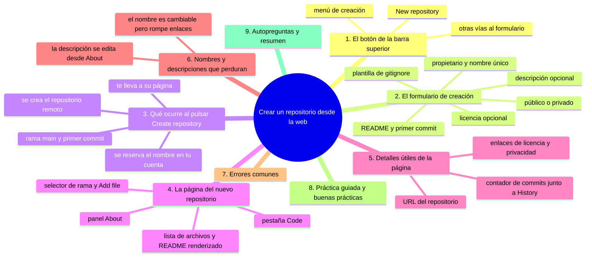
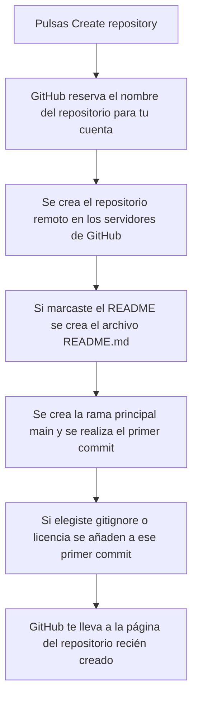

# Crear un repositorio desde la web

## Introducción

En las secciones anteriores aprendiste qué es GitHub, qué es un repositorio y cómo se crea y protege una cuenta.

Ya sabes que un repositorio es el lugar donde se guarda tu trabajo junto con todo su historial de cambios.

En esta sección vas a aprender a trabajar con GitHub desde el navegador, sin instalar ningún programa en tu computadora.

El primer paso es el más importante: **crear tu primer repositorio** desde la web.

En este capítulo aprenderás:

* dónde aparece el botón «+» en la interfaz de GitHub y qué opciones ofrece;
* cómo se ve el formulario de creación de un repositorio y qué campos pide;
* qué información se escribe en los campos de propietario, nombre y descripción;
* qué diferencia hay entre un repositorio público y uno privado;
* para qué sirve la casilla «Initialize this repository with a README»;
* qué es un gitignore y para qué sirve elegir una plantilla;
* qué es una licencia y cuándo conviene añadir una;
* qué ocurre exactamente por detrás al pulsar «Create repository».

Un pequeño aviso antes de empezar: los nombres de botones y menús se escriben en inglés («New repository», «Create repository») porque es la interfaz por defecto de GitHub. Si tu navegador traduce la interfaz a español verás equivalentes como «Nuevo repositorio» o «Crear repositorio».

## Mapa conceptual de este capítulo



## 1. Dónde está el botón «+»

Para crear un repositorio nuevo necesitas estar **logueado** en tu cuenta de GitHub. Si no lo estás, pulsa tu avatar en la esquina superior derecha y elige «Sign in».

Cuando estás logueado, en la barra superior de GitHub verás varios iconos.

El que te interesa es el icono **«+»** que aparece a la derecha, justo antes del icono de tu perfil.

Si pulsas ese botón «+» se abre un menú desplegable con varias opciones:

```text
Menú del botón «+»
    │
    ├── New repository      ← La opción que nos interesa ahora
    ├── Import repository   ← Crear un repo a partir de uno de otro sistema
    ├── New project         ← Crear un tablero de proyectos
    ├── New gist            ← Crear un gist (archivo suelto muy simple)
    ├── New organization    ← Crear una organización
    └── Sponsor             ← Apoyar a un autor
```

La opción **«New repository»** es la que abre el formulario de creación de repositorios.

> **Nota:** también puedes llegar al mismo formulario de otras maneras: pulsando tu avatar y eligiendo «Your repositories», y luego el botón «New repository» de esa página, o escribiendo directamente la dirección `github.com/new` en la barra de direcciones.

## 2. El formulario de creación

Al elegir «New repository» se abre una página titulada **«Create a new repository»** con un formulario.

Vamos a revisar el formulario de arriba hacia abajo.

```text
Create a new repository
    │
    ├── Owner or organization        ← De quién será el repositorio
    ├── Repository name              ← El nombre del repositorio
    ├── Description                  ← Descripción opcional
    ├── Public / Private             ← ¿Quién puede verlo?
    ├── Initialize this repository with a README
    ├── Add a .gitignore             ← Plantilla opcional
    ├── Add a license file           ← Licencia opcional
    └── [ Create repository ]        ← El botón final
```

### 2.1. Propietario: «Owner or organization»

El primer campo es un menú desplegable llamado **«Owner or organization»**.

Por defecto aparece tu propio nombre de usuario, que significa que el repositorio será tuyo.

Si pertenecieras a alguna organización, podrías elegir esa organización como propietaria.

Para empezar, deja tu propio nombre seleccionado.

### 2.2. Nombre: «Repository name»

El segundo campo es **«Repository name»**, donde escribes el nombre del repositorio.

El nombre tiene algunas reglas:

* debe ser único dentro de tu cuenta: no puedes tener dos repositorios con el mismo nombre;
* no puede contener espacios: se usa guión o guion bajo si necesitas separar palabras;
* puede usar letras, números, puntos, guiones y guiones bajos;
* no debe ser demasiado largo.

Ejemplos de nombres válidos: `diario-digital`, `recetas-familiares`, `notas-de-clase`.

### 2.3. Descripción: «Description»

El campo **«Description»** es opcional.

Sirve para escribir una frase corta que explique de qué trata el repositorio.

Volverás a ver esta frase en varias partes de la interfaz, por ejemplo en la página de tus repositorios y en la pestaña «About».

Un buen ejemplo: `Mi primer repositorio para practicar Git y GitHub`.

### 2.4. Público o privado

El siguiente bloque te pide elegir la visibilidad del repositorio con dos opciones de radio:

* **«Public»**: cualquier persona en internet puede ver el repositorio. Tú eliges quién puede escribir en él.
* **«Private»**: solo tú y las personas que invites pueden ver el repositorio.

Para practicar mientras aprendes, **privado** es la opción recomendada.

Cuando quieras compartir tu trabajo con el mundo, podrás cambiarlo a público en cualquier momento desde la configuración del repositorio.

### 2.5. Inicializar con un README

La casilla **«Initialize this repository with a README»** es muy importante y conviene entenderla.

Si la marcas, GitHub crea automáticamente un archivo llamado `README.md` dentro del repositorio.

Un archivo `README.md` es el archivo que describe el proyecto: su nombre, su propósito y cómo usarlo.

El archivo que se crea contiene solo un título con el nombre del repositorio y una línea de descripción, y queda listo para que lo edites.

Además, al crear ese archivo, GitHub realiza automáticamente el **primer commit** del repositorio.

Si dejas la casilla sin marcar, el repositorio se crea **vacío**: sin archivos y sin commits.

Para empezar desde la web, **marca esta casilla**: te ahorra varios pasos y tu repositorio tendrá contenido desde el primer momento.

### 2.6. Añadir un gitignore

El desplegable **«Add a .gitignore»** permite añadir una plantilla de gitignore.

Un gitignore es un archivo llamado `.gitignore` que le dice a Git qué archivos debe ignorar y no registrar.

Por ejemplo, en un proyecto de programación muchas carpetas y archivos generados por los programas no deben versionarse, y el gitignore los excluye.

Las plantillas disponibles dependen del tipo de proyecto: Python, JavaScript, C++, Docker, Jupyter Notebook, entre otras.

Si tu repositorio solo contendrá textos, notas o imágenes, **no necesitas** un gitignore ahora.

### 2.7. Añadir una licencia

El desplegable **«Add a license file»** permite añadir una licencia.

Una licencia es un archivo que declara los términos bajo los que otros pueden usar tu trabajo: si pueden copiarlo, modificarlo, redistribuirlo, o si está prohibido.

Si tu proyecto es solo un diario de práctica personal, **no necesitas** una licencia ahora.

Más adelante, cuando compartas un proyecto con el mundo, podrás añadir la licencia que mejor se ajuste a tus intenciones.

## 3. Qué ocurre al pulsar «Create repository»

Cuando has llenado el formulario y pulsas el botón **«Create repository»**, GitHub realiza varias cosas por detrás:



Fíjate en algo importante: el repositorio se crea en los **servidores de GitHub**, no en tu computadora.

Esa es la diferencia con un repositorio local, que estudiaremos más adelante.

Si no marcaste la casilla del README, el repositorio queda vacío y la página te sugiere los siguientes pasos que podrías seguir con Git desde la terminal.

## 4. La página del nuevo repositorio

Después de pulsar «Create repository» llegas a la página de tu repositorio.

La parte superior muestra el nombre del propietario y el nombre del repositorio, y una etiqueta que indica si es **Public** o **Private**.

Debajo verás una barra de pestañas:

```text
Pestañas del repositorio
    │
    ├── Code           ← Archivos del repositorio (la que verás más)
    ├── Issues         ← Registro de tareas y problemas
    ├── Pull requests  ← Propuestas de cambios de otras personas
    ├── Discussions    ← Conversaciones del proyecto
    ├── Actions        ← Automatización de tareas
    ├── Projects       ← Tableros de organización
    ├── Security       ← Alertas de seguridad
    └── Insights       ← Estadísticas y actividad
```

La pestaña **«Code»** es la que usarás en esta sección.

En la pestaña «Code» verás:

* a la izquierda, el **selector de rama** (apuntará a `main`) y los botones «Clone» y **«Add file»**;
* la **lista de archivos** del repositorio;
* debajo, el **README renderizado**, es decir, convertido en texto con formato;
* a la derecha, el panel «About» con la descripción del repositorio.

Si marcaste la casilla del README, verás tu archivo `README.md` en la lista y su contenido debajo.

## 5. Detalles útiles de la página

La barra de direcciones muestra una URL del tipo:

```text
github.com/tu-usuario/diario-digital
```

La primera parte es tu nombre de usuario y la segunda es el nombre del repositorio.

Guarda esta dirección en tus marcadores: es tu puerta de entrada al repositorio.

En la esquina inferior de la página del repositorio verás enlaces a la licencia y a la política de privacidad, y también la opción para cambiar la visibilidad si decides hacerlo más adelante.

El número de commits que has hecho aparece en varios sitios, por ejemplo junto al botón **«History»** que estudiaremos en un capítulo futuro.

> **Nota:** si algún día no encuentras tu repositorio, puedes ir a la dirección `github.com` y pulsar tu avatar; en la página de tus repositorios verás la lista de todos los que has creado.

## 6. Nombres y descripciones que perduran

El nombre del repositorio es **cambiable** después de crearlo, desde la configuración («Settings» y luego el nombre, en el bloque «Danger zone»).

Pero hay una buena razón para elegirlo bien desde el principio: el nombre aparece en la URL del repositorio, y si lo cambias las direcciones antiguas dejarán de funcionar.

Por eso, cuando elijas un nombre:

* hazlo corto y fácil de recordar;
* que describa el contenido del proyecto;
* evita espacios y letras acentuadas;
* piensa en el tipo de proyecto que será, no solo en el momento actual.

La descripción, en cambio, puedes editarla cuando quieras desde la página principal: basta con pulsar el icono del engranaje junto a la descripción en el panel «About».

## Práctica guiada

En esta práctica vas a crear tu primer repositorio real en GitHub.

### Paso 1: abre el formulario

* Entran en GitHub con tu cuenta;
* pulsa el botón «+» de la barra superior;
* elige «New repository»;
* verifica que se abra la página «Create a new repository».

### Paso 2: completa el formulario

* deja tu nombre de usuario como propietario;
* escribe un nombre como `diario-digital` (o el nombre de tu proyecto de práctica);
* escribe una descripción corta en español;
* elige «Private»;
* marca la casilla «Initialize this repository with a README»;
* deja gitignore y licencia sin seleccionar.

### Paso 3: crea el repositorio

* pulsa «Create repository»;
* espera unos segundos mientras GitHub termina de crearlo;
* verifica que llegaste a la página del repositorio.

### Paso 4: explora la página

* repasa las pestañas de la barra superior;
* en la pestaña «Code», localiza el selector de rama, el botón «Add file» y el archivo `README.md`;
* lee el contenido del README renderizado.

### Resultado esperado

Deberías tener un repositorio con tu nombre de usuario y con un solo archivo `README.md` que contiene el título del repositorio.

### Conclusión esperada

Al finalizar deberías ser capaz de crear un repositorio nuevo desde cero, elegir entre público y privado, y reconocer los elementos principales de su página.

### Ejercicio de transferencia

En un repositorio tuyo —o en uno de práctica con una segunda cuenta— crea desde el formulario web un repositorio privado con README inicial, escríbele una descripción y repasa todas sus pestañas. Entrega: la URL del repositorio y una línea escrita indicando en qué pestaña se lista el archivo `README.md` y en qué otra se listan los commits.

## Errores comunes

### Error 1: no estar logueado

Si no iniciaste sesión, al pulsar «New repository» GitHub te llevará a la página de inicio de sesión en lugar de al formulario.

Solución: inicia sesión primero y vuelve al paso del botón «+».

### Error 2: elegir un nombre que ya usaste

GitHub te avisará en el propio campo: «You already own a repository with this name».

Solución: elige otro nombre. Los nombres deben ser únicos dentro de tu cuenta.

### Error 3: usar espacios en el nombre

El nombre no acepta espacios. Si escribes `mi proyecto`, el campo no te dejará continuar.

Solución: usa guiones (`mi-proyecto`) o guiones bajos (`mi_proyecto`).

### Error 4: no marcar la casilla del README

Si dejas el repositorio vacío, al terminar verás una pantalla con instrucciones para conectarlo a Git desde la terminal, lo cual puede confundirte.

Solución: marca «Initialize this repository with a README» si quieres trabajar desde la web.

### Error 5: crear el repositorio como público sin querer

⚠️ **RIESGO:** lo que se publica en un repositorio público puede copiarse o archivarse en cuanto alguien lo ve; cambiarlo a privado después no recupera esa privacidad, así que datos personales o credenciales expuestas así se pierden para siempre.

Si tienes información personal y creaste el repositorio como «Public», cualquiera podrá verlo.

Solución: si contiene algo que no quieres compartir, cámbialo a privado desde «Settings» → «General» → «Visibility».

### Error 6: confundir la página del repositorio con la página de tus repositorios

La página de tus repositorios (`Your repositories`) lista tus repositorios; cada uno tiene su propia página independiente.

Solución: haz clic en el nombre del repositorio para entrar en su página.

## Buenas prácticas

* Elige un nombre corto, descriptivo y sin espacios para el repositorio;
* escribe siempre una descripción, aunque sea una sola frase;
* usa «Private» mientras practicas y aprendes;
* marca la casilla «Initialize this repository with a README» cuando vayas a trabajar desde la web;
* no añadas gitignore ni licencia si tu contenido es solo de texto y notas;
* guarda la URL del repositorio en tus marcadores;
* revisa la visibilidad después de crear el repositorio para confirmar que es la que esperabas.

## Autopreguntas de cierre

Sin mirar el material, responde mentalmente y luego compruébalo con este capítulo:

1. ¿Dónde está el botón «+» de la barra superior y qué otras dos vías llevan al mismo formulario de creación?
2. ¿Qué campos del formulario «Create a new repository» son imprescindibles y cuáles puedes dejar vacíos mientras practicas?
3. ¿Por qué el nombre de un repositorio debe ser único y no puede contener espacios, y qué consecuencia tiene cambiarlo después de crearlo?
4. ¿En qué situaciones conviene que un repositorio sea privado y cuándo merece ser público?
5. ¿Qué cambia exactamente en tu repositorio al marcar «Initialize this repository with a README» y qué ves en pantalla si lo dejas sin marcar?
6. ¿Para qué sirve una plantilla de gitignore y para qué una licencia, y por qué puedes prescindir de las dos en un repositorio de notas de práctica?
7. ¿Qué ocurre en los servidores de GitHub y qué ocurre en tu computadora al pulsar «Create repository»?
8. ¿Qué partes forman la URL de un repositorio, por qué conviene guardarla en marcadores y qué pestaña usarías para ver los archivos y cuál para ver los commits?

Si alguna respuesta todavía no está clara, vuelve a la sección correspondiente y repite la práctica.

## Resumen

En este capítulo aprendiste que:

* el botón «+» de la barra superior de GitHub da acceso al menú de creación;
* la opción «New repository» abre el formulario «Create a new repository»;
* el formulario pide propietario, nombre, descripción, visibilidad, README, gitignore y licencia;
* el nombre del repositorio debe ser único en tu cuenta y no llevar espacios;
* un repositorio privado lo ven solo tú y las personas que invites;
* la casilla «Initialize this repository with a README» crea el archivo README.md y el primer commit;
* al pulsar «Create repository», GitHub crea el repositorio en sus servidores y te lleva a su página;
* la pestaña «Code» es la principal y muestra la rama, los botones de acción, los archivos y el README.

La idea principal es:

> **Crear un repositorio desde la web es decidir un nombre, una visibilidad y un primer archivo, y después dejar que GitHub cree todo lo demás por ti.**

## Próximo paso

Ya tienes tu primer repositorio creado en GitHub, con su README inicial y su página lista para trabajar.

El siguiente paso es añadir contenido nuevo: aprenderás a crear un archivo desde el navegador, usar el editor web y hacer tu primer commit.

Continúa con:

[`02-crear-archivo.md`](02-crear-archivo.md)
