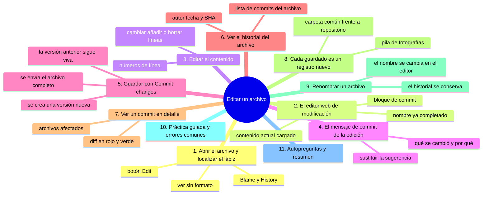
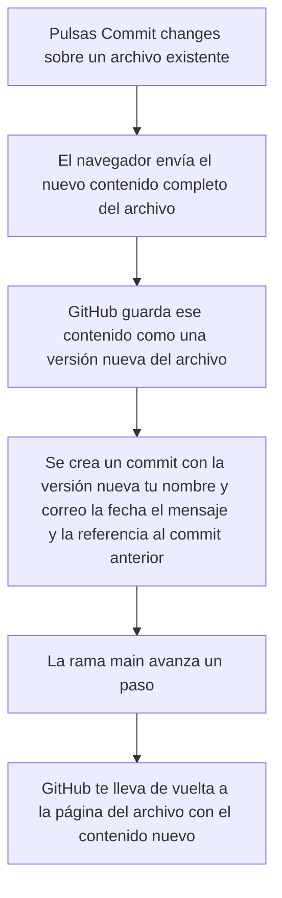

# Editar un archivo

## Introducción

En el capítulo anterior creaste tu primer archivo desde el navegador y comprobaste que apareció en la lista del repositorio.

Ahora vas a aprender a **modificar un archivo que ya existe**.

Editar archivos es la acción más frecuente de cualquier proyecto, y hacerlo desde la web es tan simple como crear uno nuevo.

En este capítulo aprenderás:

* cómo se abre un archivo y dónde está el botón del lápiz;
* qué es el editor web y cómo se modifica el contenido;
* cómo se guarda el cambio con el botón «Commit changes»;
* qué ocurre por detrás: se crea un commit nuevo que referencia el cambio;
* cómo se ve el archivo después de guardarlo;
* qué es el historial del archivo y cómo se abre desde el botón «History»;
* cómo se ve un commit de un archivo (diferencias, autor, fecha).

Recuerda que cada guardado es un commit, y cada commit es un registro en el historial del proyecto.

## Mapa conceptual de este capítulo



## 1. Abrir el archivo y localizar el lápiz

Entra en tu repositorio y asegúrate de estar en la pestaña **«Code»**.

En la lista de archivos, haz clic en el nombre del archivo que quieres editar, por ejemplo `saludo.md`.

La página del archivo se abre con el contenido y, en la parte superior, una fila de botones:

```text
Botones de la página de un archivo
    │
    ├── [ Edit ]          ← Icono de lápiz (el que nos interesa)
    ├── [ Blame ]         ← Quién tocó cada línea
    ├── [ History ]       ← Historial de commits de este archivo
    ├── [ View raw file ] ← Ver el texto sin renderizar
    └── [ Copy raw URL ]  ← Copiar la dirección del archivo
```

El botón **«Edit»** es el que tiene el icono de un lápiz.

Al pulsarlo, GitHub abre el mismo editor web que viste al crear un archivo, pero esta vez ya cargado con el contenido actual.

## 2. El editor web de modificación

La página de edición es muy parecida a la de creación:

```text
Página de edición de un archivo existente
    │
    ├── Nombre del archivo (ya viene escrito)
    ├── Editor de texto con el contenido actual
    ├── Opciones de commit (abajo)
    │   ├── Mensaje de commit (sugerido por GitHub)
    │   ├── «Commit directly to the main branch.»
    │   └── «Create a new branch for this commit.»
    └── Botón [ Commit changes ]
```

El campo del nombre del archivo ya viene completado, porque estás modificando un archivo existente.

Puedes cambiar el nombre si quieres renombrar el archivo, pero para este capítulo deja el nombre igual.

## 3. Editar el contenido

Dentro del editor, el contenido actual está listo para modificarse.

Puedes:

* cambiar texto de una línea;
* añadir líneas nuevas al final o en medio;
* borrar líneas completas;
* reescribir partes enteras del archivo.

Por ejemplo, si `saludo.md` tiene:

```text
# Mi primer archivo

Este es mi primer archivo creado en GitHub.

Lo escribí desde el navegador, sin instalar nada.
```

Puedes añadir una línea nueva al final:

```text
Hoy lo edité para practicar.
```

o cambiar una línea existente, por ejemplo la segunda, por:

```text
Este archivo ya fue editado una vez.
```

El editor muestra los números de línea a la izquierda para que sepas dónde estás.

## 4. El mensaje de commit de la edición

Abajo del editor verás el bloque de commit, igual que al crear archivos.

El campo de mensaje ya viene con una sugerencia de GitHub, por ejemplo: `(Update saludo.md)`.

Conviene reemplazarla por algo descriptivo, como: `Corrijo la línea de presentación de saludo.md`.

El mensaje de un commit de edición debería indicar **qué se cambió y por qué**, no solo el nombre del archivo.

## 5. Guardar con «Commit changes»

Cuando el contenido y el mensaje están listos, pulsa el botón **«Commit changes»**.



Es importante notar algo: no se modifica la versión anterior.

Lo que se hace es **guardar una versión nueva**, y el commit referencia esa versión.

La versión anterior sigue existiendo en el historial y podrá recuperarse más adelante.

## 6. Ver el historial del archivo

Ahora que el archivo tiene al menos dos versiones, vamos a ver su historial.

En la página del archivo, pulsa el botón **«History»** (icono de reloj).

Se abre una lista de commits, de más reciente a más antigua:

```text
Historial de un archivo
    │
    ├── Corrijo la línea de presentación de saludo.md
    │   - Por tu usuario · hace 10 minutos · abc1234
    │
    └── Añado el archivo de saludo
        - Por tu usuario · hace 30 minutos · def5678
```

Cada entrada muestra:

* el mensaje de commit;
* el autor (tu avatar y nombre de usuario);
* cuándo se hizo (por ejemplo, «10 minutes ago»);
* un identificador corto llamado SHA (por ejemplo, `abc1234`).

Haz clic en cualquiera de los mensajes para ver el detalle de ese commit.

## 7. Ver un commit en detalle

Al abrir un commit del historial del archivo, verás:

* el mensaje de commit completo;
* el autor y la fecha exacta;
* el SHA completo del commit;
* los archivos afectados por ese commit;
* las **diferencias** (diff) del archivo.

Las diferencias se ven así:

```text
Diferencias de un commit (diff)
    │
    ├── Líneas eliminadas: fondo rojo, prefijo -
    ├── Líneas añadidas:  fondo verde, prefijo +
    └── Líneas sin cambio: sin color especial
```

Por ejemplo, si en una edición cambiaste una línea:

```text
- Este es mi primer archivo creado en GitHub.
+ Este archivo ya fue editado una vez.
```

La línea roja es la que se quitó y la verde es la que se añadió.

## 8. El concepto clave: cada guardado es un nuevo registro

Piensa en el historial del archivo como una pila de fotografías:

* cada commit es una fotografía de un momento;
* la fotografía no sustituye a la anterior, se apila encima;
* puedes volver a cualquier fotografía y ver cómo estaba el archivo entonces.

Esto es lo que hace especial a un repositorio frente a una carpeta común:

en una carpeta común, cuando guardas un archivo, la versión anterior se pierde.

En un repositorio, cada guardado **deja constancia** de la versión anterior.

## 9. Renombrar un archivo (bonus)

En la misma página de edición, el campo del nombre también es editable.

Si cambias el nombre antes de pulsar «Commit changes», GitHub guardará el archivo con el **nuevo nombre**.

En el historial del archivo verás el commit de renombrado, y el historial se conservará aunque el nombre haya cambiado.

Para esta sección, es suficiente saber que el nombre se puede cambiar desde la misma página de edición.

## Práctica guiada

En esta práctica vas a editar uno de tus archivos y luego explorar su historial.

### Paso 1: abre el archivo para editar

* entra en tu repositorio de práctica, pestaña «Code»;
* haz clic en `saludo.md` (o el archivo de texto que hayas creado antes);
* pulsa el botón «Edit» (el lápiz).

### Paso 2: modifica el contenido

* añade una línea nueva al final del archivo que diga `Edité este archivo por primera vez.`;
* verifica que el editor muestra la línea nueva.

### Paso 3: escribe el mensaje y guarda

* en el campo de mensaje escribe `Añado una línea de prueba a saludo.md`;
* deja marcada «Commit directly to the main branch.»;
* pulsa «Commit changes».

### Paso 4: revisa el historial

* en la página del archivo, pulsa el botón «History»;
* verifica que ves al menos dos commits: el que creó el archivo y el que lo editó;
* haz clic en el commit de la edición y observa las diferencias.

### Resultado esperado

El archivo debe mostrar el contenido nuevo, y su historial debe tener al menos dos entradas con sus mensajes, autores y fechas.

### Conclusión esperada

Al terminar deberías saber editar un archivo desde la web, guardar el cambio con un commit, y leer el historial del archivo para ver cada versión y cada diferencia.

### Ejercicio de transferencia

Sobre el `README.md` de tu repositorio de práctica, haz dos ediciones separadas —una que añada una frase y otra que corrija un párrafo— y abre la pestaña «History» del archivo. Entrega: el enlace al archivo con su historial, el número de versiones listadas y el mensaje exacto de cada una de las dos ediciones.

## Errores comunes

### Error 1: confundir «Edit» con «View raw file»

«View raw file» solo muestra el texto plano sin renderizar; no te deja editar.

Solución: para editar, pulsa el botón «Edit» con el icono del lápiz.

### Error 2: perder el cambio porque no se pulsó «Commit changes»

⚠️ **RIESGO:** lo que está en el editor sin confirmar no está en ningún commit: si cierras la pestaña o pierdes la conexión se pierde para siempre y no hay forma de recuperarlo desde el repositorio.

Si cierras el navegador o navegas fuera sin pulsar «Commit changes», el cambio **no se guarda**.

Solución: siempre confirma con «Commit changes» antes de salir.

### Error 3: pensar que se sobrescribió la versión anterior

Al editar y guardar, no se «rompe» la versión anterior: se crea una nueva versión y se apila en el historial.

Solución: entiende que cada commit es un registro nuevo; las versiones anteriores siguen disponibles.

### Error 4: dejar el mensaje de commit vacío o poco descriptivo

Un mensaje como `Update saludo.md` no te dice qué cambió.

Solución: escribe qué se modificó y por qué, por ejemplo `Añado una línea de prueba a saludo.md`.

### Error 5: no notar que el editor muestra el contenido actual

Al pulsar «Edit», el editor carga el contenido actual del archivo, no un espacio en blanco.

Si ves texto, no es un error: es el contenido que vas a modificar.

### Error 6: confundir el SHA con el nombre del archivo

El SHA (como `abc1234`) es un identificador del commit, no del archivo.

Solución: asocia el SHA con el commit que lo produce, no con el archivo.

## Buenas prácticas

* Pulsa «Edit» solo cuando estés listo para guardar un cambio;
* revisa el contenido del editor antes de guardar para confirmar que es lo que quieres;
* escribe un mensaje de commit que describa el cambio concreto, no solo el nombre del archivo;
* guarda en `main` mientras practicas en esta sección;
* después de cada edición, abre el botón «History» para ver el commit recién creado;
* lee el diff del commit para asegurarte de que las líneas que cambiaste son las esperadas;
* recuerda que cada guardado crea una versión nueva y no borra las anteriores.

## Autopreguntas de cierre

Sin mirar el material, responde mentalmente y luego compruébalo con este capítulo:

1. ¿Qué botón abre el editor sobre un archivo existente y qué te encuentras ya cargado cuando se abre?
2. ¿Por qué el cambio que ves en el editor todavía no es una versión del archivo y qué tienes que hacer para que lo sea?
3. ¿Qué debería decir el mensaje de commit de una edición para que te sea útil dentro de seis meses?
4. ¿Qué le ocurre a la versión anterior del archivo cuando guardas una edición, y por qué no se «sobrescribe»?
5. ¿Cómo llegas al historial de un solo archivo y qué información muestra cada entrada?
6. ¿Qué te dice un diff con líneas en rojo y en verde y por qué conviene leerlo antes de dar por bueno un commit?
7. ¿Qué es el SHA de un commit, con qué se relaciona y por qué no es el nombre de un archivo?
8. ¿Qué ganas respecto a una carpeta común sin control de versiones cuando cada guardado deja constancia del estado anterior?

Si alguna respuesta todavía no está clara, vuelve a la sección correspondiente y repite la práctica.

## Resumen

En este capítulo aprendiste que:

* el botón «Edit» (icono de lápiz) abre el editor web con el contenido actual del archivo;
* el editor se usa igual que en la creación: se modifica el texto y se escribe un mensaje;
* «Commit changes» guarda una versión nueva del archivo y crea un commit;
* la versión anterior no se pierde: queda registrada en el historial;
* el botón «History» muestra la lista de commits del archivo;
* cada commit tiene mensaje, autor, fecha y SHA;
* las diferencias (diff) de un commit muestran líneas eliminadas en rojo y añadidas en verde;
* cada guardado es un registro nuevo apilado sobre los anteriores.

La idea principal es:

> **Editar un archivo en GitHub desde la web es guardar una versión nueva: el cambio queda registrado como un commit y las versiones anteriores siguen disponibles en el historial.**

## Próximo paso

Ya sabes crear archivos, editarlos y ver su historial.

El siguiente paso es subir archivos que ya tienes en tu computadora, no escribirlos desde el navegador. Aprenderás a usar la opción «Upload files» y a subir varios archivos a la vez.

Continúa con:

[`04-subir-archivos.md`](04-subir-archivos.md)
