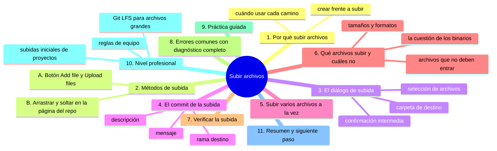
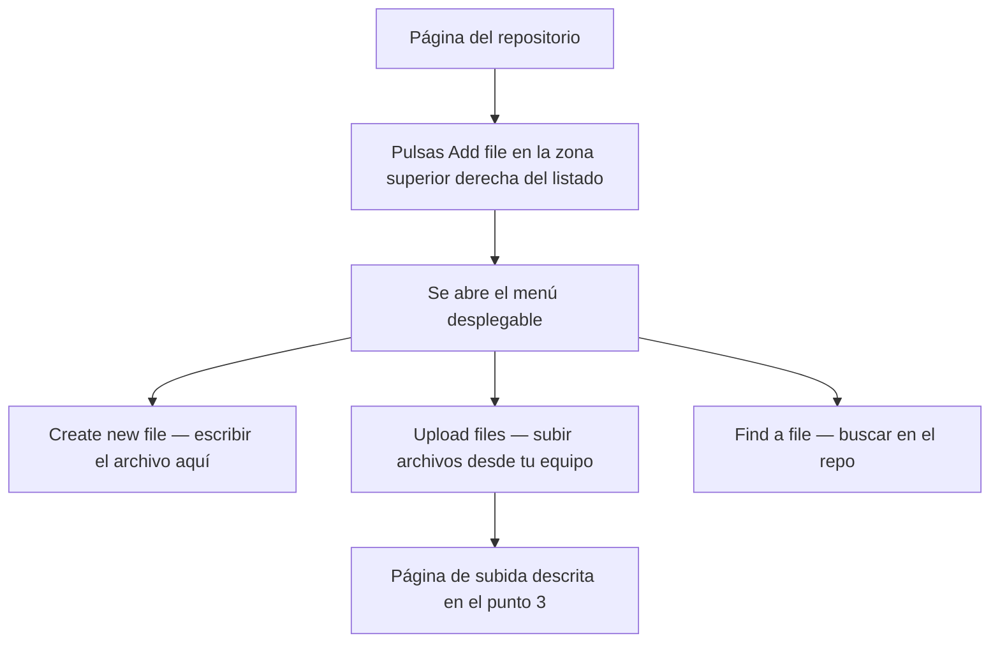
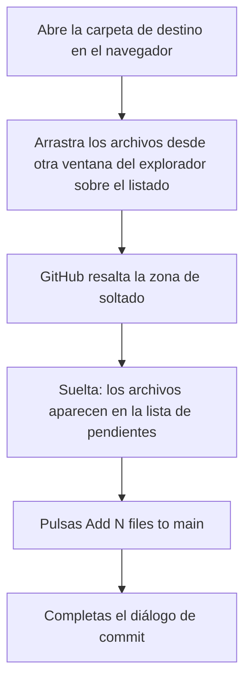

# Subir archivos

## Introducción

Hasta ahora has trabajado en la web con archivos creados desde cero: los escribiste en el editor de GitHub. Pero la mayoría de los proyectos no nacen escribiendo en un navegador: los archivos ya existen en tu equipo (imágenes, documentos, datos, código) y lo que necesitas es **subirlos** al repositorio.

Subir archivos desde la web es la operación más rápida para alimentar un repositorio sin instalar nada: arrastras, eliges dónde van, escribes el mensaje de commit y listo. Detrás ocurre exactamente lo mismo que cuando creas un archivo a mano: GitHub prepara los cambios, tú confirmas y se genera un commit.

En este capítulo aprenderás:

* las dos formas de subir archivos (botón y arrastre);
* elegir la carpeta de destino y el nombre correcto;
* el diálogo de commit al subir uno o varios archivos;
* subir a la rama correcta;
* qué tipos de archivo conviene y no conviene subir;
* los límites y errores típicos del arrastre;
* cómo verificar que la subida ocurrió realmente.

---

## Mapa conceptual de este capítulo



---

## 1. Por qué subir archivos

### 1.1. Crear vs. subir

```text
Crear archivo (capítulos anteriores)
   │
   ├── Lo escribes aquí mismo, en el navegador
   ├── Sirve para: textos, Markdown, código poco largo
   └── Inconveniente: no sirve si el archivo ya existe
       en tu equipo

Subir archivo (este capítulo)
   │
   ├── Lo seleccionas desde tu equipo y lo copias al repo
   ├── Sirve para: cualquier archivo ya existente
   └── Ventaja: rápido, sin instalar nada, varios a la vez
```

### 1.2. Cuándo usar cada camino

```text
Situación                                    Camino
──────────────────────────────────────────────────────
Escribir un README nuevo                     Crear
Corregir una errata en un archivo            Editar
Añadir una imagen que ya tienes              Subir
Traer una carpeta con 20 datos               Subir (varios)
Trabajar a diario con el proyecto            Git local (sección 06+)
```

> **Idea:** la subida por web es ideal para aportes puntuales y para quien aún no usa Git en su equipo. Para un proyecto que trabajarás a diario, pronto migrarás a Git local (clonar, editar, hacer commit y push), que verás en las secciones siguientes. Dominar la subida por web sigue siendo útil: te rescata cuando estás en un equipo prestado o sin herramientas.

---

## 2. Métodos de subida

### 2.1. Método A: el botón «Add file»



### 2.2. Método B: arrastrar y soltar



```text
Diferencia práctica entre métodos
──────────────────────────────────────────────
Botón "Upload files"          Arrastre
──────────────────────────────────────────────
Página dedicada con zona      Inmediato desde la propia
de selección                  página del repo
Ideal para mucha cantidad     Ideal para 1-3 archivos
y para elegir carpeta         (si estás ya en la carpeta
comodamente                   destino)
```

**Regla de oro del arrastre:** la carpeta de destino es **donde estés parado en el navegador**. Si estás en la raíz del repositorio, los archivos caen en la raíz. Si querías una subcarpeta, entra primero.

---

## 3. El diálogo de subida

### 3.1. La página «Upload files»

```text
Estructura de la página de subida
──────────────────────────────────────────────
Ruta actual (indicador de destino)
   │
   ┌──────────────────────────────────────┐
   │   Zona de arrastre                   │
   │   "Drag files here to upload         │
   │    or choose your files"             │
   │          [Choose your files]         │
   └──────────────────────────────────────┘
   │
   Lista de archivos seleccionados
   │  (nombre, tamaño, opción de quitar)
   │
   [Commit changes...]
```

### 3.2. Seleccionar archivos

Al pulsar «Choose your files» se abre el explorador del sistema:

* puedes seleccionar varios archivos a la vez (Ctrl o Cmd);
* también puedes arrastrar desde el explorador directamente a la zona;
* los archivos seleccionados se listan antes de confirmar: es tu momento de revisar.

```text
Revisión previa: comprueba
   │
   ├── que están TODOS los que querías
   ├── que no hay NADA que no querías (el explorador a veces
   │   selecciona de más al usar rangos)
   └── los nombres correctos (renombrar antes de subir es
       más fácil que renombrar después)
```

### 3.3. Carpeta de destino

```text
Ejemplo visual
──────────────────────────────────────────────
github.com/tu-usuario/mi-proyecto/
   │
   ├── (raíz)           ← si estás aquí, sube a la raíz
   ├── docs/
   │     └── (dentro de docs)  ← si entraste, sube a docs/
   └── assets/

En la página de subida aparece la ruta actual:
   "up to your-username / mi-proyecto / docs"
```

Si te equivocaste de carpeta: no confirmes, vuelve atrás y entra en la correcta (o muévelos después con la función de renombrar/mover, menos cómoda).

### 3.4. Tamaño y cantidad

```text
Límites prácticos
   │
   ├── Cada archivo: GitHub recomienda hasta 50 MB;
   │   hay un límite duro superior (≈100 MB) que bloquea
   ├── Repositorio: los límites de tamaño total según plan
   │   (se ven en la sección 04 de planes)
   └── Recomendación: archivos de texto < 1 MB sin problema;
       imágenes < 1-2 MB cómodo
```

Para archivos grandes existe Git LFS (nivel profesional, punto 10).

---

## 4. El commit de la subida

### 4.1. El diálogo «Commit changes»

Tras confirmar la selección aparece el mismo diálogo de commit que en crear/editar archivos:

```text
┌─────────────────────────────────────────────┐
│  Commit changes                             │
│                                             │
│  Título *                                   │
│  [Add files via upload                ]     │
│                                             │
│  Descripción (opcional)                     │
│  [                                ]         │
│  [                                ]         │
│                                             │
│  Rama: [main ▾]   (+ "create a new branch") │
│                                             │
│  [ Commit changes ]                         │
└─────────────────────────────────────────────┘
```

### 4.2. El título por defecto

GitHub propone algo genérico como «Add files via upload». **Cámbialo**: un mensaje útil describe qué se añade y por qué.

```text
Título por defecto          Título útil
──────────────────────────  ──────────────────────────────
Add files via upload        Añade logos de la marca en assets
                            (o: Añade datos de población 2025)
```

### 4.3. La rama destino

```text
Opciones
   │
   ├── main (o la rama por defecto)
   │      →  el archivo queda directo en la rama principal
   │         (apropiado en repos propios y tranquilos)
   │
   └── create a new branch
          →  los archivos se suben a una rama nueva y
             GitHub te ofrecerá abrir un Pull Request
             (apropiado en repos compartidos; ver sección 17)
```

En repositorios con protección de rama (no puedes escribir en `main`), la opción será prácticamente la única vía: subir a rama nueva y proponer la fusión.

---

## 5. Subir varios archivos a la vez

### 5.1. Procedimiento

```text
Subida múltiple
──────────────────────────────────────────────
1. Add file → Upload files (o arrastre)
2. Selecciona todos los archivos (o arrastra la selección)
3. Revisa la lista
4. Pulsa "Add N files..."
5. Escribe un mensaje que AGRUPE lo subido
6. Confirma el commit
```

### 5.2. Un commit para toda la subida

Punto conceptual importante: **aunque subas 10 archivos, se crea UN commit** con todos ellos. Git trabaja por «instantáneas»: un commit registra el estado del repositorio en ese momento.

```text
Subida de 3 archivos: ana.txt, beta.txt, gamma.txt
       │
       ▼
UN commit:
   título: "Añade los tres informes de septiembre"
   contenido del commit:
      · ana.txt   (nuevo)
      · beta.txt  (nuevo)
      · gamma.txt (nuevo)
```

Si necesitas separarlos en commits distintos: súbelos en grupos (una subida por grupo).

### 5.3. ¿Y las subcarpetas?

```text
Para subir dentro de una carpeta existente:
   │
   ├── por botón: entra en la carpeta ANTES de pulsar
   │   "Add file → Upload files"
   │
   └── por arrastre: abre la carpeta en el navegador
       y suelta allí

Para crear una carpeta nueva y subir ahí:
   └── los archivos subidos dentro de una carpeta inexistente
       la crean automáticamente (la carpeta no es un objeto
       aparte: es la ruta de los archivos)
```

Ese último detalle es conceptualmente importante y se desarrolla en el capítulo 06.

---

## 6. Qué archivos subir (y cuáles no)

### 6.1. Formatos y tamaños

```text
Comodos de subir (texto)
   │
   ├── .md, .txt, .csv, .json, .yml, .html, .css
   ├── códigos fuente de cualquier lenguaje
   └── archivos pequeños de configuración

Válidos pero a considerar (binarios)
   │
   ├── imágenes (.png, .jpg, .svg)
   ├── PDF, ofimática (.docx, .xlsx)
   └── binarios compilados  →  casi nunca van al repo
                               (punto 6.3)

Problemáticos por tamaño
   │
   ├── > 50 MB:  incomodidad y posibles límites
   ├── > 100 MB: bloqueo probable
   └── grandes y repetitivos: considerar Git LFS
```

### 6.2. Archivos que NO deben entrar

```text
Prohibidos en un repositorio
   │
   ├── Credenciales y secretos
   │      ├── contraseñas, tokens, claves API
   │      ├── archivos .env con valores reales
   │      └── certificados privados
   │      →  en documentación de ejemplo: "TU_API_KEY_AQUI"
   │        o [REDACTADO]
   │
   ├── Datos personales
   │      ├── copias de documentos de identidad
   │      ├── listados de clientes con datos sensibles
   │      └── cualquier dato personal de terceros
   │
   ├── Dependencias y artefactos pesados
   │      ├── carpetas de librerías descargadas
   │      ├── binarios compilados
   │      └── copias de seguridad (.zip de todo)
   │
   └── Archivos del sistema
          ├── .DS_Store, Thumbs.db
          └── configuraciones personales con rutas tuyas
```

> **Advertencia:** un secreto subido **una vez** ya está en el historial. Borrarlo después no lo hace desaparecer (quedan copias en el historial y en los clones). La prevención es la única estrategia seria: revisa antes de pulsar «Commit».

### 6.3. ¿Y los binarios en un repositorio de código?

```text
Problema de los binarios en Git
   │
   ├── Git guarda TODAS las versiones: cada cambio de un
   │   binario duplica peso en el historial
   │
   ├── Un video o PSD modificado 10 veces = 10 copias
   │   completas en el historial
   │
   └── Consecuencia: repositorios lentos e inmanejables

Alternativas
   │
   ├── Imágenes pequeñas y pocas: en el repo, sin problema
   ├── Recursos grandes: CDN, almacenamiento externo, o
   │   Git LFS (punto 10)
   └── Artefactos de compilación: nunca en el repo
```

### 6.4. Nombres de archivo al subir

```text
Convenciones (idénticas a crear archivos)
   │
   ├── sin espacios:  datos-2025.csv  (no: datos 2025.csv)
   ├── minúsculas y guiones: mi-informe.md
   ├── acentos y ñ: funcionan en la web, pero dan problemas
   │   en terminales y otros sistemas → evítalos
   └── extensiones correctas: .md, .csv (no .md.txt por error)
```

---

## 7. Verificar la subida

### 7.1. Checklist de verificación

```text
Después de pulsar "Commit changes"
   │
   ├── 1. Aparece la pantalla de commit con éxito
   │
   ├── 2. El listado del repositorio muestra los archivos
   │      nuevos (recarga si es necesario)
   │
   ├── 3. Los archivos están en la CARPETA CORRECTA
   │      (navega hasta ellos si subiste en subcarpeta)
   │
   ├── 4. El mensaje de commit aparece en el historial
   │      (Commits del repositorio)
   │
   └── 5. Abre cada archivo: el CONTENIDO es el esperado
          (comprueba especialmente el primer y último
          archivo si subiste varios)
```

### 7.2. Comprobación del contenido

Un archivo puede subirse mal por causas tontas: versión equivocada, archivo vacío, el explorador dejó seleccionado otro. Abre al menos una muestra y verifica:

```text
Verificación de contenido
   │
   ├── Texto: ¿se ve completo y legible?
   ├── Imagen: ¿se muestra la correcta?
   └── Archivo binario: aparecerá como "binary";
       verifica el tamaño en la lista (tamaño sospechosamente
       bajo = archivo vacío o mal seleccionado)
```

---

## 8. Errores comunes con diagnóstico completo

### Error 1: Los archivos cayeron en la raíz

**Qué ocurrió:** querías subirlos a `docs/` y quedaron en la raíz del repositorio.

**Por qué:** el arrastre usa la carpeta abierta en el navegador; estabas en la raíz.

**Cómo comprobarlo:** mira la ruta mostrada antes de confirmar (o los archivos listados ahora en la raíz).

⚠️ **RIESGO:** eliminar los duplicados desde la web borra esos archivos del repositorio con un commit nuevo; su contenido solo se recupera después abriendo el historial, y si otro colaborador ya los enlazó esos enlaces quedan rotos.

**Opciones:**
* usar la opción de renombrar/mover de GitHub (menos cómoda);
* subirlos de nuevo en la carpeta correcta y borrar los de la raíz (en repos con poca gente).

**Riesgos:** dos copias del mismo archivo en distintas rutas → confusión posterior.

**Solución:** mover o resubir + eliminar el duplicado, y actualizar el mensaje si corresponde.

**Cómo se evita:** entrar en la carpeta destino antes de soltar; mirar la ruta antes de confirmar.

---

### Error 2: Subir un archivo con datos sensibles

**Qué ocurrió:** un `.csv` con datos de clientes o un `.env` real subido «de prueba».

**Por qué:** falta de revisión previa.

**Cómo comprobarlo:** abrir el archivo subido y revisar su contenido; buscar palabras clave (contraseñas, teléfonos, DNI).

⚠️ **RIESGO:** lo que ya entró en un commit se conserva para siempre en el historial y en cualquier clon; borrar el archivo ahora retira el contenido visible, pero no borra las credenciales ni los datos, que hay que considerar filtrados y rotarlos.

**Opciones:**
* Si es privado y poca gente lo vio: borrar el archivo y revisar quién tenía acceso.
* Si es público: asumir que es conocido; cambiar las credenciales expuestas; evaluar notificación si hay datos de terceros (puede haber obligaciones legales).

**Riesgos:** filtración de datos, suplantación por credenciales.

**Solución:** retirar + rotar credenciales + revisar historial (y en casos graves, reescribir historial con guía profesional; la sección 11 aborda recuperaciones, pero borrar historial compartido siempre es delicado).

**Cómo se evita:** revisar siempre el contenido antes de subir; nunca subir `.env` real; usar variables de ejemplo (`TU_API_KEY_AQUI`).

---

### Error 3: Archivo bloqueado por tamaño

**Qué ocurrió:** GitHub rechaza un archivo grande (tensión de >100 MB; avisos con >50 MB).

**Por qué:** los límites de la plataforma; además, los archivos grandes arruinan el repositorio.

**Cómo comprobarlo:** el mensaje de error de la subida; el tamaño del archivo en tu equipo.

**Opciones:**
* comprimir si es apto;
* subir a un almacenamiento externo y enlazar;
* Git LFS si el archivo es esencial y el equipo lo soporta;
* dividir el archivo si tiene sentido (por ejemplo, datos en partes).

**Riesgos:** forzar el límite (imposible) o meter binarios gigantes «mientras tanto» y cargar el historial para siempre.

**Solución:** elegir la vía adecuada al tipo de archivo (punto 10).

**Cómo se evita:** conocer los límites antes; revisar tamaños de los archivos a subir.

---

### Error 4: Subir la versión equivocada de un archivo

**Qué ocurrió:** había dos versiones en el equipo (informe-v2 y informe-v2-final) y se subió la vieja.

**Por qué:** nombres confusos en origen.

**Cómo comprobarlo:** abrir el archivo subido y comparar.

⚠️ **RIESGO:** subir un archivo sobre un nombre que ya existe lo sobrescribe en la rama: la versión que estaba deja de ser la visible de inmediato; se recupera abriendo el «History» del archivo, pero el commit de la subida queda en el historial con esa sustitución.

**Opciones:**
* subir la correcta encima (la subida sobre un nombre existente crea un commit que lo reemplaza);
* corregir el mensaje si hacía falta.

**Riesgos:** información errónea en el proyecto.

**Solución:** resubir la versión correcta sobre el mismo nombre.

**Cómo se evita:** nombres claros y fechados en el equipo (`informe-2025-10-02.md`); verificar antes de confirmar.

---

### Error 5: Mensaje de commit «Add files via upload» en todos los cambios

**Qué ocurrió:** varias subidas con el mensaje genérico por defecto.

**Por qué:** no se editó el campo.

**Cómo comprobarlo:** lista de commits.

**Opciones:**
* en subidas ya hechas: convivir con ello (no vale la pena reescribir historial);
* a partir de ahora: escribir mensajes descriptivos.

**Riesgos:** historial ilegible: no puedes saber qué cambió sin abrir cada commit.

**Solución:** disciplina de mensajes (regla: qué + por qué en una línea).

**Cómo se evita:** tratar el campo de mensaje como obligatorio.

---

### Error 6: Completar la subida en la rama equivocada

**Qué ocurrió:** se subió a `main` cuando el equipo trabaja en ramas, o al revés.

**Por qué:** no se miró el selector de rama en el diálogo.

**Cómo comprobarlo:** la rama visible en la página del repo tras la subida.

**Opciones:**
* si corresponde: abrir un Pull Request desde esa rama;
* si fue a `main` sin permiso... (normalmente GitHub lo impide en ramas protegidas; si ocurrió en repo propio, valorar revert del commit).

**Riesgos:** introducir cambios sin revisión donde se esperaba revisión.

**Solución:** mover el cambio al flujo correcto (PR o rama adecuada).

**Cómo se evita:** mirar SIEMPRE la rama en el diálogo de commit.

---

## 9. Práctica guiada

### Objetivo

Subir un pequeño juego de archivos al repositorio y verificar la operación completa.

### Preparación (en tu equipo)

Crea una carpeta temporal con:

```text
subida-prueba/
   ├── notas.md          (texto libre, 10 líneas)
   ├── datos.csv         (2-3 columnas, 3 filas)
   └── logo.png          (cualquier imagen pequeña)
```

(No hace falta que sean útiles: son material de práctica.)

### Paso 1: subir por el botón

1. Abre tu repositorio en GitHub.
2. **Add file → Upload files**.
3. Selecciona `notas.md` y `datos.csv`.
4. Revisa la lista y la ruta.
5. Cambia el título del commit a: `Añade notas y datos de prueba`.
6. Confirma en la rama `main`.

### Paso 2: verificar

1. Vuelve a la raíz del repo: comprueba que los dos archivos están.
2. Abre `datos.csv`: revisa el contenido.
3. Entra en la pestaña de commits: comprueba el mensaje nuevo.

### Paso 3: subir por arrastre

1. Abre la raíz del repositorio.
2. Arrastra `logo.png` desde tu explorador sobre el listado.
3. Confirma con un mensaje: `Añade logotipo de prueba`.
4. Abre la imagen para verificarla.

### Paso 4: subir a una carpeta (opcional, recomendado)

1. Crea una carpeta entrando en «Add file → Create new file» y poniendo una ruta con barra (ejemplo: `assets/.gitkeep` o crea `assets/leeme.md` — se explica en el capítulo 06).
2. Entra en `assets/`.
3. Sube `logo.png` dentro.
4. Comprueba que la imagen quedó en `assets/`.

### Resultado esperado

Tres commits con mensajes claros; los archivos en sus carpetas correctos; el repositorio con contenido verificado.

### Conclusión esperada

Subir archivos es el mismo acto que crearlos, solo que el origen es tu equipo: el control está en la revisión previa (ruta, nombre, contenido, rama) y en el mensaje.

### Ejercicio de transferencia

En tu repositorio de práctica, arrastra desde tu explorador tres archivos de un asunto que no sea el curso —por ejemplo fotos o documentos de un evento— dentro de la carpeta `docs/evento/`, entrando en la carpeta antes de soltarlos. Entrega: el enlace al commit único que los agrupa, la ruta exacta donde quedaron y el mensaje que escribiste.

⚠️ **RIESGO:** todo lo que subas queda guardado para siempre en el historial, así que revisa antes de confirmar que ninguno de los tres archivos contiene datos personales de terceros o credenciales.

---

## 10. Nivel profesional

### 10.1. Git LFS para archivos grandes

**Git LFS** (Large File Storage) almacena los archivos pesados fuera del historial normal de Git y guarda en él solo referencias:

```text
Sin LFS                          Con LFS
────────────────────             ──────────────────────
Cada versión: copia completa      Historial: referencias
Historial gigante                 El archivo pesado vive
Repositorio lento                 fuera; Git solo guarda
                                  metadatos
```

Cuándo plantearse LFS:

```text
Señales de que lo necesitas
   │
   ├── archivos > 50 MB recurrentes en el proyecto
   ├── binarios que cambian a menudo (assets de juego,
   │   diseños, datos de simulación)
   └── el equipo ya sufre clones lentos
```

LFS requiere instalación y habilitación en el equipo; por eso se toca aquí solo como concepto: **los archivos grandes no son un problema de «subida», son un problema de arquitectura del repositorio**.

### 10.2. Subidas iniciales de proyectos

Cuando un proyecto existente llega a GitHub por primera vez, la subida web tiene sentido solo si son pocos archivos. Un proyecto real (carpetas, decenas de archivos) se migra con Git local:

```text
Migración de un proyecto existente
──────────────────────────────────────────────
1. git init / git add . / git commit
2. git remote add origin ...
3. git push

Ventaja sobre la subida web:
   · respeta la estructura de carpetas completa
   · conserva .gitignore desde el inicio
   · un solo commit inicial coherente
```

(Los comandos se ven con detalle en la sección 06.)

### 10.3. Reglas de equipo

En equipos, la subida web se gobierna con acuerdos:

```text
Reglas típicas
   │
   ├── La subida web está bien para docs, imágenes y aportes
   │   puntuales; el día a día es Git local
   │
   ├── Todo archivo nuevo revisa: ¿secretos? ¿datos? ¿tamaño?
   │
   ├── Mensajes de commit con formato acordado
   │   (por ejemplo: "docs: ...", "assets: ...")
   │
   ├── En repos con protección: subir a rama y abrir PR
   │
   └── Revisión por segunda persona en repos críticos
       (la subida web no exige revisión por defecto;
        la disciplina la pone el equipo)
```

---

## 11. Resumen

En este capítulo aprendiste que:

* subir archivos lleva el contenido desde tu equipo al repositorio con dos métodos: el botón «Add file → Upload files» y el arrastre sobre la página;
* la carpeta de destino es donde estás navegando en el momento de soltar o seleccionar;
* toda subida termina en un commit: mensaje descriptivo y rama correcta son parte de la operación;
* varios archivos subidos juntos forman un solo commit;
* las carpetas no son objetos aparte: nacen de la ruta de los archivos;
* hay archivos que nunca deben entrar: secretos, datos personales, dependencias pesadas y binarios de compilación;
* los límites de tamaño (comodidad ~50 MB, bloqueo ~100 MB) obligan a pensar en alternativas para archivos grandes;
* verificar la subida es abrir los archivos y revisar ruta, contenido y mensaje;
* la disciplina (revisar antes de confirmar, mensajes claros, rama correcta) es la mitad del trabajo.

La idea principal es:

> **Subir es crear con origen externo: el acto es simple, la responsabilidad está en revisar qué, dónde, en qué rama y con qué mensaje llega.**

---

## Autopreguntas de cierre

Sin mirar el material, responde mentalmente y luego compruébalo con este capítulo:

1. ¿Por qué la carpeta destino de una subida por arrastre es donde estás parado en el navegador y cómo evitas que los archivos caigan en la raíz cuando querías otra?
2. Si arrastras diez archivos de golpe, ¿cuántos commits se crean y qué mensaje conviene escribir para que el historial siga siendo legible?
3. ¿Qué tipos de archivo no deberían entrar nunca en un repositorio y por qué borrarlos después no deja de dejar rastro en el historial?
4. ¿Qué límites de tamaño te obligan a plantear Git LFS o un almacenamiento externo, y qué carga deja en el equipo subir un binario gigante «mientras tanto»?
5. ¿Cómo compruebas que una subida se hizo bien más allá de ver los nombres en la lista, y qué errores tontos detecta esa revisión?
6. ¿Qué diferencia hay entre subir un archivo nuevo y subirlo sobre un nombre que ya existe, y dónde miras si necesitas la versión anterior?

---

## Próximo paso

Ya sabes llevar archivos al repositorio.

El siguiente paso es subir imágenes con sus particularidades: formatos, visualización en Markdown y buenas prácticas.

Continúa con:

[`05-subir-imagenes.md`](05-subir-imagenes.md)
