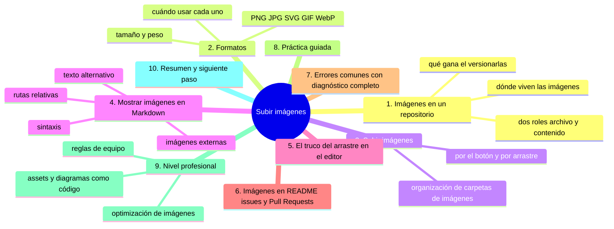
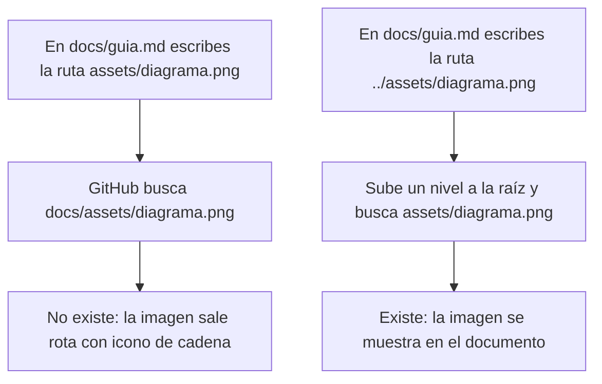
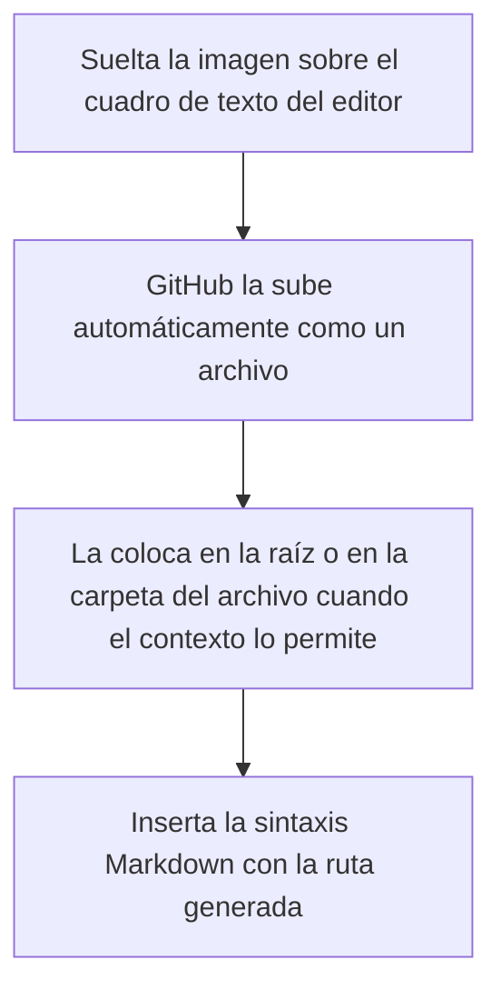

# Subir imágenes

## Introducción

Las imágenes aparecen en casi todo proyecto: logotipos, capturas de pantalla, diagramas, fotografías, gráficos. En un repositorio de GitHub tienen doble vida: como **archivos** del repositorio (se suben y versionan como cualquier otro) y como **contenido visual** que se muestra dentro de archivos Markdown (en el README, en issues, en Pull Requests).

El capítulo anterior te enseñó a subir archivos; este profundiza en las imágenes, porque tienen particularidades: formatos con distinto propósito, tamaño que afecta al repositorio, y una mecánica especial para mostrarlas dentro de documentos.

Al final aprenderás:

* qué formatos de imagen usar y cuándo;
* cómo subir imágenes por la web (y arrastrándolas);
* cómo incrustar una imagen en un archivo Markdown dentro de GitHub;
* el truco de arrastrar una imagen al editor para obtener su enlace;
* cómo funciona el almacenamiento de imágenes en GitHub;
* errores comunes, práctica guiada y nivel profesional (optimización, assets de marca).

---

## Mapa conceptual de este capítulo



---

## 1. Imágenes en un repositorio

### 1.1. Dos roles de la imagen

```text
Rol 1: ARCHIVO del repositorio
   │
   ├── Se sube como cualquier archivo
   ├── Se versiona: cada cambio queda en el historial
   ├── Vive en una carpeta (assets/, img/, docs/img/...)
   └── Útil para: imágenes del proyecto que deben viajar
       con él (logos, esquemas incluidos en la doc)

Rol 2: CONTenido visual en Markdown
   │
   ├── Se referencia desde un archivo .md
   ├── GitHub la muestra al renderizar el documento
   └── Puede apuntar a:
        ├── una imagen del propio repositorio (relativa)
        └── una imagen alojada en otro sitio (URL absoluta)
```

### 1.2. Dónde viven las imágenes

```text
Convenciones de carpetas
──────────────────────────────────────────────
mi-repositorio/
   ├── README.md
   ├── docs/
   │     └── img/          ← imágenes de la documentación
   ├── assets/             ← recursos generales
   │     ├── logo.png
   │     └── diagrama.svg
   └── img/                ← a veces en la raíz

Ninguna es "la oficial": elige una y mantén la coherencia.
Lo importante es NO dejar imágenes sueltas por la raíz
cuando son muchas.
```

### 1.3. Qué gana el versionar imágenes

```text
Imagen versionada vs. imagen solo en un enlace externo
   │
   ├── Versionada:
   │      · el proyecto es autosuficiente (clone y todo está)
   │      · la imagen no desaparece si el sitio externo cae
   │      · el historial conserva versiones antiguas
   │
   └── Solo externa:
         · el peso no está en tu repo
         · pero dependes de que el enlace siga vivo
         · rompe si el sitio cambia o elimina
```

---

## 2. Formatos

### 2.1. Tabla de formatos

```text
Formato    Tipo          Mejor para                        Evitar para
──────────────────────────────────────────────────────────────────────
PNG        sin pérdida   logos, capturas, iconos,          fotos grandes
                         texto en imagen (borde nítido)

JPG        con pérdida   fotografías, imágenes             texto, logos
                         de gran tamaño (compresión)

SVG        vectorial     logos y diagramas (escala         imágenes
                         perfecta, peso mínimo)            fotorrealistas

GIF        animación    animaciones simples cortas         animaciones
                         (paleta limitada)                 largas o ricas

WebP       moderna      web: buena calidad con            compatibilidades
                         poco peso                          muy antiguas
```

### 2.2. Reglas de decisión

```text
¿Qué imagen subir?
   │
   ├── ¿Es un logo o icono?           →  SVG si lo tienes;
   │                                      PNG si no
   ├── ¿Es una captura de pantalla?   →  PNG (texto nítido)
   ├── ¿Es una foto?                  →  JPG
   ├── ¿Es un diagrama?               →  SVG si es vectorial;
   │                                      PNG en otro caso
   └── ¿Necesitas animación?          →  GIF corto o WebP
```

### 2.3. Peso y dimensiones

```text
Guía práctica de tamaño
──────────────────────────────────────────────
Uso                        Dimensión      Peso orientativo
──────────────────────────────────────────────
Icono en README            < 256 px       < 50 KB
Captura completa           1200-1920 px   100-500 KB
Foto documental            1200-1600 px   100-400 KB
Logo                       variable       < 100 KB (PNG)

Señales de problema:
   · captura > 1 MB  →  comprime
   · imagen enorme   →  redimensiona: nadie necesita 4000 px
                        en un README
```

> **Regla:** el repositorio crece con cada versión de cada imagen. Una imagen bien dimensionada y comprimida se olvida; una de 5 MB «solo una vez» pesará en cada clone para siempre.

---

## 3. Subir imágenes

### 3.1. Los mismos caminos del capítulo anterior

```text
Subir una imagen
   │
   ├── Add file → Upload files → seleccionar la imagen
   │
   └── Arrastrar la imagen sobre la página del repositorio
       (o sobre la zona de subida)

La imagen es un archivo más: mismo diálogo de commit,
misma rama, mismo mensaje descriptivo.
```

### 3.2. Consejos específicos al subir

```text
Antes de subir
   │
   ├── Renómbrala descriptivamente:  logo-principal.png
   │   (no: Captura 2025-10-02.png, Imagen1.png)
   │
   ├── Comprueba el peso final
   │
   ├── ¿Necesitas varias versiones (claro/oscuro)?:
   │   sube ambas con nombres claros
   │
   └── Sube a su carpeta: assets/, docs/img/...
```

### 3.3. Subir varias imágenes a la vez

Se puede arrastrar una selección completa: todas entran en un solo commit (recordando el concepto del capítulo anterior). Útil al montar una carpeta de documentación completa.

---

## 4. Mostrar imágenes en Markdown

Este es el núcleo de este capítulo: la sintaxis que convierte una imagen en visual dentro de README, issues y documentos.

### 4.1. La sintaxis

```markdown

```

```text
Desglose
──────────────────────────────────────────────
            →  cierra
```

Ejemplo con un archivo del propio repositorio:

```markdown

```

Ejemplo con una URL externa:

```markdown

```

(En documentos reales usa la URL real que copies; nunca inventes direcciones.)

### 4.2. Rutas relativas: la clave

Dentro de un repositorio, las imágenes se referencian **relativamente al archivo Markdown** que las muestra:

```text
Estructura
──────────────────────────────────────────────
README.md                 (está en la raíz)
docs/
   └── guia.md            (está en docs/)
assets/
   └── diagrama.png

En README.md (raíz):
   
   →  ruta desde la raíz:  assets/diagrama.png

En docs/guia.md:
   
   →  sube un nivel (..) y luego baja a assets/
```

```text
Mecánica de las rutas relativas
──────────────────────────────────────────────
La ruta se resuelve desde la CARPETA DEL ARCHIVO .md
   │
   ├── mismo nivel:      archivo.png
   ├── subcarpeta:       img/archivo.png
   └── subir un nivel:   ../archivo.png
```

### 4.3. Error clásico de ruta



### 4.4. Imagen externa (URL absoluta)

```markdown

```

```text
Cuándo usar URL externa
   │
   ├── la imagen vive en tu sitio web personal
   ├── es una imagen alojada en otro servicio
   └── es puntual y no forma parte del proyecto

Riesgos:
   · el sitio externo cae → imagen rota
   · el enlace cambia → imagen rota
   · dependencia externa en un proyecto que debería ser
     autosuficiente
```

Para imágenes del proyecto: **relativa**. Para referencia puntual de terceros: externa.

### 4.5. Texto alternativo

```text
Por qué importa el texto alternativo
   │
   ├── Accesibilidad: lo leen lectores de pantalla
   ├── Resiliencia: si la imagen no carga, se lee el texto
   └── Búsqueda: los buscadores lo usan para entender
       el contenido

Buen texto alternativo:
   ✓  "Flujo de tres pasos: commit, push y pull"
   ✗  "imagen"   →  no aporta nada
   ✗  ""          →  vacío sin razón (solo admisible en
                      imágenes puramente decorativas)
```

---

## 5. El truco del arrastre en el editor

GitHub tiene una característica muy práctica: cuando estás escribiendo en el editor web (README, issue, comentario, archivo `.md`), puedes **arrastrar una imagen directamente sobre el cuadro de texto**.



Resultado en el texto:

```markdown

```

```text
Ventajas
   │
   ├── No sales del editor
   ├── La ruta se genera sola (sin cálculos manuales)
   └── Ideal para issues y Pull Requests con capturas

Precauciones
   │
   ├── La imagen queda en la raíz (o donde corresponda):
   │   a veces conviene moverla después a su carpeta
   └── En issue/PR: la imagen se adjunta a esa
       conversación; en repos con muchos aportes,
       valora si debe vivir en el repo o en el hilo
```

> **Práctica recomendada:** usa el arrastre al editor para capturas rápidas en issues y comentarios; usa la subida organizada (con carpeta y mensaje) para imágenes que formarán parte del proyecto.

---

## 6. Imágenes en README, issues y Pull Requests

### 6.1. En el README

El README renderiza Markdown, así que las imágenes se muestran al instante:

```text
README con imagen
──────────────────────────────────────────────
# Mi proyecto


Descripción...

## Capturas

```

Consejos para el README:

```text
README visual
   │
   ├── logo arriba, tamaño contenido
   ├── capturas cuando ayudan a entender
   ├── no satures: la imagen apoya, no sustituye al texto
   └── imágenes en assets/ para que el repo quede ordenado
```

### 6.2. En issues y Pull Requests

```text
Imágenes en conversaciones
   │
   ├── Sirven para: mostrar errores, pantallazos, diseños
   ├── Método típico: arrastrar al cuadro de comentario
   └── Buena práctica: describir la imagen en el texto
       («en la captura se ve el error al guardar»)
```

### 6.3. En otros archivos

El mismo `` funciona en:

```text
Archivos que muestran imágenes
   │
   ├── README.md y cualquier .md
   ├── Issues y comentarios (Markdown)
   ├── Wikis del repositorio (si están activas)
   └── Documentación renderizada (GitHub Pages, sección 15)
```

---

## 7. Errores comunes con diagnóstico completo

### Error 1: Imagen rota en el README (icono de cadena roto)

**Qué ocurrió:** el Markdown muestra el texto alternativo con un icono de imagen no disponible.

**Por qué:** casi siempre, ruta mal calculada (la más frecuente: olvidar `../` al referenciar desde una subcarpeta) o nombre mal escrito (mayúsculas/acentos).

**Cómo comprobarlo:**
* copia la ruta tal cual está en el `.md`;
* navega en el repo hasta la imagen y compara la ruta real carácter a carácter;
* recuerda: las rutas son sensibles a mayúsculas (`Logo.png` ≠ `logo.png`).

**Opciones:**
* corregir la ruta en el Markdown (lo normal);
* o mover/renombrar la imagen si así queda más limpio.

**Riesgos:** poca gravedad, pero degrada la documentación y la percepción del proyecto.

**Solución:** ajustar ruta o nombre; verificar con la vista previa del editor.

**Cómo se evita:** copiar la ruta desde el propio repositorio en vez de teclearla; usar el arrastre del editor que genera la ruta solo.

---

### Error 2: Imagen gigante que infla el repositorio

**Qué ocurrió:** se subió una captura de 4 MB o un JPG de cámara sin redimensionar.

**Por qué:** se subió el original «para tener calidad».

**Cómo comprobarlo:** peso del archivo en el repositorio; tamaño del clone.

**Opciones:**
* si el commit es reciente y nadie lo clonó: eliminar y subir optimizada;
* si ya circula: en la práctica se suele dejar (corregir para el futuro) o recurrir a reescritura de historial solo en casos graves y coordinados.

**Riesgos:** clone lento para siempre; límites de tamaño.

**Solución:** redimensionar (las imágenes web no necesitan 4000 px) y comprimir; reemplazar en el repo.

**Cómo se evita:** revisar el peso antes de subir; conocer la guía del punto 2.3.

---

### Error 3: Subir la imagen y no referenciarla (o referenciar otra)

**Qué ocurrió:** la imagen está en el repo pero ningún `.md` la muestra; o el `.md` apunta a una que no se subió.

**Por qué:** subir y documentar se hicieron por separado y se olvidó el enlace.

**Cómo comprobarlo:** buscar la ruta en todos los `.md` (búsqueda en el repo); abrir el render.

⚠️ **RIESGO:** borrar la imagen desde la web la elimina del repositorio y rompe cualquier enlace que apuntara a ella; solo se recupera abriendo el historial del archivo, y los lectores de esa página verán la imagen rota hasta que la vuelvas a subir.

**Opciones:** añadir la referencia o borrar la imagen huérfana si ya no sirve.

**Riesgos:** repositorio con imágenes «fantasma» que solo ensucian.

**Solución:** emparejar imagen + referencia en el mismo cambio.

**Cómo se evita:** al subir una imagen para documentación, referenciarla en el mismo momento.

---

### Error 4: Caminos absolutos del equipo local

**Qué ocurrió:** el Markdown contiene `C:\Users\yo\foto.png` o `/home/yo/foto.png`.

**Por qué:** se copió una ruta del explorador local.

**Cómo comprobarlo:** ver el texto del `.md`; GitHub no puede acceder a tu equipo.

**Opciones:** sustituirla por ruta relativa dentro del repo (y subir la imagen si no está).

**Riesgos:** imagen nunca visible + fuga de tu estructura local en el documento.

**Solución:** ruta relativa.

**Cómo se evita:** entender que el repo vive en GitHub y solo conoce sus propias rutas.

---

### Error 5: Usar una URL externa que se rompe

**Qué ocurrió:** el README mostraba una imagen alojada en un servicio que cambió sus enlaces.

**Por qué:** dependencia externa.

**Cómo comprobarlo:** abrir el README; la imagen no carga; probar la URL.

**Opciones:** alojar la imagen en el repositorio y usar ruta relativa (recomendado) o buscar la nueva URL.

**Riesgos:** documentación rota que nadie repara.

**Solución:** internalizar la imagen si el proyecto la necesita.

**Cómo se evita:** regla: si el proyecto la necesita, vive en el proyecto.

---

### Error 6: Nombres de imagen con espacios y acentos

**Qué ocurrió:** `Mi Foto Principal.png` y la referencia no carga (o carga solo a veces según el contexto).

**Por qué:** los espacios deben codificarse en URLs (`%20`); acentos y ñ añaden fricción.

**Cómo comprobarlo:** comparar nombre real con la ruta.

**Opciones:** renombrar el archivo a `mi-foto-principal.png` y actualizar la ruta.

**Riesgos:** incompatibilidades al renderizar o al trabajar con Git.

**Solución:** nombres con guiones.

**Cómo se evita:** convención de nombres sin espacios desde la subida (capítulo anterior).

---

## 8. Práctica guiada

### Objetivo

Montar un README visual: subir imágenes, organizarlas y mostrarlas correctamente.

### Paso 1: preparar imágenes

En tu equipo, reúne:

```text
para-el-repo/
   ├── logo.png        (o cualquier imagen)
   └── captura.png     (captura de pantalla cualquiera)
```

### Paso 2: subir a una carpeta

1. Crea la carpeta `assets/` (puedes crearla subiendo la primera imagen a esa ruta o creando un archivo dentro, como verás en el capítulo 06).
2. Sube ambas imágenes dentro de `assets/`.
3. Confirma con un mensaje: `Añade logo y captura en assets`.

### Paso 3: referenciarlas en el README

1. Abre `README.md` y pulsa el lápiz (editar).
2. Añade:

```markdown


## Captura


```

3. Guarda con un commit descriptivo: `Muestra logo y captura en el README`.

### Paso 4: verificar el render

1. Vuelve a la página principal del repositorio.
2. Comprueba que las imágenes se ven.
3. Si alguna no carga, aplica el diagnóstico del error 1 (compara rutas carácter a carácter).

### Paso 5: probar el arrastre (en un issue o comentario)

1. Abre un issue nuevo (sin publicarlo si prefieres).
2. Arrastra una imagen sobre el cuadro de comentario.
3. Observa la sintaxis generada; borra el issue si era de prueba.

### Resultado esperado

Un README con imágenes visibles desde la raíz, imágenes organizadas en `assets/` y dominada la mecánica de arrastre en el editor.

### Conclusión esperada

Las imágenes se suben como archivos y se muestran con una regla sencilla: ruta relativa desde el archivo que las referencia, texto alternativo siempre.

### Ejercicio de transferencia

Sube una imagen nueva a `docs/img/` de tu repositorio de práctica, crea si hace falta un archivo `.md` dentro de `docs/` y referénciala desde ahí escribiendo la ruta relativa a mano. Entrega: la URL del archivo `.md` renderizado donde se ve la imagen, la ruta exacta que escribiste y una línea explicando por qué no funcionaría si la escribieras igual que desde el README.

---

## 9. Nivel profesional

### 9.1. Optimización en flujos de equipo

```text
Política de imágenes típica
   │
   ├── Redimensionar antes de subir (ancho máximo razonable
   │   para la web: ~1200-1600 px)
   ├── Comprimir (PNG para capturas; JPG/WebP para fotos)
   ├── Nombres en minúsculas con guiones
   ├── Carpeta única por tipo (assets/, docs/img/)
   └── Revisión de peso en la revisión del Pull Request
```

Para proyectos grandes, se añaden herramientas de optimización en el flujo de integración (sección 15): las imágenes se comprimen automáticamente antes de fusionar.

### 9.2. Diagramas como código

Una tendencia profesional potente: **los diagramas viven en texto**, no en imágenes.

```text
Diagrama como imagen          Diagrama como código
──────────────────────────    ──────────────────────────
PNG dibujado a mano           Archivo .mmd, .dot, .puml
Inmutable: editar =           Editable: se versiona como
redibujar                     texto y se genera la imagen
                              en la integración continua
```

Ventajas: versionado de texto (diffs legibles), regeneración automática, sin pérdida de calidad. La imagen generada se publica en la documentación renderizada. Esto aparece con más detalle en secciones de documentación y automatización.

### 9.3. Assets de marca

```text
Carpeta de assets en un proyecto profesional
──────────────────────────────────────────────
assets/
   ├── logo.svg           (principal, vectorial)
   ├── logo-claro.png     (para fondo oscuro, si aplica)
   ├── logo-oscuro.png    (para fondo claro)
   ├── favicon.ico
   └── LEEME.md           (qué es cada uno y cómo usarlo)
```

El `LEEME.md` de la carpeta de assets evita preguntas recurrentes del equipo y de la comunidad.

### 9.4. Imágenes y accesibilidad profesional

```text
Checklist de accesibilidad visual
   │
   ├── Texto alternativo descriptivo en TODAS las imágenes
   │   informativas
   ├── Contraste suficiente en capturas (si se publican)
   ├── No usar la imagen para contenido que debe ser texto
   │   (una tabla fotografiada no es accesible)
   └── Si la imagen es decorativa: texto alternativo vacío
```

---

## 10. Resumen

En este capítulo aprendiste que:

* las imágenes tienen doble vida: archivos versionados y contenido visual referenciado desde Markdown;
* el formato se elige según el uso: PNG para capturas y logos, JPG para fotos, SVG para vectores, GIF para animación;
* el peso importa en el historial: dimensionar y comprimir antes de subir es una decisión de arquitectura, no solo de estética;
* la sintaxis de imagen es ``, y la ruta es **relativa a la carpeta del archivo Markdown** (con `../` para subir de nivel);
* el texto alternativo es accesibilidad y resiliencia;
* arrastrar una imagen sobre el editor la sube y genera la sintaxis automáticamente, ideal para issues y comentarios;
* las imágenes del proyecto viven en el proyecto; las dependencias de URLs externas rompen;
* los errores típicos (ruta rota, imagen gigante, ruta local, URL externa, nombres con espacios) se diagnostican comparando la ruta real con la referenciada.

La idea principal es:

> **Una imagen en un repositorio se gobierna como cualquier archivo: nombre correcto, carpeta ordenada, peso razonable y una ruta relativa que la conecta con el documento que la muestra.**

---

## Autopreguntas de cierre

Sin mirar el material, responde mentalmente y luego compruébalo con este capítulo:

1. ¿Qué diferencia hay entre tratar una imagen como archivo del repositorio y tratarla como contenido visual de un `.md`, y por qué una misma imagen puede cumplir las dos cosas?
2. ¿Cómo decides entre PNG, JPG y SVG para una imagen concreta y qué pierdes si eliges mal?
3. ¿Por qué la ruta de una imagen se resuelve desde la carpeta del archivo que la muestra y no desde la raíz del repositorio?
4. Si una imagen del README sale con el icono de cadena roto, ¿qué dos comparaciones haces y cuál es el fallo más frecuente?
5. ¿Qué consecuencias tiene subir una captura de 5 MB «solo una vez» y por qué no se arregla borrándola después?
6. ¿Cuándo conviene arrastrar la imagen al editor y cuándo subirla con su carpeta y su mensaje?
7. ¿Qué ganas con un texto alternativo bien escrito y qué pasa si lo dejas vacío sin ser decorativa?

---

## Próximo paso

Ya sabes subir y mostrar imágenes.

El siguiente paso es organizar el repositorio creando carpetas.

Continúa con:

[`06-crear-carpetas.md`](06-crear-carpetas.md)
