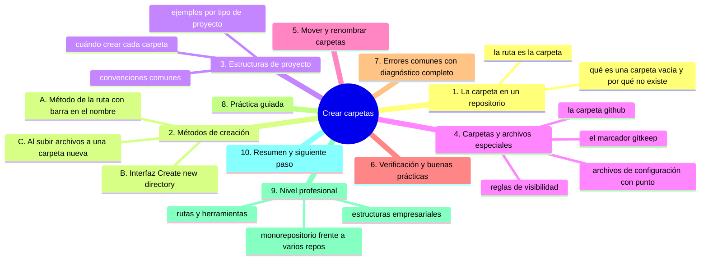
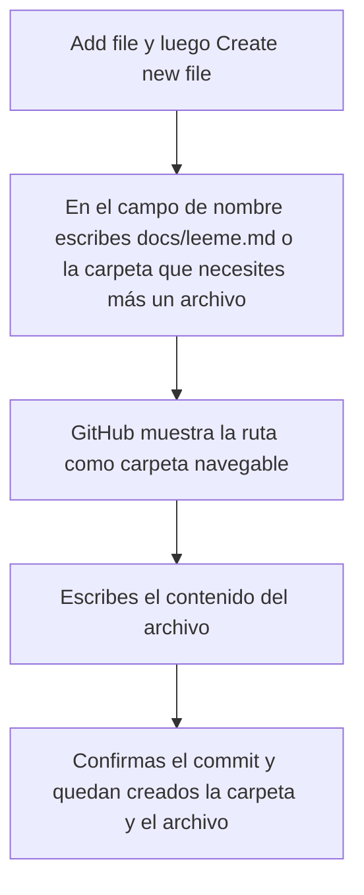
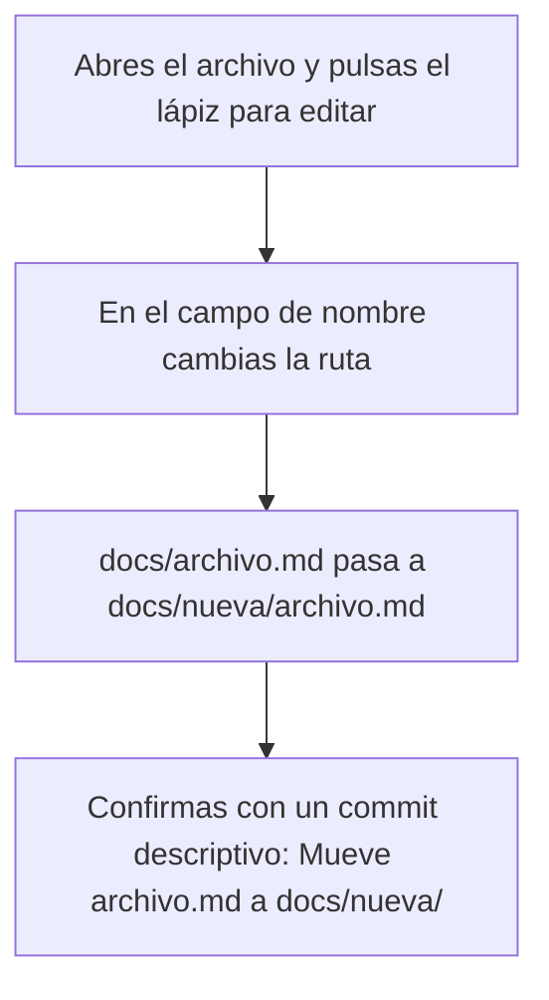

# Crear carpetas

## Introducción

Un repositorio que crece sin organización se vuelve inmanejable: archivos sueltos en la raíz, mezclando documentos, código, imágenes y datos. La carpeta es la herramienta más simple de orden, y en Git tiene una particularidad que conviene entender bien: **las carpetas no existen como objetos independientes, existen porque sus archivos tienen una ruta**.

Por eso «crear una carpeta» en la web se hace de dos formas: creando un archivo dentro de ella (lo que la genera automáticamente) o usando la interfaz de creación de directorio cuando está disponible. Entender el concepto te evita confusiones futuras: una carpeta vacía, por ejemplo, no es algo que Git pueda guardar.

En este capítulo aprenderás:

* qué es una carpeta dentro de un repositorio;
* por qué las carpetas «nacen» de los archivos;
* cómo crear carpetas por la web (método de la ruta y método de la interfaz);
* convenciones de estructura de proyectos;
* carpetas especiales (`.github/`, `.gitignore`, etc.);
* cómo mover archivos entre carpetas;
* errores comunes, práctica guiada y nivel profesional (estructuras de proyecto, ramas de documentación).

---

## Mapa conceptual de este capítulo



---

## 1. La carpeta en un repositorio

### 1.1. La ruta es la carpeta

```text
En tu explorador de Windows/Mac/Linux      En Git
──────────────────────────────────────────────────────
Carpeta = contenedor físico                Ruta = prefijo del
que contiene archivos                      nombre de los archivos

mi-proyecto/                               mi-proyecto/
   └── docs/                                  └── guia.md
         └── guia.md                           (el archivo se llama
                                                "docs/guia.md")
```

Git guarda archivos con su ruta completa. Cuando todos los archivos empiezan por `docs/`, «existe» la carpeta `docs`. No hay un objeto «carpeta» aparte que guardar.

### 1.2. Consecuencia: las carpetas vacías no existen

```text
Carpeta vacía
   │
   ├── En tu equipo: puedes crearla (y queda vacía)
   │
   ├── En Git: una carpeta sin archivos NO se guarda
   │   (no hay nada que versionar)
   │
   └── Por eso existe el truco del marcador:
       crear un archivo dentro (comúnmente .gitkeep o
       un leeme) para que la carpeta "exista"
       para el equipo
```

> **Idea clave:** una carpeta en un repositorio es una **decisión de estructura** que se manifiesta en las rutas de sus archivos. «Crear» carpeta = poner un archivo dentro.

### 1.3. Jerarquía y profundidad

```text
Árbol del repositorio
──────────────────────────────────────────────
mi-repositorio/              ← raíz
├── README.md
├── docs/
│   ├── guia.md
│   └── img/
│       └── diagrama.png
└── src/
    ├── app.py
    └── utilidades/
        └── fechas.py

Profundidad: la raíz cuenta como nivel 0.
Consejo: no profundices más de lo necesario
(rutas muy largas = referencia incómoda).
```

---

## 2. Métodos de creación

### 2.1. Método A: el camino de la ruta (el más usado)

En el formulario de creación de archivo, el nombre del archivo **acepta barras**. Al escribir una barra, creas carpeta y archivo a la vez.

```text
Crear archivo con nombre:   docs/leeme.md

Resultado:
   mi-repositorio/
      └── docs/
             └── leeme.md

La carpeta docs/ nació porque un archivo vive dentro.
```

Paso a paso:



```text
Variantes útiles del nombre
──────────────────────────────────────────────
docs/nota.md          →  crea docs/ con nota.md
assets/img/logo.png   →  crea assets/img/ con logo.png
a/b/c/dato.txt        →  crea toda la cadena a/b/c/
```

### 2.2. Método B: la interfaz de crear directorio

Según la versión de la interfaz, la página de creación de archivo puede ofrecer un botón o campo de **crear directorio** («Create new directory»), donde pones el nombre de la carpeta y creas un archivo dentro (o, cuando está disponible, la carpeta marcadora).

```text
Si tu interfaz lo ofrece:
   │
   ├── indicas el nombre de la carpeta
   ├── creas el archivo que la sostendrá
   └── confirmas el commit
```

Si tu interfaz no lo ofrece, usa el método A: hace exactamente lo mismo.

### 2.3. Método C: al subir archivos

En el capítulo 04 se mencionó: al subir archivos, si indicas una ruta de carpeta que no existe, GitHub la crea.

```text
Subir archivo a:  assets/datos.csv     (ruta nueva)
       │
       ▼
   assets/ nace + datos.csv dentro, en un solo commit
```

### 2.4. Comparación de métodos

```text
Método              Cuándo usarlo
──────────────────────────────────────────────
Ruta en crear       Necesitas carpeta + primer archivo
archivo (A)         →  el caso más común

Interfaz de         Si está disponible y prefieres
directorio (B)      crear la carpeta «a paso aparte»

Subida con ruta     Ya tenías los archivos y quieres
(C)                 colocarlos en su sitio
```

---

## 3. Estructuras de proyecto

### 3.1. Por qué importa la estructura

```text
Estructura pobre                    Estructura clara
────────────────────                ────────────────────
raíz con 40 archivos                raíz con 5 entradas
nadie sabe dónde va algo             «¿dónde va X?» tiene
                                     respuesta obvia
```

La estructura no es estética: reduce el tiempo de encontrar, evita duplicados y hace predecible el trabajo en equipo.

### 3.2. Convenciones comunes

```text
Carpetas frecuentes en proyectos
   │
   ├── src/  (o el nombre del lenguaje)
   │      →  código fuente
   │
   ├── docs/
   │      →  documentación en Markdown
   │
   ├── assets/  (o img/, media/)
   │      →  imágenes y recursos
   │
   ├── test/  (o tests/)
   │      →  pruebas automatizadas
   │
   ├── data/
   │      →  datos de ejemplo o conjuntos pequeños
   │
   ├── scripts/
   │      →  utilidades y automatizaciones
   │
   └── .github/
          →  configuración de GitHub (workflows, plantillas)
```

### 3.3. Ejemplos por tipo de proyecto

```text
Proyecto de documentación (este mismo)
──────────────────────────────────────────────
github-paso-a-paso/
   ├── README.md
   ├── EMPIEZA-AQUI.md
   ├── 00-orientacion/
   ├── 01-computacion-desde-cero/
   ├── ...
   └── recursos/
```

```text
Aplicación web sencilla
──────────────────────────────────────────────
mi-web/
   ├── README.md
   ├── src/
   │    ├── index.html
   │    ├── estilos.css
   │    └── app.js
   ├── docs/
   └── assets/
        └── logo.png
```

```text
Proyecto de datos
──────────────────────────────────────────────
analisis/
   ├── README.md
   ├── data/
   │    ├── bruto/
   │    └── limpio/
   ├── notebooks/
   └── informes/
```

### 3.4. Cuándo crear cada carpeta

```text
Regla: crea carpetas cuando tengas algo que poner dentro
   │
   ├── NO crees una estructura soñada vacía
   │   (src/, tests/, docs/... sin nada = ruido)
   │
   ├── SÍ prepara docs/ o assets/ cuando vayas a subir
   │   el primer documento o la primera imagen
   │
   └── La estructura crece con el proyecto; lo que no
       debe ocurrir es que todo quede en la raíz
```

---

## 4. Carpetas y archivos especiales

### 4.1. La carpeta `.github/`

```text
.github/
   │
   ├── workflows/          ← flujos de automatización
   │                          (Actions; sección 15)
   │
   ├── ISSUE_TEMPLATE/     ← plantillas de issues
   │
   ├── PULL_REQUEST_TEMPLATE.md  ← plantilla de PR
   │
   ├── dependabot.yml      ← avisos de dependencias
   │                          (si aplica)
   │
   └── CODEOWNERS          ← dueños por ruta de archivos
```

El punto inicial (`.`) la hace oculta en muchos exploradores, pero en GitHub se ve con normalidad. No la borres por «parecer basura».

### 4.2. Archivos de configuración con punto

```text
Archivos que suelen empezar por punto
   │
   ├── .gitignore        →  qué NO versionar (sección 06)
   ├── .gitattributes    →  reglas de archivos para Git
   ├── .editorconfig     →  reglas de editor del equipo
   └── .env / .env.example →  variables de entorno
                             (¡solo el ejemplo! jamás el real)
```

### 4.3. El marcador `.gitkeep`

Para que exista una carpeta que aún no tiene archivos:

```text
assets/
   └── .gitkeep        ← archivo vacío cuyo propósito es
                          que la carpeta exista en Git

Convención conocida por la comunidad; el nombre es
arbitrario pero ampliamente reconocido.
```

Alternativa: poner un `LEEME.md` explicando para qué servirá la carpeta (más útil que un archivo vacío).

---

## 5. Mover y renombrar carpetas

### 5.1. Mover un archivo dentro de la web



### 5.2. Mover una carpeta completa

La web no tiene «arrastrar carpeta entera» de forma cómoda para muchos archivos; las opciones prácticas:

```text
Opciones para mover una carpeta
   │
   ├── Pocos archivos: mover uno a uno desde el editor
   │   (tedioso pero posible)
   │
   ├── Muchos archivos: hacerlo con Git local
   │   (git mv  — se ve en secciones posteriores)
   │
   └── Herramientas de renombrado masivo del propio GitHub
       (cuando están disponibles en la interfaz)
```

### 5.3. Renombrar carpetas

Renombrar una carpeta = renombrar todos sus archivos con la nueva ruta. En la práctica, se hace con Git (`git mv`) o con la opción de renombrado masivo si la interfaz la ofrece. El resultado es un commit (o varios) que refleja el cambio.

> **Precaución:** renombrar carpetas rompe enlaces en documentos que las referencien con rutas antiguas. Tras mover, busca referencias (`docs/...`) en los `.md` del repositorio.

---

## 6. Verificación y buenas prácticas

### 6.1. Checklist tras crear estructura

```text
Verificación
   │
   ├── ¿La carpeta aparece en el listado del repositorio?
   ├── ¿Contiene el archivo que la sostiene?
   ├── ¿El commit refleja la intención (carpeta + archivo)?
   ├── ¿Los nombres son coherentes con la convención
   │   del proyecto (mayúsculas, guiones)?
   └── ¿Hay referencias en otros documentos que deban
       actualizarse?
```

### 6.2. Buenas prácticas

```text
Convenciones recomendadas
──────────────────────────────────────────────
1. Nombres en minúscula y sin espacios: docs/, assets/
2. Pocas carpetas en la raíz (escaneo rápido)
3. Una convención y seguirla: no metas "Documentos"
   junto a "docs"
4. No guardes estructura vacía "por si acaso"
5. Carpetas especiales (.github) intactas
6. Datos sensibles jamás en ninguna carpeta del repo
```

---

## 7. Errores comunes con diagnóstico completo

### Error 1: Crear un archivo llamado «docs» (sin barra)

**Qué ocurrió:** querías la carpeta `docs/` y quedó un archivo de texto llamado `docs`.

**Por qué:** no escribiste la barra ni el nombre del archivo dentro.

**Cómo comprobarlo:** el elemento no es navegable (al pulsarlo no entras, se muestra como archivo).

⚠️ **RIESGO:** eliminar ese archivo desde la web lo borra del repositorio con un commit; si le habías metido contenido solo se recupera abriendo su historial, y en la papelera de tu equipo no aparece.

**Opciones:**
* eliminar el archivo y crear `docs/leeme.md` con la ruta correcta;
* si tenía contenido, moverlo dentro de la carpeta nueva.

**Riesgos:** nombre que colisiona con la carpeta que querías (no puedes tener archivo `docs` y carpeta `docs/` en el mismo sitio).

**Solución:** borrar y recrear con ruta correcta.

**Cómo se evita:** escribir siempre `carpeta/archivo.ext`.

---

### Error 2: Crear la estructura vacía y olvidar los archivos

**Qué ocurrió:** se crearon carpetas con archivos de relleno y nunca llegaron los reales; o peor: carpeta con archivo temporal sin sentido.

**Por qué:** planificación anticipada; se esperaba contenido inmediato.

**Cómo comprobarlo:** inspeccionar la carpeta.

**Opciones:** borrar si no tiene plan; completar si lo tiene.

**Riesgos:** repositorio con estructura fantasma que confunde a los colaboradores.

**Solución:** crear carpetas con su primer archivo real.

**Cómo se evita:** regla del punto 3.4: estructura que crece con el contenido.

---

### Error 3: Elegir mayúsculas/minúsculas inconsistentes

**Qué ocurrió:** `Docs/` en un sitio y `docs/` en otro → dos carpetas «iguales» distintas en sistemas sensibles a mayúsculas.

**Por qué:** tecleo impreciso.

**Cómo comprobarlo:** comparar rutas en el listado; en Windows/macOS (que suelen ignorar mayúsculas) el problema se ve al usar Git o Linux.

**Opciones:** unificar nombres (renombrar) y actualizar referencias.

**Riesgos:** rutas rotas en algunos sistemas; duplicados extraños.

**Solución:** convención única (minúsculas) + limpieza.

**Cómo se evita:** convención escrita desde el primer commit.

---

### Error 4: Subir archivos a la carpeta equivocada

**Qué ocurrió:** lo planeado era `docs/img/` y quedaron en `assets/`.

**Por qué:** carpeta abierta equivocada en el navegador (error ya visto al subir).

**Cómo comprobarlo:** ubicación real de los archivos.

**Opciones:** mover los archivos (pocos → editor; muchos → Git local).

**Riesgos:** duplicados si se suben sin borrar.

**Solución:** mover + eliminar duplicados + commit limpio.

**Cómo se evita:** mirar la ruta en la cabecera antes de confirmar.

---

### Error 5: Borrar una carpeta «vacía» que no existe como tal

**Qué ocurrió:** alguien pregunta cómo borrar la carpeta `pruebas/` y no encuentra la opción (porque no tiene archivos o solo la ves en un sitio).

**Por qué:** confusión concepto carpeta/archivo.

**Cómo comprobarlo:** listar su contenido; si está vacía, en Git no está versionada.

⚠️ **RIESGO:** para borrar una carpeta hay que borrar sus archivos desde la web, y eso elimina de un commit a toda la carpeta; solo se recupera desde el historial, y los enlaces que apuntaran a esos archivos quedan rotos.

**Opciones:** si tiene archivos, borrarlos (la carpeta desaparece); si es un artefacto local, simplemente no existe en el repo.

**Riesgos:** pocos; solo confusión.

**Solución:** entender que borrar archivos = borrar la carpeta.

**Cómo se evita:** recordar el concepto del punto 1.2.

---

### Error 6: Estructura de raíz saturada

**Qué ocurrió:** con el tiempo, 30 archivos y carpetas mezcladas en la raíz.

**Por qué:** nunca hubo convención; cada archivo nació donde caía.

**Cómo comprobarlo:** mirar la página principal del repo.

**Opciones:**
* reorganizar con Git local (mover masivo en un commit);
* dejar de agravar: archivos nuevos siempre en su carpeta.

**Riesgos:** colaboradores perdidos; mala primera impresión.

**Solución:** limpieza coordinada (rama + revisión), no improvisada.

**Cómo se evita:** convención desde el día uno (README de la raíz que explique la estructura).

---

## 8. Práctica guiada

### Objetivo

Montar la estructura de un proyecto pequeño y verificarla.

### Paso 1: crear la primera carpeta con su archivo

1. **Add file → Create new file**.
2. Nombre: `docs/leeme.md`.
3. Contenido: `# Documentación\nEsta carpeta contiene los documentos del proyecto.`
4. Commit: `Crea carpeta docs con leeme`.

### Paso 2: segunda carpeta con ruta profunda

1. **Add file → Create new file**.
2. Nombre: `assets/img/nota.md` (crea la cadena).
3. Contenido breve.
4. Commit: `Crea estructura assets/img`.

### Paso 3: marcador de carpeta

1. Crea `datos/.gitkeep` (archivo vacío o con una línea).
2. Commit: `Reserva carpeta datos para datos del proyecto`.

### Paso 4: explorar

1. Vuelve a la raíz: comprueba las tres carpetas navegables.
2. Entra en `assets/img/`: comprueba la profundidad.

### Paso 5: verificar coherencia

1. Revisa nombres: minúsculas, sin espacios.
2. Escribe en el README (o en el `docs/leeme.md`) la estructura del proyecto.

### Resultado esperado

Una raíz ordenada con tres carpetas y sus archivos sostén; documentada.

### Conclusión esperada

Crear carpetas es crear rutas para archivos: con la barra correcta en el nombre nace la estructura, y la estructura se mantiene con convención, no con suerte.

### Ejercicio de transferencia

En tu repositorio de práctica monta, solo desde la web, una estructura que no sea la del curso —por ejemplo `fotos/evento/` con un `.gitkeep` dentro y `notas/semana-01.md` con una frase— y mueve después ese archivo a otra ruta nueva usando el lápiz, lo que renombra su carpeta. Entrega: la URL de la raíz donde se ven las carpetas, el mensaje de cada commit y una línea indicando qué enlace podrías haber roto con el movimiento.

---

## 9. Nivel profesional

### 9.1. Estructuras empresariales

```text
Proyecto grande (ejemplo simplificado)
──────────────────────────────────────────────
mi-sistema/
   ├── README.md
   ├── docs/
   │    ├── arquitectura.md
   │    ├── despliegue.md
   │    └── api/
   ├── servicios/
   │    ├── backend/
   │    └── frontend/
   ├── infra/
   │    └── (definiciones de infraestructura)
   ├── scripts/
   ├── .github/
   │    └── workflows/
   └── .gitignore
```

Lo profesional no es la cantidad de carpetas, sino que **cada persona pueda adivinar dónde va lo nuevo**.

### 9.2. Monorepositorio vs. múltiples repositorios

```text
Monorepositorio                     Varios repositorios
(un repo con todo)                  (uno por pieza)
   │                                   │
   ├── ventaja: visibilidad total      ├── ventaja: límites
   ├── ventaja: cambios atómicos       ├── claros y equipos
   ├── riesgo: estructura crítica      ├── independientes
   └── riesgo: permisos más gruesos    └── riesgo: versiones
                                            descoordinadas
```

La estructura de carpetas es el «mapa de territorio» del monorepo; en proyectos grandes, definirla bien es decisión de arquitectura, no de gusto.

### 9.3. Rutas y herramientas

```text
Implicaciones de las rutas en flujos automatizados
   │
   ├── Las herramientas de CI/CD trabajan por rutas
   │   (ejemplo: "ejecutar pruebas cuando cambie servicios/")
   │
   ├── CODEOWNERS asigna revisores POR RUTA
   │   (ejemplo: infra/ → equipo de plataforma)
   │
   └── Cambiar una carpeta de sitio puede romper
       automatismos que apuntan a la ruta antigua
```

Conclusión profesional: **las rutas son contrato**. Se documentan, se versionan y se cambian con coordinación.

---

## 10. Resumen

En este capítulo aprendiste que:

* en Git, la carpeta existe porque los archivos tienen ruta; no hay objeto carpeta independiente;
* una carpeta vacía no se versiona: se sostiene con un archivo (`.gitkeep` o un leeme);
* por la web se crean carpetas escribiendo la ruta en el nombre del archivo (`docs/archivo.md`), con la interfaz de directorio si existe, o al subir archivos a una ruta nueva;
* la estructura del proyecto se elige por convención y crece con el contenido, no se vacía «por si acaso»;
* `.github/` y los archivos con punto son configuración sensible: no se tocan sin saber;
* mover carpetas implica renombrar rutas y actualizar las referencias en los documentos;
* los errores típicos (archivo en vez de carpeta, mayúsculas inconsistentes, carpeta equivocada, raíz saturada) se diagnostican comparando la ruta real con la intención;
* en el nivel profesional, las rutas son contrato: afectan a automatismos, dueños de código y arquitectura.

La idea principal es:

> **La estructura del repositorio es una decisión que se escribe en las rutas: cada archivo que nace con una barra a la vez dibuja el mapa del proyecto.**

---

## Autopreguntas de cierre

Sin mirar el material, responde mentalmente y luego compruébalo con este capítulo:

1. ¿Por qué en Git una carpeta no es un objeto que se crea, y qué tienes que hacer para que una carpeta nueva aparezca en el repositorio?
2. ¿Qué problema hay con una carpeta vacía y qué dos maneras tienes de resolverlo desde la web?
3. Si escribes `docs` sin barra en el nombre de un archivo nuevo, ¿qué obtienes y cómo lo detectas en la lista del repositorio?
4. ¿Por qué conviene crear carpetas cuando ya hay contenido que poner dentro, y qué ruido deja hacerlo al revés?
5. ¿Qué riesgos tiene elegir mayúsculas y minúsculas sin convención y en qué sistemas se nota el problema?
6. Cuando mueves o renombras una carpeta, ¿qué es lo que puede romperse y dónde buscas esas referencias?
7. ¿Qué diferencia hay entre borrar una carpeta desde el explorador de tu equipo y borrar sus archivos desde la web?

---

## Próximo paso

Ya sabes ordenar el repositorio con carpetas.

El siguiente paso es el acto central del trabajo con GitHub en la web: hacer un commit.

Continúa con:

[`07-hacer-un-commit.md`](07-hacer-un-commit.md)
