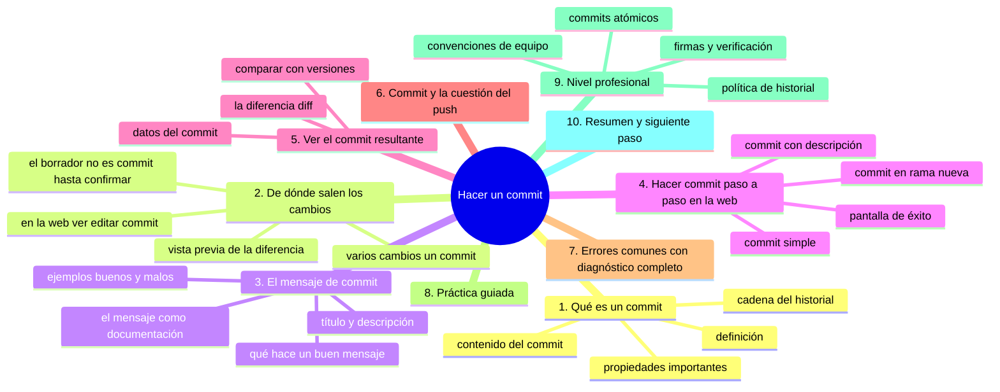
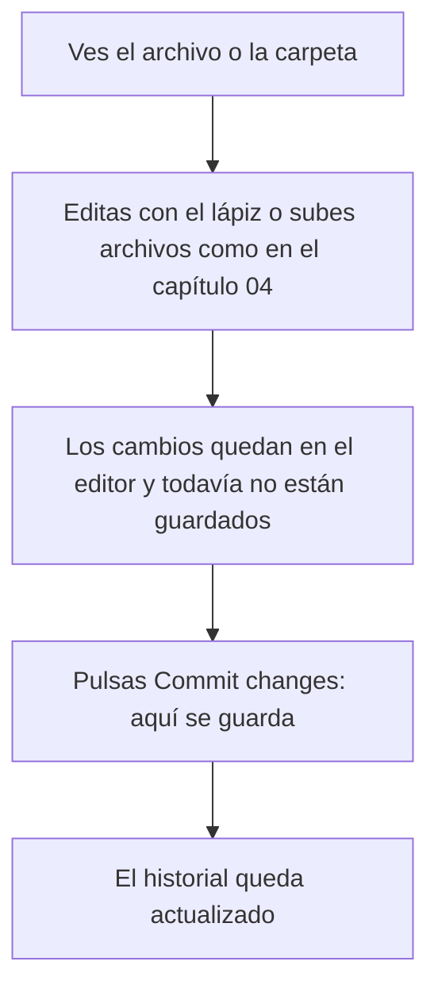
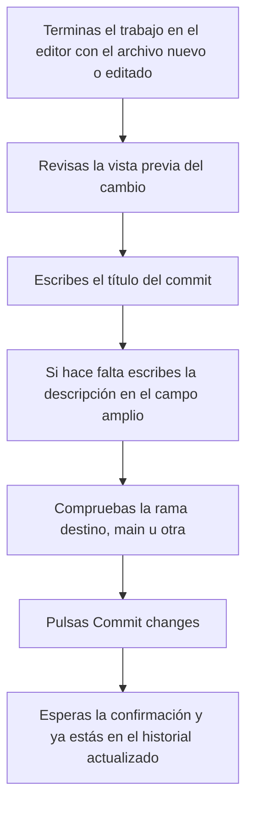

# Hacer un commit

## Introducción

Has creado archivos, los has editado, los has subido y has organizado carpetas. En todos esos pasos has estado haciendo commits sin nombrarlo: cada «Commit changes» de la web generó uno. Ahora toca entender de verdad qué es un commit, porque es la unidad fundamental de todo el trabajo con Git y GitHub.

Un commit es un **registro completo del estado del repositorio en un momento dado**, acompañado de un mensaje, un autor y un identificador. Los commits encadenados forman el historial: la columna vertebral que permite ver qué cambió, cuándo, quién y por qué, y que hace posible retroceder, comparar y colaborar sin pisarse.

En este capítulo aprenderás:

* qué es exactamente un commit y qué contiene;
* de dónde salen los cambios (área de preparación, vista previa);
* cómo redactar un buen mensaje de commit;
* el acto de hacer commit paso a paso en la web;
* cómo se ve el commit en el historial y en la página del repositorio;
* un commit no es «guardar en la nube»: su relación con push (adelantado);
* errores comunes con diagnóstico completo, práctica guiada y nivel profesional (convenciones de mensaje, commits atómicos).

---

## Mapa conceptual de este capítulo



---

## 1. Qué es un commit

### 1.1. Definición

Un **commit** (del inglés, «comprometer»; también llamado «instantánea» o «revisión») registra el estado de todos los archivos del repositorio en un instante, con un mensaje que explica el cambio y los datos de autoría y momento.

```text
Definición operativa
──────────────────────────────────────────────
commit = instantánea del proyecto
       + mensaje que la explica
       + autor
       + fecha y hora
       + identificador (hash)
       + referencia a la instantánea anterior
```

### 1.2. Qué contiene

```text
Interior de un commit
   │
   ├── REFERENCIA al estado anterior (el padre)
   │      →  por eso los commits se encadenan
   │
   ├── LISTADO de archivos con su contenido completo
   │      →  solo se guardan los que CAMBIARON respecto
   │         al commit anterior (Git es eficiente)
   │
   ├── MENSAJE
   │      →  título (obligatorio) + descripción (opcional)
   │
   ├── AUTOR
   │      →  nombre y correo que configuraste en Git
   │         (o la identidad de quien hizo la acción en la web)
   │
   ├── FECHA/HORA
   │
   └── HASH (identificador único)
          →  resumen criptográfico del contenido
          →  ejemplo: 9f1c2ab... (40 caracteres; en la
             interfaz se muestran los primeros 7)
```

### 1.3. La cadena del historial

```text
Historial como cadena
──────────────────────────────────────────────
commit A ──► commit B ──► commit C ──► commit D (HEAD)
(inicio)     (añade       (corrige     (último;
              docs/)       typo)        rama main)

Cada commit conoce a su padre.
Ver D implica poder ver A, B y C.
Retroceder = mirar la cadena hacia atrás.
```

Conceptos que verás en detalle más adelante (sección 07): el commit tiene un identificador **hash** (como el SHA de seguridad, calculado del contenido) y el puntero **HEAD** («dónde estás parado ahora») apunta siempre al último commit de la rama actual.

### 1.4. Propiedades importantes

```text
Propiedades del commit
   │
   ├── INMUTABLE: un commit hecho no se edita;
   │   corregir = hacer OTRO commit que sobrescriba
   │
   ├── AUTOR: nadie puede «cambiar» quién lo hizo sin
   │   reescribir historial (y eso se nota)
   │
   ├── ATÓMICO: o está todo el cambio o no está nada
   │   (no hay «commit al 50%»)
   │
   └── DESCRIPTIVO: sin mensaje, el historial es mudo
```

---

## 2. De dónde salen los cambios

### 2.1. El flujo en la web



El punto crucial: **los cambios en el editor son un borrador**. Hasta que no pulsas «Commit changes», nada queda registrado. Si cierras la pestaña antes, se pierde.

### 2.2. Vista previa de la diferencia

Antes de confirmar, la interfaz suele mostrar la **vista previa** del cambio (qué líneas se añaden y cuáles se quitan). Es tu última puerta de revisión:

```text
Vista previa (diff) típica
──────────────────────────────────────────────
- línea vieja          ← rojo: se elimina
+ línea nueva          ← verde: se añade
  línea sin cambio     ← gris: se mantiene
```

Compárala mentalmente con tu intención: si ves cambios que no querías (una línea borrada por error), vuelve y corrige antes de confirmar.

### 2.3. Varios cambios, un commit

Si en la misma sesión cambiaste dos archivos (o editaste y subiste), los cambios se acumulan en la vista de commit según el flujo; en la web, cada confirmación suele generar un commit con lo que esté en juego. En Git local esto es más flexible (podrás agrupar o separar), concepto que verás en la sección 06.

---

## 3. El mensaje de commit

### 3.1. Estructura

```text
Mensaje
   │
   ├── TÍTULO (una línea, obligatoria)
   │      →  qué hice, en imperativo, sin punto final
   │
   └── DESCRIPCIÓN (opcional, apartado)
          →  por qué lo hice, efectos secundarios,
             contexto que no cabe en el título
```

### 3.2. Qué hace bueno a un mensaje

```text
Criterios
──────────────────────────────────────────────
✔  Imperativo: «Añade», «Corrige», «Elimina»
✔  Concreto: dice qué cambió de verdad
✔  Breve en el título: < 50-70 caracteres
✔  Con contexto útil en la descripción si hace falta
✔  En el idioma acordado para el equipo
   (en este recorrido: español)

✘  «cambios»               →  no dice nada
✘  «actualización final 3» →  no dice nada
✘  «wip»                   →  ¿para quién sirve?
✘  Párrafos enteros en el título
✘  Mezclar 5 temas distintos en un commit
```

### 3.3. Ejemplos

```text
Malos                         Buenos
─────────────────────────     ─────────────────────────────
update                        Añade sección de ejercicios
                              al capítulo 3

fix                           Corrige enlace roto en README
                              (apuntaba al capítulo antiguo)

aaaa                          Separa datos brutos de limpios
                              en data/
```

### 3.4. El mensaje como documentación

Piensa en quién leerá este mensaje dentro de seis meses: probablemente tú, buscando cuándo cambió algo. Un historial con buenos mensajes responde «¿por qué está así las cosas?» sin tener que abrir cada diff.

> **Regla práctica:** el título responde «¿qué?»; la descripción responde «¿por qué?».

---

## 4. Hacer commit paso a paso (web)

### 4.1. Commit desde un archivo nuevo o editado



### 4.2. Commit desde una subida de archivos

```text
Igual que en el capítulo 04:
   │
   ├── selecciona los archivos
   ├── revisa lista y ruta
   ├── escribe título (nunca dejes el genérico)
   ├── elige rama
   └── "Add N files to [rama]"
```

### 4.3. Commit en rama nueva

En el diálogo de commit, la opción «create a new branch» crea una rama con el cambio y te lleva a proponer un Pull Request:

```text
Cuándo usar rama nueva desde el diálogo
   │
   ├── repositorio con protección de rama (no puedes
   │   escribir directo en main)
   │
   ├── colaboración: quieres que alguien revise
   │
   └── trabajo en marcha que no debe contaminar main
```

(Las ramas se estudian en la sección 08; aquí solo identificas la opción.)

### 4.4. Anatomía de la pantalla de éxito

```text
Tras confirmar verás:
   │
   ├── el commit en la parte alta del historial
   ├── su título, autor y hace «x minutos»
   ├── su hash abreviado (7 caracteres)
   └── el botón para ver los cambios (diff)
```

---

## 5. Ver el commit resultante

### 5.1. Dónde está el historial

```text
Página del repositorio
   │
   └── pestaña "Commits" (junto al listado de archivos)
          │
          ▼
       Lista de commits de la rama actual
          │
          ├── más reciente arriba
          ├── título, hash, autor, fecha
          └── cada uno es clicable
```

### 5.2. La página del commit (detalle)

Al pulsar un commit:

```text
Detalle del commit
   │
   ├── Título y descripción completos
   ├── Autor y fecha
   ├── Hash completo
   ├── Padre (commit anterior)
   ├── Estadísticas: +N líneas añadidas, -M quitadas
   └── LISTADO DE ARCHIVOS con su diferencia (diff)
         │
         ├── + líneas verdes (nuevas)
         ├── - líneas rojas (quitadas)
         └── navegación por archivo si hay varios
```

### 5.3. Comparar con otros puntos

Desde el historial o desde la pestaña de commits puedes comparar cualquier commit con otro («Browse files» te lleva al estado del repositorio EN ese momento):

```text
Comparaciones útiles
   │
   ├── commit actual vs. commit anterior  →  ver el cambio
   ├── commit cualquiera vs. main         →  ver lo que falta
   └── estado del repo hace 3 meses       →  «Browse files»
                                              en ese commit
```

Este poder (viajar por el tiempo del proyecto) es la recompensa de tener historial.

---

## 6. Commit ≠ nube: la cuestión del push

### 6.1. Dónde ocurre cada cosa

```text
En la WEB de GitHub          En tu EQUIPO (Git local)
──────────────────────       ──────────────────────────
Al pulsar "Commit changes",   git commit crea el commit
el commit se crea DIRECTO     en tu equipo; para que
en el repositorio remoto      llegue a GitHub hace falta
                              git push

(resumen: ver capítulo 06-07 de este recorrido)
```

### 6.2. Por qué importa ya

Muchos conceptos futuros dependen de esta distinción:

```text
Distinción clave
   │
   ├── Repositorio REMOTO (en GitHub):  aquí estás ahora
   ├── Repositorio LOCAL (en tu equipo): donde vivirás
   │   con la terminal y con GitHub Desktop
   │
   └── commit:  guardar un cambio en el historial
       push:    subir commits locales al remoto
       pull:    traer commits del remoto al equipo
```

Cuando trabajas en la web, commit y «subida» ocurren juntos porque tu «equipo» es el propio GitHub. Cuando trabajes con Git local, los separarás (y entenderás por qué).

---

## 7. Errores comunes con diagnóstico completo

### Error 1: Mensaje vacío o genérico

**Qué ocurrió:** el commit quedó con el texto por defecto o sin explicación.

**Por qué:** prisa o desconocimiento.

**Cómo comprobarlo:** pestaña Commits: mira los últimos mensajes.

**Opciones:**
* commits recientes y pocos: no tocar (reescribir historial es peor mal);
* a partir de ahora: mensaje siempre editado.

**Riesgos:** historial ilegible; en revisión de código, los reviewers no entienden la intención.

**Solución:** disciplina del punto 3.

**Cómo se evita:** tratar el campo de mensaje como parte obligatoria del cambio.

---

### Error 2: Commit con cambios que no querías

**Qué ocurrió:** entró una línea borrada por error, un archivo de prueba, un artefacto.

**Por qué:** no se revisó la vista previa.

**Cómo comprobarlo:** abrir el commit y revisar el diff archivo por archivo.

**Opciones:**
* si no se ha compartido: en web, contrarrestar con un commit de corrección (rápido);
* en Git local, si no se hizo push: se puede rehacer limpiamente (se verá en secciones posteriores);
* si ya se compartió: commit de reversión o corrección (la vía segura).

**Riesgos:** contenido basura en el historial para siempre.

**Solución:** revert/corrección en un commit nuevo.

**Cómo se evita:** revisar la vista previa SIEMPRE antes de confirmar.

---

### Error 3: Subir en la rama equivocada

**Qué ocurrió:** el commit fue a `main` cuando debía ir a una rama de trabajo.

**Por qué:** no se miró el selector de rama.

**Cómo comprobarlo:** la página del repo muestra la rama actual; el commit está en `main` (pestaña Commits con `main` seleccionado).

**Opciones:**
* si es tu repo personal y sin reglas: a veces se convive o se revierte;
* si hay reglas de equipo: hablar con quien gestiona; mover el cambio a la rama correcta y revertir en main.

**Riesgos:** cambios sin revisión en la rama principal.

**Solución:** mover + revert (o pedir ayuda si el historial compartido está en juego).

**Cómo se evita:** mirar la rama en cada diálogo de commit.

---

### Error 4: Cerrar la pestaña sin confirmar

⚠️ **RIESGO:** lo que está en el editor sin pulsar «Commit changes» no está en ningún commit: no hay borrador, ni historial, ni papelera que lo recupere; si cierras la pestaña se pierde para siempre.

**Qué ocurrió:** horas de edición en el navegador... y se cerró la pestaña.

**Por qué:** se creyó que «estaba guardado» al escribir.

**Cómo comprobarlo:** el archivo en el repo no cambió.

**Opciones:** lamentablemente, se perdió (la web no tiene recuperación de borradores en el editor de archivo).

**Riesgos:** pérdida de trabajo.

**Solución:** rehacer (o en el futuro, trabajar con Git local donde el editor es tuyo y los borradores viven en tu equipo).

**Cómo se evita:** confirmar con frecuencia; para trabajo largo, no usar el navegador como editor principal.

---

### Error 5: Creer que el commit «borró» lo anterior

**Qué ocurrió:** alguien cree que al hacer commit, la versión previa desapareció.

**Por qué:** confundir guardar con sobrescribir.

**Cómo comprobarlo:** abrir el commit anterior: su contenido está intacto.

**Opciones:** ninguna: es un malentendido, no un fallo.

**Riesgos:** pánico innecesario o, al revés, confianza excesiva en que «todo está guardado» sin revisión.

**Solución:** entender la cadena: cada commit agrega; nada se destruye.

**Cómo se evita:** recordar el modelo del historial como cadena (punto 1.3).

---

### Error 6: Commit enorme con 30 archivos

**Qué ocurrió:** «preparación del proyecto» con 30 archivos, mezclando estructura, contenido y ajustes.

**Por qué:** todo se hizo de golpe y se confirmó de golpe.

**Cómo comprobarlo:** detalle del commit: «30 files changed».

**Opciones:**
* si es el commit inicial del proyecto: es aceptable (el primero puede ser grande);
* si no: en adelante, separar por tema (un commit = una idea).

**Riesgos:** imposibilidad de revisar, revertir o entender el cambio parcialmente.

**Solución:** disciplina de commits atómicos (punto 9.1).

**Cómo se evita:** confirmar por bloques coherentes mientras trabajas.

---

## 8. Práctica guiada

### Objetivo

Hacer tres commits con mensajes correctos y practicar la lectura del historial.

### Paso 1: commit con descripción

1. Crea o edita un archivo (por ejemplo, amplía `docs/leeme.md`).
2. Escribe el título: `Amplía el leeme con la estructura del proyecto`.
3. Escribe en la descripción: `Explica para qué sirve cada carpeta creada.`
4. Confirma en `main`.

### Paso 2: commit de subida

1. Sube una imagen a `assets/` (capítulos 04-05).
2. Título: `Añade captura de ejemplo en assets`.
3. Confirma.

### Paso 3: leer el historial

1. Entra en la pestaña **Commits**.
2. Identifica: título, hash, autor, fecha de cada commit.
3. Abre el primero de los tres: revisa el diff (qué líneas cambiaron).
4. Pulsa «Browse files»: navega por el repo tal como estaba en ese commit.

### Paso 4: simulacro de error

1. Edita un archivo y borra una línea por «accidente» a propósito.
2. Revisa la vista previa y DETECTA el borrado.
3. Corrige antes de confirmar.
4. Confirma solo el cambio correcto.

### Resultado esperado

Tres commits con mensajes distintos y claros; capacidad para abrir cualquier commit y leer su diferencia.

### Conclusión esperada

El commit es un acto de documentación tanto como de guardado: lo que cambias importa, pero lo que explicas es lo que hace útil al historial.

### Ejercicio de transferencia

En tu repositorio de práctica, haz dos commits que nada tengan que ver con el curso —por ejemplo uno que corrija una frase mal escrita en el README y otro que añada una lista nueva a otro archivo— con título y descripción en ambos. Entrega: los dos enlaces a los commits, el texto completo de cada mensaje y el hash corto de cada uno.

---

## 9. Nivel profesional

### 9.1. Commits atómicos

```text
Commit atómico = un solo propósito
──────────────────────────────────────────────
Bueno:
   commit 1: «Corrige cálculo de totales en facturación»
   commit 2: «Actualiza pruebas del cálculo de totales»
   commit 3: «Documenta la fórmula en docs/facturacion.md»

Malo:
   commit 1: «correcciones varias, docs, pruebas, logo»
```

Ventajas de lo atómico:

```text
   │
   ├── Revisión: el reviewer entiende cada cambio solo
   ├── Revert: puedes deshacer UN problema sin deshacer otros
   ├── Bisect: localizar el commit que rompió algo es rápido
   └── Historial: responde «cómo evolucionó esto» con precisión
```

### 9.2. Convenciones de equipo

Equipos acuerdan formatos de mensaje:

```text
Convenciones conocidas (ejemplos)
──────────────────────────────────────────────
Tipo: alcance: descripción
   feat: pagos: añade soporte para reembolsos
   fix: api: corrige error 500 al crear usuario
   docs: guía: actualiza instalación

O simplemente: prefijo libre acordado (Docs:, Test:, Refactor:)

Lo importante NO es la moda elegida, sino que
TODO el equipo use la misma.
```

### 9.3. Firmas y verificación

Para trazabilidad alta, GitHub permite la **verificación de commits** (el sello «Verified»): el commit se firma con tu clave (GPG/SSH/S/MIME según corresponda) y la plataforma valida que lo hiciste tú.

```text
Firma de commits
   │
   ├── Para qué: demostrar autoría inequívoca
   ├── Dónde: configuración de claves en Settings
   ├── Resultado: sello "Verified" en el historial
   └── Cuándo importa: proyectos con requisitos de
       cumplimiento, seguridad o distribución oficial
```

Implica que la identidad que firma debe estar verificada en tu cuenta (conexión con los capítulos de correo y seguridad).

### 9.4. Política de historial

```text
En equipos con muchas personas se acuerda:
   │
   ├── ¿Se permite reescribir historial? (normalmente NO
   │   en ramas compartidas)
   ├── ¿Formato de mensaje obligatorio?
   ├── ¿Firma requerida en releases?
   └── ¿Quién puede fusionar en main?
```

Estas reglas se ven con detalle en las secciones de ramas, Pull Requests y protección de ramas.

---

## 10. Resumen

En este capítulo aprendiste que:

* un commit es una instantánea completa del repositorio con mensaje, autor, fecha e identificador (hash), encadenada a la anterior;
* en la web, los cambios del editor son borradores hasta pulsar «Commit changes»; la vista previa es la última revisión;
* el historial (pestaña Commits) es la cadena completa del proyecto, navegable y comparable en cualquier punto;
* un buen mensaje tiene título imperativo y concreto, y descripción que explica el porqué;
* cada commit es atómico e inmutable: corregir es añadir otro commit, no editar uno viejo;
* en la web, commit y publicación ocurren juntos; con Git local se separarán en commit y push;
* los errores típicos (mensaje genérico, cambios no deseados, rama equivocada, pestaña cerrada, commit gigante) se diagnostican abriendo el commit y revisando el diff;
* a nivel profesional, los commits atómicos y las convenciones de mensaje son el contrato de legibilidad del equipo.

La idea principal es:

> **El commit es la unidad de verdad del proyecto: cada uno debe poder explicarse solo, por qué existe y qué cambió, sin necesidad de preguntarle a nadie.**

---

## Autopreguntas de cierre

Sin mirar el material, responde mentalmente y luego compruébalo con este capítulo:

1. ¿Qué contiene un commit y por qué su mensaje es tan obligatorio como la instantánea que guarda?
2. ¿Por qué los cambios escritos en el editor no son todavía un commit y qué es exactamente lo que los convierte en uno?
3. ¿Qué pregunta responde el título del commit y cuál la descripción, y qué pasa si el título se queda en «update»?
4. Si la vista previa del commit muestra una línea que no querías borrar, ¿qué haces antes de confirmar y por qué no conviene editar después el commit viejo?
5. ¿Qué significa que un commit sea inmutable y cómo se corrige entonces un error ya confirmado?
6. ¿Por qué en la web el commit y la subida ocurren en el mismo paso, y qué separación aparece cuando trabajas con Git en tu equipo?
7. ¿Qué revisas en el diálogo de commit para evitar un commit enorme con treinta archivos o un commit en la rama equivocada?

---

## Próximo paso

Ya sabes crear commits con buenos mensajes.

El siguiente paso es leer el historial completo: cómo ver la lista de commits, compararlos y entender la evolución del proyecto.

Continúa con:

[`08-ver-el-historial.md`](08-ver-el-historial.md)
