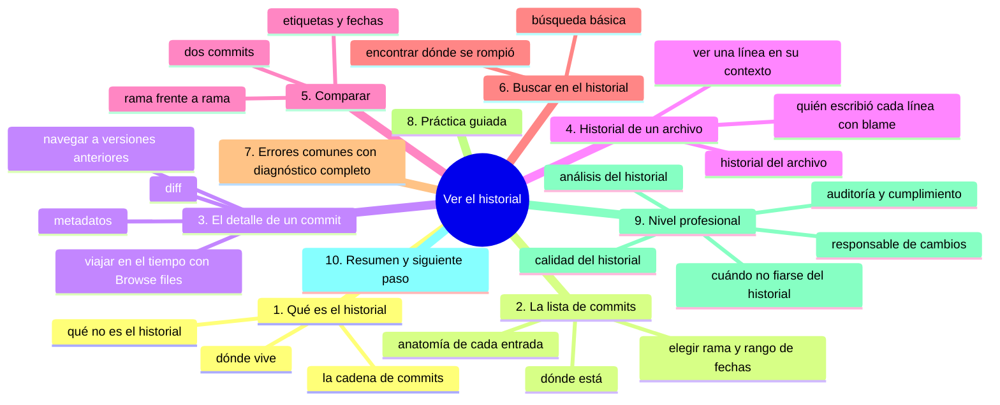
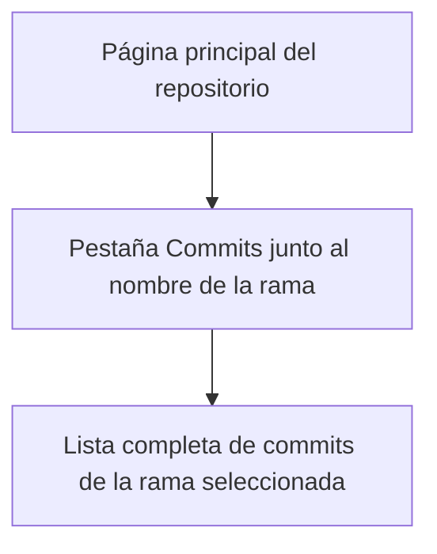
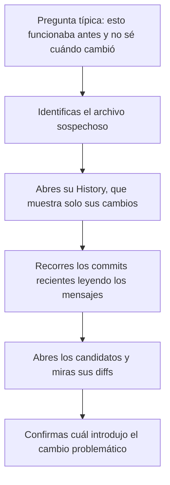

# Ver el historial

## Introducción

Cada commit que haces añade un eslabón a la cadena del proyecto. Esa cadena es el **historial**: la memoria completa de todo lo que ha pasado en el repositorio.

Saber leer el historial es tan importante como saber escribirlo. El historial responde preguntas cotidianas: ¿quién cambió esto y cuándo?, ¿qué contenía el archivo antes?, ¿en qué commit se introdujo este error?, ¿qué pasó en la última semana? En un equipo, leer el historial es la base de la revisión de código; en solitario, es la forma de no perder el hilo.

En este capítulo aprenderás:

* dónde y cómo listar los commits;
* anatomía de cada entrada del historial;
* la vista de detalle de un commit y su diff;
* navegar el historial de un archivo concreto;
* comparar commits y ramas;
* buscar en el historial;
* errores y malentendidos comunes, práctica guiada y nivel profesional (herramientas de análisis, blame).

---

## Mapa conceptual de este capítulo



---

## 1. Qué es el historial

### 1.1. La memoria del proyecto

```text
Historial
   │
   ├── Es la lista ORDENADA de todos los commits de una rama
   ├── Cada entrada es un estado guardado del proyecto
   ├── Se lee del más reciente al más antiguo (en la web)
   └── Contiene también: autores, fechas, mensajes y diffs
```

### 1.2. Dónde vive

```text
En la web de GitHub
   │
   ├── Pestaña "Commits" de la página del repositorio
   ├── Pestaña "History" de un archivo concreto
   └── Página individual de cada commit (hash)

En tu equipo (Git local)
   │
   └── git log  →  lo verás en la sección 06
```

### 1.3. Qué NO es el historial

```text
Malentendidos frecuentes
   │
   ├── NO es un archivo: no «existe» como fichero dentro
   │   del repositorio (vive en la carpeta interna .git,
   │   que no se navega en la web)
   │
   ├── NO es el log de actividad de la plataforma
   │   (ese es el resumen de eventos: estrellas, follows...;
   │   el historial es de COMMITS)
   │
   └── NO muestra borradores: solo cambios confirmados
```

---

## 2. La lista de commits

### 2.1. Cómo llegar



### 2.2. Anatomía de una entrada

```text
Entrada del historial
──────────────────────────────────────────────
[icono] Título del commit                    hace 2 días
        autor  ·  hash (7 caracteres)  ·  +12 -3
──────────────────────────────────────────────
   │         │          │             │       │
   │         │          │             │       └ líneas
   │         │          │             │         añadidas/
   │         │          │             │         quitadas
   │         │          │             └ identificador
   │         │          │               abreviado
   │         │          └ quién lo hizo
   │         └ mensaje (clicable)
   └ carpeta afectada
      (si el commit toca una carpeta
       subida, se indica la ruta)
```

### 2.3. Cambiar de rama y de rango

```text
Controles del historial
   │
   ├── Selector de RAMA
   │      →  el historial es por rama: cambia la rama
   │         y ves SU cadena
   │
   ├── Filtro de FECHAS (si está disponible)
   │      →  «hoy», «esta semana», rango personalizado
   │
   └── Selector de AUTOR (si está disponible)
          →  filtrar por quién hizo los commits
```

> **Concepto importante:** cada rama tiene su propio historial que crece desde el punto en que se separó. Ver «main» no muestra los commits hechos solo en otra rama (aunque estos se fusionen después; lo verás en la sección 08 de ramas).

---

## 3. El detalle de un commit

### 3.1. Metadatos

Al pulsar un commit:

```text
Cabecera del commit
   │
   ├── Título completo
   ├── Descripción completa (si tiene)
   ├── Autor + identificador de correo (puede aparecer
   │   enmascarado o como noreply según tu configuración)
   ├── Fecha exacta (y «hace X»)
   ├── Hash completo del commit
   └── Hash del padre (commit anterior)
```

### 3.2. El diff

```text
Diferencia mostrada
──────────────────────────────────────────────
 Archivo A (modificado)
    línea sin cambio
 -  línea eliminada       (rojo)
 +  línea añadida         (verde)

 Archivo B (nuevo)
    (todo el archivo como adición)

 Archivo C (eliminado)
    (todo el archivo como baja)
```

La estadística (`+12 -3`) resume el cambio; el diff lo explica línea a línea.

### 3.3. Herramientas de la vista

```text
En la vista de commit sueles poder:
   │
   ├── plegar/desplegar archivos grandes
   ├── navegar al archivo completo en ESE commit
   ├── copiar enlaces a líneas concretas
   │   (deep link a una línea del diff)
   ├── marcar como visto (en flujos de revisión)
   └── navegar al commit anterior/siguiente
```

### 3.4. Viajar en el tiempo

```text
"Browse files" en cualquier commit
       │
       ▼
Página del repositorio TAL COMO ESTABA en ese commit
   │
   ├── abres archivos antiguos sin tocar nada
   ├── puedes navegar por carpetas de esa época
   └── no estás «editando el pasado»: solo mirando
```

Esta es una de las funciones más valiosas del historial: reproducir cualquier estado anterior del proyecto.

---

## 4. Historial de un archivo

### 4.1. Historial por archivo

Un archivo concreto tiene su propia historia:

```text
Archivo abierto
   │
   └── pestaña "History" (Historial)
          │
          ▼
   Solo los commits que tocaron ESTE archivo
```

Ventaja: si el repositorio tiene cientos de commits y el archivo solo cambió cinco veces, ves cinco.

### 4.2. Blame: quién escribió cada línea

En la pestaña de un archivo aparece la opción «Blame» (responsabilidad):

```text
Blame (culpa/responsabilidad)
──────────────────────────────────────────────
Cada línea del archivo acompaña de:
   · el commit que la introdujo (o la modificó por última vez)
   · el autor
   · la fecha

Uso: entender POR QUÉ está esa línea y quién
puede dar contexto (o quién revisó ese cambio)
```

```text
Cuándo es útil
   │
   ├── «esta condición rara, ¿quién la puso?»
   ├── «necesito explicación de este bloque»
   │      →  el blame apunta al commit; el commit
   │         tiene su mensaje
   └── En equipos: localizar al revisor adecuado

Uso responsable:
   · es una herramienta técnica, no un arma
   · el objetivo es entender el origen, no juzgar
```

### 4.3. Ver una línea en su contexto

Desde el blame puedes abrir el commit exacto donde esa línea nació, y desde ahí el diff completo. Es el camino: **línea → commit → mensaje → contexto**.

---

## 5. Comparar

### 5.1. Dos commits

```text
Comparación A...B
   │
   ├── Muestra: todos los cambios entre A y B
   ├── Útil para: «qué cambió desde la última revisión»
   └── Se llega desde: historial, URL de comparación o
       la interfaz de "Compare"
```

### 5.2. Rama vs. rama

```text
Compare entre ramas (con base:)
   │
   ├── base: main
   ├── compare: mi-rama
   └── resultado: lo que aporta mi-rama respecto a main

Fundamento: detectar qué commits están en una rama
y no en otra (concepto de «diferencia» que verás
en detalle con git log y git diff en la terminal,
y con git cherry/cherry-pick más adelante)
```

Esta vista es la base del Pull Request: «mira lo que cambió mi rama» (sección 17).

### 5.3. Comparar etiquetas y fechas

Si el equipo usa etiquetas (tags) de versiones, puedes comparar entre ellas (por ejemplo, `v1.0...v1.1`) para ver todo lo que cambió entre dos entregas. Las etiquetas se tratan en secciones posteriores de versionado.

---

## 6. Buscar en el historial

### 6.1. Búsqueda básica

```text
Dónde buscar
   │
   ├── La barra de búsqueda del repositorio acepta
   │   comandos como:
   │        committer:nombre
   │        commit:hash
   │        o texto libre sobre mensajes/contenido
   │
   ├── En la lista de commits: recorrer y leer
   │
   └── En Git local: git log con filtros
          (sección 06: --author, --grep, --since...)
```

### 6.2. Encontrar «dónde se rompió»



En Git local, este procedimiento se automatiza con `git bisect` (búsqueda binaria), que te deja saltar directamente al commit culpable; se menciona en la sección 11.

---

## 7. Errores comunes con diagnóstico completo

### Error 1: Buscar un commit «y no aparece»

**Qué ocurrió:** recuerdas un commit pero no lo ves en la lista.

**Por qué posibles:**
* estás mirando otra rama;
* el filtro de fechas lo excluye;
* el commit es de otro repositorio (fork);
* te acuerdas del mensaje pero no existe tal cual.

**Cómo comprobarlo:**
* cambiar el selector de rama a `main` y a la rama relevante;
* quitar filtros de fecha;
* buscar por hash si lo recuerdas (parcial sirve).

**Opciones:** recorrer con el buscador; en Git local, `git log --all` ve todas las ramas.

**Riesgos:** pérdida de tiempo y conclusiones erróneas («alguien borró mi commit» cuando estabas en otra rama).

**Solución:** verificar rama y filtros.

**Cómo se evita:** antes de sacar conclusiones, comprobar el contexto (rama, fecha, repositorio).

---

### Error 2: El diff es enorme y no se entiende

**Qué ocurrió:** un commit con cientos de archivos y miles de líneas.

**Por qué:** commit no atómico (error ya visto) o cambios masivos automáticos (formato de código, dependencias).

**Cómo comprobarlo:** estadísticas del commit.

**Opciones:**
* si es regeneración automática (un archivo generado): leerlo por partes o confiar en el mensaje si es claro;
* si es humana: lamentar la falta de atomicidad y anotarlo para la revisión.

**Riesgos:** pasar por alto un cambio peligroso dentro del ruido.

**Solución:** revisar por archivo, empezando por los más sospechosos (configuración, credenciales, borrados).

**Cómo se evita:** commits atómicos (y en equipo, limitar cambios masivos en un solo commit).

---

### Error 3: Creer que el historial se puede editar en la web

**Qué ocurrió:** alguien intenta «arreglar» un mensaje viejo desde GitHub.

**Por qué:** la interfaz web no permite reescribir commits (y es bueno: la inmutabilidad es una garantía).

**Cómo comprobarlo:** no hay botón de editar commit en la vista (solo comentarios).

⚠️ **RIESGO:** reescribir historial con Git local cambia los identificadores de todos los commits de la rama; en una rama compartida deja a los demás con clones descoordinados, y lo único que lo recupera es que alguien conserve una copia de la rama anterior.

**Opciones:** dejarlo como está (lo normal) o reescribir historial con Git local (avanzado, coordinado, riesgoso en ramas compartidas).

**Riesgos:** intentarlo por tu cuenta puede provocar historiales divergentes en el equipo.

**Solución:** aceptar la inmutabilidad; hacer commits correctos desde el inicio.

**Cómo se evita:** recordar que corregir = commit nuevo.

---

### Error 4: Confundir historial con actividad

**Qué ocurrió:** se mira el cuadro de contribuciones o la pestaña de actividad creyendo que es el historial de código.

**Por qué:** ambos son «lo que pasó» pero con distinto alcance.

**Cómo comprobarlo:**
* historial de commits: solo cambios de código, por rama;
* actividad: eventos de la plataforma (estrellas, comentarios...).

**Opciones:** ninguna: son vistas distintas y complementarias.

**Riesgos:** confusión al explicar el proyecto («actividad» no es «avance del código»).

**Solución:** usar la pestaña Commits para código.

**Cómo se evita:** distinguir ambos conceptos desde el principio.

---

### Error 5: No notar que el historial es de la rama actual

**Qué ocurrió:** se revisa «el historial del proyecto» pero la pestaña muestra otra rama.

**Por qué:** el selector de rama pasa desapercibido.

**Cómo comprobarlo:** mirar la rama indicada junto a la lista.

**Opciones:** cambiar de rama en el selector; entender que cada rama tiene su cadena.

**Riesgos:** creer que faltan cambios que existen en otra rama (o al revés).

**Solución:** comprobar siempre la rama al interpretar el historial.

**Cómo se evita:** hábito de mirar el selector primero.

---

### Error 6: Esperar que «hace X tiempo» sea preciso

**Qué ocurrió:** el historial dice «hace 3 meses» y alguien afirma «lo hizo el lunes».

**Por qué:** la fecha relativa es aproximada; además, la fecha es la del commit, no la de la fusión.

**Cómo comprobarlo:** abrir el commit y ver fecha y hora exactas.

**Opciones:** usar la fecha exacta (y la de fusión si aplica).

**Riesgos:** imprecisiones en reportes.

**Solución:** fechas exactas en cualquier discusión seria.

**Cómo se evita:** citar hash + fecha exacta cuando importa.

---

## 8. Práctica guiada

### Objetivo

Leer un historial como un profesional: listar, abrir, comparar y buscar.

### Paso 1: lista

1. Abre tu repositorio → pestaña **Commits**.
2. Identifica en las primeras entradas: título, autor, fecha, hash, estadísticas.

### Paso 2: detalle

1. Abre el commit más antiguo (navega con la paginación si hace falta).
2. Lee mensaje completo, autoría y fecha exacta.
3. Revisa el diff: ¿qué archivos tocó? ¿qué líneas cambió?

### Paso 3: viaje en el tiempo

1. En ese commit antiguo, pulsa **Browse files**.
2. Navega por el repositorio de esa época: ¿qué archivos existían y cuáles no?
3. Vuelve al commit actual.

### Paso 4: historial de un archivo

1. Abre `README.md` (o el archivo que hayas tocado más).
2. Entra en su **History**: ¿cuántos commits lo tocaron?
3. Pulsa **Blame**: identifica la última línea que cambiaste y su commit.

### Paso 5: comparación mental

1. Toma dos commits (uno antiguo y uno reciente).
2. Imagina la comparación: ¿qué archivos cambian entre ellos?
3. Si la interfaz lo permite, realiza la comparación y verifica.

### Resultado esperado

Capacidad de responder, sin ayuda: «¿quién cambió X, cuándo, en qué commit y qué cambió exactamente?».

### Conclusión esperada

El historial no es una lista decorativa: es la base de la comprensión del proyecto y de la revisión del trabajo.

### Ejercicio de transferencia

En tu repositorio de práctica, elige una frase concreta de un archivo, localiza con «History» y «Blame» en qué commit apareció y ábrelo con «Browse files» para ver el proyecto de ese momento. Entrega: el enlace al commit, su hash corto, la fecha exacta, el autor y la frase que rastreaste.

---

## 9. Nivel profesional

### 9.1. El historial como herramienta de análisis

```text
Preguntas profesionales y su respuesta en el historial
   │
   ├── ¿Cuándo se introdujo esta dependencia?
   │      →  blame del archivo de dependencias
   │
   ├── ¿Qué cambió entre la versión 1.0 y 1.1?
   │      →  comparación entre etiquetas (tags)
   │
   ├── ¿Quién es responsable de este módulo?
   │      →  blame + frecuencia de commits en la ruta
   │         (mejor: CODEOWNERS, sección 18)
   │
   ├── ¿Qué pasó en la última semana?
   │      →  filtro de fechas del historial
   │
   └── ¿Este cambio fue revisado?
          →  el historial del PR y sus revisiones
             (sección 17)
```

### 9.2. Calidad del historial

```text
Historial sano                    Historial enfermo
────────────────────              ──────────────────────
Mensajes con intención            «update», «fix», «wip»
Commits atómicos                  Commits de 40 archivos
Fechas coherentes                 Historial reescrito a menudo
Autores reales                    «co-author» confusos
Sin secretos ni basura            .env, credenciales, zips
```

Un historial sano reduce el tiempo de onboarding: el equipo nuevo lee los commits y entiende la evolución sin preguntar.

### 9.3. Auditoría y cumplimiento

En entornos regulados o de seguridad:

```text
Requisitos típicos
   │
   ├── Trazabilidad: cada cambio con autor verificable
   ├── Integridad: commits firmados en puntos críticos
   ├── Retención: el historial no se reescribe
   ├── Revisión: cambios en rutas sensibles con aprobación
   └── Evidencia: exportar el historial como registro
```

La pestaña Commits es la vista rápida; la verdad completa está en el repositorio clonado (y las políticas de rama protegida impiden alteraciones no autorizadas).

### 9.4. Cuándo NO fiarse del historial

```text
Límites del historial
   │
   ├── No muestra intención solo si el mensaje es malo
   ├── No prueba revisión (eso está en el PR)
   ├── Puede haber sido reescrito (avanzado; raro en
   │   flujos con ramas protegidas)
   └── Los cambios con herramientas externas (fusión de
       PRs) aparecen con su propia estructura
```

---

## 10. Resumen

En este capítulo aprendiste que:

* el historial es la cadena de commits de una rama, accesible en la pestaña Commits y en el History de cada archivo;
* cada entrada muestra mensaje, autor, fecha, hash y estadísticas; el detalle muestra el diff completo;
* la vista de commit permite viajar al estado del repositorio en cualquier punto (Browse files) sin alterar nada;
* el historial de un archivo filtra solo sus cambios, y el blame muestra qué commit introdujo cada línea;
* comparar commits o ramas es la base del flujo de Pull Requests;
* la búsqueda efectiva combina rama, fechas y mensaje; en la terminal se amplía con filtros potentes (`git log`);
* los errores típicos (otra rama, filtros, diff gigante, confundir historial con actividad) se resuelven comprobando el contexto antes de concluir;
* a nivel profesional, el historial es evidencia: su calidad (mensajes, atomicidad, firmas) determina su utilidad para análisis, revisión y auditoría.

La idea principal es:

> **El historial es la memoria del proyecto: leerlo bien es la forma de entender por qué el código está como está, y cuidarlo es la forma de que esa memoria siga siendo útil.**

---

## Autopreguntas de cierre

Sin mirar el material, responde mentalmente y luego compruébalo con este capítulo:

1. ¿Dónde miras para listar los commits y por qué el historial que ves depende de la rama que tenga seleccionada?
2. ¿Qué información lleva cada entrada de la lista y qué te aporta el diff que no te dice el título del commit?
3. ¿Qué puedes hacer con «Browse files» en un commit antiguo y qué pasaría si lo usaras con la intención de modificar ese estado?
4. ¿Cómo respondes a la pregunta «¿quién escribió esta línea?» y cómo sigues desde esa línea hasta el mensaje que explica el porqué?
5. ¿Qué diferencia hay entre la pestaña «Commits» y la pestaña de actividad, y qué conclusión errónea sacas si las confundes?
6. ¿Cómo procedes cuando un commit «no aparece» en la lista y por qué la primera comprobación es el selector de rama y los filtros?
7. ¿Qué haces cuando el diff de un commit es enorme y qué suele estar diciéndote ese commit sobre su autor?

---

## Próximo paso

Ya sabes leer el historial.

El siguiente paso es aprender a retroceder: restaurar versiones anteriores de archivos y proyectos.

Continúa con:

[`09-restaurar-versiones.md`](09-restaurar-versiones.md)
