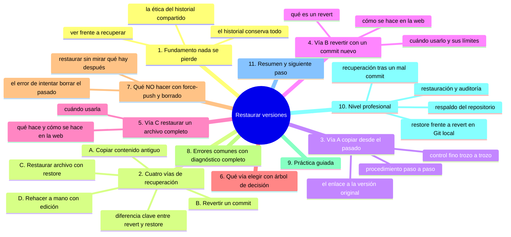
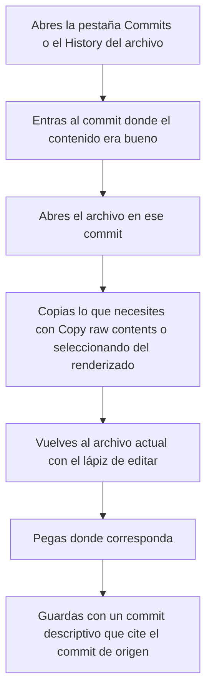
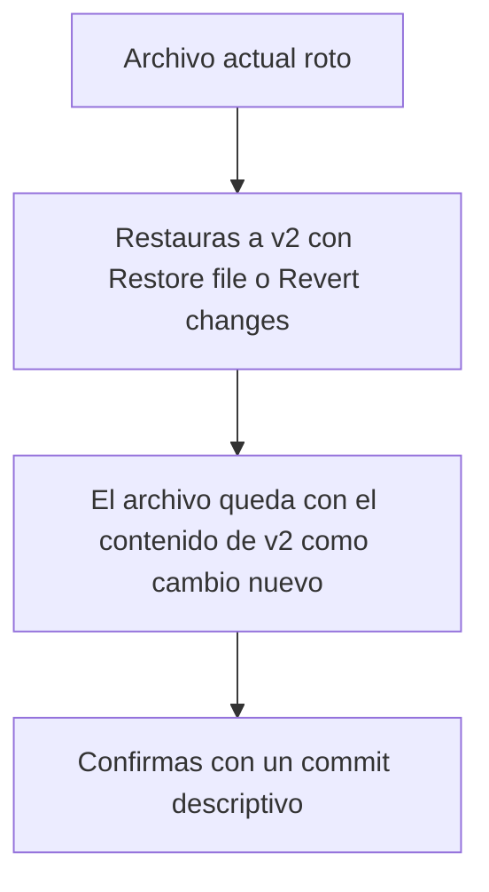

# Restaurar versiones

## Introducción

El historial guarda cada estado del proyecto. Eso significa que nada se pierde: si un archivo quedó mal, si se borró algo por error o si necesitas el contenido de hace tres meses, el estado anterior sigue ahí, guardado en su commit.

**Restaurar versiones** es el arte de recuperar ese pasado. Y aquí hay una distinción que separa a los usuarios de los que entienden Git: *ver* un estado antiguo es fácil e inocuo; *recuperarlo* al trabajo actual puede hacerse de varias formas, con consecuencias distintas (sobrescribir, revertir o copiar). Elegir bien la vía es el objetivo de este capítulo.

En la web de GitHub hay tres formas de restaurar versiones: copiar el contenido antiguo, revertir un commit con un commit nuevo, o (con ciertas interfaces) restaurar un archivo al estado anterior. Las tres son seguras a su manera; ninguna reescribe el pasado.

En este capítulo aprenderás:

* la diferencia entre ver, copiar, revertir y restaurar;
* cómo copiar el contenido de una versión antigua;
* cómo revertir un cambio con la interfaz web;
* cómo restaurar un archivo completo (cuando la interfaz lo permite);
* cuándo usar cada vía;
* errores y riesgos comunes (especialmente, qué NO hacer);
* práctica guiada y nivel profesional (recuperaciones y respaldos).

---

## Mapa conceptual de este capítulo



---

## 1. Fundamento: nada se pierde

### 1.1. El historial es un almacén

```text
Estado del proyecto a lo largo del tiempo
──────────────────────────────────────────────
v1 ──► v2 ──► v3 ──► v4 (ahora)
 │      │      │      │
 └──────┴──────┴──────┴──  todos siguen disponibles

Nada se destruye al avanzar:
   · el contenido de v2 sigue guardado en su commit
   · puedes abrirlo (Browse files), copiarlo,
     compararlo o traerlo de vuelta
```

### 1.2. Ver ≠ recuperar

```text
VER un estado antiguo
   │
   ├── Abres el commit → Browse files
   ├── Ves el proyecto como era
   ├── NO cambia nada (es solo lectura)
   └── Riesgo: ninguno

RECUPERAR al trabajo actual
   │
   ├── El contenido antiguo vuelve a los archivos actuales
   ├── Implica un CAMBIO (que se registra como commit)
   └── Riesgo: sobrescribir trabajo posterior no deseado
```

> **Regla de oro:** la restauración siempre debe decidirse con la pregunta: *¿qué pasa con lo que se hizo DESPUÉS de esa versión?* Si hay trabajo posterior que quieres conservar, la respuesta suele ser «revertir lo malo», no «volver atrás entero».

### 1.3. La ética del historial compartido

```text
En un repositorio SOLO
   │
   └── tienes más libertad (pero sigue existiendo
       el historial de lo que hagas)

En un repositorio EN EQUIPO
   │
   ├── el historial es propiedad compartida
   ├── reescribirlo (borrar commits) afecta a todos
   ├── la vía segura es SIEMPRE añadir commits
   │   (revert, restore con commit)
   └── reescribir solo con coordinación explícita
```

---

## 2. Cuatro vías de recuperación

### 2.1. Mapa de opciones

```text
Vía A: COPIAR contenido antiguo
   │
   ├── Qué: abres la versión vieja y copias el texto
   ├── Resultado: lo pegas en el archivo actual y guardas
   ├── Cuándo: necesitas SOLO UN TROZO de la versión vieja
   └── Seguridad: máxima (tú decides qué entra)

Vía B: REVERTIR un commit
   │
   ├── Qué: crear un commit NUEVO que deshace los cambios
   │   de uno anterior
   ├── Resultado: el historial avanza; el cambio malo
   │   queda anulado públicamente
   ├── Cuándo: deshacer un commit completo ya publicado
   └── Seguridad: alta (nada se borra)

Vía C: RESTAURAR un archivo (Restore)
   │
   ├── Qué: el archivo actual pasa a tener el contenido
   │   de una versión anterior (y queda como cambio
   │   por confirmar/commitear)
   ├── Resultado: el archivo completo vuelve atrás
   ├── Cuándo: el archivo se arruinó y quieres SU versión
   │   buena de antes, sin tocar el resto
   └── Seguridad: alta si se hace con cuidado (ver riesgos)

Vía D: REHACER A MANO
   │
   ├── Qué: editar el archivo actual corrigiendo a mano
   ├── Resultado: tú decides exactamente qué vuelve
   ├── Cuándo: cambios pequeños o versiones que se mezclan
   └── Seguridad: máxima (pero manual)
```

### 2.2. Diferencia clave entre B y C

```text
Revert (B)                      Restore (C)
──────────────────              ──────────────────────
Deshace UN COMMIT               Devuelve UN ARCHIVO
con un commit nuevo             a una versión vieja
(aplica a todos los archivos    (solo ese archivo;
 del commit)                    el resto queda como está)
```

---

## 3. Vía A: copiar desde el pasado

### 3.1. Procedimiento



### 3.2. Cuándo brilla esta vía

```text
Casos ideales
   │
   ├── recuperar un párrafo que se editó mal
   ├── sacar un ejemplo que se había borrado
   ├── comparar y decidir con calma qué traer de vuelta
   └── cualquier situación donde quieras control fino
```

### 3.3. Ventaja del enlace

La vista raw del archivo en ese commit tiene una URL estable; puedes enlazarla en el mensaje de commit o en una conversación: «versión original: <enlace al commit>».

---

## 4. Vía B: revertir con un commit nuevo

### 4.1. Qué es un revert

**Revert** crea un commit nuevo cuyo contenido es el «efecto inverso» de uno anterior. El historial queda así:

```text
Antes:
   A ──► B (cambio problemático) ──► C (main)

Después de revertir B:
   A ──► B ──► C ──► R (deshace B)

   · B sigue en el historial (no se borra)
   · R lo neutraliza públicamente
   · el código resultante = estado sin el cambio de B
```

### 4.2. Cómo se hace en la web

```text
Ruta aproximada (según interfaz vigente)
──────────────────────────────────────────────
1. Abre el commit problemático (pestaña Commits)
2. Busca la acción "Revert" (botón o menú)
3. GitHub propone crear una rama con el revert
   (o confirmarlo directo según permisos)
4. Si es en rama nueva: se abre un Pull Request
   con el cambio inverso; se revisa y fusiona
5. Si tienes permiso directo: confirma el commit de revert
```

### 4.3. Cuándo usar revert

```text
Revert es la vía profesional cuando:
   │
   ├── el commit malo ya está publicado/compartido
   ├── el repositorio tiene varias personas
   ├── hay ramas protegidas (necesitas PR)
   └── quieres dejar CONSTANCIA de la corrección
       (el historial explica «se deshizo X»)

Revert NO es adecuado cuando:
   │
   └── estás en la web y solo quieres recuperar un archivo
       (para eso está restore o copiar)
```

### 4.4. Limitaciones

```text
Lo que revert no hace
   │
   ├── no borra el commit original (nada se borra)
   ├── no reescribe historial
   └── si después del malo hubo trabajo que lo construyó
       encima, el revert puede conflictuar (y habrá que
       resolverlo; los conflictos se ven en la sección 10)
```

---

## 5. Vía C: restaurar un archivo completo

### 5.1. Qué hace

Devolver el CONTENIDO ACTUAL de un archivo a como estaba en un commit anterior, dejándolo como cambio pendiente de confirmación (commit):



### 5.2. Cómo se hace en la web

```text
Según la interfaz vigente, la vista del archivo antiguo
o del commit puede ofrecer:
   │
   ├── "Restore file" / "Revert changes"... botón que
   │   crea el commit de restauración
   │
   └── Si NO está disponible en tu interfaz/flujo:
       usa la Vía A (copiar) o la Vía D (rehacer):
       el resultado final es el mismo
```

### 5.3. Cuándo usarla

```text
Restaurar es ideal cuando:
   │
   ├── un archivo concreto quedó completamente mal
   ├── quieres SU versión anterior entera
   ├── el resto del repositorio NO debe cambiar
   └── el cambio se publica como commit normal
```

---

## 6. Qué vía elegir (árbol de decisión)

```text
¿Necesitas recuperar algo?
   │
   ├── ¿Solo VER cómo era? → Browse files (sin cambios)
   │
   ├── ¿Recuperar UN TROZO? → Vía A: copiar y pegar
   │
   ├── ¿Deshacer un COMMIT COMPLETO ya publicado?
   │      │
   │      ├── equipo/repositorio compartido → Vía B: revert
   │      └── repo propio, cambio simple → revert también
   │          (siempre la vía más limpia)
   │
   ├── ¿Devolver UN ARCHIVO entero a su versión buena?
   │      → Vía C: restore (o Vía A si no hay botón)
   │
   └── ¿Corrección puntual que mezcla versiones?
          → Vía D: editar a mano con la versión vieja
             como referencia

NUNCA como primera opción:
   ✗  borrar commits / force-push
   ✗  reescribir historial compartido
```

---

## 7. Qué NO hacer

### 7.1. El error grave: intentar «borrar» el pasado

⚠️ **RIESGO:** el force-push borra commits ya publicados de la rama; en una rama compartida los demás quedan con clones descoordinados y en ramas protegidas GitHub lo rechazará, pero donde no haya protección solo se recupera si alguien conserva la rama anterior.

```text
Conductas peligrosas (y por qué)
   │
   ├── force-push para que un commit «no haya existido»
   │      →  en ramas compartidas rompe el trabajo de otros;
   │         sus clones quedan descoordinados
   │
   ├── eliminar commits seleccionados «a mano»
   │      →  mismo problema: reescritura
   │
   └── darse permisos solo porque «es mi repo»
          →  si alguien más ya clonó, hay consecuencias
```

Regla:

> **En lugar de borrar el pasado, añade el presente: un commit de revert o de restauración deja el código correcto Y el relato honesto de lo ocurrido.**

### 7.2. Restaurar sin mirar qué hay después

⚠️ **RIESGO:** restaurar un archivo entero a una versión antigua sin comparar qué cambió después deshace los arreglos posteriores de ese archivo, y el contenido nuevo se pierde en cuanto confirmas el commit de restauración.

```text
Riesgo del restore ciego
──────────────────────────────────────────────
v1 (bueno) → v2 (bueno) → v3 (mal) → v4 (arreglos encima)
                                 │
                     restaurar a v1
                                 │
                                 ▼
               pierde los ARREGLOS de v4 si
               el archivo completo vuelve a v1

Conclusión: antes de restaurar, compara:
¿el trabajo posterior del ARCHIVO vale la pena?
Si sí → rehacer a mano o revert selectivo
Si no → restore completo
```

---

## 8. Errores comunes con diagnóstico completo

### Error 1: Restaurar el archivo y perder trabajo posterior

**Qué ocurrió:** se restauró una versión vieja y desaparecieron correcciones hechas después en ese archivo.

**Por qué:** no se comparó con el contenido actual (punto 7.2).

**Cómo comprobarlo:** abrir el commit de restauración y su diff; comparar con el commit anterior.

**Opciones:**
* el trabajo perdido está en el commit anterior: recuperarlo (copiar del commit que se deshizo) y hacer commit de nuevo;
* o revertir la restauración (que es otro commit).

**Riesgos:** pérdida aparente de trabajo (recuperable desde el historial, que es justo su función).

**Solución:** copiar lo perdido desde el commit previo a la restauración.

**Cómo se evita:** comparar versiones (vista diff entre «actual» y «objetivo») antes de decidir.

---

### Error 2: Revert confundido con «borrar»

**Qué ocurrió:** alguien piensa que revertir elimina el commit original.

**Por qué:** confusión conceptual.

**Cómo comprobarlo:** el historial después del revert muestra AMBOS commits (original y revert).

**Opciones:** ninguna: es el comportamiento correcto.

**Riesgos:** explicaciones erróneas en equipo («eso ya no existe» cuando existe pero está anulado).

**Solución:** recordar la cadena con el commit R (punto 4.1).

**Cómo se evita:** estudiar el modelo del historial antes de usar las acciones.

---

### Error 3: Restaurar en la rama equivocada

**Qué ocurrió:** la restauración/revert se hizo sobre `main` cuando el equipo trabaja por ramas y PRs.

**Por qué:** no se miró el flujo de la interfaz (muchas acciones proponen rama nueva y PR).

**Cómo comprobarlo:** en qué rama aparece el commit nuevo.

**Opciones:**
* si se hizo directo en main sin permiso... (en ramas protegidas GitHub lo impide: siempre irá por PR);
* si hubo permiso y fue error: revertir la restauración o trasladar el cambio al flujo adecuado.

**Riesgos:** cambio de historial sin revisión.

**Solución:** seguir el flujo propuesto (rama + PR) salvo acuerdo expreso.

**Cómo se evita:** leer las opciones del diálogo antes de confirmar.

---

### Error 4: Intentar revert de un commit «con historial complejo»

**Qué ocurrió:** se revirtió un commit grande y ahora hay conflictos o efectos inesperados.

**Por qué:** el cambio malo fue la base de trabajo posterior (punto 4.4).

**Cómo comprobarlo:** el revert genera conflictos, o el resultado no compila/funciona.

**Opciones:**
* resolver el conflictual y ajustar en commits adicionales;
* pedir ayuda si es un repositorio de equipo (sección 10 enseña conflictos).

**Riesgos:** dejar el proyecto en estado inconsistente.

**Solución:** completar la resolución; nunca dejar un revert a medias.

**Cómo se evita:** antes de revertir un commit grande, ver qué tocó y qué se hizo encima (historial del archivo).

---

### Error 5: «La versión buena ya no está»

**Qué ocurrió:** alguien cree que la versión antigua se perdió tras las ediciones.

**Por qué:** confundir «no visible» con «inexistente».

**Cómo comprobarlo:** abrir el commit antiguo: el contenido está ahí.

**Opciones:** ninguna (es un malentendido).

**Riesgos:** pánico o rehacer trabajo innecesariamente.

**Solución:** usar Browse files / History.

**Cómo se evita:** confiar en la inmutabilidad del historial.

---

### Error 6: Copiar TODO el archivo cuando solo cambiaba una parte

**Qué ocurrió:** se pegó la versión completa vieja y se deshicieron cambios buenos del presente.

**Por qué:** pereza de comparar.

**Cómo comprobarlo:** diff del commit de guardado: muchos cambios inesperados.

**Opciones:** recuperar del commit anterior (como error 1).

**Riesgos:** pérdida de trabajo.

**Solución:** copiar solo el fragmento; usar diffs para localizar.

**Cómo se evita:** comparar antes de pegar (Vía A con criterio).

---

## 9. Práctica guiada

### Objetivo

Practicar las cuatro vías en un repositorio de prueba, sin miedo porque el historial te respalda.

### Preparación

En un repositorio de práctica, crea este guion:

1. Commit 1: `informe.md` con 10 líneas buenas. Mensaje: `Crea informe con contenido inicial`.
2. Commit 2: cambia 3 líneas (como si fuera una edición dudosa). Mensaje: `Edita informe (versión a revisar)`.
3. Commit 3: añade un final nuevo bueno. Mensaje: `Añade conclusiones al informe`.

### Paso 1: ver el pasado (sin tocar nada)

1. Abre el commit 1 → Browse files → abre `informe.md`.
2. Comprueba: el contenido original está intacto.

### Paso 2: Vía A (copiar)

1. Copia del commit 1 las 3 líneas originales (las que cambiaste en el 2).
2. En el archivo actual, pégales y guarda con commit:
   `Recupera las líneas originales del informe (copiadas del commit 1)`.

### Paso 3: Vía B (revert)

1. Abre el commit 2 en la pestaña Commits.
2. Si tu interfaz ofrece **Revert**: ejecútalo (siguiendo el flujo que proponga, rama o directo según permisos).
3. Si no lo ofrece: omite este paso o simúlalo con un commit manual que deshaga el cambio (también es válido: el concepto es «commit que anula»).

### Paso 4: Vía C o D (restaurar/rehacer)

⚠️ **RIESGO:** sobrescribir `informe.md` a propósito borra su contenido actual; hazlo solo en el repositorio de práctica y comprueba antes en la pestaña Commits que ya está guardado en un commit.

1. Arruina `informe.md` entero a propósito (sobre-escribe con contenido malo) y confirma.
2. Restáuralo: si hay botón de restore, úsalo; si no, copia la última buena versión y guarda.
3. Mensaje: `Restaura informe.md a su última versión buena`.

### Paso 5: leer el resultado

1. Pestaña Commits: el historial ahora cuenta la historia completa: creación, edición dudosa, correcciones, restauración.
2. Comprueba que NADA se perdió: todos los commits anteriores siguen accesibles.

### Resultado esperado

Un historial honesto donde el código actual es correcto y el pasado sigue completo.

### Conclusión esperada

Restaurar no es reescribir: es avanzar con la corrección encima. El historial guarda tanto los errores como sus arreglos, y esa transparencia es una virtud.

### Ejercicio de transferencia

En tu repositorio de práctica, arruina por completo un archivo que ya tenga historia y recupéralo con una sola de las cuatro vías, sin tocar el resto del repositorio. Entrega: el enlace al commit de recuperación, el mensaje completo que escribiste y una línea comparando la vía que usaste con la alternativa que descartaste, explicando cuál elegirías si solo hubieras dañado un párrafo.

---

## 10. Nivel profesional

### 10.1. Recuperación tras un mal commit publicado

```text
Protocolo profesional
──────────────────────────────────────────────
1. Calma: nada se perdió (está en el historial)
2. Evalúa alcance: ¿qué archivos toca? ¿quién lo vio?
3. Elige:
   · cambio grande / equipo  → revert (rama + PR)
   · archivo concreto        → restore + commit
   · trozo puntual           → copiar + commit
4. Comunica en el equipo: «revertí X por Y»
5. Verifica el resultado (y las pruebas, si hay)
6. Documenta en el PR/commit la razón
```

### 10.2. Respaldo del repositorio

```text
Capas de respaldo profesional
   │
   ├── El historial ES un respaldo (cada commit es una
   │   instantánea versionada)
   │
   ├── Aun así: copias externas del repositorio
   │   (clones en otros servidores, copias de seguridad)
   │
   ├── Para archivos grandes: Git LFS tiene su propio
   │   almacenamiento (respaldarlo aparte si aplica)
   │
   └── Regla: nunca UNA sola copia de algo importante
       (ni el historial, ni tu equipo local)
```

### 10.3. Restore vs. revert en Git local (adelanto)

Cuando trabajes con la terminal, la diferencia se vuelve explícita:

```text
Concepto                 Efecto típico
─────────────────────────────────────────────────────
git restore (archivo)    El archivo vuelve al estado del
                         HEAD (o de un commit indicado):
                         cambio SIN COMMIT aún

git revert (commit)      Crea un commit nuevo que deshace
                         el anterior: cambio PUBLICADO

(git reset / rebase      Herramientas de reescritura:
 → sección 11)           riesgosas en ramas compartidas
```

Aprenderás a usarlas en la sección 11 (deshacer y recuperar); aquí ya entiendes el mapa mental.

### 10.4. Restauración y auditoría

```text
En entornos con requisitos:
   │
   ├── toda restauración es un COMMIT con autor y mensaje
   ├── la reversión queda evidenciada (no se oculta)
   ├── los revert en ramas protegidas pasan por revisión
   └── el historial completo es la evidencia del proceso
```

---

## 11. Resumen

En este capítulo aprendiste que:

* nada se pierde: el historial conserva cada estado, y verlo (Browse files) es inocuo e ilimitado;
* recuperar al trabajo actual tiene cuatro vías: copiar un trozo, revertir con un commit nuevo, restaurar un archivo completo, o rehacer a mano;
* **revert** es la vía profesional para deshacer commits publicados: añade un commit inverso sin borrar nada;
* **restore** devuelve un archivo a su versión anterior como cambio nuevo;
* la decisión depende de dos preguntas: ¿qué ámbito (trozo, archivo, commit) y qué hay que conservar del trabajo posterior;
* lo que NO se hace: borrar commits, force-push en ramas compartidas ni reescribir el pasado;
* los errores típicos (perder trabajo posterior, confundir revert con borrar, actuar en la rama equivocada) se diagnostican comparando versiones y leyendo el diff del commit de recuperación;
* a nivel profesional, toda restauración es evidencia: un commit con autor, mensaje y razón.

La idea principal es:

> **Restaurar no es borrar: es añadir la corrección encima. El pasado se consulta, no se manipula; el presente se arregla con commits que dejan rastro.**

---

## Autopreguntas de cierre

Sin mirar el material, responde mentalmente y luego compruébalo con este capítulo:

1. ¿Por qué nada de lo que ya está en un commit puede perderse de verdad y qué haría falta para que desapareciera?
2. ¿Qué diferencia hay entre «ver» una versión antigua y «recuperar» su contenido, y en qué situaciones toca copiarlo a mano?
3. ¿Qué hace exactamente un revert y por qué deja el error visible en el historial en lugar de borrarlo?
4. ¿Qué hace el restore de un archivo completo y qué queda siempre pendiente de confirmar justo después?
5. ¿Cómo decides entre copiar solo un trozo, revertir un commit y restaurar el archivo entero?
6. ¿Qué puedes perder si restauras a una versión vieja sin mirar qué commits posteriores tocaron ese mismo archivo?
7. ¿Qué haces cuando la versión buena ya no está en ningún commit y por qué el respaldo externo es la última red de seguridad?

---

## Próximo paso

Has completado la sección «GitHub desde la web»: creaste repositorios, archivos, carpetas, imágenes, commits, historial y restauraciones, todo desde el navegador.

Continúa con el índice de la sección:

[`README.md`](README.md)
