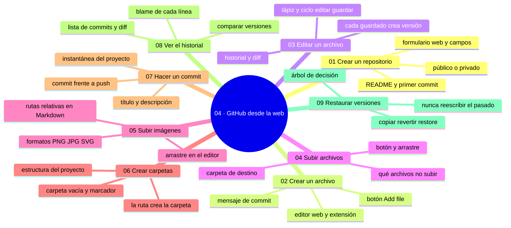

# 04 — GitHub desde la web

## Bienvenido a la sección de GitHub desde la web

En esta sección usarás GitHub tal cual llega de fábrica: sin instalar nada, solo con el navegador.

Ya sabes qué es GitHub, qué es un repositorio y tienes tu cuenta configurada y segura. Ahora toca trabajar: crear repositorios, escribir y subir archivos, ordenar el proyecto con carpetas y, sobre todo, hacer commits y leer el historial. Todo el ciclo completo de edición en la nube.

En esta sección estudiarás:

* cómo crear un repositorio desde el formulario web;
* cómo crear y editar archivos con el editor de GitHub;
* cómo subir archivos e imágenes y mostrarlos en Markdown;
* cómo organizar el proyecto con carpetas;
* qué es un commit y cómo redactar buenos mensajes;
* cómo leer el historial, comparar versiones y ver quién escribió cada línea;
* cómo restaurar versiones antiguas sin perder nada.

Al finalizar esta sección dominarás el flujo completo de trabajo en la web, que es la base para entender después lo que ocurre «bajo el capó» cuando Git trabaja en tu equipo.

---

## Objetivos de aprendizaje

Al terminar esta sección serás capaz de:

* crear repositorios y archivos con la interfaz web de GitHub;
* redactar mensajes de commit que expliquen el qué y el porqué;
* organizar un proyecto con carpetas y publicar archivos e imágenes desde Markdown;
* leer el historial: lista de commits, autor por línea (blame) y comparación de versiones;
* restaurar una versión antigua de un archivo sin perder la actual.

## Mapa conceptual

---

## ¿Qué aprenderás en esta sección?

Cada capítulo de esta sección está diseñado para construir tu comprensión progresivamente:

1. **Crear un repositorio** - El formulario web, propietario, nombre, visibilidad y primer commit.
2. **Crear un archivo** - El botón «Add file», nombres, extensiones y el diálogo de commit.
3. **Editar un archivo** - El lápiz del editor web y el ciclo editar-guardar con historial.
4. **Subir archivos** - Botón y arrastre, carpetas destino, límites y verificación.
5. **Subir imágenes** - Formatos, rutas relativas, Markdown visual y el truco del arrastre en el editor.
6. **Crear carpetas** - La ruta como carpeta, marcadores y estructuras de proyecto.
7. **Hacer un commit** - Qué es un instantánea, mensajes útiles y la distinción commit/push.
8. **Ver el historial** - Lista de commits, diffs, blame y comparaciones.
9. **Restaurar versiones** - Copiar, revertir y restore: recuperar sin reescribir el pasado.

---

## Cómo estudiar esta sección

Cada capítulo incluye:

* Mapas conceptuales que sitúan cada tema;
* Procedimientos paso a paso con la interfaz real;
* Diagramas de los flujos (qué se guarda y qué no);
* Errores comunes con diagnóstico completo (qué ocurrió, por qué, cómo comprobarlo, opciones, riesgos, solución y cómo evitarlo);
* Prácticas guiadas con checklists de verificación;
* Un nivel profesional para situar el tema en equipos reales;
* Resúmenes con la idea principal;
* Enlaces al siguiente capítulo.

Un hilo conductor recorre toda la sección: cada acción en la web escribe en el historial. Crear, editar, subir y restaurar son variaciones del mismo acto —hacer commits— y la disciplina del mensaje y de la revisión previa es lo que separa un historial útil de uno inutilizable.

Recuerda: la web es la puerta rápida. Cuando esta sección termine, entenderás perfectamente qué ocurre por debajo cuando Git haga lo mismo desde tu terminal.

---

## Referencias

* GitHub — Documentación oficial: «Creating a new repository» y «Writing on GitHub» (docs.github.com).
* Chacon, S. y Straub, B. — *Pro Git* (cap. 1).
* CBE — «How to write better git commit messages» (Google Engineering Practices).

---

## Checkpoint 04 — Comprobación obligatoria

Antes de avanzar a `05-github-desktop/`, demuestra que puedes (en un repositorio de práctica real, solo con el navegador):

1. **Crear** un repositorio privado desde el formulario web con su README inicial y abrirlo por su URL.
2. **Crear y editar** archivos con el editor web y dejar dos commits con mensajes que expliquen el qué y el porqué.
3. **Subir** dos archivos desde tu equipo —uno por «Upload files» y otro por arrastre— dentro de la carpeta correcta.
4. **Mostrar** una imagen dentro de un archivo `.md` con ruta relativa y comprobar que se ve renderizada en el README.
5. **Leer** el historial: abrir un commit, leer su diff y localizar con «Blame» quién escribió una línea concreta y en qué commit.
6. **Restaurar** la versión anterior de un archivo y explicar, en dos frases, qué pasó con el trabajo que había encima.

Si puedes hacerlo **sin mirar instrucciones**, el checkpoint está cerrado.

---

## Autopreguntas de cierre

Sin mirar el material, responde mentalmente y luego compruébalo con los capítulos de la sección:

1. ¿De qué dos partes consta un buen mensaje de commit?
2. ¿Cómo ves quién escribió cada línea de un archivo?
3. ¿Cómo restauras un archivo a una versión anterior sin borrar la nueva?
4. ¿Qué diferencia hay entre «descartar cambios» y «restaurar versión anterior»?
5. ¿Por qué todas las acciones de esta sección —crear, editar, subir, restaurar— terminan en un commit, y qué se pierde para siempre si cierras la pestaña antes de confirmarlo?
6. Si subes por error un archivo con datos personales a un repositorio público y después lo borras, ¿por qué sigue expuesto y qué debería haber hecho antes de pulsar «Commit»?
7. Antes de volver a una versión antigua, ¿qué debes comparar con el contenido actual y por qué suele ser mejor revertir con un commit nuevo que volver atrás entero?
8. ¿En qué se diferencia la pestaña «Commits» de la pestaña de actividad del repositorio y qué conclusiones erróneas sacas si los confundes?

---

## Próximo paso

Una vez que completes esta sección, estarás listo para dejar el navegador y trabajar con GitHub desde tu propio equipo.

Continúa con:

[`05-github-desktop/`](../05-github-desktop/)
