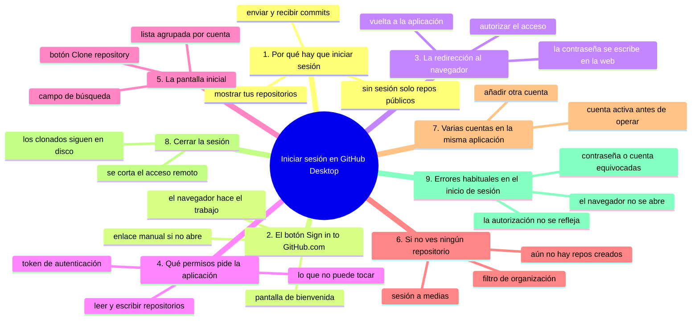
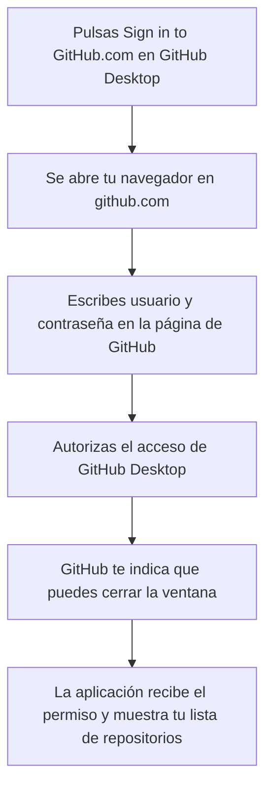

# Iniciar sesión en GitHub Desktop

## Introducción

La aplicación está instalada, pero todavía no sabe con qué cuenta trabajar.

Hasta que no inicies sesión, GitHub Desktop no puede mostrarte tus repositorios ni enviarte commits a github.com.

Iniciar sesión es una operación de un solo clic: la aplicación abre tu navegador, tú autorizas el acceso y vuelves a la aplicación.

En este capítulo vamos a ver ese proceso paso a paso, y también qué permisos se están concediendo y qué se ve en pantalla después.

En este capítulo aprenderás:

* qué significa iniciar sesión en una aplicación de escritorio;
* cómo funciona la redirección al navegador;
* qué permisos pide la aplicación y por qué;
* qué aparece en la pantalla inicial una vez autenticado;
* cómo funciona la lista de repositorios del panel izquierdo;
* qué hacer si el inicio de sesión falla;
* cómo se cierra la sesión y cómo se gestiona más de una cuenta.

Al terminar, tu cuenta de GitHub estará conectada a la aplicación y verás tus repositorios listos para clonarse.

---

## Mapa conceptual de este capítulo



---

## 1. Por qué hay que iniciar sesión

GitHub Desktop necesita saber quién eres para dos cosas:

* Mostrar los repositorios asociados a tu cuenta;
* Enviar y recibir commits hacia los repositorios donde tienes permiso.

Sin sesión iniciada, la aplicación puede clonar repositorios públicos, pero no puede ver tu lista de proyectos ni colaborar en repositorios privados.

La autenticación de GitHub Desktop funciona de una forma muy distinta a la de otras aplicaciones:

```text
1. Pulsas "Sign in to GitHub.com"
2. Se abre tu navegador en una página de github.com
3. Inicias sesión en esa página (si no lo estabas)
4. Autorizas el acceso de GitHub Desktop
5. El navegador te indica que puedes cerrar la ventana
6. La aplicación detecta el permiso y muestra tus repositorios
```

Tú no escribes ninguna contraseña dentro de la aplicación: todo el proceso sensible ocurre en el navegador, en un sitio de GitHub.

---

## 2. El botón "Sign in to GitHub.com"

El nombre exacto del botón es **"Sign in to GitHub.com"**.

Lo encuentras en la pantalla de bienvenida, y también después, si cierras sesión y quieres volver a conectar tu cuenta.

Al pulsarlo, la aplicación abre tu navegador predeterminado en una dirección de `github.com` (o `login.github.com`).

No necesitas escribir nada en la aplicación: el trabajo lo hace el navegador.

Si el navegador no se abre solo, la aplicación muestra un cuadro de diálogo con un enlace para abrirlo manualmente. Utilízalo en ese caso.

---

## 3. La redirección al navegador: paso a paso

Esta es la secuencia completa tal como se ve en pantalla.

### Paso 1: la aplicación abre el navegador

Verás una página de GitHub con un mensaje similar a "GitHub Desktop would like to access your account".

### Paso 2: inicia sesión en la página de GitHub

Si no estabas conectado a github.com en ese navegador, aparecerán los campos de usuario y contraseña.

Escríbenos aquí, no en la aplicación.

Si tienes activada la verificación en dos pasos, el navegador te pedirá también el código de confirmación.

### Paso 3: revisa la petición de acceso

Una vez identificado, GitHub muestra una pantalla con el permiso que está pidiendo GitHub Desktop.

Verás el nombre de la aplicación y una lista de lo que puede hacer.

### Paso 4: autoriza

Haz clic en el botón de autorización (habitualmente "Authorize" o "Autorizar").

### Paso 5: cierra la ventana del navegador

GitHub muestra un mensaje como "You can now close this window and return to GitHub Desktop".

Puedes cerrar esa pestaña o esa ventana.

### Paso 6: vuelve a la aplicación

Al volver a GitHub Desktop, la autenticación ya está completada y la aplicación muestra tu lista de repositorios.



El punto importante: la contraseña nunca se toca dentro de la aplicación.

---

## 4. Qué permisos pide la aplicación

Cuando autorizas el acceso, la aplicación recibe un **token de autenticación** que le permite actuar en tu nombre.

Los permisos habituales que pide son:

* Leer tus repositorios (públicos y privados);
* Escribir en tus repositorios: enviar commits, crear ramas y Pull Requests;
* Consultar información básica de tu cuenta (usuario, avatar, estado).

En términos simples: la aplicación puede hacer en tu nombre lo que tú podrías hacer desde la web, dentro de tus propios repositorios.

No puede:

* Acceder a cuentas de otras personas;
* Modificar tus ajustes de cuenta (contraseña, verificación en dos pasos, correo);
* Acceder a organizaciones en las que no tienes permisos.

El token se guarda de forma segura en tu sistema operativo y se renueva cuando caduca. No lo compartas con nadie.

Si en algún momento desconfías de la sesión, puedes cerrar la sesión desde la propia aplicación (sección 8).

---

## 5. La pantalla inicial: la lista de tus repositorios

Después de autorizar, la aplicación cambia a su pantalla habitual.

En el panel izquierdo verás:

* Un campo de búsqueda para filtrar repositorios por nombre;
* La lista de tus repositorios, agrupados por cuenta;
* El botón "Clone repository" en la parte inferior.

En el panel derecho aparecerá el contenido del repositorio que selecciones: al principio suele verse vacío o con un mensaje indicando que debes seleccionar o clonar un repositorio.

Cada entrada de la lista muestra el nombre del propietario y el nombre del repositorio, por ejemplo `tu-usuario/practica`.

Si tienes muchos repositorios, utiliza el campo de búsqueda para filtrar.

---

## 6. Si no ves ningún repositorio

Algunas personas inician sesión y no ven ningún repositorio en la lista.

Las causas habituales son:

* Todavía no has creado ningún repositorio: vuelve a la web y crea uno;
* Tu cuenta pertenece a una organización y la lista se muestra filtrada: cambia el filtro de cuenta o busca por nombre;
* La sesión no se completó del todo: cierra sesión e inicia sesión de nuevo.

Si creaste el repositorio desde la web (como se hace en la sección 04), debería aparecer aquí.

Recuerda que la lista se actualiza cuando abres la aplicación o cuando interactúas con ella; no es necesario recargar nada.

---

## 7. Varias cuentas en la misma aplicación

Es posible tener más de una cuenta de GitHub conectada a la misma aplicación.

Por ejemplo, una cuenta personal y otra de una organización de estudio.

Para añadir otra cuenta:

* En la parte superior de la ventana (menú de la aplicación), localiza tu nombre de usuario;
* Selecciona la opción para añadir otra cuenta ("Add account" o similar);
* Repite el proceso de inicio de sesión: navegador, autorización, permiso.

La lista de repositorios del panel izquierdo se muestra agrupada por cuenta y puedes filtrar por cuenta en el desplegable superior.

Conviene tener claro qué cuenta está activa antes de clonar o enviar commits, para no mezclar proyectos entre cuentas.

---

## 8. Cerrar la sesión

Cerrar la sesión desautoriza a la aplicación a actuar en tu nombre.

Para cerrar la sesión:

* En la parte superior de la ventana, haz clic en tu nombre de usuario (o en el menú de la aplicación);
* Selecciona "Sign out" o "Cerrar sesión".

Al cerrar sesión:

* La aplicación deja de ver tus repositorios privados;
* Ya no puede enviar ni recibir commits en tu nombre;
* Los repositorios que ya clonaste siguen en tu disco: puedes seguir viéndolos y modificándolos localmente, pero sin poder hacer push ni pull en tu nombre.

Para volver a conectar, repite el proceso desde el botón "Sign in to GitHub.com".

---

## 9. Errores habituales en el inicio de sesión

### El navegador no se abre

Al pulsar el botón, a veces el navegador no arranca. La aplicación muestra un cuadro con un enlace "Open in browser" o similar. Haz clic en ese enlace y completa el proceso manualmente.

### La autorización no se refleja en la aplicación

A veces, tras autorizar en el navegador, la aplicación no cambia. Cierra la aplicación por completo y abrila de nuevo. En la mayoría de los casos, al abrirla de nuevo la sesión ya está lista.

### Se pide la contraseña y no funciona

Comprueba que estés usando la contraseña correcta de tu cuenta de GitHub, y que no estés confundiendo la cuenta. Si usas verificación en dos pasos, introduce también el código.

### La aplicación no lista todos tus repositorios

Revisa el filtro de cuenta en el panel izquierdo: es posible que estés viendo solo los repositorios de una cuenta específica.

---

## Práctica guiada

En esta práctica vas a iniciar sesión en GitHub Desktop y a localizar tus repositorios.

### Objetivo

Tener la sesión iniciada y ver al menos un repositorio en la lista.

### Paso 1: abre la aplicación

Abre GitHub Desktop. Si es la primera vez, verás la pantalla de bienvenida.

### Paso 2: pulsa "Sign in to GitHub.com"

Haz clic en el botón de inicio de sesión.

### Paso 3: completa el proceso en el navegador

En el navegador:

1. Si no estabas, inicia sesión en github.com;
2. Lee el permiso que pide la aplicación;
3. Autoriza el acceso;
4. Cierra la pestaña cuando GitHub te lo indique.

### Paso 4: vuelve a la aplicación

Comprueba que ahora ves tu nombre de usuario y tu lista de repositorios en el panel izquierdo.

### Paso 5: filtra tus repositorios

Escribe en el campo de búsqueda el nombre de un repositorio tuyo y comprueba que aparece en la lista.

### Paso 6: (opcional) abre y cierra sesión de prueba

Cierra la sesión desde el menú de usuario y vuelve a iniciarla para comprobar que el proceso es reproducible.

### Resultado esperado

Deberías ver tu cuenta conectada, tus repositorios listados y capacidad para seleccionar cualquiera de ellos en el panel derecho.

### Ejercicio de transferencia

Con una segunda cuenta de GitHub (o simulando el proceso con la tuya en un equipo de casa), inicia sesión en Desktop, filtra la lista hasta dejar solo un repositorio concreto y después cierra y vuelve a abrir la sesión para comprobar que el proceso se repite igual. Entrega: una captura con la lista filtrada mostrando ese repositorio y una línea escrita con el nombre exacto del botón que vuelve a aparecer cuando cierras sesión.

---

## Errores comunes

### Error 1: escribir la contraseña dentro de la aplicación

La aplicación no pide contraseñas: el inicio de sesión se hace siempre en el navegador. Si ves un campo de contraseña en la aplicación, algo está mal.

### Error 2: no cerrar la pestaña del navegador después de autorizar

No es grave, pero conviene cerrar la pestaña para dejar claro que el proceso terminó.

### Error 3: autorizar desde la cuenta equivocada

Si en el navegador estás conectado a otra cuenta de GitHub, estarás autorizando a esa otra cuenta. Cierra sesión en el navegador y vuelve a iniciar con la cuenta que quieres usar.

### Error 4: cerrar sesión y no saber volver a conectar

El botón "Sign in to GitHub.com" sigue disponible en la pantalla de bienvenida. Repite el proceso cuando quieras reconectar.

### Error 5: mezclar varias cuentas sin fijarse en cuál está activa

Antes de clonar o enviar commits, comprueba en el desplegable de cuenta qué cuenta está activa, para no mezclar proyectos.

### Error 6: pensar que cerrar sesión borra los repositorios locales

Cerrar sesión solo corta el acceso remoto. Los repositorios clonados siguen en tu disco y pueden seguir usándose localmente.

---

## Buenas prácticas

* Inicia sesión siempre desde el navegador, nunca escribiendo contraseñas en la aplicación;
* Autoriza el acceso revisando qué permisos pide;
* Si usas verificación en dos pasos en GitHub, mantenla activada: protege tu cuenta y tu sesión;
* Verifica la cuenta activa antes de clonar o enviar commits;
* Cierra sesión al terminar de usar la aplicación en equipos compartidos;
* Si algo falla en el inicio de sesión, cierra y abre de nuevo la aplicación antes de reiniciar el ordenador.

---

## Autopreguntas de cierre

Sin mirar el material, responde mentalmente y luego compruébalo con este capítulo:

1. ¿Por qué la aplicación necesita que inicies sesión y qué deja de funcionar si no lo haces?
2. ¿Qué ocurre exactamente entre el momento en que pulsas el botón y el momento en que ves tu lista de repositorios?
3. ¿Por qué es importante que la contraseña se escriba en el navegador y nunca dentro de la aplicación?
4. ¿Qué permisos se le están concediendo a la aplicación, qué no puede hacer con ellos y dónde se guarda el token que los representa?
5. Si tras autorizar en el navegador la aplicación no cambia de pantalla, ¿qué haces antes de culpar a la red?
6. ¿Cómo añades y cambias de cuenta en la interfaz y qué debes comprobar antes de clonar o enviar commits?
7. ¿Qué se pierde y qué se conserva en tu equipo al cerrar la sesión, y por qué eso no es lo mismo que borrar un repositorio clonado?
8. ¿Qué harías si la lista de repositorios aparece vacía y cómo descartas en dos comprobaciones las causas más probables?

Si alguna respuesta todavía no está clara, vuelve a la sección correspondiente y repite la práctica.

---

## Resumen

En este capítulo aprendiste que:

* iniciar sesión en GitHub Desktop se hace mediante el botón "Sign in to GitHub.com";
* el proceso redirige al navegador, donde inicias sesión y autorizas el acceso;
* la aplicación pide permisos para leer y escribir en tus repositorios;
* el token de autenticación se guarda de forma segura en el sistema;
* después de autorizar, la pantalla inicial muestra tu lista de repositorios en el panel izquierdo;
* puedes tener varias cuentas conectadas y cambiar entre ellas;
* cerrar sesión corta el acceso remoto pero no borra los repositorios locales.

La idea principal es:

> **El inicio de sesión conecta tu cuenta de GitHub con la aplicación mediante una autorización en el navegador, y habilita el acceso a tus repositorios.**

---

## Próximo paso

Ya tienes la sesión iniciada y tus repositorios a la vista. El siguiente paso es llevar uno de ellos a tu computadora: clonarlo.

Continúa con:

[`04-clonar-repositorio.md`](04-clonar-repositorio.md)
