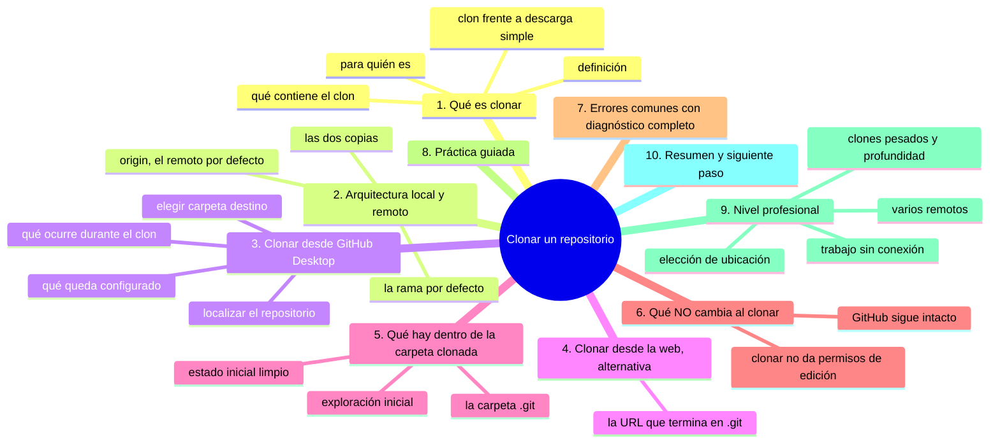
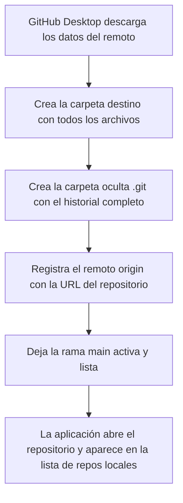

# Clonar un repositorio

## Introducción

Hasta ahora todo el trabajo ocurrió en dos lugares separados: el navegador (GitHub) y, quizá, archivos sueltos en tu equipo. **Clonar** es el acto que une ambos: copia un repositorio completo de GitHub a tu equipo, con todo su historial, para que puedas trabajar con él sin navegador.

El clon es el punto de partida de todo el trabajo con Git local. Una vez clonado, el repositorio vive en tu disco: lo editas con tus programas, haces commits con tu terminal o con GitHub Desktop, y luego sincronizas con GitHub (push/pull, que verás en los capítulos siguientes).

También entenderás aquí la arquitectura que sostiene todo el curso: **copia local (en tu equipo) vs. remoto (en GitHub)**, y cómo GitHub Desktop se posiciona en medio.

En este capítulo aprenderás:

* qué significa clonar y qué contiene el clon;
* cómo clonar desde GitHub Desktop (y cómo sería desde la web);
* dónde se guarda el repositorio en tu equipo;
* la relación entre clon, remoto y origen (origin);
* qué NO cambia al clonar (GitHub sigue intacto);
* errores comunes, práctica guiada y nivel profesional (clones, espejos, trabajo sin conexión).

---

## Mapa conceptual de este capítulo



---

## 1. Qué es clonar

### 1.1. Definición

**Clonar** es crear una copia completa de un repositorio remoto (el de GitHub) en tu equipo, incluido el historial de commits y la configuración que apunta de vuelta a GitHub.

```text
Clonar
──────────────────────────────────────────────
github.com/usuario/proyecto   ──clonar──►   C:\proyecto\  (o Mac/Linux)
   (remoto)                                   (local)
   · vive en GitHub                           · vive en tu disco
   · tú no lo controlas                       · lo controlas tú
   · copia de referencia                      · tu espacio de trabajo
```

### 1.2. Qué contiene el clon

```text
Interior de la carpeta clonada
   │
   ├── TODOS los archivos del proyecto (la última versión)
   │
   ├── la carpeta oculta .git
   │      →  el historial completo (todos los commits)
   │      →  la configuración (incluido el remoto origin)
   │      →  es lo que convierte la carpeta en un
   │         repositorio Git
   │
   └── NADA de tu cuenta: no incluye contraseñas ni
       configuración personal (eso está en GitHub Desktop
       y en Git, no en la carpeta)
```

### 1.3. Clon vs. descarga simple

```text
Descargar ZIP (botón "Code → Download ZIP")
   │
   ├── Copia SOLO los archivos actuales
   ├── SIN historial, SIN .git
   └── Sirve para: mirar un proyecto una vez

Clonar
   │
   ├── Copia archivos + historial + conexión con GitHub
   └── Sirve para: TRABAJAR (commits, ramas, push, pull)
```

> **Regla:** si vas a trabajar, clona. El ZIP es para curiosear.

### 1.4. Para quién es

```text
Situaciones
   │
   ├── Tu propio proyecto creado en la web → clona en tu
   │   equipo para trabajar sin navegador
   │
   ├── Proyecto de tu equipo → clona para colaborar
   │
   ├── Proyecto de código abierto → clona para estudiarlo
   │   o proponer cambios
   │
   └── Sin clon, Git local no tiene «nada» que gestionar:
       clonar es el acto fundacional
```

---

## 2. Arquitectura: local y remoto

### 2.1. Las dos copias

```text
Después de clonar existen DOS repositorios
──────────────────────────────────────────────
TU EQUIPO                          GITHUB
(repositorio local)                (repositorio remoto)
   │                                   │
   ├── carpeta con archivos            ├── la copia original
   ├── .git con historial              ├── sigue intacta
   ├── trabajas AQUÍ                   ├── recibe tus pushes
   └── cambios locales                 └── publicas desde aquí
            │                                ▲
            │         push (subir) ──────────┤
            │         pull (traer) ──────────┘
            │
       (capítulos 08 y 09)
```

### 2.2. origin: el nombre del remoto

Al clonar, Git guarda automáticamente una referencia al repositorio original con el nombre **origin**:

```text
Configuración tras clonar
──────────────────────────────────────────────
Tu repositorio local
   └── remoto "origin" → https://github.com/usuario/proyecto
                          (o la URL SSH equivalente)

"origin" es solo un APELIDO:
   · Git no tiene por qué llamarlo origin
   · pero es el nombre por defecto y el que usarás siempre
     al principio
```

Verás `origin` en los comandos `git remote -v`, `git push origin main`, etc. (sección 09).

### 2.3. La rama por defecto

El clon trae la rama activa del remoto (normalmente `main`) y la deja lista para trabajar. Si el repositorio tiene varias ramas, al clonar obtienes todas (Git trae todas las referencias; lo verás en la sección 08).

---

## 3. Clonar desde GitHub Desktop

### 3.1. Localizar el repositorio

```text
GitHub Desktop (sesión iniciada)
   │
   ├── Si es tu primer clon:
   │      pantalla "Let's get started" →
   │      botón "Clone a repository from the Internet"
   │
   ├── Desde el menú:
   │      File → Clone repository...
   │
   └── Si ya tienes repos:
         File → Clone repository...
         (o pestaña "Add → Clone a Repository")
```

### 3.2. Elegir origen y destino

```text
Diálogo "Clone a repository"
──────────────────────────────────────────────
Origen:  [ GitHub.com ▾ ]   (también permite URL o
                              carpeta local como origen)

Lista de tus repositorios (según tu cuenta):
   │
   └── selecciona:  usuario/mi-proyecto

Local path (destino):
   │
   ├── elige la carpeta de TU equipo donde vivirá
   ├── ejemplo: C:\Users\tu-usuario\Documents\proyectos\mi-proyecto
   └── el último tramo lo suele proponer con el nombre
       del repositorio (déjalo)

[ Clone ]
```

### 3.3. Qué ocurre durante el clon



### 3.4. Qué queda configurado

```text
Tras el clon, en GitHub Desktop verás:
   │
   ├── Nombre del repositorio y rama actual (main)
   ├── Lista de cambios (vacía: todo está guardado)
   ├── Historial (los commits recientes del remoto)
   └── Botones de flujo: Commit / Push / Pull / Fetch
       (los estudiaremos en los capítulos siguientes)
```

---

## 4. Clonar desde la web (alternativa)

Para entender qué hace GitHub Desktop por debajo (y para cuando necesites la vía manual):

```text
En la web de GitHub
──────────────────────────────────────────────
1. Abre tu repositorio
2. Botón verde "Code"
3. Pestaña "Local" (o "HTTPS")
4. Copia la URL:
      https://github.com/usuario/mi-proyecto.git
5. Con Git instalado, en la terminal:
      git clone https://github.com/usuario/mi-proyecto.git

(Con GitHub Desktop instalado, el sistema también
 permite convertir la URL en clon con la aplicación.)
```

La URL termina en `.git`: es la dirección «técnica» del repositorio (la misma que usa el navegador para comunicarse con Git).

---

## 5. Qué hay dentro de la carpeta clonada

### 5.1. Exploración inicial

```text
Carpeta clonada (ejemplo)
──────────────────────────────────────────────
mi-proyecto/
   ├── .git/            ← oculta; el motor (no la toques)
   ├── README.md
   ├── docs/
   ├── assets/
   └── ...              ← exactamente lo que ves en GitHub
```

### 5.2. La carpeta .git

⚠️ **RIESGO:** borrar la carpeta `.git` elimina el historial local entero: la carpeta deja de ser un repositorio y los commits que no hayas subido no se pueden recuperar de ningún sitio.

```text
.git (oculta)
   │
   ├── Contiene TODO el historial y la configuración
   ├── Git la gestiona: jamás la edites a mano
   ├── Si la borras, la carpeta deja de ser un repositorio
   │   (y el historial se pierde de facto)
   │
   └── Consejo de exploración: puedes mirar su estructura
       por curiosidad, pero nada de modificar ni borrar
```

Para verla en Windows: activa «archivos ocultos» en el explorador. No hace falta para trabajar.

### 5.3. Estado inicial limpio

```text
Tras clonar:
   │
   ├── los archivos coinciden con el remoto
   ├── no hay cambios pendientes
   └── GitHub Desktop lo muestra como "No local changes"

Tu primera misión: que siga así hasta que TÚ cambies algo
con intención.
```

---

## 6. Qué NO cambia al clonar

```text
Invariante tras clonar
──────────────────────────────────────────────
En GitHub:
   · nada cambia (clonar es solo lectura)
   · no se crea actividad, no se notifica a nadie
   · el repositorio remoto sigue igual

En tu equipo:
   · solo se AÑADE la carpeta clonada
   · tu cuenta no queda «atada» a la carpeta
   · el mismo repositorio puede clonarse en varios
     equipos a la vez
```

Y lo importante: **clonar no da permisos de edición**. Puedes clonar un repositorio público donde no tienes derechos; para subir cambios necesitarás permisos (y en repos públicos ajenos, el flujo será Pull Request, sección 17).

---

## 7. Errores comunes con diagnóstico completo

### Error 1: Descargar el ZIP en vez de clonar

**Qué ocurrió:** se pulsó «Download ZIP» y la carpeta no «funciona» en GitHub Desktop (no hay historial, no hay botones).

**Por qué:** se confundió descarga con clon (punto 1.3).

**Cómo comprobarlo:** no existe la carpeta `.git`; GitHub Desktop no reconoce el repositorio.

**Opciones:**
* borrar la descarga y clonar correctamente;
* si solo querías mirar el código, el ZIP basta (pero no podrás trabajar con Git).

**Riesgos:** pérdida de tiempo; en proyectos con muchas ramas, el ZIP solo trae un estado.

**Solución:** clonar.

**Cómo se evita:** recordar que `.git` = repositorio.

---

### Error 2: Elegir una carpeta de destino desordenada

**Qué ocurrió:** el clon cayó en Documentos, Escritorio o una carpeta sin estructura, mezclado con otras cosas.

**Por qué:** no se pensó dónde viven los proyectos.

**Cómo comprobarlo:** mirar la ruta; buscar carpeta `Documentos/proyectos/...` inexistente.

**Opciones:**
* mover la carpeta clonada a un sitio ordenado (con la aplicación cerrada; en general mover carpetas con `.git` es seguro si se mueve entera);
* re-clonar en el sitio correcto y borrar el otro.

**Riesgos:** pérdida de hilo entre proyectos; copias duplicadas confusas.

**Solución:** definir una raíz de proyectos (por ejemplo, `Documentos/proyectos/`) y clonar siempre ahí dentro.

**Cómo se evita:** decidir la ubicación ANTES de pulsar Clone (punto 3.2).

---

### Error 3: Confundir la carpeta local con la web

**Qué ocurrió:** se editó en la carpeta local y no se «ve» en GitHub (o al revés).

**Por qué:** aún no entiendes que son dos copias (punto 2.1).

**Cómo comprobarlo:** GitHub sigue con el contenido anterior; la carpeta local tiene el cambio.

**Opciones:** hacer commit y push (capítulos 07-08) para sincronizar.

**Riesgos:** sensación de que «no funciona».

**Solución:** entender el flujo local → commit → push → remoto.

**Cómo se evita:** estudiar bien el mapa de las dos copias.

---

### Error 4: Clonar un repositorio al que no tienes acceso

**Qué ocurrió:** error al intentar clonar un repo privado ajeno (o la lista no lo muestra).

**Por qué:** no eres miembro o no tienes permisos; GitHub Desktop lista lo que tu cuenta ve.

**Cómo comprobarlo:** abrir la URL en el navegador: ¿acceso?

**Opciones:**
* pedir invitación al propietario (capítulo 06 de la sección 03);
* si es público, comprobar la URL exacta.

**Riesgos:** ninguno (el sistema te protege).

**Solución:** obtener acceso legítimo primero.

**Cómo se evita:** verificar el acceso en la web antes de intentar clonar.

---

### Error 5: Clonar dos veces en la misma carpeta

**Qué ocurrió:** se intentó clonar encima de una carpeta que ya contenía el mismo proyecto (o una carpeta no vacía).

**Por qué:** se reutilizó una ruta ya ocupada.

**Cómo comprobarlo:** el diálogo avisa de carpeta no vacía, o el resultado es una mezcla extraña.

⚠️ **RIESGO:** eliminar el clon antiguo borra de tu disco su carpeta `.git` con él; los commits locales que no se hayan subido a GitHub se pierden para siempre.

**Opciones:**
* elegir otra ruta;
* si la carpeta era el clon antiguo: eliminar el clon antiguo (con cuidado: si tiene commits locales sin subir, se pierden) o abrirlo desde «Add → Add existing repository».

**Riesgos:** mezclar versiones o perder trabajo local no publicado.

**Solución:** rutas limpias; si el clon ya existe, añadirlo en vez de clonar otra vez.

**Cómo se evita:** revisar la ruta; recordar «un proyecto = una carpeta».

---

### Error 6: Intentar clonar y tener Git/GitHub Desktop bloqueado por red

**Qué ocurrió:** el clon falla con error de conexión o queda colgado.

**Por qué:** red corporativa, proxy, firewall o caída de GitHub.

**Cómo comprobarlo:** abrir github.com en el navegador; probar otra red si es posible.

**Opciones:**
* reintentar más tarde;
* revisar configuración de proxy/corporativo;
* en casos de firewall, puede hacer falta configuración especial (nivel profesional).

**Riesgos:** demora.

**Solución:** según la causa: red, proxy o disponibilidad.

**Cómo se evita:** nada preventivo simple; saber que la red es parte del flujo remoto.

---

## 8. Práctica guiada

### Objetivo

Clonar un repositorio propio y comprobar que la copia local y el remoto están en orden.

### Paso 1: preparar un repositorio en GitHub

1. Si aún no lo tienes, crea un repositorio en la web (sección 04) con README.
2. Añade un archivo de texto (`notas.md`) con un par de líneas.

### Paso 2: clonar desde GitHub Desktop

1. Abre GitHub Desktop → **File → Clone repository**.
2. Selecciona tu cuenta y el repositorio.
3. Destino: tu carpeta de proyectos (créala antes si hace falta, por ejemplo `Documentos/proyectos`).
4. Pulsa **Clone** y espera.

### Paso 3: verificar la copia local

1. Abre la carpeta en el explorador: ¿están `README.md` y `notas.md`?
2. Comprueba que la carpeta aparece en GitHub Desktop con historial y «No local changes».

### Paso 4: verificar el remoto

1. En GitHub Desktop, busca la referencia al repositorio (repo actual, menú de repositorio o la URL mostrada).
2. Comprueba que apunta a `https://github.com/tu-usuario/mi-proyecto.git`.
3. En la web: el repositorio no cambió (clonar es lectura).

### Paso 5: ejercicio mental

Responde (sin mirar):

1. ¿Dónde está el historial? → en `.git`, en ambos sitios (local clonado y remoto).
2. ¿Puedo editar `notas.md` en la carpeta local? → sí.
3. ¿Se ve mi edición en GitHub todavía? → no, hasta que hagas commit y push.

### Resultado esperado

Un clon limpio en una carpeta ordenada, con la conexión `origin` verificada y el entendimiento de las dos copias.

### Conclusión esperada

Clonar es el nacimiento del repositorio en tu equipo: a partir de ahí, trabajarás en local y sincronizarás con GitHub. El error conceptual más grande sería tratar ambas copias como si fueran la misma.

### Ejercicio de transferencia

En un repositorio que aún no hayas clonado (uno propio o de código abierto), haz la prueba contraria a la guiada: descarga primero el ZIP desde el botón «Code → Download ZIP», comprueba que esa carpeta no tiene `.git` y que Desktop no la reconoce, y clona después el mismo repositorio en una carpeta ordenada. Entrega: dos capturas (la carpeta ZIP sin `.git` y el clon abierto en Desktop con «No local changes») y una línea escrita con la URL del remoto `origin` que muestra tu clon.

---

## 9. Nivel profesional

### 9.1. Elección de ubicación

```text
Convenciones de equipo para clones
   │
   ├── Raíz única de proyectos (por usuario y sistema)
   ├── Un clon por trabajo/repo (no clonar lo mismo 3 veces)
   ├── Evitar carpetas sincronizadas automáticamente
   │   (OneDrive/Dropbox/iCloud + .git = conflictos raros)
   └── Evitar rutas con espacios/acentos si el equipo
       tiene herramientas variadas (reduce fricción)
```

> **Advertencia importante:** no clones repositorios dentro de carpetas que tu sistema sincronice con la nube (el servicio de sincronización y Git pelean por los archivos). Usa una carpeta normal del disco.

### 9.2. Trabajo sin conexión

```text
Clon = copia completa = autonomía
   │
   ├── Puedes: leer, editar, commitear, ver historial
   │   TODO sin conexión
   │
   └── Solo necesitas red para: push, pull, fetch,
       clonar, operar con GitHub
```

Esta es la gran ventaja de Git frente a la edición pura en la nube: el trabajo diario no depende de la conexión.

### 9.3. Clones pesados y profundidad

Para repositorios gigantes, existen opciones de clonado parcial (profundidad limitada) que descargan solo parte del historial:

```text
Clonado completo vs. parcial
   │
   ├── completo: todo el historial (por defecto)
   └── parcial (avanzado): solo los últimos commits
          →  útil para repos enormes donde solo necesitas
             trabajar con el código actual
          →  se usa con opciones de git clone (nivel avanzado)
```

GitHub Desktop realiza clones completos; la opción parcial se maneja por terminal cuando la necesidad es real.

### 9.4. Varios remotos

En flujos avanzados, un clon puede apuntar a varios remotos (por ejemplo, tu copia personal y el repositorio original de terceros). Es la base del flujo de fork (sección 17): `origin` = tu fork, `upstream` = proyecto original. Aquí solo queda la semilla: **origin es un nombre, y puede haber más de un remoto**.

---

## 10. Resumen

En este capítulo aprendiste que:

* clonar crea una copia COMPLETA (archivos + historial + `.git`) del repositorio remoto en tu equipo;
* clonar es distinto de descargar el ZIP: sin `.git` no hay historial ni trabajo con Git posible;
* tras el clon existen dos repos el local (tu espacio de trabajo) y el remoto (en GitHub), unidos por el apodo `origin`;
* desde GitHub Desktop se clona con File → Clone repository eligiendo origen y carpeta destino;
* la carpeta `.git` es el motor del repositorio: no se toca ni se borra;
* clonar no cambia nada en GitHub ni otorga permisos: es lectura;
* los errores típicos (ZIP, carpeta desordenada, doble clon, falta de acceso, carpetas sincronizadas) se diagnostican comprobando `.git`, la ruta y el permiso en la web;
* a nivel profesional, la ubicación del clon se gobierna (raíz única, fuera de sincronizadores) y el historial completo permite trabajar sin conexión.

La idea principal es:

> **Clonar trae el proyecto a tu casa con toda su memoria: a partir de ahí trabajas en tu copia y sincronizas con GitHub cuando lo decidas.**

---

## Autopreguntas de cierre

Sin mirar el material, responde mentalmente y luego compruébalo con este capítulo:

1. ¿Qué tres cosas contiene un clon y por qué una carpeta descargada como ZIP no sirve para trabajar con Git?
2. ¿Qué cambia en tu equipo y qué no cambia en GitHub cuando pulsas «Clone»?
3. ¿Para qué sirve el nombre `origin`, quién lo crea y qué pasaría si lo borras?
4. ¿Cómo sabes, sin salir de GitHub Desktop, que el clon apunta al repositorio que tú querías?
5. Si clonas un repositorio público en el que no tienes permisos, ¿qué podrás hacer con él y qué no, y por qué?
6. ¿Qué te dice el estado «No local changes» justo después de clonar y qué deberías hacer para que siga así?
7. ¿Por qué conviene decidir la carpeta destino antes de pulsar «Clone» y qué problemas concretos aparecen si clonas dentro de una nube de sincronización?
8. Tras clonar, ¿dónde está el historial completo, qué parte de tu configuración personal viaja con él y cuál se queda fuera?

---

## Próximo paso

Ya tienes el repositorio en tu equipo.

El siguiente paso es tocarlo: modificar archivos con tus propias herramientas.

Continúa con:

[`05-modificar-archivos.md`](05-modificar-archivos.md)
