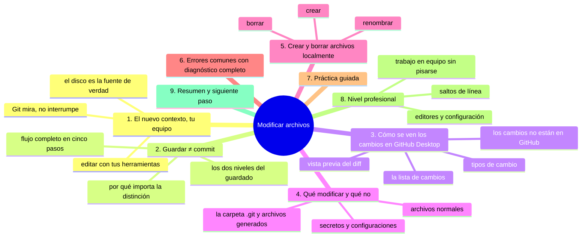
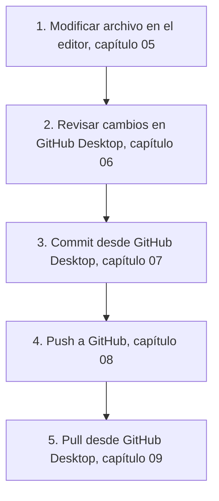

# Modificar archivos

## Introducción

El repositorio está clonado en tu equipo. Ahora empieza la diferencia fundamental con el trabajo en la web: **editas con tus propias herramientas**.

Modificar un archivo localmente es exactamente lo que haces cada día con cualquier documento: lo abres con un editor, cambias y guardas. Lo que cambia respecto a la web es el contexto: aquí Git observa desde fuera. Guardar un archivo NO es hacer commit; es solo cambiar la carpeta de trabajo. La detección de cambios es el primer concepto nuevo que aprenderás en este capítulo.

También verás las buenas prácticas de edición (qué editar y qué no), cómo Git se entera de tus cambios, y cómo leer en GitHub Desktop qué hay modificado. Todo ello sin tocar todavía el botón de commit, que viene en el capítulo 07.

En este capítulo aprenderás:

* modificar y crear archivos con tu editor local;
* que guardar ≠ commit (y por qué eso importa);
* cómo Git detecta cambios (área de trabajo);
* qué significa «Working Directory» para GitHub Desktop;
* qué archivos no deben tocarse (`.git`, generados, secretos);
* errores comunes, práctica guiada y nivel profesional (editores, entornos, saltos de línea).

---

## Mapa conceptual de este capítulo



---

## 1. El nuevo contexto: tu equipo

### 1.1. Editar con tus herramientas

```text
Antes (web)                    Ahora (local)
────────────────────           ──────────────────────
Editor del navegador           Tu editor favorito
con límites                    (VS Code, Bloc de notas,
                                Vim, lo que uses)

Todo en la nube                Todo en tu disco

Commit desde la web            Commit desde Desktop/terminal
                               (capítulo 07)
```

### 1.2. Git mira, no interrumpe

```text
Mientras editas
──────────────────────────────────────────────
1. Abres el archivo en tu editor
2. Cambias el contenido
3. Guardas (Ctrl+S)

Qué ocurre por debajo:
   · el archivo cambió en el disco
   · Git lo detecta (su carpeta .git registra el estado)
   · GitHub Desktop muestra "1 file changed"
   · NO se ha hecho commit todavía
   · GitHub (el remoto) sigue intacto
```

Ese «Git lo detecta» no es magia: Git compara el contenido actual del disco con la instantánea del último commit. Esa comparación es lo que la aplicación muestra como *cambios pendientes*.

---

## 2. Guardar ≠ commit

### 2.1. Los dos niveles

```text
Nivel 1: GUARDAR en el editor
   │
   ├── El archivo en el disco tiene el nuevo contenido
   ├── Es tuyo; Git lo nota
   └── Aún NO es parte del historial

Nivel 2: COMMIT en Git
   │
   ├── Los cambios entran en una instantánea nueva
   ├── Se les pone mensaje, autor y fecha
   └── Solo entonces forman parte del historial
```

### 2.2. El flujo completo (visión anticipada)



Cada paso es distinto y reversible a su manera;
el salto de riesgo está en entender qué estás haciendo
en cada uno.

### 2.3. Por qué importa la distinción

```text
Si confundes guardar con commit:
   │
   ├── crees que tus cambios ya están «en el proyecto»
   │   y no lo están (falta commit/push)
   │
   ├── o crees que al guardar ya «se subió» a GitHub
   │   (no: el remoto no se entera hasta el push)
   │
   └── y al revés: puedes guardar 20 veces y hacer UN
       commit al final (o varios commits si conviene)
```

---

## 3. Cómo se ven los cambios en GitHub Desktop

### 3.1. La lista de cambios

Con el repositorio abierto en GitHub Desktop, la pestaña de cambios (Change) muestra justo lo que ha cambiado desde el último commit:

```text
Vista "Changes" (Cambios)
──────────────────────────────────────────────
Cambios (1)
   │
   ├── README.md                        M
   │      (M = modificado)
   │
   └── [cuadro de descripción]

Botones:
   [ Commit to main ▾ ]
   [ Discard all... ]     (peligroso; ver errores)
```

### 3.2. Tipos de cambio

```text
Estados que verás
   │
   ├── M  Modified   →  archivo existente con contenido nuevo
   │
   ├── A  Added      →  archivo nuevo (todavía sin commit)
   │
   ├── D  Deleted    →  archivo borrado del disco
   │
   └── R  Renamed    →  archivo renombrado
```

### 3.3. La vista previa (diff)

Al seleccionar un archivo de la lista aparece su diferencia:

```text
Diff en GitHub Desktop
──────────────────────────────────────────────
- líneas quitadas (rojo)
+ líneas añadidas (verde)

Función esencial: REVISAR antes de commitear.
Si ves cambios que no esperabas (ejemplo: el editor
reformateó todo el archivo), es el momento de corregir.
```

### 3.4. Los cambios NO están en GitHub

```text
Comprobación de realidad:
   │
   ├── abres github.com/tu-repo en el navegador
   ├── el archivo muestra el contenido ANTIGUO
   └── correcto: falta commit (y push)

Los cambios viven SOLO en tu equipo hasta que
completes el flujo.
```

---

## 4. Qué modificar (y qué no)

### 4.1. Archivos normales: adelante

```text
Modificables sin duda
   │
   ├── tu código fuente
   ├── tus documentos (.md, .txt)
   ├── tus datos de ejemplo (si procede)
   ├── configuración del proyecto (la que es del repo)
   └── README y documentación
```

### 4.2. `.git` y archivos generados: no tocar

```text
Prohibido
   │
   ├── Carpeta .git
   │      →  el motor; ediciones manuales = corrupción
   │
   ├── Archivos generados por compilación/ejecución
   │      →  (binarios, cachés) salvo que el proyecto
   │         decida versionarlos (raro)
   │
   └── Archivos que el .gitignore excluye
          →  no los verás en la lista de cambios (correcto)
```

### 4.3. Secretos y configuraciones personales

```text
Nunca en el repo (ni en local versionado)
   │
   ├── .env con valores reales
   ├── claves, tokens, contraseñas
   └── configuraciones con datos personales tuyos

Práctica correcta:
   ├── .env.example  (con ejemplos: TU_API_KEY_AQUI)
   └── .env real     (excluido con .gitignore)
```

(Aunque tu `.gitignore` te proteja, la disciplina es no meterlos nunca en el primero; el `.gitignore` se estudia en la sección 06.)

---

## 5. Crear y borrar archivos localmente

### 5.1. Crear

```text
Crear archivo local
   │
   ├── en el explorador: clic derecho → nuevo documento
   ├── en tu editor: Guardar como... dentro de la carpeta
   └── GitHub Desktop lo mostrará como "Added" en cambios
```

### 5.2. Borrar

⚠️ **RIESGO:** si borras un archivo que todavía no tiene ningún commit, su contenido desaparece de tu disco sin que Git lo guarde en ningún sitio; los archivos ya commiteados sí se recuperan desde el historial.

```text
Borrar archivo local
   │
   ├── bórralo del explorador (o desde el editor)
   ├── GitHub Desktop lo muestra como "Deleted"
   └── IMPORTANTE: el borrado NO está hecho en el proyecto
       hasta el commit (y sigue existiendo en el historial
       y en GitHub)
```

> **Sobre borrar:** borrar en local y commitear el borrado es un cambio normal (el archivo dejará de existir en la rama), pero su historia permanece en el historial. Para deshacer un borrado: restaurar (capítulo 09 de la sección 04 o la sección 11).

### 5.3. Renombrar

```text
Renombrar
   │
   ├── renómbralo en el explorador
   │   (evita espacios y acentos, como siempre)
   │
   └── Desktop lo suele detectar como rename
       (o como borrador + añadido, según el caso)
```

---

## 6. Errores comunes con diagnóstico completo

### Error 1: Creer que guardar ya subió el cambio

**Qué ocurrió:** se guardó el archivo y se fue a GitHub a comprobar: sin cambio.

**Por qué:** falta commit (y push). Confusión guardado/publicado.

**Cómo comprobarlo:** Desktop muestra cambios pendientes; GitHub muestra contenido antiguo.

**Opciones:** completar el flujo (commit + push).

**Riesgos:** pensar que «GitHub no funciona» o que se perdió el trabajo.

**Solución:** entender los dos niveles (punto 2).

**Cómo se evita:** repetir el flujo completo en la práctica guiada hasta internalizarlo.

---

### Error 2: El editor reformateó todo el archivo

**Qué ocurrió:** cambiaste una línea, pero el diff muestra 200 líneas modificadas.

**Por qué:** el editor cambió los saltos de línea, quitó/añadió espacios finales, o reordenó algo automáticamente (algunos editores alinean al guardar).

**Cómo comprobarlo:** ver el diff en Desktop: cambios masivos inexplicables.

**Opciones:**
* deshacer en el editor (Ctrl+Z) y volver a guardar con ajustes desactivados;
* o aceptar el reformateo SI es la convención del proyecto (a veces un commit de formato es válido, pero debe ser consciente y separado).

**Riesgos:** reviews imposibles; conflictos futuros con el equipo.

**Solución:** configurar el editor (final de línea, espacios) según el proyecto.

**Cómo se evita:** revisar SIEMPRE el diff antes de commitear (capítulo 06).

---

### Error 3: Editar archivos dentro de `.git`

**Qué ocurrió:** alguien abrió archivos de `.git` por curiosidad y los modificó.

**Por qué:** exploración sin conocimiento.

**Cómo comprobarlo:** Git empieza a dar errores extraños; status inconsistente.

**Opciones:**
* deshacer los cambios (si los recuerda) restaurando esos archivos;
* en casos graves: re-clonar (perdiendo trabajo local no publicado).

**Riesgos:** corrupción del historial local.

**Solución:** no tocar `.git`; ante daño, restauración o re-clonado.

**Cómo se evita:** regla clara: `.git` es interno.

---

### Error 4: Borrar archivos que «estorban» sin saber que son del proyecto

**Qué ocurrió:** se limpiaron archivos «raros» de la carpeta y el proyecto falló.

**Por qué:** no se entendía la estructura.

**Cómo comprobarlo:** Desktop los muestra como borrados; el proyecto da errores.

**Opciones:** restaurarlos (deshacer el borrado con Ctrl+Z en explorador o desde el historial) y commit solo si procede.

**Riesgos:** romper el proyecto.

**Solución:** entender la estructura antes de limpiar; revisar siempre la lista de cambios.

**Cómo se evita:** borrar solo lo que sabes que sobra; cuando dudes, no borres.

---

### Error 5: Guardar sin querer en una carpeta equivocada

**Qué ocurrió:** el editor «Guardar como» creó el archivo fuera del repositorio (o en una subcarpeta equivocada).

**Por qué:** ruta mal elegida en el diálogo.

**Cómo comprobarlo:** el archivo nuevo no aparece en Desktop (está fuera) o está mal ubicado.

**Opciones:** moverlo a la carpeta correcta con el explorador.

**Riesgos:** «trabajo invisible» que no entra en el commit.

**Solución:** mover y verificar que aparece en la lista de cambios.

**Cómo se evita:** abrir el editor desde la carpeta del proyecto o verificar rutas al guardar.

---

### Error 6: Dejar cambios viejos sin commitear por semanas

**Qué ocurrió:** la lista de cambios acumula 12 archivos modificados sin definir.

**Por qué:** «lo dejo para después»; miedo al commit.

**Cómo comprobarlo:** la pestaña de cambios está llena.

⚠️ **RIESGO:** descartar esos cambios borra del disco el trabajo que no está en ningún commit; Git no guarda una copia y no existe deshacer.

**Opciones:**
* revisar y dividir en commits coherentes (si es posible);
* o descartar lo que no sirva (con cuidado, punto siguiente).

**Riesgos:** cambios sin contexto; imposible recordar qué era qué; riesgo de perderlos.

**Solución:** hábito de commits frecuentes y pequeños.

**Cómo se evita:** tratar la lista de cambios como una bandeja que debe estar vacía al terminar la jornada (salvo trabajo en marcha consciente).

---

## 7. Práctica guiada

### Objetivo

Modificar, crear y borrar archivos en local, y ver cómo GitHub Desktop los refleja SIN hacer commit todavía.

### Preparación

Clona (o abre) tu repositorio de práctica en GitHub Desktop.

### Paso 1: modificar

1. Abre `notas.md` (o el archivo que tengas) con tu editor.
2. Añade tres líneas.
3. Guarda.
4. Ve a GitHub Desktop: el archivo aparece como **Modified** con su diff.

### Paso 2: crear

1. Crea `tareas.md` en la carpeta del repositorio.
2. Escribe contenido.
3. Comprueba en Desktop: aparece como **Added**.

### Paso 3: borrar

1. Borra `tareas.md` (si prefieres no borrarlo, crea y borra un archivo de prueba `temporal.txt`).
2. Comprueba: aparece como **Deleted**.

### Paso 4: reversibilidad

1. Deshaz el borrado (Ctrl+Z en explorador no siempre aplica; vuelve a crear el archivo con el mismo contenido).
2. Observa cómo la lista de cambios se actualiza en tiempo real.

### Paso 5: comprobación de realidad

1. Abre GitHub en el navegador.
2. Comprueba: el remoto NO refleja ninguno de tus cambios.
3. Confirma mentalmente: «están solo en mi equipo, y aún sin commit».

### Paso 6: revisar el diff

1. En Desktop, selecciona el archivo modificado.
2. Lee el diff: ¿todas las líneas cambiadas son las tuyas?

### Resultado esperado

Tres tipos de cambio (Modified, Added, Deleted) visibles en Desktop y ninguno en GitHub; dominada la distinción guardar/commit.

### Conclusión esperada

Modificar es fácil; lo importante es entender dónde vive el cambio (tu disco) y cuánto falta para que sea historial (commit) y para que sea público (push).

### Ejercicio de transferencia

En un repositorio de práctica distinto al de la práctica guiada (por ejemplo, uno que clonaste para seguir otro bloque), edita un archivo con un editor que no uses habitualmente, crea otro nuevo y borra un tercero, y deja los tres estados visibles en la lista de cambios sin commitear. Entrega: una captura de GitHub Desktop donde se lean a la vez Modified, Added y Deleted, y dos líneas escritas explicando por qué al abrir la misma URL en GitHub el contenido sigue antiguo.

---

## 8. Nivel profesional

### 8.1. Editores y configuración

```text
Configuración sensible de editor
   │
   ├── Final de línea: respetar la convención del proyecto
   │   (Windows: CRLF, Unix: LF — el proyecto decide;
   │    Git puede normalizar; se ve en la sección 06)
   │
   ├── Espacios al final: no añadirlos sin querer
   │   (algunos editores los ponen; hay quien los quita)
   │
   ├── Codificación: UTF-8 por defecto
   │
   └── Guardado automático: cómodo; vigila que no guarde
       estados a medias cuando pausas a pensar
```

### 8.2. Saltos de línea y desastres de formato

```text
Problema clásico
──────────────────────────────────────────────
Equipo Windows + equipo Mac/Linux:
   · cada guardado cambia TODAS las líneas
   · el diff de 500 líneas por un cambio real de 2

Solución profesional:
   · .gitattributes para normalizar (sección 06+)
   · editor configurado en el equipo
   · convención escrita en CONTRIBUTING
```

### 8.3. Trabajo en equipo sin pisarse

```text
Reglas para no liarse entre varios
   │
   ├── Cada persona en SU clon (nunca trabajar sobre la
   │   carpeta compartida de otro)
   ├── Cambios frecuentes y pequeños
   ├── No acumular semanas de trabajo sin publicar
   ├── Ramas para trabajo en curso (capítulo 10)
   └── Comunicar: «estoy tocando X» si es urgente
       (o mejor: ramas, que lo resuelven de forma limpia)
```

---

## 9. Resumen

En este capítulo aprendiste que:

* con el repositorio clonado, editas con tus propias herramientas y Git observa los cambios desde `.git`;
* guardar en el editor y hacer commit son dos niveles distintos: el primero cambia tu disco, el segundo crea historial; y falta aún el push para el remoto;
* GitHub Desktop muestra los cambios pendientes con sus tipos (Modified, Added, Deleted, Renamed) y permite revisarlos como diff antes de commitear;
* los archivos prohibidos son `.git`, los generados y los secretos; la configuración real de credenciales vive fuera del repositorio;
* crear, borrar y renombrar localmente son cambios como cualquier otros, hasta que se commitean;
* los errores típicos (creer que se subió, reformateo del editor, editar `.git`, limpiezas a ciegas, cambios acumulados) se diagnostican leyendo la lista de cambios y el diff;
* a nivel profesional, la configuración del editor (saltos de línea, codificación) y la disciplina de cambios pequeños evitan conflictos de equipo.

La idea principal es:

> **Editar es solo la primera mitad del acto: el cambio vive en tu disco hasta que lo revisas, lo nombras con un commit y lo publicas con un push.**

---

## Autopreguntas de cierre

Sin mirar el material, responde mentalmente y luego compruébalo con este capítulo:

1. ¿Qué dos cosas ocurren cuando guardas un archivo en tu editor y cuál de las dos sigue sin haber pasado hasta que haces commit?
2. ¿Cómo sabe Git que un archivo ha cambiado si tú no le has dicho nada y por qué aparece o desaparece solo de la lista de cambios?
3. ¿Por qué abrir la URL del repositorio en GitHub justo después de guardar te muestra el contenido antiguo, y qué haría falta para que cambie?
4. ¿Qué tres tipos de cambio puede mostrar la lista de GitHub Desktop y qué significa cada letra?
5. ¿Qué archivos no deberías editar nunca desde el explorador y qué ocurre con el proyecto si los editas por curiosidad?
6. Si un diff de 200 líneas te aparece por un cambio de dos, ¿cuál es la sospecha más probable y cómo lo compruebas?
7. ¿Qué diferencia hay entre borrar un archivo que ya tiene commits y borrar un archivo recién creado sin commitear?
8. ¿Por qué se considera un error dejar doce archivos modificados acumulados durante semanas y qué hábito lo evita?

---

## Próximo paso

Ya sabes modificar archivos y ver los cambios pendientes.

El siguiente paso es dominar la revisión de esos cambios: leer bien la lista y el diff antes de decidir.

Continúa con:

[`06-ver-los-cambios.md`](06-ver-los-cambios.md)
