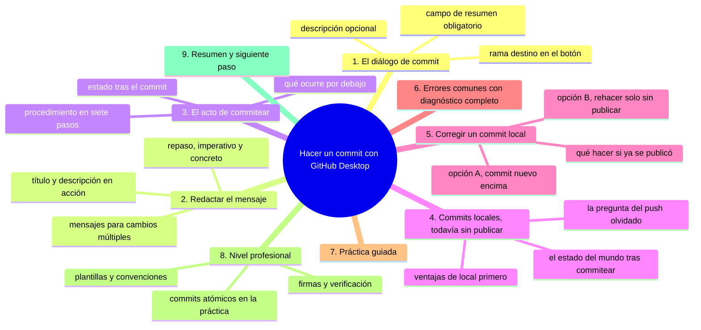
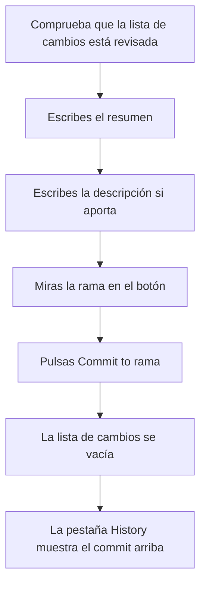
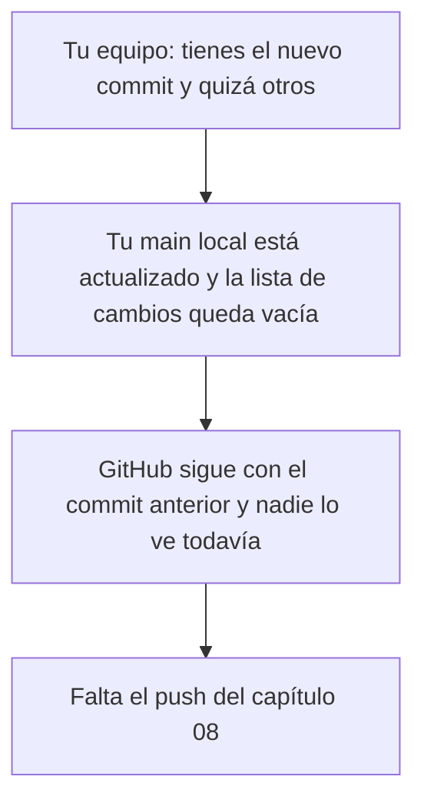

# Hacer un commit

## Introducción

Ya revisaste tus cambios: la lista es limpia y sabes exactamente qué vas a guardar. Ahora llega el momento de convertir ese trabajo en historia: **hacer commit**.

Ya sabes qué es un commit (sección 04, capítulo 07): una instantánea con mensaje, autor y fecha. La diferencia ahora es el entorno: en lugar de la web, lo haces desde tu equipo, y el commit nace en tu repositorio LOCAL. Todavía no llegará a GitHub: eso será el push del capítulo siguiente. Mantener separados esos dos conceptos es el objetivo pedagógico de esta pareja de capítulos.

En este capítulo aprenderás:

* el diálogo de commit en GitHub Desktop;
* redactar título y descripción (repasando la teoría);
* elegir a qué rama se hace el commit;
* qué queda después de commitear (historial local actualizado, cambios vacíos);
* cómo deshacer o corregir un commit local (sin miedo, aún sin publicar);
* errores comunes, práctica guiada y nivel profesional (commits atómicos, firmas).

---

## Mapa conceptual de este capítulo



---

## 1. El diálogo de commit

### 1.1. Dónde está

```text
GitHub Desktop → pestaña "Changes"
   │
   ├── arriba: lista de cambios revisados
   │
   ├── abajo: área de mensaje
   │      ┌────────────────────────────────────┐
   │      │ Resumen (obligatorio)              │
   │      │ [describe lo que cambiaste...   ]  │
   │      ├────────────────────────────────────┤
   │      │ Descripción (opcional)             │
   │      │ [¿por qué? contexto...          ]  │
   │      │ [                               ]  │
   │      └────────────────────────────────────┘
   │
   ├── selector de rama (en el botón: "Commit to main ▾")
   │
   └── [ Commit to main ]
```

### 1.2. Resumen (título)

* Obligatorio: el botón no se activa sin él.
* Debe describir **qué** cambiaste.
* Una línea, imperativa, concreta (repaso del capítulo de la sección 04).

### 1.3. Descripción

* Opcional pero recomendada cuando el cambio necesita contexto.
* Responde **por qué** y qué más hay que saber (efectos, decisiones, advertencias).

### 1.4. La rama destino

```text
Botón "Commit to [rama]"
   │
   ├── por defecto: la rama actual (normalmente main)
   │
   ├── el desplegable permite elegir OTRA rama
   │   (si la creaste antes; ver capítulo 10)
   │
   └── también puede ofrecer "Commit to a new branch"
       (crea rama y commitea en ella — muy útil)
```

> **Hábito:** mira el nombre de la rama EN EL BOTÓN antes de pulsar. Es el equivalente local a mirar la rama en la web.

---

## 2. Redactar el mensaje

### 2.1. Repaso rápido

```text
Buen mensaje                     Mal mensaje
────────────────────             ──────────────
Añade ejemplos al capítulo 3     cambios
Corrige cálculo de IVA           fix
Documenta instalación en README  update final 2
                                 wip
```

### 2.2. Título + descripción en acción

```text
Ejemplo bien resuelto
──────────────────────────────────────────────
Resumen:
   Añade ejemplos de ramas al capítulo 10

Descripción:
   Incluye tres ejemplos de creación y fusión.
   Falta añadir los ejercicios: se hará en un
   commit aparte.
```

```text
Por qué la descripción aquí aporta:
   │
   ├── deja constancia de lo que falta (deuda consciente)
   ├── explica que los ejercicios vendrán aparte
   │   (anticipa el siguiente commit)
   └── quien lea el historial entiende la intención
```

### 2.3. Mensajes para cambios múltiples

Si la lista mezcla temas distintos, hay dos caminos:

```text
Ante cambios mezclados
   │
   ├── Opción A (recomendada): separar en varios commits
   │      →  en Desktop: excluir archivos (si tu versión
   │         lo permite), commitear por grupos
   │      →  o por terminal: staging selectivo (sección 06)
   │
   └── Opción B: un commit que los cubra todos
          →  solo si de verdad son UNA cosa
             (por ejemplo: «actualiza documentación de la
              rama X» con varios .md relacionados)
```

---

## 3. El acto de commitear

### 3.1. Procedimiento



### 3.2. Qué ocurre por debajo

```text
Internamente Git
   │
   ├── toma la instantánea actual de la carpeta de trabajo
   ├── la asocia al commit (padre: el anterior)
   ├── le pone tu autoría (nombre y correo configurados)
   ├── le pone fecha y hash
   ├── avanza la rama (main ahora apunta al nuevo commit)
   └── NO contacta con GitHub (eso es push)
```

### 3.3. Estado tras el commit

```text
Comprobación
   │
   ├── pestaña Changes: vacía (o con lo que excluiste)
   ├── pestaña History: el commit nuevo arriba
   ├── GitHub (navegador): SIN cambios (falta push)
   └── indicador de Desktop: "1 local commit waiting" 
       (o similar: commits locales sin publicar)
```

Ese último indicador es clave para no perder el hilo: te recuerda que hay trabajo local listo para subir.

---

## 4. Commits locales: todavía sin publicar

### 4.1. El estado del mundo tras commitear



### 4.2. Ventajas de local primero

```text
   │
   ├── puedes equivocarte sin que nadie lo vea
   ├── puedes hacer varios commits pequeños sin «ensuciar»
   │   el remoto a cada paso
   ├── puedes esperar a un buen punto para publicar
   └── y si algo sale mal (antes del push), se arregla
       con mucha más libertad
```

### 4.3. Pregunta frecuente

> «¿Y si se me olvida el push?» → Tus cambios siguen seguros en tu equipo; Desktop te lo recuerda con su indicador. El olvido solo importa si esperas que otra persona los vea.

---

## 5. Corregir un commit local

### 5.1. Los dos caminos

⚠️ **RIESGO:** rehacer un commit que ya se publicó reescribe el historial compartido; en el remoto solo podría imponerse con un force push que borra de allí los commits que otros ya habían descargado.

```text
Situación: el commit ya existe LOCALMENTE y NO se ha hecho push

Opción A: AÑADIR otro commit encima (siempre segura)
   │
   ├── simplemente: más cambios → otro commit con su mensaje
   └── el historial muestra ambos (correcto y honesto)

Opción B: REHACER el commit (ampliada, solo local)
   │
   ├── útil cuando el mensaje estaba mal o se mezcló
   │   algo por error
   ├── en Desktop: existen flujos que permiten editar o
   │   deshacer el último commit local (menú del commit
   │   o "Undo last commit" en versiones que lo ofrecen)
   ├── en terminal: herramientas como `git commit --amend`
   │   (sección 11 lo detalla)
   └── REGLA DE ORO: solo si NO se publicó
```

> **Advertencia:** reescribir un commit que ya es push daña el trabajo de los demás. La regla práctica: **si ya salió, solo se añade; si no salió, se puede rehacer**.

### 5.2. Qué hacer si ya se hizo push

```text
Commit malo YA publicado
   │
   ├── no reescribir
   ├── añadir commit de corrección (o revert, si procede;
   │   viste revert en la sección 04)
   └── comunicar si el equipo lo nota
```

---

## 6. Errores comunes con diagnóstico completo

### Error 1: Botón desactivado (resumen vacío)

**Qué ocurrió:** pulsas Commit y no pasa nada.

**Por qué:** no escribiste el resumen (es obligatorio).

**Cómo comprobarlo:** el campo vacío.

**Opciones:** escribir el resumen.

**Riesgos:** ninguno (el sistema te protege).

**Solución:** describir el cambio.

**Cómo se evita:** empezar el commit por el mensaje (a veces ayuda a darse cuenta de que no sabes qué estás guardando).

---

### Error 2: Commit a la rama equivocada

**Qué ocurrió:** el commit quedó en `main` (o en otra rama) cuando debía ir a `feature`.

**Por qué:** no se miró el botón (punto 1.4).

**Cómo comprobarlo:** History con esa rama seleccionada; o la pestaña de ramas.

**Opciones:**
* si NO se publicó: mover/rehacer en la rama correcta (Desktop/terminal lo permiten con cuidado);
* si se publicó: hablar con el equipo; en repos con reglas, planificar cómo trasladarlo (avanzado; sección 08).

**Riesgos:** historia mezclada; PRs confusos.

**Solución:** mirar el botón SIEMPRE.

**Cómo se evita:** hábito de leer la rama antes de pulsar.

---

### Error 3: Mensaje genérico porque «es solo una prueba»

**Qué ocurrió:** el historial local se llena de «cambios».

**Por qué:** actitud de práctica sin disciplina.

**Cómo comprobarlo:** History.

**Opciones:**
* si es práctica pura y local: a veces se acepta;
* mejor: practicar con mensajes buenos desde el primer ejercicio (la práctica guiada sirve para esto).

**Riesgos:** se crea el hábito malo; el día real se replica.

**Solución:** practicar el hábito correcto.

**Cómo se evita:** tratar toda práctica como si fuera producción.

---

### Error 4: Creer que el commit ya está en GitHub

**Qué ocurrió:** se commiteó y se fue a la web: nada cambió.

**Por qué:** falta push (concepto clave de esta sección).

**Cómo comprobarlo:** indicador de commits locales pendientes; GitHub sin cambios.

**Opciones:** hacer push (capítulo 08).

**Riesgos:** confusiones en equipo («yo ya lo subí»).

**Solución:** recordar la cadena.

**Cómo se evita:** completar el flujo (commit + push) en la práctica.

---

### Error 5: Archivos que «no entran» en el commit

**Qué ocurrió:** commiteaste y quedó un archivo fuera (sigue en la lista de cambios).

**Por qué:** la versión de Desktop excluye o estagea selectivamente; o el archivo sigue modificado tras el commit.

**Cómo comprobarlo:** la lista de cambios aún lo muestra.

**Opciones:**
* si debía entrar: commitearlo (en commit aparte o junto si corresponde);
* si no debía: dejarlo o descartarlo con criterio.

**Riesgos:** sensación de commit incompleto.

**Solución:** revisar tras el commit: ¿la lista quedó como esperaba?

**Cómo se evita:** revisión completa antes y comprobación después.

---

### Error 6: Commit gigante por no separar

**Qué ocurrió:** un commit con código, docs y un archivo borrado sin relación.

**Por qué:** pereza de separar (ya visto en la sección 04).

**Cómo comprobarlo:** History: «X files changed» con temas mezclados.

**Opciones:** si no se publicó y es reciente, la corrección puede rehacerse; si no, el siguiente será atómico.

**Riesgos:** revisión imposible; revert imposible selectivo.

**Solución:** separar por grupos.

**Cómo se evita:** revisar la lista preguntando «¿esto es UNA cosa?».

---

## 7. Práctica guiada

### Objetivo

Hacer tres commits correctos desde GitHub Desktop y comprobar su localidad.

### Paso 1: preparar

1. Modifica `README.md` (añade una sección de resumen).
2. Revisa el diff.

### Paso 2: primer commit

1. Resumen: `Añade sección de resumen al README`.
2. Descripción: `Resume los cinco puntos principales del proyecto.`
3. Comprueba: botón `Commit to main`.
4. Pulsa Commit.
5. Verifica: lista vacía, commit arriba en History.

### Paso 3: segundo commit con cambio distinto

1. Crea `docs/guia-rapida.md` con contenido.
2. Revisa.
3. Commit: `Crea guía rápida en docs`.

### Paso 4: tercer commit con descripción útil

1. Edita `notas.md` y escribe una frase con un error conocido.
2. Commit con descripción que explique qué corregirás luego (simula deuda consciente).

### Paso 5: comprobación de localidad

1. Indicador de Desktop: ¿muestra commits locales pendientes de subir?
2. Abre GitHub en el navegador: los tres cambios NO están.
3. Conclusión escrita: «mis commits existen en mi equipo; falta push».

### Resultado esperado

Historial local con tres mensajes claros y comprensión de que nada ha llegado aún al remoto.

### Conclusión esperada

Committer desde el equipo es el mismo acto que en la web, con una gran diferencia de contexto: ahora el historial es tuyo y local, y publicarlo es una decisión aparte.

### Ejercicio de transferencia

En un repositorio de práctica con al menos dos temas de contenido distintos, prepara una sola tanda de cambios que mezcle documentación y notas y divídela en dos commits con mensajes que expliquen cada tema por separado. Entrega: la pestaña History capturada con los dos commits locales en el orden correcto y una línea escrita indicando en qué rama dice el botón que se hizo cada uno.

---

## 8. Nivel profesional

### 8.1. Commits atómicos en la práctica

```text
Un trabajo de media hora puede producir:
   │
   ├── commit 1: «Extrae la lógica de validación»
   ├── commit 2: «Corrige el formato de fechas»
   ├── commit 3: «Actualiza pruebas de validación»
   └── commit 4: «Documenta las reglas en docs/»

En vez de: «cambios del martes»
```

Técnica: trabajar, y cuando cambies de tema, commitear lo hecho hasta ahí (si la revisión lo permite).

### 8.2. Plantillas y convenciones

```text
Recursos de equipo
   │
   ├── Convención de mensajes (feat:, fix:, docs:... )
   ├── Plantilla de descripción en la herramienta
   ├── Hooks que validan el formato (sección 15)
   └── CONTRIBUTING.md que documenta todo lo anterior
```

### 8.3. Firmas y verificación

Al igual que en la web, los commits locales pueden estar firmados con tu clave (GPG/SSH) para que GitHub los muestre como verificados:

```text
Firma de commit (concepto)
   │
   ├── se configura en Git (clave asociada)
   ├── GitHub valida y muestra "Verified"
   └── útil cuando la autoría importa contractualmente
```

(El detalle técnico de configuración llega en secciones avanzadas; aquí queda el concepto.)

---

## 9. Resumen

En este capítulo aprendiste que:

* el diálogo de commit de GitHub Desktop tiene resumen obligatorio, descripción opcional y rama destino visible en el botón;
* el mensaje sigue las reglas ya conocidas: imperativo, concreto, con «qué» en el título y «por qué» en la descripción;
* commitear crea una instantánea LOCAL: avanza tu rama local y no contacta con GitHub;
* el indicador de commits pendientes y la pestaña History son la comprobación de estado;
* hasta el push, los commits son privados: puedes trabajar con libertad y publicar cuando estés listo;
* corregir un commit local tiene dos vías: añadir otro encima (siempre) o rehacerlo (solo si no se publicó);
* los errores típicos (resumen vacío, rama equivocada, mensaje genérico, creer que subió, archivos fuera) se diagnostican con la lista, el History y el indicador de estado;
* a nivel profesional, la atomicidad y las convenciones convierten al historial en documentación útil.

La idea principal es:

> **El commit local es tu espacio de decisión: nombras el cambio, eliges la rama y aún puedes corregir sin dar explicaciones a nadie. La responsabilidad pública empieza con el push.**

---

## Autopreguntas de cierre

Sin mirar el material, responde mentalmente y luego compruébalo con este capítulo:

1. ¿Qué campos tiene el diálogo de commit de GitHub Desktop, cuál es obligatorio y dónde miras la rama antes de pulsar?
2. ¿Qué diferencia hay entre el resumen y la descripción y qué información suele reservarse para la segunda?
3. ¿Qué hace Git exactamente al pulsar «Commit to main» y qué NO hace todavía en ese momento?
4. ¿Cómo compruebas, en tres sitios distintos, que tu commit existe solo en tu equipo y no en GitHub?
5. ¿Cuándo puedes rehacer un commit y cuándo ya solo puedes añadir otro encima, y por qué esa línea es tan estricta?
6. Si la lista de cambios queda vacía tras el commit pero aún ves un archivo pendiente, ¿qué ha ocurrido y cómo lo resuelves?
7. ¿Por qué conviene separar en varios commits los cambios que mezclan temas distintos y qué se pierde si no lo haces?
8. ¿Qué indica el contador de commits locales pendientes de la aplicación y qué error de equipo evita leerlo cada día?

---

## Próximo paso

Ya tienes commits locales.

El siguiente paso es publicarlos: llevar tu trabajo al repositorio de GitHub con el push.

Continúa con:

[`08-hacer-push.md`](08-hacer-push.md)
