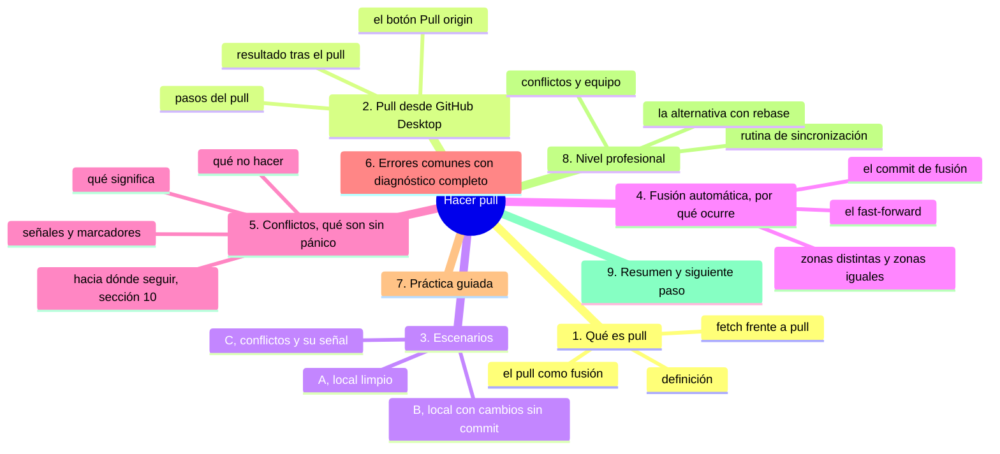
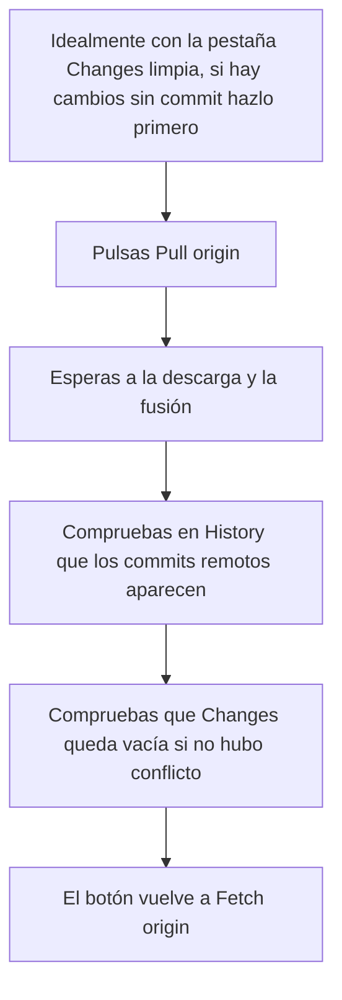
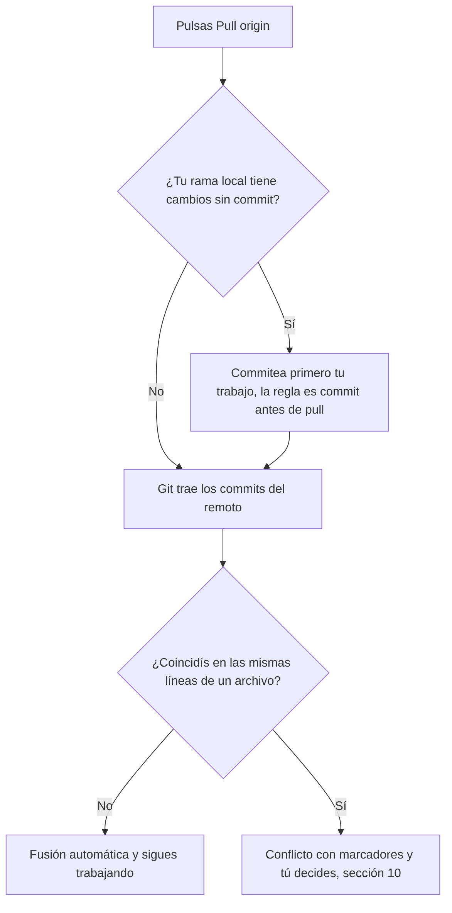

# Hacer pull

## Introducción

El push lleva tu trabajo a GitHub. El **pull** («traer» o «jalar») hace lo contrario: trae al repositorio remoto los cambios que otros (o tú desde otro sitio) han subido, y los incorpora a tu copia local.

Trabajar en equipo sin pull es imposible: cada miembro necesita los cambios de los demás antes de seguir. Pero el pull también tiene su parte delicada: cuando tu trabajo local y el remoto han cambiado el mismo archivo, Git no puede decidir por sí solo. Ahí nacen los **conflictos**, el tema que asusta a principiantes y que dominarás en la sección 10.

En este capítulo aprenderás:

* qué hace exactamente un pull (y su relación con fetch);
* cómo ejecutarlo en GitHub Desktop;
* qué pasa cuando no hay conflictos (fusión automática);
* qué pasa cuando los hay (aviso y paso siguiente);
* qué NO hacer ante un pull conflictuoso;
* errores comunes con diagnóstico completo, práctica guiada y nivel profesional (rutinas de sincronización).

---

## Mapa conceptual de este capítulo



---

## 1. Qué es pull

### 1.1. Definición

**Pull** trae los commits nuevos del remoto a tu rama local y los integra en tu trabajo actual (fusionándolos).

```text
Pull
──────────────────────────────────────────────
TU EQUIPO (local)              GITHUB (remoto)
   │                               │
main: A─B                        main: A─B─D─E
   │                               │
   └─────────── pull ──────────────┘
                     │
                     ▼
main local: A─B─D─E      (te quedas al día)
   │
   └── si TÚ tenías commit local C:
       se integra D y E con C
       (fusión automática o conflicto)
```

### 1.2. fetch vs. pull

```text
Fetch
   │
   ├── Consulta al remoto y descarga lo nuevo
   ├── NO integra nada en tu trabajo: solo trae datos
   │   (tu rama local no se mueve aún)
   └── Servicio: mirar qué hay sin alterar nada

Pull
   │
   ├── = fetch + integración (merge) en tu rama
   └── tu rama local avanza e incorpora lo traído
```

En la práctica diaria usas pull; fetch es la herramienta fina (y la que ofrece el botón cuando no hay nada que integrar).

### 1.3. El pull es una fusión

```text
Concepto clave
──────────────────────────────────────────────
pull = traer + FUSIONAR con lo que ya tenías

Si tus cambios y los remotos tocan archivos distintos
(o líneas distintas): fusión automática, sin ruido.

Si tocan LO MISMO: Git necesita que tú decidas
→ CONFLICTO (sección 10)
```

---

## 2. Pull desde GitHub Desktop

### 2.1. El botón

```text
Cuando el remoto está por delante:
   │
   ├── el botón principal muestra "Pull origin"
   │   (a menudo con contador: "Pull origin 2 commits")
   │
   └── menú: Repository → Pull
```

### 2.2. Pasos



### 2.3. Resultado

```text
Tras un pull sin conflicto
   │
   ├── tu rama local incluye los commits remotos
   ├── tu trabajo anterior (si lo había) sigue ahí,
   │   integrado
   └── estás al día: puedes seguir trabajando
```

---

## 3. Escenarios

### 3.1. Escenario A: local limpio (lo típico)

```text
Situación: sin cambios locales pendientes
   │
   └── pull: directo, rápido, sin sorpresas
       (los commits remotos se incorporan)
```

Este es el flujo de «empezar la jornada»: fetch/pull antes de editar.

### 3.2. Escenario B: local con cambios sin commit

```text
Situación: modificaste archivos y quieres pull
   │
   ├── Git necesita saber QUÉ hacer con tus cambios
   │   locales en relación con lo que llega
   │
   ├── Opciones que suele ofrecer la herramienta:
   │      · hacer commit primero y luego pull
   │        (recomendado y simple)
   │      · o dejar que Git intente integrar
   │        (puede funcionar o conflictuar)
   │
   └── Regla práctica: COMMIT antes de PULL
          →  historial limpio y problemas menos probables
```

### 3.3. Escenario C: conflictos (señal)

```text
Situación: tu trabajo y el remoto tocan lo mismo
   │
   ├── pull: Git se detiene o avisa
   │   (en Desktop: mensaje de conflicto/estado de merge)
   │
   ├── tus archivos pueden quedar marcados con
   │   <<<<<<< ======= >>>>>>>
   │
   └── NO es un error de sistema: es Git pidiéndote
       que decidas (sección 10)
```

Así se ven los tres escenarios cuando pulsas el botón:



---

## 4. Fusión automática: por qué ocurre

### 4.1. Ejemplo simple

```text
Antes (común):
   archivo X línea 10: "hola"

Remoto (otro) modifica línea 20.
Tú modificaste línea 10.

pull:
   · llega el cambio de la línea 20
   · tu cambio de la línea 10 se mantiene
   · resultado: AMBOS cambios, sin conflicto
```

### 4.2. Por qué no hay conflicto

```text
Git compara por ZONAS, no por archivo entero:
   │
   ├── líneas distintas → fusión automática
   ├── archivo distinto → fusión automática
   └── MISMA línea (o zona cercana) cambiada en ambos
          →  conflicto: necesita tu criterio
```

### 4.3. Fusión como commit

```text
Cuando el pull integra dos líneas de trabajo,
Git crea un COMMIT DE FUSIÓN (merge commit):
   │
   ├── tiene DOS padres (tu historia y la traída)
   └── aparece en History como «Merge branch ...»
       (o equivalente según flujo)

En pull fast-forward (tu local no tenía cambios):
   Git solo mueve el puntero; a veces no crea
   commit de fusión (la historia avanza en línea).
```

(El detalle de fast-forward y merge lo verás en la sección 08.)

---

## 5. Conflictos: qué son (sin pánico)

### 5.1. Señales de conflicto

```text
Síntomas
   │
   ├── Desktop/terminal: aviso de conflicto al hacer pull
   ├── el archivo contiene marcadores:
   │
   │      <<<<<<< TÚ
   │      tu versión
   │      =======
   │      versión remota
   │      >>>>>>> origin/main
   │
   └── la lista de cambios muestra el archivo en estado
       de conflicto
```

### 5.2. Qué significa

```text
Git dice, en sustancia:
   «ambos cambiasteis esto; yo no sé qué versión es la
    correcta; tú decidirás editando el archivo y
    guardando el resultado»
```

### 5.3. Qué NO hacer

⚠️ **RIESGO:** un pull interrumpido a medias deja el repositorio en estado de fusión sin resolver; si desde ahí fuerzas, cierras la aplicación o abortas sin leer, los archivos pueden quedar con los marcadores de conflicto en mitad del texto y parte del trabajo deja de estar en ningún lado.

```text
Ante un conflicto, prohibido por prisa:
   │
   ✗  abortar de cualquier manera y perder trabajo
   ✗  force push para «imponer» tu versión
   ✗  cerrar la aplicación y fingir que no pasa
   ✗  aceptar una versión sin leer la otra
   │
   correcto:
   ✓  respirar (es un proceso documentado)
   ✓  leer ambos lados de los marcadores
   ✓  producir la versión correcta
   ✓  confirmar la resolución
   ✓  si te atascas: pedir ayuda o abortar con
      conocimiento (la sección 07 enseña abortar)
```

> **Perspectiva:** los conflictos no son fallos del sistema; son Git respetando el trabajo de todos y pidiendo criterio humano donde la máquina no lo tiene.

### 5.4. Hacia dónde seguir

La sección **10-git-conflictos** cubre en detalle: por qué aparecen, cómo identificarlos, cómo resolverlos (merge y rebase), cómo abortar operaciones y buenas prácticas. Este capítulo te deja en la puerta, sabiendo que existen y que no son el fin del mundo.

---

## 6. Errores comunes con diagnóstico completo

### Error 1: Hacer pull con cambios sin commitear

**Qué ocurrió:** Git se queja, ofrece opciones confusas o el resultado queda raro.

**Por qué:** no se hizo commit antes (escenario B).

**Cómo comprobarlo:** la lista de cambios tenía trabajo pendiente.

**Opciones:**
* hacer commit de lo tuyo y repetir el pull;
* si la herramienta ofreció un camino y salió bien: verificar resultado (History y diff).

**Riesgos:** confusión sobre qué quedó dónde.

**Solución:** hábito: **commit antes de pull**.

**Cómo se evita:** rutina: cerrar bloques de trabajo con commit al terminar.

---

### Error 2: Pull rechazado o detenido por conflicto

**Qué ocurrió:** el pull no termina limpio; aparecen marcadores o un mensaje de conflicto.

**Por qué:** cambios superpuestos (punto 5).

**Cómo comprobarlo:** marcadores en el archivo; estado de la herramienta.

**Opciones:**
* resolver ahora (si sabes) o leer la sección 10 y volver;
* o abortar el pull con la opción de abortar (quedándote como estabas) y prepararte mejor.

**Riesgos:** dejar archivos a medias (el peor escenario: resolver a medias y commitear).

**Solución:** resolución completa y verificada, o aborto limpio.

**Cómo se evita:** pull frecuentes (cuanto más tiempo pasas sin sincronizar, más crece la probabilidad de conflicto).

---

### Error 3: Esperar que pull «actualice» archivos sin commit

**Qué ocurrió:** se hicieron cambios locales, se hizo pull, y se cree que los cambios locales desaparecieron o se mezclaron solos.

**Por qué:** malentendido de niveles (otra vez).

**Cómo comprobarlo:** ver History y lista de cambios tras el pull.

**Opciones:** aclarar mentalmente qué estaba commit y qué no.

**Riesgos:** creer que se perdió trabajo (si no se perdió) o al revés.

**Solución:** revisar estado tras cada operación.

**Cómo se evita:** trabajar en bloques cerrados con commit.

---

### Error 4: Tirar de la maneta (pull) una y otra vez esperando que «arregle» algo

**Qué ocurrió:** pull repetido sin sentido.

**Por qué:** no se entiende qué hace (o se espera que arregle un conflicto solo).

**Cómo comprobarlo:** el estado no cambia entre pulls.

**Opciones:** leer el estado real (¿fetch? ¿conflicto? ¿nada que traer?).

**Riesgos:** ruido y confusión.

**Solución:** una pull = una acción concreta.

**Cómo se evita:** entender el ciclo fetch/push/pull (capítulo anterior).

---

### Error 5: Confundir pull con push

**Qué ocurrió:** se quiso «subir» y se tiró de pull (o al revés), con la consiguiente confusión de estado.

**Por qué:** nombres asimilados a un idioma nuevo.

**Cómo comprobarlo:** el estado del botón (la herramienta te dice qué necesita).

**Opciones:** mirar el indicador: «local commits waiting» = push; «N commits ahead of origin» en remoto = pull.

**Riesgos:** pasos en falso.

**Solución:** regla mnemotécnica: **push = sube lo tuyo; pull = baja lo de ellos**.

**Cómo se evita:** repetir en voz alta el flujo durante la práctica.

---

### Error 6: Pull en la rama equivocada

**Qué ocurrió:** se trajeron commits a una rama donde no tocaban.

**Por qué:** rama mal seleccionada.

**Cómo comprobarlo:** History de esa rama ahora contiene commits inesperados.

**Opciones:**
* si no se publicó nada raro: a veces se convive o se reorganiza con criterio;
* en equipo: consultar (sección 08 tiene herramientas para este tipo de movimientos).

**Riesgos:** historia mezclada.

**Solución:** mirar la rama antes de operar (otra vez).

**Cómo se evita:** el hábito de comprobar rama en commit, push Y pull.

---

## 7. Práctica guiada

### Objetivo

Experimentar un pull real: crear cambios remotos y traerlos a tu equipo.

### Paso 1: preparar un cambio remoto

1. Abre tu repositorio en GitHub (navegador).
2. Edita `notas.md` directamente en la web (lápiz) y añade una línea.
3. Commit con mensaje: `Añade línea desde la web`.
4. Comprueba: el remoto tiene un commit que tu local no tiene.

### Paso 2: detectar el estado

1. En GitHub Desktop, pulsa **Fetch origin**.
2. Observa: el botón pasa a indicar pull (el remoto está por delante).
3. Tu lista de cambios está limpía.

### Paso 3: pull

1. Pulsa **Pull origin**.
2. Espera: el commit remoto aparece en History.
3. Abre `notas.md` en tu equipo: la línea está ahí.

### Paso 4: ahora, ambos lados

1. En local, modifica `notas.md`: cambia EXACTAMENTE la misma línea que cambiaste en la web (edita otra cosa distinta para evitar conflicto en esta práctica... o hazlo igual a propósito si quieres ver la señal de conflicto: **opcional y recomendado para observar**).
2. Si cambiaste la misma línea: haz pull y OBSERVA el conflicto (marcadores). Léelo con calma; no lo resuelvas aún si no estás listo: puedes abortar o terminar la lectura y volver en la sección 10.
3. Si cambiaste otra zona: haz pull y observa la fusión automática: ambos cambios conviven.

### Paso 5: síntesis

Responde:
1. ¿Qué trae el pull? → commits remotos.
2. ¿Sube algo? → no (eso es push).
3. ¿Qué pasa si coincidís en la misma línea? → conflicto: tú decides.

### Resultado esperado

Experiencia directa de los dos desenlaces del pull: fusión limpia y (opcional) conflicto observado.

### Conclusión esperada

El pull es la vida en equipo: mantiene tu copia al día. Y los conflictos, cuando llegan, son el precio de que Git nunca tire el trabajo de nadie.

### Ejercicio de transferencia

Reproduce los dos desenlaces en un repositorio distinto al de la práctica guiada: desde la web cambia una línea de un archivo y desde tu equipo otra línea del mismo archivo, y haz pull para ver la fusión automática; repite el proceso tocando exactamente la misma línea desde ambos lados para observar el conflicto. Entrega: una captura del archivo con los marcadores `<<<<<<<` y `=======` sin resolver y una línea escrita explicando qué decisión te pide Git ahí.

---

## 8. Nivel profesional

### 8.1. Rutina de sincronización

```text
Día a día en equipo
──────────────────────────────────────────────
Mañana:
   Fetch → ¿hay novedades? → Pull → empezar

Entre tareas:
   Commit → Push → Fetch (¿alguien subió?) → Pull

Antes de abrir PR:
   Pull de la rama base → Push de tu rama
   (para que el PR esté fresco)
```

### 8.2. pull --rebase (mención)

Existe una alternativa a la fusión tradicional: rehacer tus commits sobre lo nuevo (rebase):

```text
merge (por defecto del pull)      rebase
────────────────────────────      ────────────────────
Crea commit de fusión             Historial lineal
Historial con «bifurcaciones»     Commits tuyos
                                  re-apilados encima

Útil: historia limpia             Riesgo: se reescriben
                                  tus commits locales →
                                  con cuidado en equipo
```

Se estudia a fondo en la sección 08 (rebase) y sus variantes de conflicto en la sección 10. Por ahora, identifica que existe y que es opcional.

### 8.3. Conflictos y equipo

```text
Cómo los equipos reducen conflictos
   │
   ├── pull frecuente (horas, no días)
   ├── trabajo en ramas cortas y vidas breves
   ├── evitar cambios «de formato» masivos
   ├── dividir archivos grandes si generan fricción
   │   (o acordar quién toca qué)
   └── resolver conflictos PRONTO: cuanto más esperas,
       más capas de conflicto
```

---

## 9. Resumen

En este capítulo aprendiste que:

* el pull trae los commits nuevos del remoto y los integra en tu rama local; es fetch + fusión;
* el flujo típico es: fetch (ver) → pull (traer) → trabajar → commit → push;
* con cambios locales pendientes, lo limpio es commitear antes de tirar del pull;
* si tus cambios y los remotos tocan zonas distintas, Git los fusiona solo; si tocan lo mismo, se produce un conflicto con marcadores `<<<<<<< ======= >>>>>>>`;
* los conflictos no son fallos: son Git pidiéndote una decisión; la resolución completa se estudia en la sección 10;
* ante un conflicto no se hace force, no se aborta a ciegas y no se cierra la aplicación esperando lo mejor;
* los errores típicos (pull sin commit, confundir push/pull, rama equivocada) se evitan con el hábito de leer el estado y commitear por bloques;
* a nivel profesional, la sincronización frecuente es la mejor vacuna contra los conflictos.

La idea principal es:

> **El pull mantiene viva la conexión con el equipo: baja lo que otros subieron y te pide tu criterio solo cuando vuestros trabajos se cruzan.**

---

## Autopreguntas de cierre

Sin mirar el material, responde mentalmente y luego compruébalo con este capítulo:

1. ¿Qué hace exactamente un pull y en qué se diferencia de un fetch, que también consulta al remoto?
2. ¿Por qué el pull es una fusión y qué decides tú cuando vuestros cambios tocan zonas distintas y cuando tocan lo mismo?
3. Si tienes cambios locales sin commitear, ¿qué haces antes de pulsar Pull origin y qué puede pasar si no lo haces?
4. ¿Qué marcadores aparecen en un archivo en conflicto y qué le está pidiendo Git exactamente a la persona?
5. ¿Por qué un conflicto no es un error del sistema y qué comportamientos solo empeoran la situación?
6. Si haces pull repetidamente sin que cambie nada, ¿qué información real te falta leer y dónde está?
7. ¿Cómo distingues en la interfaz si toca un push o un pull, y qué frase corta te ayuda a no confundirlos?
8. ¿Qué hábitos de equipo reducen la frecuencia y la gravedad de los conflictos?

---

## Próximo paso

Ya dominas el circuito completo: modificar, revisar, commit, push y pull.

El siguiente paso es aprender a trabajar con varias líneas de desarrollo a la vez: las ramas.

Continúa con:

[`10-trabajar-con-ramas.md`](10-trabajar-con-ramas.md)
