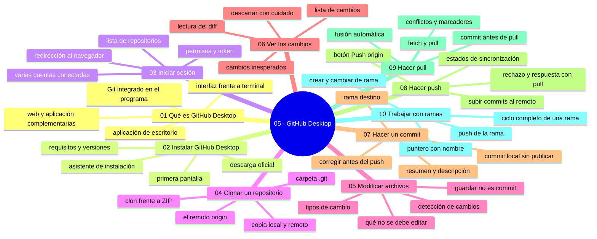

# 05 — GitHub Desktop

## Bienvenido a la sección de GitHub Desktop

En esta sección dejarás el navegador para trabajar con GitHub desde tu propio equipo, con una herramienta visual que hace de puente entre tus archivos y la plataforma.

Ya sabes editar en la web y entender el ciclo de commits. Ahora el repositorio vive en tu disco: lo clonas, lo editas con tus programas y gestionas el historial con GitHub Desktop. Es el momento en que la copia local y la copia remota se convierten en conceptos reales de tu día a día.

En esta sección estudiarás:

* qué es GitHub Desktop, para quién sirve y cómo se instala;
* cómo iniciar sesión y clonar un repositorio a tu equipo;
* cómo modificar archivos localmente y qué significa «guardar ≠ commit»;
* a revisar los cambios con la lista y el diff;
* a hacer commits desde tu equipo y a publicarlos con push;
* a traer el trabajo de los demás con pull, y a reconocer los conflictos;
* a trabajar con ramas: crearlas, publicarlas y volver a main.

Al finalizar esta sección dominarás el circuito completo local↔remoto, que es la base de todo lo que harás después con la terminal.

---

## Objetivos de aprendizaje

Al terminar esta sección serás capaz de:

* instalar GitHub Desktop y clonar un repositorio a tu equipo;
* explicar por qué «guardar el archivo» no es «hacer commit»;
* revisar los cambios con la lista y el diff antes de commitear;
* ejecutar el ciclo completo: cambio local → commit → push → pull;
* crear y publicar una rama y volver a la rama principal sin perder trabajo.

---

## Mapa conceptual

---

## ¿Qué aprenderás en esta sección?

Cada capítulo de esta sección está diseñado para construir tu comprensión progresivamente:

1. **Qué es GitHub Desktop** - La alternativa visual a la terminal y su lugar en el flujo de trabajo.
2. **Instalar GitHub Desktop** - Descarga, requisitos y primera pantalla.
3. **Iniciar sesión** - La autenticación entre la aplicación y tu cuenta de GitHub.
4. **Clonar un repositorio** - La copia completa a tu equipo y el origen `origin`.
5. **Modificar archivos** - Editar con tus herramientas; guardar ≠ commit.
6. **Ver los cambios** - La lista de cambios y el diff como herramientas de revisión.
7. **Hacer un commit** - Mensajes, ramas y la localidad de tus commits.
8. **Hacer push** - Publicar en GitHub y leer el estado de sincronización.
9. **Hacer pull** - Traer el trabajo ajeno, la fusión automática y la entrada a los conflictos.
10. **Trabajar con ramas** - Aislar líneas de trabajo y el ciclo completo de una rama.

---

## Cómo estudiar esta sección

Cada capítulo incluye:

* Mapas conceptuales de cada operación;
* Diagramas del estado local vs. remoto (el hilo conductor de toda la sección);
* Procedimientos paso a paso en la aplicación;
* Errores comunes con diagnóstico completo (qué ocurrió, por qué, cómo comprobarlo, opciones, riesgos, solución y cómo evitarlo);
* Prácticas guiadas encadenadas sobre el mismo repositorio de práctica;
* Un nivel profesional para situar cada tema en equipos reales;
* Resúmenes con la idea principal;
* Enlaces al siguiente capítulo.

La idea que recorre la sección: cada operación tiene un lugar —tu disco, tu historial local o el remoto— y el error más común es confundirlos. Guardar, commitear, subir y traer son cuatro actos distintos; entender cuál estás haciendo es entender Git.

---

## Referencias

* GitHub Desktop — Documentación oficial (desktop.github.com).
* Chacon, S. y Straub, B. — *Pro Git* (cap. 1).
* GitHub — Documentación oficial: «About GitHub Desktop».

---

## Checkpoint 05 — Comprobación obligatoria

Antes de avanzar a `06-git-desde-cero/`, demuestra que puedes (en un repositorio de práctica real, con GitHub Desktop instalado y la sesión iniciada):

1. **Clonar** un repositorio de tu cuenta a una carpeta ordenada de tu equipo y comprobar en el explorador que aparece la carpeta oculta `.git` junto a los archivos.
2. **Modificar** archivos con tu editor, ver en la lista de cambios los estados Modified, Added y Deleted, y leer el diff de cada uno antes de decidir.
3. **Hacer commit** redactando resumen y descripción, mirando antes el nombre de la rama en el botón, y verificar en History que el commit queda arriba.
4. **Hacer push** y confirmar en github.com, refrescando la pestaña Commits, que ese commit y su archivo están en la rama correcta.
5. **Hacer pull** después de crear un commit en la web y comprobar que ese commit aparece en tu historial local.
6. **Crear y publicar** una rama con un commit propio, volver a `main` y explicar por qué `main` no muestra ese trabajo.

Si puedes hacerlo **sin mirar instrucciones**, el checkpoint está cerrado.

---

## Autopreguntas de cierre

Sin mirar el material, responde mentalmente y luego compruébalo con los capítulos de la sección:

1. ¿Qué diferencia hay entre guardar un archivo en el editor y commitearlo en Desktop?
2. ¿Qué hace `push` y qué hace `pull`?
3. ¿Por qué un pull puede detenerse en un conflicto y cuál es tu primer paso?
4. ¿Qué diferencia hay entre la rama principal y una rama de feature en la interfaz?
5. Si guardas el mismo archivo veinte veces y haces un solo commit al final, ¿qué queda registrado en el historial y qué no?
6. ¿Por qué un push rechazado se resuelve con pull y nunca forzando la subida, y qué trabajo queda destruido si lo fuerzas en una rama compartida?
7. ¿Qué puede pasar si cambias de rama en Desktop con cambios sin commitear y qué hábito evita del todo ese problema?
8. ¿Qué se pierde al cerrar la sesión en GitHub Desktop y qué se perdería si en cambio borrases la carpeta clonada?

---

## Próximo paso

Una vez que completes esta sección, estarás listo para ver el motor por dentro: Git desde la terminal.

Continúa con:

[`06-git-desde-cero/`](../06-git-desde-cero/)
