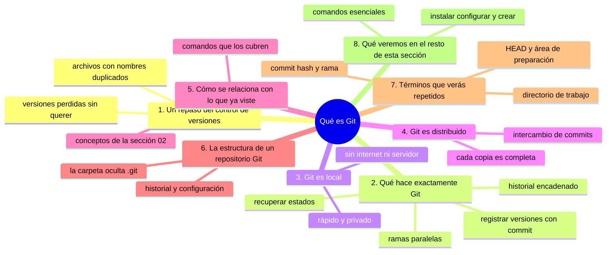
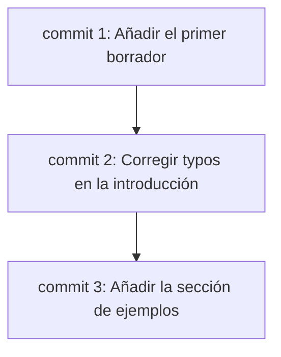

# Qué es Git

## Introducción

En la sección 02 ya estudiaste qué es el control de versiones y qué es un repositorio.

Viste que existe una manera sistemática de registrar los cambios que se hacen en archivos a lo largo del tiempo.

En esta sección entraremos en Git, el programa concreto que permite hacer todo eso.

Antes de escribir el primer comando, conviene repasar qué es Git y qué puede hacer por ti.

En este capítulo aprenderás:

* qué es Git y qué significa que sea un sistema de control de versiones distribuido;
* qué hace exactamente Git: registrar versiones, mantener un historial, gestionar ramas y recuperar estados;
* qué significa que Git sea local;
* qué significa que Git sea distribuido;
* cómo se relaciona Git con lo que ya viste en la sección 02;
* cuáles son los términos que volverás a encontrar una y otra vez.

No abrirás la terminal en este capítulo. Es un repaso conceptual que servirá de mapa para el resto de la sección.

---

## Mapa conceptual de este capítulo



---

## 1. Un repaso del control de versiones

Imagina que trabajas en un documento durante semanas.

Cada día lo modificas: cambias palabras, reescribes párrafos, borras secciones y añades otras.

Sin un sistema de control de versiones, lo más probable es que termines con archivos como estos:

```text
informe.txt
informe-final.txt
informe-final-v2.txt
informe-final-v2-MODIFICADO.txt
informe-final-v2-MODIFICADO-copia.txt
```

No sabes cuál es el bueno, no recuerdas qué cambiaste ni cuándo, y has perdido versiones sin querer.

El control de versiones resuelve esto de manera sistemática.

Un sistema de control de versiones registra cada cambio importante de tus archivos de forma automática y recuperable.

Git es, precisamente, uno de esos sistemas.

Y es el más utilizado en el desarrollo de software a nivel mundial.

---

## 2. Qué hace exactamente Git

Aunque el nombre completo es "una suite de herramientas", en la práctica Git hace cuatro cosas grandes.

### 2.1. Registrar versiones

Git guarda versiones de tus archivos.

Cuando quieres conservar el estado actual de tu trabajo, escribes un comando llamado `git commit`.

Git guarda entonces una **instantánea** completa de tus archivos: su contenido en ese momento.

Esa instantánea se llama **commit** y se identifica con un código único llamado hash.

### 2.2. Mantener un historial

Cada commit queda guardado en una cadena de commits.

Esa cadena es el historial de tu proyecto:



El historial te permite ver:

* cuántas versiones existen;
* quién las creó y cuándo;
* qué cambió en cada una;
* cómo se fueron construyendo entre sí.

### 2.3. Gestionar ramas

A veces necesitas trabajar en dos líneas de desarrollo a la vez.

Por ejemplo: corregir un error urgente mientras continúas con una característica nueva.

Git permite crear **ramas**: líneas de desarrollo paralelas que conviven dentro del mismo repositorio.

Puedes moverte de una rama a otra sin que se mezclen los cambios.

Más adelante, cuando quieras, puedes fusionar una rama con otra.

### 2.4. Recuperar estados

Si en algún momento rompes algo, Git te permite volver a un estado anterior.

Puedes recuperar:

* el archivo completo de un commit antiguo;
* un solo archivo concreto;
* el contenido de una versión anterior sin perder el trabajo actual.

Por eso, trabajar con Git se siente como tener un "punto de control" disponible todo el tiempo.

---

## 3. Git es local

La primera gran ventaja de Git es que todo ocurre **en tu computadora**.

Cuando escribes comandos como `git add` o `git commit`, Git trabaja en los archivos que tienes delante, en la carpeta donde te encuentras.

No necesita internet.

No necesita un servidor.

No necesita que nadie más esté online.

Esto tiene consecuencias importantes:

* eres muy rápido: registrar una versión tarda milisegundos;
* puedes trabajar en un avión o sin conexión;
* tu información no viaja por red cada vez que la modificas;
* Git funciona igual aunque no exista servidor alguno.

Es importante interiorizarlo: **Git es un programa de control de versiones local**.

La conexión con internet es opcional.

---

## 4. Git es distribuido

La segunda gran ventaja de Git es que su historial **no vive solo en un lugar**.

En un sistema centralizado clásico, el historial completo vive en un servidor.

Cada persona solo tiene una parte del trabajo y depende del servidor para todo.

En Git, cada copia del repositorio es un **repositorio completo** con todo el historial.

```text
Repo A (tu equipo)
   ├── historial completo
   └── puede enviar y recibir cambios

        ⇅ intercambio de commits

Repo B (otro equipo)
   ├── historial completo
   └── puede enviar y recibir cambios
```

Gracias a esto:

* si el servidor se cae, tu trabajo no se pierde;
* puedes hacer commits, ver el historial y crear ramas sin internet;
* los repositorios pueden "divergir" y luego sincronizarse;
* la colaboración se vuelve flexible: cada quien trabaja a su ritmo.

Por eso Git se llama **distribuido**: el historial no está centralizado, está repartido.

---

## 5. Cómo se relaciona con lo que ya viste

En la sección 02 estudiaste el control de versiones de forma conceptual.

Ahí viste ideas como:

* registrar versiones de archivos;
* recuperar estados anteriores;
* trabajar en equipo sin pisarse;
* ver quién hizo qué y cuándo.

Ahora esas ideas tienen una herramienta concreta detrás.

Cada concepto que ya conociste tiene un comando o un mecanismo en Git:

| Concepto de la sección 02 | En Git |
|---|---|
| Registrar una versión | `git commit` |
| Ver el historial | `git log` |
| Preparar cambios | `git add` |
| Ver qué cambió | `git diff` |
| Recuperar un estado | `git restore` |
| Trabajar en paralelo | ramas |

No necesitas memorizarlos ahora.

Solo quiero que veas que el mapa conceptual que ya tienes ahora tendrá correspondencia práctica.

---

## 6. La estructura de un repositorio Git

Cuando creas un repositorio Git en una carpeta, Git añade una carpeta oculta llamada `.git`.

```text
mi-proyecto/
   ├── .git/          ← carpeta oculta de Git
   ├── README.md
   └── notas.txt
```

Dentro de `.git` vive todo lo que Git necesita:

* el historial de commits;
* las versiones de los archivos;
* la información de ramas;
* la configuración local del repositorio.

Tú no editas esa carpeta directamente.

Git la gestiona internamente.

Mientras no la borres, tu historial está a salvo.

---

## 7. Términos que verás repetidos

Para no perderte, conviene conocer ya algunos términos que usarás durante toda la sección:

* **Repositorio**: la carpeta con su historial Git.
* **Commit**: una instantánea registrada de tus archivos.
* **Hash**: el identificador único de cada commit.
* **Rama**: una línea de desarrollo paralela.
* **HEAD**: el puntero a tu commit actual.
* **Área de preparación (staging)**: el lugar donde guardas los cambios antes de hacer un commit.
* **Directorio de trabajo**: tus archivos actuales en la carpeta.

Con el tiempo estos términos se volverán naturales.

Por ahora, solo necesitas saber que existen.

---

## 8. ¿Qué veremos en el resto de esta sección?

Con este repaso, ya tienes el mapa.

Los próximos capítulos seguirán un orden muy práctico:

1. Entenderás por qué existe Git y de dónde viene.
2. Lo instalarás y lo configurarás.
3. Crearás tu primer repositorio.
4. Aprenderás los comandos esenciales: `init`, `status`, `add`, `commit`, `log`, `diff`, `show` y `help`.

Cada comando se explicará con:

* su sintaxis básica;
* un ejemplo paso a paso;
* qué ocurre internamente;
* qué revisar después de ejecutarlo.

No se trata de memorizar: se trata de practicar.

---

## Práctica guiada

En esta práctica vas a repasar mentalmente lo que acabas de leer.

No necesitas terminal todavía.

### Paso 1: ubica un archivo que hayas modificado varias veces

Puede ser un documento, un cuaderno, un código o cualquier archivo.

Pregúntate:

* ¿Cuántas versiones tiene?
* ¿Sabes cuál es la última?
* ¿Podrías recuperar una versión anterior si quisieras?

### Paso 2: imagina aplicar Git

Ahora imagina que ese archivo está en un repositorio Git.

Visualiza:

* cada vez que guardas un commit queda una instantánea etiquetada;
* puedes ver todas las versiones en orden cronológico;
* puedes volver a cualquier versión sin perder la actual.

### Paso 3: conecta con lo que ya sabes

Piensa en los conceptos de la sección 02:

* registrar versiones;
* recuperar estados;
* historial;
* ramas.

Confirma que cada uno de esos conceptos tiene ahora una herramienta concreta en Git.

### Resultado esperado

Deberías poder explicar:

* qué es Git en una frase;
* qué hace exactamente (los cuatro puntos de la sección 2);
* qué significa que sea local y distribuido;
* cómo se relaciona con el control de versiones ya estudiado.

### Ejercicio de transferencia

Elige un documento personal que hayas editado muchas veces (un acta, una receta, un informe) y crea a mano en tu escritorio tres copias con nombres tipo `documento.txt`, `documento-v2.txt` y `documento-v2-final.txt`. Escribe un párrafo de cinco líneas explicando qué información NO puedes recuperar con esas copias (quién cambió qué y cuándo) y cómo la obtendrías si ese documento viviera en un repositorio Git. Entrega el párrafo junto al listado de las tres copias.

---

## Errores comunes

### Error 1: confundir Git con GitHub

Son cosas diferentes: Git es el programa local, GitHub es una plataforma web.

### Error 2: pensar que Git necesita internet

Git funciona perfectamente sin conexión. El internet solo entra cuando colaboras con repositorios remotos.

### Error 3: creer que Git guarda copias literales de cada versión

Git guarda instantáneas inteligentes. No repite el contenido completo cada vez.

### Error 4: pensar que un commit es lo mismo que guardar un archivo

Guardar un archivo es una operación del sistema. Un commit es una instantánea registrada en el historial Git.

### Error 5: creer que las ramas son copias completas del proyecto

Las ramas son referencias ligeras. No duplican el historial.

---

## Buenas prácticas

* Trata Git como una herramienta local primero: practica sin depender de internet.
* Antes de hacer un commit, pregúntate si el estado actual es bueno para guardar.
* Usa mensajes de commit claros desde el inicio.
* No edites la carpeta `.git` a mano.
* Repasa los términos de esta sección antes de avanzar: son la base de todo lo que vendrá.
* Practica los conceptos mentales antes de ejecutar comandos.

---

## Autopreguntas de cierre

Sin mirar el material, responde mentalmente y luego compruébalo con este capítulo:

1. ¿Qué información pierdes cuando guardas `informe-final-v2-copia.txt` a mano y cómo la recupera Git?
2. ¿Qué hace exactamente Git con tus archivos (registrar, historial, ramas, recuperar) y qué ganas con cada acción?
3. ¿Por qué Git funciona sin internet y qué operaciones quedan pendientes hasta que hay conexión?
4. ¿Qué riesgo elimina que Git sea distribuido y qué pasaría si el servidor central desapareciera?
5. ¿Qué contiene la carpeta `.git` y qué le ocurriría a tu proyecto si la borras?
6. ¿Qué diferencia hay entre Git y GitHub y en qué momentos del curso te afecta esa diferencia?
7. ¿Cómo se traduce cada concepto de la sección 02 (registrar, historial, preparar, comparar) en un comando concreto de Git?

Si alguna respuesta no está clara, vuelve a la sección correspondiente y repite la práctica.

---

## Resumen

En este capítulo aprendiste que:

* Git es un sistema de control de versiones local y distribuido;
* Git registra versiones de archivos como instantáneas llamadas commits;
* cada commit tiene un historial ordenado y un hash único;
* las ramas permiten líneas de desarrollo paralelas;
* puedes recuperar cualquier estado anterior;
* Git funciona sin internet porque todo ocurre en tu equipo;
* la carpeta `.git` contiene todo el historial del repositorio;
* los términos de esta sección son la base de todo lo que vendrá.

La idea principal es:

> **Git es el programa local que registra versiones de tus archivos, mantiene su historial y te permite recuperar cualquier estado anterior, y funciona de forma distribuida para que el historial nunca dependa de un solo lugar.**

---

## Próximo paso

Ya tienes el mapa conceptual de Git.

El siguiente paso es entender por qué existe Git y qué problema concreto lo hizo necesario.

Continúa con:

[`02-por-que-existe-git.md`](02-por-que-existe-git.md)
