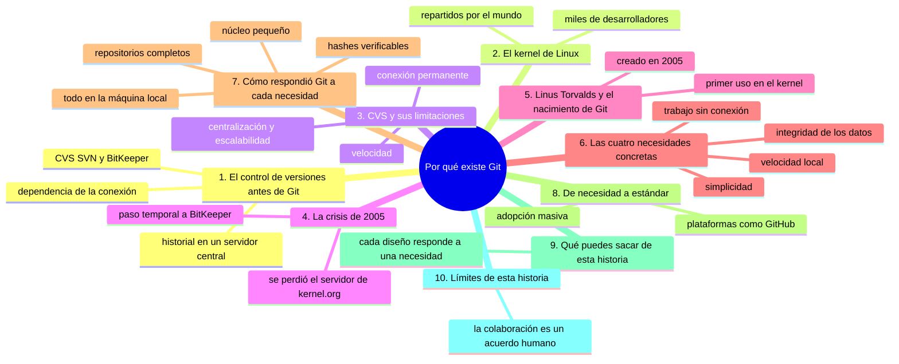
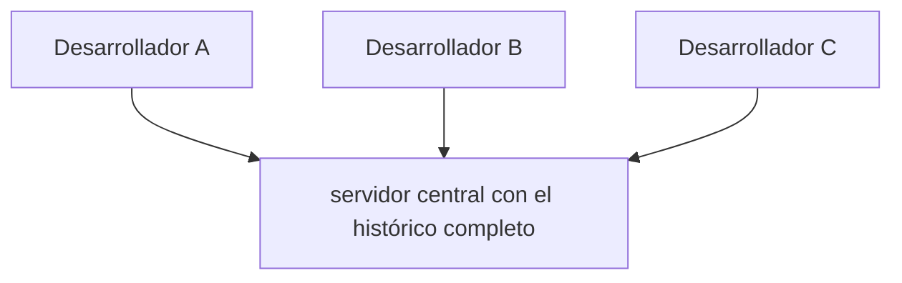

# Por qué existe Git

## Introducción

Ya sabes qué es Git y qué hace: registrar versiones, mantener un historial, gestionar ramas y recuperar estados.

Pero aún queda una pregunta importante: ¿por qué existe Git?

Conocer su origen no es un dato de trivia. Explica el diseño del programa y por qué Git se comporta como se comporta.

En este capítulo aprenderás:

* cómo era el control de versiones antes de Git;
* qué era el kernel de Linux y por qué era un proyecto tan grande;
* qué limitaciones tenía el sistema que se usaba (CVS) con desarrolladores distribuidos;
* qué necesidades concretas surgieron: velocidad local, desarrollo distribuido sin conexión, integridad de los datos y simplicidad;
* cómo respondió Git a cada una de esas necesidades;
* cómo pasó Git de ser una herramienta interna a convertirse en el estándar mundial.

No necesitas terminal para este capítulo. Es una lección de contexto que te ayudará a entender muchas decisiones de Git.

---

## Mapa conceptual de este capítulo

---

## 1. El control de versiones antes de Git

Antes de 2005, la mayoría de los proyectos grandes de software usaban sistemas de control de versiones **centralizados**.

Los más comunes eran:

* **CVS** (Concurrent Versions System);
* **Subversion (SVN)**;
* **Perforce**;
* **BitKeeper**.

Todos ellos compartían una idea común: el historial completo del proyecto vive en un **servidor central**.

Cada desarrollador solo tiene una copia parcial de su trabajo.

Para consultar el historial, registrar un cambio o ver lo que hicieron los demás, cada uno debe **conectar con el servidor**.

Ese modelo funcionó bien durante años, pero tenía una limitación estructural: **dependía de la conexión**.

---

## 2. El kernel de Linux

El **kernel de Linux** es el núcleo del sistema operativo Linux: el programa que gestiona la memoria, los procesos, las redes y el acceso a hardware.

Es uno de los proyectos de software más grandes de la historia.

Para 2005 ya contaba con:

* decenas de miles de líneas de código;
* cientos de desarrolladores activos;
* miles de contribuciones al año;
* desarrolladores en prácticamente todos los continentes.

El kernel se desarrolla de forma completamente distribuida.

No hay una oficina central, ni horarios comunes, ni un lugar físico donde todos se encuentren.

Cada desarrollador trabaja en su propio equipo, en su propio huso horario y con su propia conexión a internet.

Esa realidad hizo que las limitaciones de un sistema centralizado fueran especialmente graves para este proyecto.

---

## 3. CVS y sus limitaciones

El proyecto del kernel usaba **CVS** a través del servidor del sitio kernel.org.

CVS era una buena herramienta para su época, pero el crecimiento del kernel puso a prueba cada una de sus debilidades.

### 3.1. Velocidad

CVS es lento en las operaciones cotidianas.

Ver el historial de un archivo, listar los cambios o registrar una versión puede tardar varios segundos o incluso más.

Con miles de desarrolladores haciendo esto cientos de veces al día, la lentitud se vuelve un problema real.

### 3.2. Conexión permanente

CVS necesita conectarse al servidor para casi cualquier operación.

Si la conexión es lenta o inestable, el trabajo se detiene.

Un desarrollador que viaja, que está en una red limitada o que simplemente quiere trabajar sin conexión no puede avanzar.

### 3.3. Centralización

Todo el historial vive en un solo servidor.

Eso crea dos riesgos:

* si el servidor falla o se pierde, el historial completo está en peligro;
* el servidor se convierte en un cuello de botella: si está caído, nadie puede trabajar.

### 3.4. Escalabilidad

CVS no está diseñado para miles de desarrolladores accediendo al mismo historial de forma intensiva.

A mayor número de personas, mayor presión sobre el servidor y mayor lentitud.

---

## 4. La crisis de 2005

En septiembre de 2005 ocurrió un incidente que aceleró todo: el servidor principal de kernel.org se perdió.

El resultado fue concreto:

* el historial del kernel estuvo en riesgo;
* los desarrolladores quedaron sin acceso durante un tiempo;
* quedó claro que depender de un solo servidor era demasiado frágil.

Ante eso, el proyecto buscó una alternativa.

La opción elegida fue **BitKeeper**, un sistema propietario.

Pero BitKeeper traía problemas propios:

* era software privativo, con limitaciones de uso;
* su modelo no encajaba con la filosofía abierta del kernel;
* surgieron incidentes de permisos que tensionaron a la comunidad.

La conclusión de Linus Torvalds, creador y mantenedor principal del kernel, fue clara: **era mejor escribir el sistema propio**.

---

## 5. Linus Torvalds y el nacimiento de Git

En abril de 2005, Linus Torvalds comenzó a desarrollar un sistema de control de versiones para su propio uso.

Trabajó en el núcleo del programa durante unas pocas semanas.

En abril de 2005 ya existía un primer Git funcional, y en el verano de 2005 el kernel pasó a usarlo.

Algunos datos del nacimiento de Git:

* **Autor principal**: Linus Torvalds.
* **Año**: 2005.
* **Motivo**: gestionar el desarrollo del kernel de Linux.
* **Primer uso a gran escala**: el propio kernel de Linux.
* **Nombre**: "git", tomado de una expresión coloquial británica que Linus usaba para describirse a sí mismo. No es un acrónimo.

El nombre no importa tanto como el contexto: Git nació para resolver un problema real y urgente.

---

## 6. Las cuatro necesidades concretas

Para entender el diseño de Git, conviene enumerar las necesidades que el kernel tenía y que Git debía cubrir.

### 6.1. Velocidad local

Las operaciones de uso diario (ver historial, comparar, registrar) debían ser **extremadamente rápidas**, porque se repiten cientos de veces al día.

Cada milisegundo cuenta cuando se hace millones de veces.

### 6.2. Desarrollo distribuido sin conexión

Los desarrolladores debían poder:

* trabajar sin conexión a internet;
* hacer commits completos localmente;
* consultar el historial completo sin servidor;
* sincronizar solo cuando fueran a intercambiar trabajo con otros.

El sistema debía funcionar **desconectado** y permitir colaborar **después**.

### 6.3. Integridad de los datos

El kernel es crítico: no se podía permitir que el historial se corrompiera o se perdiera.

Se necesitaba un mecanismo para **detectar cualquier daño o manipulación** en los datos guardados.

### 6.4. Simplicidad

El sistema debía ser fácil de mantener y de usar.

No quería una suite enorme ni dependencias complejas.

Quería algo directo, predecible y robusto.

---

## 7. Cómo respondió Git a cada necesidad

Aquí está la parte clave: Git respondió cada necesidad de forma concreta.

### 7.1. Velocidad local

Git realiza casi todas sus operaciones **en la máquina local**, sobre archivos locales.

Al no hablar con un servidor en cada paso, es muy rápido.

Ver el historial, comparar dos versiones o registrar un commit son operaciones que se completan en milisegundos.

### 7.2. Desarrollo distribuido sin conexión

Como vimos, cada repositorio Git es **completo**.

Puedes:

* crear ramas;
* hacer commits;
* consultar todo el historial;

...todo **sin internet**.

Solo cuando decides intercambiar trabajo con otros (push y pull) necesitas conexión.

Eso habilitó el modelo de desarrollo distribuido a gran escala que hace posible el kernel de Linux.

### 7.3. Integridad de los datos

Git identifica cada dato con un **hash** (una huella digital calculada a partir del contenido).

Si algún byte de un objeto cambia, el hash cambia y Git puede detectarlo.

Esto hace que sea extremadamente difícil que el historial se corrompa sin que se note.

La integridad no es una promesa: está verificable en cada objeto.

### 7.4. Simplicidad

Aunque Git es potente, su núcleo es relativamente pequeño y directo.

No requiere un servidor complejo, ni una base de datos externa, ni servicios adicionales.

Un repositorio es, en esencia, una carpeta con una estructura sencilla.

Esa simplicidad estructural es parte de su robustez.

---

## 8. De necesidad a estándar

Git se creó para un solo proyecto: el kernel de Linux.

Pero sus virtudes lo hicieron atractivo para cualquier otro proyecto distribuido.

En poco tiempo:

* se adoptó para miles de proyectos;
* se convirtió en el estándar de facto del desarrollo de software;
* se construyeron plataformas de colaboración (como GitHub) sobre él;
* se volvió una habilidad esperada en el trabajo profesional.

Lo que empezó como solución a un problema muy específico terminó siendo la base del desarrollo moderno.

---

## 9. Qué puedes sacar de esta historia

Conocer el origen de Git te ayuda a entender su comportamiento:

| Observación | Explicación histórica |
|---|---|
| Git es muy rápido | Nació para que miles de desarrolladores trabajen a diario |
| Funciona sin internet | Nació para un proyecto distribuido globalmente |
| Verifica sus datos con hashes | El kernel no podía permitirse datos corruptos |
| Un repositorio es solo una carpeta | Se buscó simplicidad y facilidad de mantenimiento |
| El historial está en todas las copias | Se quería eliminar el riesgo de un solo servidor |

Cada vez que Git haga algo que te parezca extraño, recuerda este contexto.

Muchas de sus decisiones son respuestas directas a estas necesidades.

---

## 10. Límites de esta historia

Para ser justos, conviene matizar.

Git no resuelve solo por sí solo la colaboración en equipo: para intercambiar trabajo se necesitan más comandos y acuerdos.

Tampoco reemplaza buenas prácticas de comunicación entre personas.

Git resuelve el problema técnico de registrar y distribuir el historial de forma rápida e íntegra.

El resto (cómo se organizan los equipos, cómo se revisa el código) son acuerdos humanos que se construyen encima de Git.

---

## Práctica guiada

En esta práctica vas a leer una situación y explicar por qué Git se comporta como lo hace.

### Paso 1: lee la situación

Un desarrollador de avión necesita continuar trabajando en un proyecto importante.

Su conexión es inestable y no puede confiar en ella.

### Paso 2: responde con lo que sabes

Pregúntate:

* ¿Puede hacer commits sin conexión?
* ¿Puede ver el historial completo?
* ¿Puede crear ramas y experimentar?
* ¿Cuándo necesitará conexión?

### Paso 3: conecta con las cuatro necesidades

Asocia cada respuesta con una de las necesidades de la sección 6:

* velocidad local;
* desarrollo distribuido sin conexión;
* integridad;
* simplicidad.

### Paso 4: escribe tu explicación

Redacta un párrafo corto explicando por qué Git permite trabajar en esa situación.

Menciona al menos dos de las cuatro necesidades.

### Resultado esperado

Deberías poder explicar:

* que Git funciona sin conexión porque cada copia es completa;
* que las operaciones son rápidas porque son locales;
* que los datos están protegidos por hashes;
* que la simplicidad estructural facilita el mantenimiento.

### Ejercicio de transferencia

Elige una gestión real que hoy llevas en un solo sitio (el presupuesto familiar en tu equipo, las recetas en una carpeta de la nube, un documento compartido por correo) y escribe cinco líneas aplicando las cuatro necesidades de Git: cómo te afectaría que ese único origen desaparezca y qué ganarías con una copia completa en cada dispositivo. Entrega el texto rotulando cada una de las cuatro necesidades (velocidad, sin conexión, integridad, simplicidad).

---

## Errores comunes

### Error 1: pensar que Git nace como un sistema centralizado

Al contrario: Git nació precisamente para eliminar la dependencia de un servidor central.

### Error 2: creer que la crisis de 2005 fue el inicio de Git

Git ya existía desde abril de 2005. La pérdida del servidor aceleró la migración del kernel a Git.

### Error 3: confundir Git con BitKeeper

BitKeeper fue la alternativa temporal que se consideró. Git es el sistema que Linus escribió para reemplazarlo.

### Error 4: pensar que la velocidad de Git es un accidente

La velocidad es un diseño deliberado, nacido de la necesidad de miles de operaciones diarias.

### Error 5: ignorar la integridad por hash

La verificación por hash no es opcional: es la base de la confianza en los datos de Git.

---

## Buenas prácticas

* Recuerda el contexto histórico cuando Git haga algo que no entiendes.
* Aproveita que Git funciona sin conexión para practicar en cualquier momento.
* Valora la integridad de tus datos: no manipules el historial a mano.
* Piensa en simplicidad al diseñar tu flujo de trabajo: menos dependencias es mejor.
* No confundas Git (local) con las plataformas web (remoto).
* Conecta cada comando que aprendas con la necesidad que resuelve.

---

## Autopreguntas de cierre

Sin mirar el material, responde mentalmente y luego compruébalo con este capítulo:

1. ¿Cómo funcionaba el control de versiones antes de Git y qué dependencia crítica introducía ese modelo?
2. ¿Qué limitaciones tenía CVS con desarrolladores distribuidos y cuál de ellas habría frenado tu trabajo diario?
3. ¿Qué ocurrió en 2005 con el servidor de kernel.org y por qué aceleró eso la adopción de Git?
4. ¿Quién creó Git, en qué año y para qué proyecto concreto?
5. ¿Cuáles son las cuatro necesidades de diseño de Git y por qué responden al tamaño del kernel?
6. ¿Cómo responde Git a cada necesidad (velocidad, sin conexión, integridad, simplicidad) en la práctica diaria?
7. ¿Qué lección de esta historia te ayudará a entender un comportamiento de Git que mañana te parezca extraño?

Si alguna respuesta no está clara, vuelve a la sección correspondiente y repite la práctica.

---

## Resumen

En este capítulo aprendiste que:

* antes de Git, el control de versiones era predominantemente centralizado (CVS, SVN);
* el kernel de Linux era un proyecto enorme y distribuido globalmente;
* CVS tenía limitaciones de velocidad, conexión, centralización y escalabilidad;
* en 2005 la pérdida del servidor de kernel.org aceleró la adopción de Git;
* Linus Torvalds creó Git en 2005 para gestionar el kernel;
* Git nació para cubrir cuatro necesidades: velocidad local, desarrollo sin conexión, integridad y simplicidad;
* cada necesidad tiene una respuesta concreta en el diseño de Git;
* Git pasó de ser una herramienta interna a ser el estándar mundial.

La idea principal es:

> **Git existe porque el kernel de Linux necesitaba un sistema rápido, distribuido, íntegro y simple; cada una de esas necesidades explica por qué Git se comporta como se comporta.**

---

## Próximo paso

Ya entiendes el porqué de Git.

El siguiente paso es práctico: instalar Git en tu equipo para poder comenzar a usarlo.

Continúa con:

[`03-instalar-git.md`](03-instalar-git.md)
