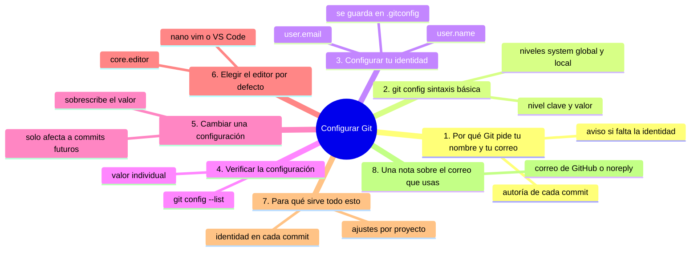
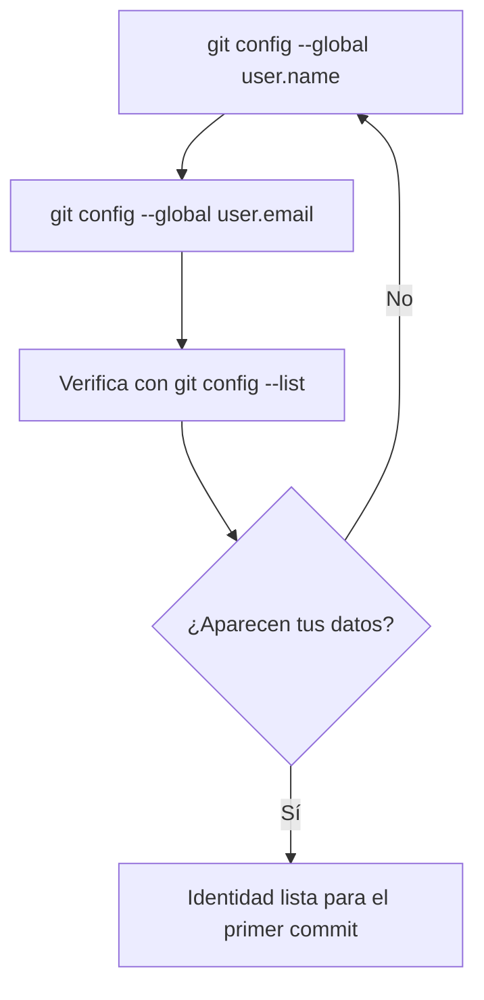

# Configurar Git

## Introducción

Git ya está instalado en tu equipo.

Antes de crear tu primer repositorio, hay algo importante: Git necesita saber **quién eres**.

En este capítulo vas a configurar tu identidad en Git y a conocer cómo funciona su sistema de configuración.

En este capítulo aprenderás:

* por qué Git pide tu nombre y tu correo;
* cómo configurar tu identidad con `git config --global`;
* cómo verificar la configuración con `git config --list`;
* qué diferencia hay entre configuración global y local;
* cómo cambiar una configuración ya existente;
* cómo elegir el editor por defecto de Git;
* qué revisar después de cada comando de configuración.

Este capítulo sí usa la terminal. Vas a ejecutar varios comandos de Git por primera vez.

---

## Mapa conceptual de este capítulo



---

## 1. Por qué Git pide tu nombre y tu correo

Cada commit que hagas lleva un registro de quién lo hizo y cuándo.

Ese registro es la **autoría** del commit.

Git usa tu nombre y tu correo para escribir esa autoría en cada commit.

Por eso, antes de hacer commits, Git necesita que le indiques:

* tu nombre;
* tu correo electrónico.

No usa esa información para enviar correos ni para crear cuentas.

Solo la guarda dentro de cada commit como parte de su historial.

Si no configuras tu identidad, Git te lo avisará cuando intentes hacer tu primer commit.

Configurarlo ahora evita ese error y te deja trabajar desde el primer momento.

---

## 2. git config: sintaxis básica

El comando para gestionar la configuración de Git es `git config`.

Su forma general es:

```bash
git config [nivel] clave valor
```

Donde:

* **nivel**: indica el alcance de la configuración (`--global` para todo tu equipo);
* **clave**: el nombre de la opción que quieres configurar;
* **valor**: el valor que le asignas.

Si no das valor, Git muestra el valor actual de esa clave:

```bash
git config [nivel] clave
```

### 2.1. Niveles de configuración

Git tiene varios niveles de configuración:

| Nivel | Sintaxis | Alcance |
|---|---|---|
| system | `--system` | Todo el equipo, para todos los usuarios |
| global | `--global` | Solo tú, en todos los repositorios |
| local (default) | sin opción | Solo el repositorio donde estás |

Para empezar, vas a trabajar con **global**, que es el más común.

La configuración global se guarda en un archivo en tu carpeta personal, llamado `.gitconfig`.

La configuración local se guarda dentro de cada repositorio, en `.git/config`.

Si una configuración local existe, **tiene prioridad** sobre la global.

Eso significa que puedes tener una identidad general y otra específica para un proyecto concreto.

---

## 3. Configurar tu identidad

Ahora vas a configurar tu nombre y tu correo a nivel global.



### 3.1. El nombre

Escribe en la terminal:

```bash
git config --global user.name "Tu Nombre"
```

Sustituye `Tu Nombre` por tu nombre real o el nombre que quieras que aparezca en tus commits.

### 3.2. El correo

Luego escribe:

```bash
git config --global user.email "tu-correo@example.com"
```

Sustituye el correo por el tuyo.

### 3.3. Ejemplo completo paso a paso

Imagina que tu nombre es Ana García y tu correo es ana.garcia@example.com.

Escribirías:

```bash
git config --global user.name "Ana García"
git config --global user.email "ana.garcia@example.com"
```

Al ejecutar estos comandos no verás salida en pantalla.

Eso es normal: `git config` no muestra nada cuando guarda un valor con éxito.

### 3.4. Qué ocurre internamente

Al ejecutar `git config --global`, Git:

* abre (o crea) el archivo `.gitconfig` en tu carpeta personal;
* guarda ahí la clave y el valor que indicaste;
* no modifica ningún repositorio.

El resultado es que desde ahora, cualquier commit que hagas en cualquier repositorio llevará tu nombre y tu correo como autor.

### 3.5. Qué revisar después de ejecutarlo

Después de configurar, verifica que los valores se guardaron bien.

Ve a la sección 4 y ejecuta los comandos de verificación.

Si ves tus datos correctamente, la configuración quedó lista.

---

## 4. Verificar la configuración

Git te permite consultar la configuración de varias formas.

### 4.1. Ver toda la configuración

Para ver todas las opciones configuradas, escribe:

```bash
git config --list
```

La salida mostrará una lista de claves y valores, por ejemplo:

```text
user.name=Ana García
user.email=ana.garcia@example.com
core.editor=notepad
```

Cada línea es una clave y un valor.

### 4.2. Ver un valor concreto

Para ver solo tu nombre, escribe:

```bash
git config --global user.name
```

La salida será:

```text
Ana García
```

Para ver tu correo:

```bash
git config --global user.email
```

La salida:

```text
ana.garcia@example.com
```

### 4.3. Qué revisar después de ejecutarlo

Al verificar, confirma:

* que `user.name` y `user.email` aparecen en `git config --list`;
* que los valores son exactamente los que quieres;
* que no hay caracteres extraños ni errores de escritura.

Si algo no está bien, corrígelo con el mismo comando usando el valor correcto.

---

## 5. Cambiar una configuración

Cambiar un valor es igual a configurarlo: Git lo sobrescribe.

Por ejemplo, si quieres cambiar tu nombre:

```bash
git config --global user.name "Nuevo Nombre"
```

Git reemplaza el valor anterior con el nuevo.

Si cambias tu correo:

```bash
git config --global user.email "nuevo-correo@example.com"
```

Solo se afecta a los commits futuros.

Los commits que ya hiciste conservan la autoría con la que se crearon.

---

## 6. Elegir el editor por defecto

Cuando haces un commit sin el mensaje en el comando, Git abre un **editor** para que escribas el mensaje.

Por defecto, Git usa el editor `nano` en entornos Unix y `notepad` en Windows.

Puedes cambiarlo con:

```bash
git config --global core.editor "nombre-del-editor"
```

Ejemplos según tu sistema:

```bash
git config --global core.editor "code --wait"
```

si usas Visual Studio Code; o:

```bash
git config --global core.editor "vim"
```

si usas Vim.

Para este curso, no es urgente cambiarlo.

Solo conviene saber que existe la opción para cuando quieras un editor más cómodo.

---

## 7. Para qué sirve todo esto

La configuración de Git te acompaña en el día a día:

* tu identidad aparece en cada commit;
* puedes personalizar el editor;
* puedes ajustar el comportamiento de Git para un proyecto concreto.

En los próximos capítulos verás que muchos comportamientos de Git pueden ajustarse desde `git config`.

Por ahora, lo esencial es que tu identidad esté bien configurada a nivel global.

---

## 8. Una nota sobre el correo que usas

Puedes usar cualquier correo para tu configuración.

Muchas personas usan el mismo correo que tienen en GitHub, así que la autoría local y la de la plataforma coinciden.

También puedes usar un correo diferente, por ejemplo uno de trabajo.

No hay una obligación técnica.

Elige el que prefieras, pero si planeas publicar en GitHub, conviene usar el correo asociado a tu cuenta para que las contribuciones se vinculen correctamente.

---

## Práctica guiada

En esta práctica vas a configurar y verificar tu identidad en Git.

### Paso 1: abre la terminal

Abre tu terminal (Git Bash, PowerShell o la que uses).

### Paso 2: configura tu nombre

Escribe:

```bash
git config --global user.name "Tu Nombre"
```

Sustituye el nombre por el tuyo.

### Paso 3: configura tu correo

Escribe:

```bash
git config --global user.email "tu-correo@example.com"
```

Sustituye el correo por el tuyo.

### Paso 4: verifica la configuración completa

Escribe:

```bash
git config --list
```

Busca las líneas `user.name` y `user.email`.

### Paso 5: verifica un valor individual

Escribe:

```bash
git config --global user.name
```

Confirma que muestra tu nombre.

### Resultado esperado

Deberías poder:

* configurar tu nombre y correo a nivel global;
* ver toda la configuración con `git config --list`;
* ver un valor individual;
* distinguir configuración global de local.

### Ejercicio de transferencia

Usa una identidad distinta a la habitual: configura un nombre de uso personal o profesional (por ejemplo, tu nombre y apellido en el formato que usarías en tu empresa) y un correo que no sea el habitual con `git config --global`. Entrega la salida de `git config --list` donde se vean los valores nuevos; después devuelve tu identidad original y repite la comprobación con `git config --global user.name` para demostrar que quedó restaurada.

---

## Errores comunes

### Error 1: olvidar configurar la identidad

Si intentas hacer un commit sin `user.name` y `user.email`, Git lo bloqueará y te pedirá que los configures.

### Error 2: escribir mal el correo

Un correo mal escrito en la configuración aparecerá así en tus commits. Revísalo bien antes de avanzar.

### Error 3: confundir nivel global con local

Si configuras sin `--global`, la configuración solo aplica al repositorio actual. Para tu identidad, usa `--global`.

### Error 4: pensar que cambiar la identidad afecta a commits anteriores

No. Los commits ya creados conservan su autoría. Solo los futuros commits usan la nueva identidad.

### Error 5: no verificar después de configurar

Ejecutar `git config` sin valor muestra el valor actual. Verifica siempre que se guardó lo que esperabas.

---

## Buenas prácticas

* Configura tu identidad a nivel global desde el primer día.
* Usa el mismo correo en Git y en GitHub si planeas publicar.
* Verifica tu configuración con `git config --list` después de cada cambio.
* Revisa que el nombre y el correo estén escritos correctamente.
* No confundas el nivel global con el local: para identidad usa global.
* Cambia el editor solo cuando tengas claro cuál quieres usar.

---

## Autopreguntas de cierre

Sin mirar el material, responde mentalmente y luego compruébalo con este capítulo:

1. ¿Para qué necesita Git tu nombre y tu correo, y qué fallaría si no los configuras?
2. ¿Qué diferencia hay entre los niveles `--global`, `--system` y el nivel local, y en cuál conviene poner tu identidad?
3. ¿Dónde se guarda tu identidad global y dónde la configuración de un proyecto concreto, y cuál manda si coinciden?
4. ¿Qué harías si te has equivocado escribiendo el correo y qué commits quedan afectados?
5. ¿Qué consecuencia tiene cambiar tu identidad hoy sobre los commits que ya hiciste?
6. ¿Por qué te conviene usar el mismo correo en Git y en GitHub, y qué alternativa existe si no quieres exponer tu correo?
7. ¿Qué ocurre cuando ejecutas `git commit` sin haber configurado la identidad y cómo evitarías ese bloqueo?

Si alguna respuesta no está clara, vuelve a la sección correspondiente y repite la práctica.

---

## Resumen

En este capítulo aprendiste que:

* Git registra tu nombre y correo como autoría de cada commit;
* `git config --global` configura opciones para todo tu equipo;
* tu identidad se guarda en el archivo `.gitconfig` de tu carpeta personal;
* la configuración local se guarda en `.git/config` y tiene prioridad sobre la global;
* `git config --list` muestra todas las opciones;
* ejecutar `git config clave` muestra el valor actual de esa clave;
* cambiar un valor lo sobrescribe y solo afecta a commits futuros;
* puedes elegir el editor por defecto con `core.editor`.

La idea principal es:

> **Configurar tu identidad con `git config --global` es el paso previo a cualquier commit; Git la usa para registrar quién hizo cada cambio en el historial.**

---

## Próximo paso

Tu identidad ya está configurada.

El siguiente paso es crear tu primer repositorio, el lugar donde Git va a empezar a registrar versiones.

Continúa con:

[`05-crear-un-repositorio.md`](05-crear-un-repositorio.md)
