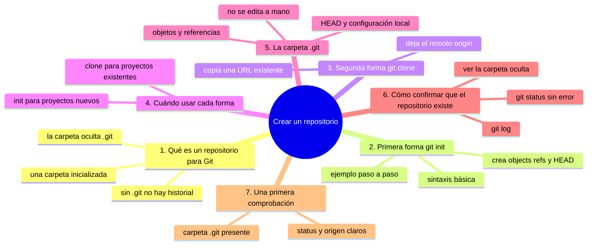
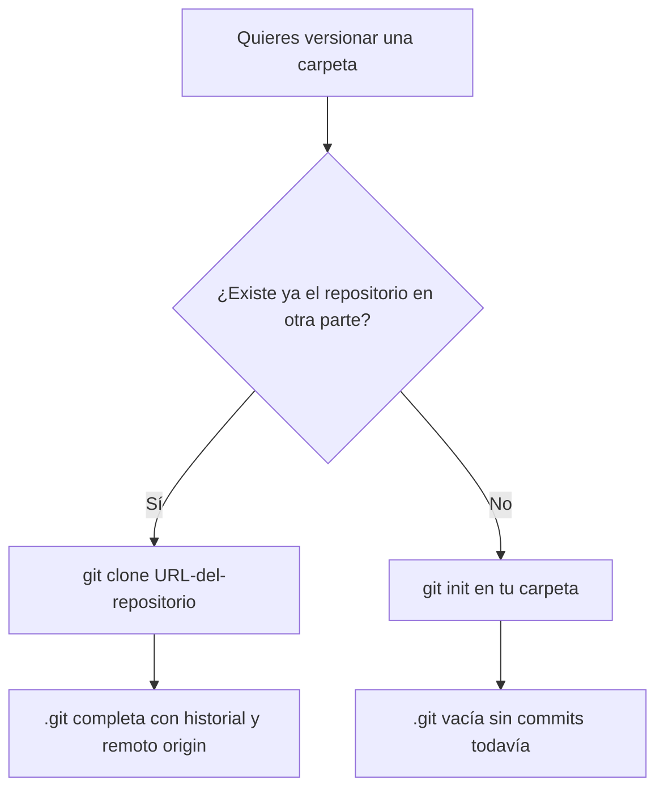

# Crear un repositorio

## Introducción

Ya tienes Git instalado y configurado.

Ahora vas a crear tu primer repositorio: el lugar donde Git empezará a registrar versiones de tus archivos.

En este capítulo aprenderás:

* qué es un repositorio desde el punto de vista de Git;
* las dos formas de obtener un repositorio: `git init` y `git clone`;
* cuándo conviene usar cada una;
* qué carpeta `.git` aparece y qué contiene;
* cómo confirmar que el repositorio se creó correctamente;
* qué revisar después de ejecutar cada comando.

Este capítulo usa la terminal. Vas a crear y verificar tu primer repositorio real.

---

## Mapa conceptual de este capítulo



---

## 1. Qué es un repositorio para Git

Para Git, un **repositorio** es una carpeta que Git ha inicializado.

No es una carpeta cualquiera: es una carpeta donde Git ha creado su propia estructura interna.

Esa estructura es la carpeta oculta `.git`.

```text
mi-repositorio/
   ├── .git/
   ├── archivo.txt
   └── otra-carpeta/
```

Mientras la carpeta `.git` exista, Git reconoce ese lugar como un repositorio.

Si borras `.git`, desaparece el historial y deja de ser un repositorio Git.

Todo lo que Git recuerda sobre ese proyecto vive dentro de `.git`.

---

## 2. Primera forma: `git init`

La primera forma de crear un repositorio es **iniciar Git en una carpeta que ya existe**.

Usa el comando `git init`.

### 2.1. Sintaxis básica

```bash
git init
```

O, para inicializar una carpeta con un nombre concreto:

```bash
git init nombre-carpeta
```

La primera forma inicializa la carpeta donde te encuentras.

La segunda crea (o usa) la carpeta indicada y la inicializa.

### 2.2. Ejemplo paso a paso

Imagina que quieres crear un repositorio llamado `mi-proyecto`.

Paso 1: crea la carpeta.

```bash
mkdir mi-proyecto
```

Paso 2: entra en ella.

```bash
cd mi-proyecto
```

Paso 3: inicializa Git.

```bash
git init
```

La salida será algo como:

```text
Initialized empty Git repository in C:/Users/TuNombre/mi-proyecto/.git/
```

Si usas Git en un entorno de tipo Unix, verás una ruta similar con barras.

### 2.3. Qué ocurre internamente

Al ejecutar `git init`, Git:

* crea la carpeta oculta `.git` dentro del directorio;
* dentro de `.git`, crea las subcarpetas `objects` y `refs`;
* crea un archivo `HEAD` que apunta a la rama por defecto;
* crea un archivo `config` con la configuración local del repositorio;
* define la rama inicial (por defecto `main` en versiones recientes de Git).

El directorio de trabajo (tus archivos) no se toca.

Git solo añade su estructura interna.

### 2.4. Qué revisar después de ejecutarlo

Después de `git init`, revisa:

* que la salida dice "Initialized empty Git repository";
* que aparece la carpeta `.git` en el directorio;
* que la rama inicial es la que esperabas (por defecto `main`).

Para ver la rama inicial puedes usar:

```bash
git branch
```

No verás ramas todavía si no has hecho commits, pero el nombre de la rama por defecto está definido.

---

## 3. Segunda forma: `git clone`

La segunda forma de obtener un repositorio es **copiar uno que ya existe en otra parte**.

Usa el comando `git clone`.

### 3.1. Sintaxis básica

```bash
git clone URL-del-repositorio
```

La URL indica dónde está el repositorio original.

Por ejemplo:

```bash
git clone https://github.com/usuario/repositorio
```

### 3.2. Ejemplo paso a paso

Imagina que quieres copiar un repositorio público de GitHub.

Escribe:

```bash
git clone https://github.com/usuario/repositorio
```

Git descargará el contenido del repositorio y creará una carpeta local con el mismo nombre.

La salida será algo como:

```text
Cloning into 'repositorio'...
remote: Enumerating objects: 10, done.
remote: Counting objects: 100% (10/10), done.
remote: Total 10 (delta 0), reused 0 (delta 0), pack-reused 10
Receiving objects: 100% (10/10), 2.50 KiB | 2.50 MiB/s, done.
```

Al terminar, tendrás una carpeta llamada `repositorio` con todos los archivos y su historial.

### 3.3. Qué ocurre internamente

Al ejecutar `git clone`, Git:

* se conecta a la URL indicada;
* descarga todos los objetos (versiones de archivos) del repositorio remoto;
* crea una carpeta local con el nombre del repositorio;
* crea dentro la carpeta `.git` completa;
* configura un **remoto** llamado `origin` que apunta a la URL de origen;
* copia los archivos al estado actual en el directorio de trabajo.

El resultado es un repositorio local **completo**, con todo el historial y una conexión de referencia al origen.

### 3.4. Qué revisar después de ejecutarlo

Después de `git clone`, revisa:

* que se creó la carpeta del repositorio;
* que dentro está el archivo `.git`;
* que los archivos del proyecto aparecen en el directorio;
* que el comando `git status` funciona sin errores.

---

## 4. Cuándo usar cada forma

La regla general es sencilla:



### Usa `git init` cuando:

* estás empezando un proyecto nuevo desde cero;
* tienes una carpeta con archivos y quieres empezar a versionarlos;
* no hay un repositorio original en otra parte.

### Usa `git clone` cuando:

* el repositorio ya existe en otra parte (GitHub, un servidor, etc.);
* quieres trabajar en un proyecto ajeno;
* necesitas una copia local con su historial completo.

En la práctica, `git init` se usa para proyectos propios nuevos.

`git clone` se usa cuando trabajas en un proyecto que ya existe en un remoto.

---

## 5. La carpeta `.git`

Ambas formas dejan una carpeta `.git`.

La diferencia está en el contenido:

```text
git init:
   .git vacía, sin historial todavía (solo la rama por defecto)

git clone:
   .git con todo el historial del repositorio de origen
```

En los dos casos, `.git` es el corazón del repositorio.

Contiene:

* los objetos (versiones de archivos y commits);
* las referencias (ramas);
* el `HEAD` (tu posición actual);
* la configuración local.

Nunca edites `.git` a mano.

Es la estructura interna que Git gestiona por ti.

---

## 6. Cómo confirmar que el repositorio existe

Hay varias formas de confirmar que Git reconoce tu carpeta como repositorio.

### 6.1. Ver la carpeta `.git`

En el explorador de archivos, busca la carpeta `.git` dentro del directorio.

Si la ves, el repositorio existe.

En Windows, puede que las carpetas ocultas no aparezcan por defecto.

Activa la opción de "Mostrar archivos ocultos" del sistema para verla.

### 6.2. Ejecutar `git status`

Escribe:

```bash
git status
```

Si el directorio es un repositorio, Git mostrará información del estado.

Si no es un repositorio, verás un error como:

```text
fatal: not a git repository (or any of the parent directories): .git
```

Ese error significa que Git no encontró la carpeta `.git`.

### 6.3. Ejecutar `git log`

También puedes probar:

```bash
git log
```

Si no hay commits todavía, dirá que no hay commits.

Eso confirma que el repositorio existe pero aún no tiene historial.

---

## 7. Una primera comprobación

Antes de avanzar, confirma esto:

1. Tienes una carpeta con una carpeta `.git` dentro.
2. `git status` no da el error de "not a git repository".
3. Sabes si creaste el repositorio con `git init` o con `git clone`.

Si todo está bien, ya tienes tu primer repositorio.

---

## Práctica guiada

En esta práctica vas a crear tu primer repositorio con `git init`.

### Paso 1: crea una carpeta de práctica

Crea una carpeta para tus experimentos:

```bash
mkdir proyecto-git-basico
cd proyecto-git-basico
```

### Paso 2: inicializa Git

Escribe:

```bash
git init
```

Anota la salida que ves.

### Paso 3: confirma la carpeta `.git`

Verifica que la carpeta `.git` existe en el directorio.

Puedes listar el contenido con:

```bash
ls
```

o, en Windows:

```bash
dir
```

### Paso 4: confirma el estado

Escribe:

```bash
git status
```

Confirma que Git reconoce el directorio como repositorio.

### Resultado esperado

Deberías poder:

* crear una carpeta y entrar en ella;
* inicializar Git en esa carpeta;
* ver la carpeta `.git`;
* confirmar que `git status` reconoce el repositorio.

### Ejercicio de transferencia

Toma una carpeta que ya exista en tu equipo con documentos reales (tus notas, un proyecto de estudio o el material de este curso) y conviértela en repositorio con `git init` sin mover ni renombrar ningún archivo. Entrega la salida de `git status` dentro de esa carpeta y una lista de los archivos que siguen intactos. Como variante, si ya usas GitHub, clona un repositorio público con `git clone` y entrega la carpeta clonada con su `git status` limpio.

---

## Errores comunes

### Error 1: ejecutar `git init` fuera de la carpeta deseada

Si no estás en la carpeta correcta, inicializarás Git en otro lugar. Confirma siempre el indicador antes de ejecutar.

### Error 2: no ver la carpeta `.git` y pensar que no se creó

En Windows las carpetas ocultas no se ven por defecto. Activa "mostrar archivos ocultos".

### Error 3: confundir `git init` con `git clone`

`git init` crea un repositorio vacío. `git clone` copia uno que ya existe. No son equivalentes.

### Error 4: borrar la carpeta `.git` por error

Si borras `.git`, pierdes el historial del repositorio. No edites ni borres esa carpeta.

### Error 5: creer que `git init` modifica tus archivos

`git init` no toca tus archivos: solo añade la estructura `.git`.

---

## Buenas prácticas

* Antes de `git init`, confirma en qué carpeta estás.
* Crea una carpeta de práctica para tus primeros experimentos.
* Usa `git clone` cuando quieras trabajar en un proyecto que ya existe en un remoto.
* Verifica siempre que `.git` existe después de crear el repositorio.
* No edites la carpeta `.git` a mano.
* Repasa qué contiene `.git` para que no te sorprenda.

---

## Autopreguntas de cierre

Sin mirar el material, responde mentalmente y luego compruébalo con este capítulo:

1. ¿Qué convierte una carpeta cualquiera en un repositorio para Git y qué la deja de ser?
2. ¿En qué se diferencian `git init` y `git clone` y cómo decides cuál usar en una situación real?
3. ¿Qué encontrarás dentro de `.git` y qué le pasaría al proyecto si la borrases sin querer?
4. ¿Cómo demuestras que una carpeta es un repositorio si no ves la carpeta oculta en el explorador?
5. ¿Qué diferencia hay entre el `.git` que deja `git init` y el que deja `git clone`?
6. ¿Qué le diría Git si ejecutas `git status` fuera de un repositorio y cómo interpretarías ese error?
7. ¿Por qué `git init` es seguro en una carpeta llena de archivos tuyos y qué comprobarías después?

Si alguna respuesta no está clara, vuelve a la sección correspondiente y repite la práctica.

---

## Resumen

En este capítulo aprendiste que:

* un repositorio es una carpeta con una carpeta `.git` dentro;
* `git init` crea un repositorio vacío en una carpeta existente;
* `git clone` copia un repositorio que ya existe en un remoto;
* ambas formas dejan una carpeta `.git` que contiene el historial;
* `git init` se usa para proyectos nuevos; `git clone` para proyectos existentes;
* `git status` confirma si Git reconoce un directorio como repositorio;
* `.git` es la estructura interna que Git gestiona y no debe editarse a mano.

La idea principal es:

> **Un repositorio Git es una carpeta inicializada con una carpeta `.git`; se crea con `git init` para empezar desde cero o con `git clone` para trabajar en un proyecto que ya existe.**

---

## Próximo paso

Ya sabes que un repositorio se crea con `git init`.

El siguiente paso es estudiar ese comando en detalle: qué crea exactamente y cómo funciona.

Continúa con:

[`06-git-init.md`](06-git-init.md)
